# Thornado oneMKL -- Summary
This is created based oneMKL branch of https://github.com/endeve/thornado.git   
commit: `b19c9a4e1ac4204b4e5cd4526beddd851605f021`  
Application used: SandBox/TwoMoment_OrderV   
The code was first cloned on Feb 22 2022, and the suggested extra compiling flags are:  
  `USE_OMP_OL=TRUE USE_GPU=TRUE USE_ONEMKL=TRUE`
The code is located at `$HOME/ExaStar`  and we mainly work on `$HOME/ExaStar/thornado/SandBox/TwoMoment_OrderV`  
   (Previous working code: https://gitlab.devtools.intel.com/A21-NRE-EPA/NRE-Codes/thornado)  
- [:heavy_check_mark:] **Thornado's SineWaveStreaming and Relaxation cases compile and runs fine with nightly compiler before 2023.05.03. There is an libsycl version issue with the version after 0503. With `-fopenmp-targets=spir64_gen -Xopenmp-target-backend "-device 12.60.7 -options -ze-intel-enable-auto-large-GRF-mode"`, the both case runs fine with the UMD after 609, and see as high as 30% performance improvement. May 22  2023**
- [:heavy_check_mark:] **~~The modified code now compiles and runs on ATS, PVC, and Arcticus on JLSE system using oneapi/eng-compiler/2022.01.30.005. The results are the same, PVC shows 40% more speedup comparing to ATS and Arcticus. June 1 2022~~**
- [:heavy_check_mark:] **~~The modified code now compiles and runs on PVC using the latest compilers and UMDs, but not on ATS and Arcticus on JLSE system except oneapi/eng-compiler/2022.01.30.005 as stated above. The Tally results are now in agree with the CPU results.   June 1 2022~~**
- [:heavy_check_mark:] ~~**Can be compiled and run with nightly-compiler/2022.04.10 and neo/agama-prerelease/401-22.13.022791.10859-main with out seeing NaNs and Infs in the Two-Momentum Tally on ATS nodes. April 25 2022**~~       
- [:heavy_check_mark:] ~~**Can be compiled and run with latest nightly and umds on PVC12, but nightly-compiler/2022.04.14 seems having issues or disclosing issues as the Tally has a huge number 5.80478701E+302. May 03 2022**~~
- [:heavy_check_mark:] ~~**Currently, the code can only be compiled by `nightly-compiler/2022.03.02 (03.05)`, but the application 1) got NANs with offload off 2) crashed with offload on**~~      
- [:heavy_check_mark:] ~~**Currently, the code can only be compiled by `nightly-compiler/2022.02.21`, but the application crashes probably due to `c_loc` issue**~~

# Thornado oneMKL -- How to Build and Run
1. Two extra external packages are needed   
   a)  HDF5   
   b)  weaklib-table from ORNL. source: git clone https://code.ornl.gov/astro/weaklib-tables.git   
   c) wealib from github: git clone  https://github.com/starkiller-astro/weaklib.git
More information on the external packages, please visit: https://gitlab.devtools.intel.com/williamr/thornado-builder  
2. Enviromental variable for weaklib-table needs to be set: export WEAKLIB_TABLES_DIR=$HOME/ExaStar/weaklib-tables
3. Run `softlink.sh` inside `$HOME/ExaStar/thornado/SandBox/TwoMoment_OrderV/Executables` to create links to the external libraries. Be sure to edit the content of this script as your path to the libraries may be different.
4. Copy `/nfs/site/home/quanshao/ExaStar/mpifort` to your `$HOME/ExaStar` and modify `$HOME/ExaStar/thornado/Build/Machines/Makefile_beacon_intel` to reflect the correct path of `mpifort`
5. To compile,  run `build.anl.sh` inside `$HOME/ExaStar/thornado/SandBox/TwoMoment_OrderV/Executables`. Be sure to make modifications to reflect the path of your source code and change the module to your favorite one
6. To run apps, run `run.anl.active.sh` inside `$HOME/ExaStar/thornado/SandBox/TwoMoment_OrderV/Executables`. Be sure to make modifications to reflect the path of your source code and change the module to your favorite one

# Flash-X build and run
1. git clone git@github.com:Flash-X/Flash-X.git to $FLASH_HOME, i.e., /localdisk/quanshao/ExaStar/Flash-X
2. cd $FLASH_HOME & git submodule update --init. thornado and weaklib has been cloned to $FLSH_HOME/lib/ and Grid(paramesh) has been clone to $FLASH_HOME/source as submodules
3. git checkout delep_Ov & git submodule update
4. cd $FLASH_HOME/lib/thornado/source & git checokut $BRANCH_OF_INTEREST (for example: git checkout ms69)
5. StreamingSineWave case already exsits inside $FLASH_HOME/source/Simulation/SimulationMain/   
6. cp buildRun.sh inside ${FLASH_HOME}. This script set $APP_DIR, for example: APP_DIR=StreamingSineWave for the Streaming Sine Wave case of Thornado. 
7. add a directory under ${FLASH_HOME}/sites and add Makefile.h under this directory. For example sdpcloud.pvc.intel.com
8. add DEFINES += -DTHORNADO_EULER_NOGPU to $FLASH_HOME/lib/thornado/source/SandBox/Interface_FLASH/Makefile.Flash
9. run buildRun.sh under ${FLASH_HOME}
    - Add .o file name to Makefile.Flash and the path of source files to $(THORNADO_DIR)/Build/Makefile_Path
    - ./build.sh is written in line 130 of libUtils.py, which call the library's libinfo.py
10. If you just srun to the node, then you may need to `unset SLURM_TASKS_PER_NODE` to run mpiexec, but If you do the srun to the node, then in another terminal ssh to it, then you shouldn't need to.    

# Tricks and commands
**sudo usermod -a -G render <username>** to make sycl-ls work
**exaperf-sdpcloud-ats1.jf.intel.com  IP Address:**    10.165.9.163          
**exaperf-sdpcloud-pvc09.jf.intel.com IP Address:**    10.23.153.3        pvc12: 10.23.153.76   pvc19: 10.23.153.179 
**restart machine:**                     `sudo systemctl restart autofs`    
**check GPU speed:**                     `sudo /opt/scripts/check_speed.sh`
**get default /opt/exaperf/modulefiles** `/opt/scripts/update_nightly.sh`    
**remove nightlies and agamas** ` sudo /shared/maint/tools/prune_nightly.py`
**ortce** ortce-skl.jf.intel.com/
**DUT** srun -p FM-QZ1J-ICX-PVC -t 1:00:00 --pty /bin/bash
**get on a node on JLSE:**  `qsub -n 1 -t 300 -q arcticus -I`       
**get on a node on Sunspot** `qsub -l select=1 -l walltime=30:00 -A Aurora_deployment -q workq -I`
**get on Aurora** qsub -I -A Aurora_deployment -l select=1,walltime=120:00 -q LustreApps
**get on Aurora** qsub -I -A Aurora_deployment -l select=1,walltime=120:00 -q EarlyAppAccess 
**borealis guide**  https://wiki.ith.intel.com/display/OPS/HPCM+user+guide
**get on borealis** ssh borealis-uan1.hpe.jf.intel.com
**pbs reserve a node starting 07:34 for 8 hours** psb_rsub -R 0734 -D 08:00:00
**pbs get on the reserved node**  qsub -q <Reservation ID> -I -l walltime=09:00:00
**To git clone weaklib tables from ORNL, we need** `export https_proxy=http://proxy-us.intel.com:912`    (error: SSL certificate problem: self signed certificate in certificate chain) 
**pip install need proxy pip install --proxy=http://proxy-us.intel.com:912    numpy***
**display GPU serial and rev. number** `sudo /sbin/lspci |grep -i Display`    
**power cycle a machine** /shared/maint/tool/powercycl_node.sh exaperf-sdpcloud-pc20
**autoconf** module load spack autoconf
**Working weaklib and it's tables** exaperf-sdpcloud-pvc12.jf.intel.com:/localdisk/quanshao/ExaStar/weaklib   weaklib-tables.
**limit GPU power** `xpu-smi config -d 0 --powerlimit 500` to 50W
**srun not work with mpi, unset SLURM_TASKS_PER_NODE** or ssh to the node. "When you srun into a system, it sets a bunch of variable behind your back" by Brian. 
**get number cores and threads**  sudo /usr/sbin/dmidecode  -t processor | grep -E '(Core Count|Thread Count)'
` gdb-oneapi -q -ex "b 34" -ex "run" -ex "info devices" --args ./a.out`
`ZET_ENABLE_PROGRAM_DEBUGGING=1 IGC_StackOverflowDetection=1 gdb-oneapi -q   ./flashx`
    
#############################################       
# Enable implicit scaling     
#############################################        
export EnableImplicitScaling=1       
export ITEX_TILE_AS_DEVICE=0        

<pre>
PVC17:
quanshao@exaperf-sdpcloud-pvc17:~> sudo lspci |grep Display
3a:00.0 Display controller: Intel Corporation Device 0bd6 (rev 2f)  = 58
9a:00.0 Display controller: Intel Corporation Device 0bd6 (rev 2f)  = 154
vtune needs special umd, the default umd475 does not working, while umd552 does. 
</pre>


**To do shaderDump which can show assembly code**
<pre>

export EnableImplicitScaling=0
export IGC_ShaderDumpEnable=1
export IGC_ShowFullVectorsInShaderDumps=1

export  IGC_DumpToCustomDir=/nfs/site/home/quanshao/sandbox/shaderDump/tmp
objcopy --dump-section __CLANG_OFFLOAD_BUNDLE__openmp-spirv=offload.elf ApplicationDriver_Neutrinos_beacon_intel
objcopy -I elf64-x86-64 --dump-section __openmp_offload_spirv_0=reproducer.spv offload.elf

`ZEX_NUMBER_OF_CCS=0:1`
</pre>

# Activities, progress, and results
## April 29 2024
1. According to Brain, "nightly-mkl-cev_nightly/2024.04.26 looks like it works with the 4.28 nightly compiler.". Tried run Thornado with nightly-compiler/2024.04.28, and the linking failed due to libsycl.so.7. so nightly 4.28 does not point to nightly-mkl-cev_nightly/2024.04.26.
2. However, "module load ightly-mkl-cev_nightly/2024.04.26" makes Thornado compile and run. Here is the result:
```
cat timeFOM_2024.04.28.txt-umd871
ifx -what     : Intel(R) Fortran 24.0-1690
ifx --version : ifx (IFX) dev.x.0 Mainline 20240428
                                                        Time(seconds)                             |                      Figure of Merit (FOM)
AppName     Grid      OpLevel :  2024.04.28-umd871   2023.10.15.002    TimeDiff   Percentage   |   2024.04.28-umd871   2023.10.15.002    FOM-Diff   Percentage
                     MKL Date :                 2024.04.04
-----------------------------    --------------------------------------------------------------       --------------------------------------------------------------
sineWave   [8,8,8]      O3    :     3.1731e+00          2.9053e+00       2.6774e-01     9.22%            6.6918e+06          7.3085e+06       -6.1667e+05    -8.44%
sineWave   [16,16,16]   O3    :     2.8222e+02          1.2129e+01       2.7009e+02  2226.90%            1.1964e+06          2.7838e+07       -2.6642e+07   -95.70%
relax      [8,8,8]      O3    :     2.1844e+01          2.2466e+01      -6.2246e-01    -2.77%            3.9026e+07          3.7945e+07        1.0813e+06     2.85%
relax      [16,16,16]   O3    :     1.5541e+02          1.6439e+02      -8.9734e+00    -5.46%            4.3883e+07          4.1488e+07        2.3954e+06     5.77%
```

## April 22-26 2024
1. nightly-mkl-cev_nightly/2024.04.14 with nightly 2024.04.21 has "undefined reference" related to mkl libraries, and thus Thornado compilation failed. According to Brain, "Starting with 4.19 the nightly compiler doesn't want to play nice.  Looks like they did a SYCL update that breaks lots of things"
2. Working on Borealis to run reframe and other system performance tools/apps/software.
3. Trying to setup reframe configuration and run thornado on Borealis. 
4. Learning HPL stalls and hangs 
## April 17-20 2024
1. Modules/Library/LinearAlgebraModule.F90 uses DGEMM and it’s variations.
2. Learnt to run cxi tools on Borealis. 
## April 16 2024
1. Although Thornado works with nightly-mkl-cev_nightly/2024.04.14, and this MKL point to the latest nightly compilers. But the latest nightly compilers do not point to the latest MKL library. So Thornado has the issue with libsycl.so version. Put a note in OneAPI Discussions Channel. 
2. contined experiments on FlashX run on Borealis to see the effects of gpu_wrapper/wrapper_hbm_quad.sh.
## Apr 15 2024
1. With  nightly-mkl-cev_nightly/2024.04.14, Thornado runs fine, and here is the run times
<pre>
cat timeFOM_2024.04.14.txt-umd871
ifx -what     : Intel(R) Fortran 24.0-1652
ifx --version : ifx (IFX) dev.x.0 Mainline 20240414
                                                        Time(seconds)                             |                      Figure of Merit (FOM)
AppName     Grid      OpLevel :  2024.04.14-umd871   2023.10.15.002    TimeDiff   Percentage   |   2024.04.14-umd871   2023.10.15.002    FOM-Diff   Percentage
                     MKL Date :                 2024.04.04
-----------------------------    --------------------------------------------------------------       --------------------------------------------------------------
sineWave   [8,8,8]      O3    :     3.1078e+00          2.9053e+00       2.0246e-01     6.97%            6.8324e+06          7.3085e+06       -4.7612e+05    -6.51%
sineWave   [16,16,16]   O3    :     1.2165e+01          1.2129e+01       3.5910e-02     0.30%            2.7756e+07          2.7838e+07       -8.2200e+04    -0.30%
relax      [8,8,8]      O3    :     2.1474e+01          2.2466e+01      -9.9284e-01    -4.42%            3.9699e+07          3.7945e+07        1.7544e+06     4.62%
relax      [16,16,16]   O3    :     1.5402e+02          1.6439e+02      -1.0370e+01    -6.31%            4.4281e+07          4.1488e+07        2.7934e+06     6.73%
</pre>
2. Started to run scaling of FlashX/Thornado on Borealis machine. 

## Apr 10-12 2024
1. Learning Aurora Burn-in's tools, issues, aims, and anlysis by setting in the dialy meetings and reading docs
2. Learning awk and more advanced bash script to be ready to automate the script used by Aurora burn-in team
3. Run FlashX with Thornado on PVC16 and get pretty good scaling, and here are some data for 4x4x4:
<pre>
#MPI-rank total time			evolution		rt-imex	
 1  13m43	823	1	815.627	1	640.524	1
 2  7m9	    429	1.918414918	421.265	1.936137586	332.042	1.929045121
 4  3m54	234	3.517094017	226.019	3.608665643	176.874	3.621357577
</pre>
For 8x8x8, we have
<pre>
#MPI-rank total time			evolution		rt-imex	
 1  73m55s	4435	1	4419.778	1	2649.652	1
 2   37m58s	2278	1.946883231	2267.209	1.949435628	1366.393	1.939158061
 4  20m8	1208	3.671357616	1198.351	3.688216558	725.575	3.651796162
</pre>
## Apr 08-09 2024

1. Thornado has libsycl.so versoin issue with nighlty 04.07 as Brain noted that "Starting with 4.5  nightly compiler, they have moved to libsycl.so.8.  This means you need to use an MKL that uses libsycl.so.8.". Thornado has libsycl.so version issue with both nightly-mkl-cev_nightly/2024.04.04 and nightly-mkl-develop/2024.04.04. zypper search on PVC04 show the latest mkl is 04.04. So we will not use the latest compiler. 
2. Tried to run FlashX/Thornado using multiple pvcs node of spdcloud, but failed with errors:
<pre>
/soft/restricted/CNDA/mpich/52.2/mpich-ofi-sockets-icc-default-gpu-drop52/bin/hydra_pmi_proxy: error while loading shared libraries: libze_loader.so.1: cannot open shared object file: No such file or directory
[mpiexec@exaperf-sdpcloud-pvc04.jf.intel.com] ui_cmd_cb (mpiexec/pmiserv_pmci.c:53): Launch proxy failed.
[mpiexec@exaperf-sdpcloud-pvc04.jf.intel.com] HYDT_dmxu_poll_wait_for_event (lib/tools/demux/demux_poll.c:76): callback returned error status
[mpiexec@exaperf-sdpcloud-pvc04.jf.intel.com] HYD_pmci_wait_for_completion (mpiexec/pmiserv_pmci.c:184): error waiting for event
[mpiexec@exaperf-sdpcloud-pvc04.jf.intel.com] main (mpiexec/mpiexec.c:221): process manager error waiting for completion
</pre>
it turned out the our spdcloud is not setup for multinode runs.


## Apr 04-05 2024
1. Run flashX 4x4x4 and 8x8x8 case to get the scaling data. Optimizing the scalability.
2. It is also found that the run on pvc16 seems slower 10-15% compared to runs on pvc04
3. Will be run some perftool to help understand why.
## Apr 03 2024
1. Without `MPIR_CVAR_ENABLE_GPU=0`, thornado runs failed with mpi related errors: 
<pre>
ApplicationDriver_beacon_intel:91526 terminated with signal 11 at PC=152e4725f37e SP=7ffe42c822d8.  Backtrace:
/lib64/libpthread.so.0(+0x168c0)[0x152e4e04d8c0]
/exaperf/neo/agama-devel-sp4/867-24.09.28717.16-867/usr/lib64/libze_intel_gpu.so.1(+0x13e37e)[0x152e4725f37e]
/exaperf/neo/agama-devel-sp4/867-24.09.28717.16-867/usr/lib64/libze_intel_gpu.so.1(+0x13fe4b)[0x152e47260e4b]
/exaperf/neo/agama-devel-sp4/867-24.09.28717.16-867/usr/lib64/libze_intel_gpu.so.1(+0x121d72)[0x152e47242d72]
/soft/restricted/CNDA/mpich/52.2/mpich-ofi-sockets-icc-default-gpu-drop52/lib/libmpi.so.12(+0x423e006)[0x152e53400006]
/soft/restricted/CNDA/mpich/52.2/mpich-ofi-sockets-icc-default-gpu-drop52/lib/libmpi.so.12(+0x423d226)[0x152e533ff226]
/soft/restricted/CNDA/mpich/52.2/mpich-ofi-sockets-icc-default-gpu-drop52/lib/libmpi.so.12(+0xc1e9a6)[0x152e4fde09a6]
/soft/restricted/CNDA/mpich/52.2/mpich-ofi-sockets-icc-default-gpu-drop52/lib/libmpi.so.12(+0x9b7a92)[0x152e4fb79a92]
/soft/restricted/CNDA/mpich/52.2/mpich-ofi-sockets-icc-default-gpu-drop52/lib/libmpi.so.12(+0x9cf654)[0x152e4fb91654]
/soft/restricted/CNDA/mpich/52.2/mpich-ofi-sockets-icc-default-gpu-drop52/lib/libmpi.so.12(+0x9cf4b9)[0x152e4fb914b9]
/soft/restricted/CNDA/mpich/52.2/mpich-ofi-sockets-icc-default-gpu-drop52/lib/libmpi.so.12(MPI_Init+0x6)[0x152e4f274fc6]
/soft/restricted/CNDA/mpich/52.2/mpich-ofi-sockets-icc-default-gpu-drop52/lib/libmpifort.so.12(MPI_INIT+0x29)[0x152e5aafc449]
./ApplicationDriver_beacon_intel[0x8977ff]
./ApplicationDriver_beacon_intel[0x8b6393]
./ApplicationDriver_beacon_intel[0x8b2cb4]
./ApplicationDriver_beacon_intel[0x4159cd]
/lib64/libc.so.6(__libc_start_main+0xef)[0x152e4dc772bd]
./ApplicationDriver_beacon_intel[0x4158fa]

</pre>
2. The run of flashx on pvc16 using 4 GPUs tiles and 4 ranks has page faults:
<pre>
[753150.097787] i915 0000:3a:00.0: page fault @ 0x01010000057ce000, ccs0 in flashx [26308]
[753887.571699] i915 0000:3a:00.0: page fault @ 0x01010000057ce000, ccs0 in flashx [95851]
[753887.628278] i915 0000:9a:00.0: page fault @ 0x01010000057ce000, ccs0 in flashx [95853]
[753887.644851] i915 0000:9a:00.0: page fault @ 0x01010000057ce000, ccs4 in flashx [95854]
[753887.651302] i915 0000:3a:00.0: page fault @ 0x01010000057ce000, ccs4 in flashx [95852]
</pre>

## Apr 02 2024
1. Flashx's evolution time is 857s on pvc04 while FlashX with reframe only runs in 405s on pvc02 Try to figure it out. 
  - With reframe script, we got "OpenMP thread stack size:       8 MB" while with my own script, it is 4 MB. `export OMP_STACKSIZE="8M"` helps to change it to 8 MB, but did not help the running time. 
  - run rfm_job.sh on pvc04, and the evolution time is good, i.e., 383s. so computint node is not the problem.
  - run local compiled flashx with rfm_job.sh, the eveloution time is good, i.e. around 383s.
  - run local compiled flashx with buildRun.sh, the evolution is is bad. 
  - change the run command line to include gpu_wrapper.sh, did not effect evolution time
  - unset LIBOMPTARGET_LEVEL_ZERO_USE_IMMEDIATE_COMMAND_LIST, evolution time reduced to 527s from 875s
  - unset OMP_PROC_BIND and MPI_CVAR_ENABLE_GPU reduces the time to 384.6s, the same as the reframe run on pvc04 localdisk. 
  - testing MPI_CVAR_ENABLE_GPU effects by unset it only. It reduce the evolution time to 386s. So OMP_PROC_BIND does not have significant effect on running time. 
2. Change the script of flashx to reflect the above findings. 
3. Tried to run jobs on PVC16, and the Previously running GPU job is hanging for around 10 minutes at the beginning of the run. then "srun: Job 41023 step creation temporarily disabled, retrying (Requested nodes are busy)".

## Apr 01 2024
1. num_teams fix is not in nightly 03.31. ifx -what of this nightly shows Intel(R) Fortran 24.0-1640, and run of teamSize.f90 gives 
<pre>
Target LEVEL_ZERO RTL --> Number of teams = {896, 1, 1}
Target LEVEL_ZERO RTL --> Number of teams = {1, 4096, 1}
</pre>
2. Tried OpenMC with reframe, the python script in /nfs/pdx/home/revans/performance.platform.rfm_testfiles/openmc.py is working, but /nfs/pdx/home/revans/epc_rfm_testfiles/openmc.py does not work.
## Mar 28-29 2024
1. Thornado runs with nightly 03.27/03.28 (Intel(R) Fortran 24.0-1634/Intel(R) Fortran 24.0-1640) and umd862, and so is Thornado reframe, but with umd805
2. FashX with Thornado is now in Reframe.
## Mar 27 2024
1. Thornado runs with nightly 03.26 (Intel(R) Fortran 24.0-1634) and umd862 
2. Continued putting FlashX with Thornado to Reframe.
## Mar 26 2024
1. Thornado runs with nightly 03.24 and umd862 
2. Continued putting FlashX with Thornado to Reframe.
## Mar 25 2024
1. Thornado runs with nightly 03.24 and neo/agama-devel-sp4/860-24.05.28454.24-858
2. Started put FlashX with Thornado to Reframe.
3. Addressed the confusion of cmplrllvm-40308
## Mar 22 2024
1. Thornado runs fine with nightlies, 0319, 0320, 0321
2. Here are some finding related to the scalability of FlashX with Thornado.
  - Hydro seems not offloaded to GPU at all. It took 29.44 seconds for serial run. 
    -  arm_guadcell is mpich based cod, not offloaded to GPU at all. It took 23.95 seconds. This is believed to be related to PARAMESH, as I am not familiar with PARAMESH, I do not know the scalability. However, from my runs, it took 18.93 seconds.  The scalability is not good. 
    - computeFluxes is not offloaded either, nor is conserveFluxes,update solution. 
  - RadTran, need to figure out which FORTRAN file is used.  
## Mar 19-21 2024
1. Did a systematic runs of FlashX/Thornado to see the overheads of LPP, unitrace, and vtune. Here are the results:
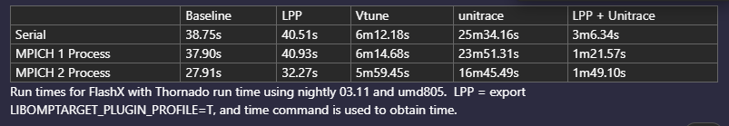
2. Ran FlashX with Thornado new case on 1 rank and 2 rank with LPP, but the total time scaling is not great, although the device time of all the kernels seems scaling well.     
<pre>
1 rank:
   Total Host Time: 1339969.22 (msec), Total Device Time 477837.31 (msec)
2 ranks: 
   Total Host Time: 1678088.98 (msec), Total Device Time 481576.55 (msec)
      [0:0] Host Time : 832804.70 (msec), Device Time [0:0] 240081.54 (msec)
      [0:1] Host Time : 845284.28 (msec), Device Time [0:1] 241495.01 (msec)
</pre>
3. iprof has issues with FlashX Thornado run
<pre>
terminate called after throwing an instance of 'sycl::_V1::runtime_error'
  what():  pi::getPlugin couldn't find plugin -59 (PI_ERROR_INVALID_OPERATION)
forrtl: error (76): Abort trap signal
</pre>
## Mar 18 2024
1. Run FlashX with unitrace and vtune in different ways. It is found out that vtune works, however, we need do `sudo /opt/sepdk/src/rmmod-sep; sudo /opt/sepdk/src/insmod-sep` to make vtune work. Discussed with Marcus, and it seems to me that he is now convinced that our profiling tool, i.e., unitrace might have issue. We run cases in a systematic way to generate a table to show where the overheads are. 
## Mar 15 2024
1. By running a large number of cases with unitrace, LIBOMPTARGET_PLUGIN_PROFILE, and unitrace + LIBOMPTARGET_PLUGIN_PROFILE, it is found that unitrace alone gives crazy times, while both LIBOMPTARGET_PLUGIN_PROFILE, and unitrace + LIBOMPTARGET_PLUGIN_PROFILE produce reasonable times.
<pre>
[3:26 PM] Quan, Shaoping
quanshao@exaperf-sdpcloud-pvc04:/localdisk/quanshao/ExaStar/Flash-X> egrep 'l3784|Kernel 48' ompProfOnly03.log
Kernel 48                 : __omp_offloading_802_3400a0_twomoment_discretizationmodule_streaming_mp_computeoffgridflux__l3784
Kernel 48                 :     177.11      0.05      0.04      0.10    133.26      0.04      0.03      0.05   3520.00
quanshao@exaperf-sdpcloud-pvc04:/localdisk/quanshao/ExaStar/Flash-X> egrep 'l3784|Kernel 48' unitraceWompProf03.log
                     __omp_offloading_802_3400a1_twomoment_discretizationmodule_streaming_mp_computeoffgridflux__l3784[SIMD32 {448; 1; 1} {1024; 1; 1}],        3520,           132752160,     0.08,               37713,               30560,               49440
                     __omp_offloading_802_3400a1_twomoment_discretizationmodule_streaming_mp_computeoffgridflux__l3784[SIMD32 {448; 1; 1} {1024; 1; 1}],                  62                 32                         0                       0
quanshao@exaperf-sdpcloud-pvc04:/localdisk/quanshao/ExaStar/Flash-X> egrep 'l3784|Kernel 48' unitraceOnly03.log
                     __omp_offloading_802_34009e_twomoment_discretizationmodule_streaming_mp_computeoffgridflux__l3784[SIMD32 {448; 1; 1} {1024; 1; 1}],        3520,       1406900594480,     0.34,           399687668,                 880,        272675167040
                     __omp_offloading_802_34009e_twomoment_discretizationmodule_streaming_mp_computeoffgridflux__l3784[SIMD32 {448; 1; 1} {1024; 1; 1}],                  62                 32                         0                       0
For "I3784/Kernel 48"  unitrace is 1406900.59(ms), while LPP is 133.26(ms) and unitrace+LPP has 132.75 (ms)
</pre>

2. Discussed with Marcus, he was not aware anybody else experiencing similar issue. However, he will try to run qmcpack to see whether the similar issue will happen. 
## Mar 13-14
1. Ran FlashX with Thornado on PVC04 on 1 and 2 ranks, but did not get a good scaling. Here is the command line `mpiexec -n 1 -env ZE_AFFINITY_MASK=0.0 ./flashx : -n 1 -env ZE_AFFINITY_MASK=0.1 ./flashx.` Single rank run took 2353.952 seconds in Evolution, while it is 1757.821 for 2rank run. It is found that this code is compiled with -O0. So Run the case with -O3, and here are the times: 1417.227 and 1030.872.
2. Ran FlashX with Thornado on PVC16 which has 2 cards, but the scaling is even worse: 2992.436, 2319.263, and 2338.571.
3. Discussed with Brain. The command line seems correct. 
4. Trying to do a profiling to gain some insights.

## Mar 11-12 2024
1. Thornado runs with nightly 03.11
2. Mathi's version of FlashX with Thornado runs successfully on PVC04 with two workarounds. a) add  DEFINES += -DTHORNADO_EULER_NOGPU to $FLASH_HOME/lib/thornado/source/SandBox/Interface_FLASH/Makefile.Flash b) remove/comment out the update to device of Mesh(1)%Width, .... in ./Modules/TwoMoment/OrderV/TwoMoment_DiscretizationModule_Streaming.F90
3. Default FlashX and thornado works also with nightly 03.11 and the above two workarounds.
4.  Default FlashX with thornado master-nre works with nightly 03.11 and only DEFINES += -DTHORNADO_EULER_NOGPU
5. Without commented out the updates to device of Mesh(1)%Width, we got
<pre>
 Driver init all done
omptarget message: explicit extension not allowed: host address specified is 0x00007ffca1d874e8 (72 bytes), but device allocation maps to host at 0x00007ffca1d87510 (72 bytes)
omptarget error: Call to getTargetPointer returned null pointer (device failure or illegal mapping).
omptarget error: Run with
omptarget error: LIBOMPTARGET_DEBUG=1 to display basic debug information.
omptarget error: LIBOMPTARGET_DEBUG=2 to display calls to the compute runtime.
omptarget error: LIBOMPTARGET_INFO=4 to dump host-target pointer mappings.
</pre>

This has been recorded to https://jira.devtools.intel.com/browse/CMPLRLLVM-55553

## Mar 11 2024
1. Recaliborated the thornado run based on oneapi/eng-compiler/2023.10.15.002 ( three runs has been performed, and the last run data was chosen)
2. libomptarget.so has been moved back to its original location since nightly 03.08. so LD_LIBRARY_PATH is no longer needed for newer nightlies.    
3. Running nightly 03.10 and umd849, and umd851. Here are the resuls:
<pre>
cat timeFOM_2024.03.10.txt-umd849
                                                        Time(seconds)                             |                      Figure of Merit (FOM)
AppName     Grid      OpLevel :  2024.03.10-umd849   2023.10.15.002    TimeDiff   Percentage   |   2024.03.10-umd849   2023.10.15.002    FOM-Diff   Percentage
                     MKL Date :
-----------------------------    --------------------------------------------------------------       --------------------------------------------------------------
sineWave   [8,8,8]      O3    :     3.4928e+00          2.9053e+00       5.8747e-01    20.22%            6.0792e+06          7.3085e+06       -1.2292e+06   -16.82%
sineWave   [16,16,16]   O3    :     1.3562e+01          1.2129e+01       1.4335e+00    11.82%            2.4896e+07          2.7838e+07       -2.9425e+06   -10.57%
relax      [8,8,8]      O3    :     2.2249e+01          2.2466e+01      -2.1780e-01    -0.97%            3.8316e+07          3.7945e+07        3.7150e+05     0.98%
relax      [16,16,16]   O3    :     1.6127e+02          1.6439e+02      -3.1192e+00    -1.90%            4.2290e+07          4.1488e+07        8.0240e+05     1.93%
</pre>

<pre>
cat timeFOM_2024.03.10.txt-umd851
                                                        Time(seconds)                             |                      Figure of Merit (FOM)
AppName     Grid      OpLevel :  2024.03.10-umd851   2023.10.15.002    TimeDiff   Percentage   |   2024.03.10-umd851   2023.10.15.002    FOM-Diff   Percentage
                     MKL Date :
-----------------------------    --------------------------------------------------------------       --------------------------------------------------------------
sineWave   [8,8,8]      O3    :     3.4613e+00          2.9053e+00       5.5595e-01    19.14%            6.1346e+06          7.3085e+06       -1.1739e+06   -16.06%
sineWave   [16,16,16]   O3    :     1.3822e+01          1.2129e+01       1.6936e+00    13.96%            2.4427e+07          2.7838e+07       -3.4110e+06   -12.25%
relax      [8,8,8]      O3    :     2.2546e+01          2.2466e+01       7.9720e-02     0.35%            3.7811e+07          3.7945e+07       -1.3410e+05    -0.35%
relax      [16,16,16]   O3    :     1.5891e+02          1.6439e+02      -5.4795e+00    -3.33%            4.2918e+07          4.1488e+07        1.4305e+06     3.45%
</pre>
## Mar 08 2024
1. removed unnecessary workarounds (i.e., not speedup the simulation, not affect the results), ms-daily is now aligned with master-nre. The only difference is the ms-daily has the FOM output. Here is the time comparison between ms-daily and master-nre
   - ms-daily
<pre>
cat timeFOM_2024.03.07.txt
                                                        Time(seconds)                             |                      Figure of Merit (FOM)
AppName     Grid      OpLevel :  2024.03.07   2023.10.15.002682.20    TimeDiff   Percentage   |   2024.03.07   2023.10.15.002682.20    FOM-Diff   Percentage
                     MKL Date :
-----------------------------    --------------------------------------------------------------       --------------------------------------------------------------
sineWave   [8,8,8]      O3    :     3.5454e+00          4.6583e+00      -1.1128e+00   -23.89%            5.9891e+06          2.7350e+07       -2.1361e+07   -78.10%
sineWave   [16,16,16]   O3    :     1.3415e+01          6.9252e+01      -5.5838e+01   -80.63%            2.5170e+07          2.9253e+07       -4.0834e+06   -13.96%
relax      [8,8,8]      O3    :     2.2692e+01          1.5096e+02      -1.2827e+02   -84.97%            3.7569e+07          4.5178e+07       -7.6091e+06   -16.84%
relax      [16,16,16]   O3    :     1.5960e+02          1.5128e+02       8.3139e+00     5.50%            4.2733e+07          4.5081e+07       -2.3484e+06    -5.21%
</pre>

   - master-nre 
<pre>

cat timeFOM_2024.03.07.txt
                                                        Time(seconds)                             |                      Figure of Merit (FOM)
AppName     Grid      OpLevel :  2024.03.07   eng-23/05.15.007    TimeDiff   Percentage   |   2024.03.07   eng-23/05.15.007    FOM-Diff   Percentage
-----------------------------    --------------------------------------------------------------       --------------------------------------------------------------
sineWaveNRE [8,       8,        8]           O3    :     3.5339e+00          0.0000e+00       3.5339e+00     0.00%            0.0000e+00          0.0000e+00        0.0000e+00     0.00%
sineWaveNRE [16,      16,       16]          O3    :     1.3531e+01          0.0000e+00       1.3531e+01     0.00%            0.0000e+00          0.0000e+00        0.0000e+00     0.00%
relaxNRE   [8,       8,        8]           O3    :     2.2642e+01          0.0000e+00       2.2642e+01     0.00%            0.0000e+00          0.0000e+00        0.0000e+00     0.00%
relaxNRE   [16,      16,       16]          O3    :     1.6000e+02          0.0000e+00       1.6000e+02     0.00%            0.0000e+00          0.0000e+00        0.0000e+00     0.00%
</pre>
## Mar 07 2024
1. Thornado compiles fine with nightly 0306, but failed to run due to "error while loading shared libraries: libomptarget.so: cannot open shared object file: No such file or directory". Brian pointed out this in the OneAPI Discussions channel, and the fix is `LD_LIBRARY_PATH=/exaperf/nightly/compiler/2024.03.06/linux/lib/x86_64-unknown-linux-gnu:$LD_LIBRARY_PATH`, it was usually in `/exaperf/nightly/compiler/2024.03.05/linux/lib/`
2. Thornado runs with night 0306 and neo/agama-devel-sp4/847-24.05.28454.14-847, and the fix above and her is the time (the default udf gives nan)
<pre>
cat timeFOM_2024.03.06.txt
                                                        Time(seconds)                             |                      Figure of Merit (FOM)
AppName     Grid      OpLevel :  2024.03.06   2023.10.15.002682.20    TimeDiff   Percentage   |   2024.03.06   2023.10.15.002682.20    FOM-Diff   Percentage
                     MKL Date :
-----------------------------    --------------------------------------------------------------       --------------------------------------------------------------
sineWave01 [8,8,8]      O3    :     5.6332e+00          0.0000e+00       5.6332e+00     0.00%            2.2616e+07          0.0000e+00        2.2616e+07     0.00%
sineWave01 [16,16,16]   O3    :     5.6103e+01          0.0000e+00       5.6103e+01     0.00%            3.6109e+07          0.0000e+00        3.6109e+07     0.00%
relax01    [8,8,8]      O3    :     2.1669e+01          0.0000e+00       2.1669e+01     0.00%            3.9341e+07          0.0000e+00        3.9341e+07     0.00%
relax01    [16,16,16]   O3    :     1.4727e+02          0.0000e+00       1.4727e+02     0.00%            4.6310e+07          0.0000e+00        4.6310e+07     0.00%
</pre>
<pre>
cat timeFOM_2024.03.05.txt
                                                        Time(seconds)                             |                      Figure of Merit (FOM)
AppName     Grid      OpLevel :  2024.03.05   2023.10.15.002682.20    TimeDiff   Percentage   |   2024.03.05   2023.10.15.002682.20    FOM-Diff   Percentage
                     MKL Date :
-----------------------------    --------------------------------------------------------------       --------------------------------------------------------------
sineWave   [8,8,8]      O3    :     5.7094e+00          4.6583e+00       1.0511e+00    22.56%            2.2315e+07          2.7350e+07       -5.0351e+06   -18.41%
sineWave   [16,16,16]   O3    :     5.6002e+01          6.9252e+01      -1.3251e+01   -19.13%            3.6175e+07          2.9253e+07        6.9218e+06    23.66%
relax      [8,8,8]      O3    :     2.1586e+01          1.5096e+02      -1.2937e+02   -85.70%            3.9492e+07          4.5178e+07       -5.6858e+06   -12.59%
relax      [16,16,16]   O3    :     1.4783e+02          1.5128e+02      -3.4468e+00    -2.28%            4.6132e+07          4.5081e+07        1.0511e+06     2.33%
</pre>
Compared to 2023.08.20, there is huge improvement in [16,16,16] case, but there is slightly regression in [8,8,8] case
<pre>
cat timeFOM_2023.08.20-2023.08.28.txt-umd692
                                                        Time(seconds)                             |                      Figure of Merit (FOM)
AppName     Grid      OpLevel :  2023.08.20-umd692   2023.08.20-dev627    TimeDiff   Percentage   |   2023.08.20-umd692   2023.08.20-dev627    FOM-Diff   Percentage
                     MKL Date :  2023.08.28               2023.08.28
-----------------------------    --------------------------------------------------------------       --------------------------------------------------------------
sineWave   [8,8,8]      O3    :     5.6065e+00          9.4682e+00      -3.8617e+00   -40.79%            2.2724e+07          1.3456e+07        9.2681e+06    68.88%
sineWave   [16,16,16]   O3    :     7.0337e+01          1.3478e+02      -6.4441e+01   -47.81%            2.8802e+07          1.5031e+07        1.3771e+07    91.62%
relax      [8,8,8]      O3    :     2.0817e+01          2.0464e+01       3.5318e-01     1.73%            4.0952e+07          4.1659e+07       -7.0680e+05    -1.70%
relax      [16,16,16]   O3    :     1.7703e+02          1.6591e+02       1.1119e+01     6.70%            3.8525e+07          4.1107e+07       -2.5818e+06    -6.28%
</pre>

## Mar 06 2024
1. Thonrado ms-daily compiled with nightly 0305. SineWaveStreaming runs find, but Relaxation apps get NaNs. And so is master-nre branch. 
2. with `module switch -f intel_compute_runtime/release/stable-736.25 neo/agama-devel-sp4/847-24.05.28454.14-847` for nightly 0305, got following errors:
<pre>
  INFO: Initializing Program: Relaxation

omptarget error: Run with
omptarget error: LIBOMPTARGET_DEBUG=1 to display basic debug information.
omptarget error: LIBOMPTARGET_DEBUG=2 to display calls to the compute runtime.
omptarget error: LIBOMPTARGET_INFO=4 to dump host-target pointer mappings.
omptarget error: No images found compatible with the installed hardware. Found 0 image(s): ()
omptarget error: Source location information not present. Compile with -g or -gline-tables-only.
omptarget fatal error 1: failure of target construct while offloading is mandatory
forrtl: error (76): Abort trap signal
Image              PC                Routine            Line        Source
libpthread-2.31.s  00001488249FF8C0  Unknown               Unknown  Unknown
libc-2.31.so       000014882463ECDB  gsignal               Unknown  Unknown
libc-2.31.so       0000148824640375  abort                 Unknown  Unknown
libomptarget.so    00001488250384C6  Unknown               Unknown  Unknown
libomptarget.so    000014882503883D  Unknown               Unknown  Unknown
libomptarget.so    000014882502DB36  Unknown               Unknown  Unknown
libomptarget.so    000014882502F779  __tgt_target_data     Unknown  Unknown
ApplicationDriver  0000000000466505  Unknown               Unknown  Unknown
ApplicationDriver  00000000004660AC  Unknown               Unknown  Unknown
ApplicationDriver  00000000008ED66C  Unknown               Unknown  Unknown
ApplicationDriver  00000000008FB2C4  Unknown               Unknown  Unknown
ApplicationDriver  00000000008FAED0  Unknown               Unknown  Unknown
ApplicationDriver  0000000000415F8D  Unknown               Unknown  Unknown
libc-2.31.so       00001488246292BD  __libc_start_main     Unknown  Unknown
ApplicationDriver  0000000000415EBA  Unknown               Unknown  Unknown
./buildRun.all.sh: line 73: 105444 Aborted                 (core dumped) ./${APP_NAME}_${THORNADO_MACHINE}
</pre>
3. The reason is the mpi has issue with gpu awareness. setting MPIR_CVAR_ENABLE_GPU=0, ZE_FLAT_DEVICE_HIERARCHY=COMPOSITE, and any combination of ZE_AFFINITY_MASK makes work. 
4. `module switch -f intel_compute_runtime/release/stable-736.25 neo/agama-devel-sp4/847-24.05.28454.14-847` unsets ZE_FLAT_DEVICE_HIERARCHY. Brian put a note in system issues. 
## Mar 05 2024
1. Thornado compilation failed due to https://jira.devtools.intel.com/browse/CMPLRLLVM-51851 with nightly 0304, as ifx -what gives Intel(R) Fortran 24.0-1571. The fix is in 24-1594
2. Thornado in Reframe does not run if run remotely, but runs fine locally on Aurora.

## Mar 04 2024
1. Thornado compilation contiuned failure due to https://jira.devtools.intel.com/browse/CMPLRLLVM-51851 with nightly 0303, and oneapi/release/2023.12.15.001 (ifx what gives Intel(R) Fortran 24.0-1238.2). 
<pre>
ifx: error #10106: Fatal error in /opt/exaperf/nightly/compiler/2024.03.03/linux/bin/compiler/xfortcom, terminated by kill signal
compilation aborted for /tmp/ifx1929401698TSKnh6/ifxj7J4j7.bc (code 1)
make: *** [/localdisk/quanshao/ExaStar/thornado/Build/Makefile_Suffixes:6: TwoMoment_PositivityLimiterModule.o] Error 1
</pre>
2. Thornado works with  oneapi/release/2023.10.15.001 and here is the performance data:
<pre>
cat timeFOM_2023.10.15.001.txt
                                                        Time(seconds)                             |                      Figure of Merit (FOM)
AppName     Grid      OpLevel :  2023.10.15.001   2023.10.15.002682.20    TimeDiff   Percentage   |   2023.10.15.001   2023.10.15.002682.20    FOM-Diff   Percentage
                     MKL Date :
-----------------------------    --------------------------------------------------------------       --------------------------------------------------------------
sineWave   [8,8,8]      O3    :     6.4206e+00          4.6583e+00       1.7624e+00    37.83%            1.9843e+07          2.7350e+07       -7.5071e+06   -27.45%
sineWave   [16,16,16]   O3    :     6.0537e+01          6.9252e+01      -8.7152e+00   -12.58%            3.3464e+07          2.9253e+07        4.2114e+06    14.40%
relax      [8,8,8]      O3    :     2.3743e+01          1.5096e+02      -1.2721e+02   -84.27%            3.5905e+07          4.5178e+07       -9.2725e+06   -20.52%
relax      [16,16,16]   O3    :     1.6528e+02          1.5128e+02       1.4002e+01     9.26%            4.1262e+07          4.5081e+07       -3.8189e+06    -8.47%

</pre>

## Mar 01 2024
1. Thornado compilation failed due to https://jira.devtools.intel.com/browse/CMPLRLLVM-51851
2. Continue learning of Reframe
## Feb 27-29 2024
1. Thornado and FlashX with Thornado run failed with the following error: 
<pre>
Target LEVEL_ZERO RTL --> Error: findDevices:zeInit failed with error code 2013265921, ZE_RESULT_ERROR_UNINITIALIZED
Libomptarget --> No devices supported in this RTL
Libomptarget --> RTLs loaded!
Libomptarget --> No RTL found for image 0x0000000000fb8f80!
Libomptarget --> Done registering entries!
and then
Libomptarget --> Entering data update region for device 0 with 13 mappings
Libomptarget --> Call to omp_get_num_devices returning 0
Libomptarget --> omp_get_num_devices() == 0 but offload is manadatory
Libomptarget error: No images found compatible with the installed hardware. Found (empty)
ProgramHeaderModule.F90:262:262: Libomptarget fatal error 1: failure of target construct while offloading is mandatory
forrtl: error (76): Abort trap signal
</pre>
Discussed with Brian, and he suggested to do a sycl-ls, but it shows no GPU detected
<pre>
quanshao@exaperf-sdpcloud-pvc04:/localdisk/quanshao/ExaStar/Flash-X> sycl-ls
Warning: ONEAPI_DEVICE_SELECTOR environment variable is set to level_zero:gpu.
To see device ids, please unset ONEAPI_DEVICE_SELECTOR.
</pre>
However, 'sudo /sbin/lspci |grep -i Display' shows obd6(rev 2f). So it seems to be a software repavement issue. 

2. FlashX with Thornado run hangs and ctrl+c shows:
<pre>
 *** Wrote plotfile to streamingsinewave_hdf5_plt_cnt_0000 ****
 Initial plotfile written
 Driver init all done
^Cforrtl: error (69): process interrupted (SIGINT)
Image              PC                Routine            Line        Source
libpthread-2.31.s  000014C1C795F8C0  Unknown               Unknown  Unknown
libze_intel_gpu.s  000014C1C15CC059  Unknown               Unknown  Unknown
libze_intel_gpu.s  000014C1C15C8F59  Unknown               Unknown  Unknown
libomptarget.rtl.  000014C1C2AC6C1C  __tgt_rtl_synchro     Unknown  Unknown
libomptarget.so    000014C1C7E4E10C  Unknown               Unknown  Unknown
libomptarget.so    000014C1C7E47E04  __tgt_target_kern     Unknown  Unknown
libomptarget.so    000014C1C7E6B646  __tgt_target_team     Unknown  Unknown
flashx             0000000000AD1BE3  computeincrement_        2530  TwoMoment_DiscretizationModule_Streaming.F90
flashx             0000000000AA22CF  computeincrement_         310  TwoMoment_DiscretizationModule_Streaming.F90
flashx             000000000097044E  update_imex_pdars         299  TimeSteppingModule_Flash.F90
flashx             00000000004FC0BE  radtrans                  298  RadTrans_OMP_OL.F90
flashx             000000000051B2B8  timeadvance                54  TimeAdvance.F90
flashx             000000000041D32F  driver_evolveall          174  Driver_evolveAll.F90
flashx             00000000006E3D73  flashx                     54  main.F90
flashx             0000000000410DBD  Unknown               Unknown  Unknown
libc-2.31.so       000014C1C75892BD  __libc_start_main     Unknown  Unknown
flashx             0000000000410CEA  Unknown               Unknown  Unknown
</pre>

3. with export LIBOMPTARGET_LEVEL_ZERO_USE_IMMEDIATE_COMMAND_LIST=0, the run hangs earlier:
<pre>
flashx             00000000008CF59F  computegeometryx_         153  GeometryComputationModule.F90
flashx             00000000008CE85F  computegeometryx           99  GeometryComputationModule.F90
flashx             000000000096B3B1  initthornado_patc         575  ThornadoInitializationModule.F90
flashx             0000000000511810  simulation_initbl         114  Simulation_initBlock.F90
</pre>

4. Aurora uses oneapi/eng-compiler/2022.12.30.003 and intel_compute_runtime/release/agama-devel-551
## Feb 26 2024
1. The JIRA https://jira.devtools.intel.com/browse/GSD-8244 was not fixed, but given a flag setting as a workaround: `IGC_ForcePerThreadPrivateMemorySize= 14478`, and  `ulimit -s unlimited`
2. Thornado compilation still fails due to https://jira.devtools.intel.com/browse/CMPLRLLVM-51851
## Feb 21-23 2024
1. Made reframe with Thornado runs both locally and remotely. Need more tests to verify this. 
2. Added hostname info to the code so the node on which the tests are running can be see on the screen output. 
3. Tested performance regression due to not set num_teams and not move paralll do around, corresponding to https://jira.devtools.intel.com/browse/CMPLRLLVM-49108 and  https://jira.devtools.intel.com/browse/CMPLRLLVM-49464, respectively. Here is the performance data
<pre>
  Base with 1a,1b workaround                  No 1a workaround                             No 1b workaround
                Time                                             Time                Percentage                  Time           Percentage
             146.86                                            171.67                16.89                          182.82            24.491

</pre>
Software stack is oneapi/eng-compiler/2023.10.15.002 and intel_compute_runtime/release/agama-devel-682.20
Time is in seconds and the average of three runs. 

4. enhanced nodelist output by incorporating $SLURM_JOB_NODELIST

## Feb 20 2024
1. Thornado still fails to compile using nightly-compiler/2024.02.19 due to https://jira.devtools.intel.com/browse/CMPLRLLVM-51851
2. Thornado compilation failed with libraries-built-oneapi/hdf5/1.12.1-parallel. This is that the module only set HDF5_ROOT Env, but not HDF5_INC and HDF5_LIB. Modified buildRun.all.sh and the code compiled and runs. 
3. continued work on reframe with Thornado to make the code more general.

## Feb 15-16 2024
1. Added a fix which updates Iterations for the inner and outer loop in Thornado to master branch.
2. Thornado's 4 cases are now in Reframe with the error check and performance monitor.
## Feb 14 2024
1. Thornado compilation fails with nightly-compiler/2024.02.13, the failure is recorded in https://jira.devtools.intel.com/browse/CMPLRLLVM-51851. Good news is https://jira.devtools.intel.com/browse/CMPLRLLVM-54357 has been fixed. 
2. Added Relaxation to reframe, but got errors like:
<pre>
[ RUN      ] fetchThornado ~sdpcloud /566261ee @sdpcloud:pvc+oneapi-eng
[       OK ] (1/5) fetchThornado ~sdpcloud /566261ee @sdpcloud:pvc+oneapi-eng
[ RUN      ] buildThorando %app_name=ApplicationDriver_Neutrinos ~sdpcloud:pvc+oneapi-eng /e54257b3 @sdpcloud:pvc+oneapi-eng
[ RUN      ] buildThorando %app_name=ApplicationDriver ~sdpcloud:pvc+oneapi-eng /72a372cc @sdpcloud:pvc+oneapi-eng
[     FAIL ] (2/5) buildThorando %app_name=ApplicationDriver ~sdpcloud:pvc+oneapi-eng /72a372cc @sdpcloud:pvc+oneapi-eng
==> test failed during 'compile_wait': test staged in '/nfs/pdx/home/revans/epc_rfm_shared/quanshao/stage/sdpcloud/pvc/oneapi-eng/buildThorando_72a372cc'
[     FAIL ] (3/5) runThorando %thornado_build.app_name=ApplicationDriver /78b180db @sdpcloud:pvc+oneapi-eng
==> test failed during 'startup': test staged in None
[       OK ] (4/5) buildThorando %app_name=ApplicationDriver_Neutrinos ~sdpcloud:pvc+oneapi-eng /e54257b3 @sdpcloud:pvc+oneapi-eng
[ RUN      ] runThorando %thornado_build.app_name=ApplicationDriver_Neutrinos /af3b3f53 @sdpcloud:pvc+oneapi-eng
[       OK ] (5/5) runThorando %thornado_build.app_name=ApplicationDriver_Neutrinos /af3b3f53 @sdpcloud:pvc+oneapi-eng
[----------] all spawned checks have finished

[  FAILED  ] Ran 5/5 test case(s) from 5 check(s) (2 failure(s), 0 skipped, 0 aborted)
</pre>
## Feb 13 2024
1. Figured out the regression of the reframe run of Thornado sineWaveStreaming case with 8x8x8. The reason is the missing environment variables such as ZE_AFFINITY_MASK, and Memory Pool. Updated the test file in Todd's directory. 
## Feb 12 2024
1. thornado's sineWaveStreaming with 8x8x8 is now in reframe. Need to find a way to setup the reference for the performance test
## Feb 05-09 2024

1. Continued learning reframe and putting thonado to reframe
## Feb 01-02 2024
1. Continued learning reframe and put thornado to reframe framework
## Jan 31 2024
1. Helped proof-reading the rebuttal of reviewers' comments
2. Started to learn reframe 
## Jan 30 2024
1.  The modified build run script has now tested on PVC04 and Aurora. It is working. 
2. The compilation time of the 4 cases, i.e., SineWaveStreaming and Relaxation cases with a grid of 8x8x8 and 16x16x16 costs 45m4.619s in total on Aurora:
<pre>
real    12m1.155s
user    2m50.682s
sys     2m37.618s
ApplicationDriver_Neutrinos_beacon_intel-xN16 has been build

real    45m4.619s
user    10m57.202s
sys     9m46.881s
shaopingquan@x4711c3s5b0n0:~/ExaStar/thornado-nre/SandBox/TwoMoment_OrderV/Executables>
</pre>

## Jan 29 2024
1. Performed a systematic tests on the performance improvement of stand-alone SineWaveStreaming and Relaxation cases on PVC04 using oneapi/eng-compiler/2023.10.15.002. It seems that the unroll only improves the performance by less than 5%. Create master-without-Mathi-Unroll and  master-without-Mathi-Unroll and pushed them to https://github.com/endeve/thornado.git. notified Mathi with this foundings to see whether something/code changes is/are missed in these experiments. 
2. Tested master-nre on Aurora, and it seems that compilation on Aurora is 10X slower than the compilation on our PVC04
3. Modified the build and run script to create log file for compilation only with "-BLD" in it and also create independent executables for 8x8x8 and 16x16x16 cases.
## Jan 26 2024
1. By reverting back to master code for the following files, both SineWaveStreaming and Relaxation cases compiles and runs, but there is a significant slowdown. Here are the files:
<pre>
Modules/EquationOfState/EquationOfStateModule_TABLE.F90
Modules/Euler/Euler_PositivityLimiterModule_NonRelativistic_TABLE.F90
Modules/Euler/Euler_SlopeLimiterModule_Relativistic_IDEAL_WENO.F90
Modules/Opacities/NeutrinoOpacitiesComputationModule.F90
Modules/TwoMoment/TwoMoment_NeutrinoMatterSolverModule.F90

</pre>
and here are the running times

<pre>
AppName     Grid      OpLevel :      revert back to master   original ms-daily   
-----------------------------    ----------------------------------------------
sineWaveDD05 [8,8,8]      O3    :     4.5787e+00          4.6835e+00
sineWaveDD05 [16,16,16]   O3    :     6.7899e+01          6.6798e+01
relaxDD05    [8,8,8]      O3    :     2.9179e+01          2.0310e+01
relaxDD05    [16,16,16]   O3    :     2.1294e+02          1.4598e+02
quanshao@exaperf-sdpcloud-pvc04:/localdisk/quanshao/ExaStar/toAurora/thornado-intl/SandBox/TwoMoment_OrderV/Executables>
</pre>
The slow down is caused by 
   - removing num_team(nX_G) for line 2247 and 2280; slow down by 10-20%
   - reverting back to original SolveLS_FP; slow down by 20-30%
of Modules/TwoMoment/TwoMoment_NeutrinoMatterSolverModule.F90
2. However, using original ShiftRHS_FP caused "wlEOSInversionModule ERROR: Second Argument" and the run crashes. 
## Jan 25 2024
1. Filed a JIRA regarding the crash due to mapping Fortran custom-type variables inside an associated struct, and here is the link: https://jira.devtools.intel.com/browse/CMPLRLLVM-55553
2. Revert 4 files in ms-daily to master-working branch under quanshao@exaperf-sdpcloud-pvc04:/localdisk/quanshao/ExaStar/toAurora/thornado-intl, and SineWaveStreaming and Relaxation compiles and runs fine with oneapi/eng-compiler/2023.10.15.002
3. Reverting Modules/TwoMoment/TwoMoment_NeutrinoMatterSolverModule.F90 to maser-working caused the relaxation case crashed due to "wlEOSInversionModule ERROR: Second Argument (E, P, or S) Outside Table Bounds". Will investigate tommorrow to see which workaround(s) is(are) needed to successfully run the case. 

## Jan 24 2024
1. Tried a 5-liner reproducer, actually, it is 114 line of code, but did not replicate the error of 
<pre>
Libomptarget message: explicit extension not allowed: host address specified is 0x000000000806ba90 (672 bytes), but device allocation maps to host at 0x000000000806ba90 (224 bytes)
Libomptarget error: Call to getTargetPointer returned null pointer (device failure or illegal mapping).
Libomptarget error: Run with
Libomptarget error: LIBOMPTARGET_DEBUG=1 to display basic debug information.
Libomptarget error: LIBOMPTARGET_DEBUG=2 to display calls to the compute runtime.
Libomptarget error: LIBOMPTARGET_INFO=4 to dump host-target pointer mappings.
TwoMoment_DiscretizationModule_Streaming.F90:216:216: Libomptarget fatal error 1: failure of target construct while offloading is mandatory
</pre>

2. By reducing the Thorando original code, a reproducer is obtained, and the compile line is "ifx -fPIC -fpp -O3 -g  -fiopenmp -fopenmp-targets=spir64  associateDupMap.F90 -o associateDupMap.exe", will file a jira tommorrow. on PVC04 it is located at: /localdisk/quanshao/sandbox/assocateDuplicateMap>


## Jan 23 2024
1. Found out two bugs, i.e. one being the code bug, and the other one was considered a bug for compiler by ORNL developer, and now the master branch with a commit number of 2c39d1445801f2ae63e13ec56d20ee27857588de runs on PVC04 with the two bug fixes. Here is the run time:
<pre>

cat timeFOM_eng-23.10.15.002-Jan10-2c39d.txt
                                                        Time(seconds)                             |                      Figure of Merit (FOM)
AppName     Grid      OpLevel :  eng-23.10.15.002-Jan10-2c39d   eng-23/05.15.007    TimeDiff   Percentage   |   eng-23.10.15.002-Jan10-2c39d   eng-23/05.15.007    FOM-Diff   Percentage
-----------------------------    --------------------------------------------------------------       --------------------------------------------------------------
sineWaveDebug [8,8,8]      O3    :     3.8464e+00          0.0000e+00       3.8464e+00     0.00%            0.0000e+00          0.0000e+00        0.0000e+00     0.00%
</pre>
2. Will try to get a reproducer for the second bug tomorrow. 

## Jan 22 2024
1. It is found that they are UDM discrepencies of eng-compiler between PVC04 and Aurora, i.e.
<pre>
for oneapi/eng-compiler/2023.10.15.002, PVC04 loads agama-devel-682.20 while Aurora loads agama-devel-682.22
for oneapi/eng-compiler/2023.12.15.002, PVC04 loads agama-devel-682.20, while Aurora loads stable-736.25
</pre>
2. When load oneapi/eng-compiler/2023.05.15.007, the following messages displayed
<pre>
ROOT A21_SDK_CCLROOT directory /soft/compilers/oneapi/2023.05.15.001/oneapi/ccl/2021.9.0 is not accessible!
ROOT A21_SDK_ROOT directory /soft/compilers/oneapi/2023.05.15.001/oneapi is not accessible!
ROOT A21_SDK_DPLROOT directory /soft/compilers/oneapi/2023.05.15.001/oneapi/dpl/2022.1.0-20230504 is not accessible!
Directory /soft/compilers/oneapi/2023.05.15.001/oneapi/dal/2023.1.1/lib is not accessible!
Directory /soft/compilers/oneapi/2023.05.15.001/oneapi/tbb/2021.9.0/lib/intel64/gcc4.8 is not accessible!
Directory /soft/compilers/oneapi/2023.05.15.001/oneapi/dnnl/2023.1.0/cpu_dpcpp_gpu_dpcpp/lib is not accessible!

</pre>
discussed it with Brian, and found out the messages is due to " To save space, Chris has removed some stuff.  If you don't need any of the things it isn't finding, you can proceed.

3. On PVC04 oneapi/eng-compiler/2023.10.15.002 show the same issue with master branch of endeve's reporistory as it on Aurora even the UMD is different. Aurora loads agama-devel-682.22, while PVC loads agama-devel-682.20. So oneapi/eng-compiler/2023.10.15.002 will be used to clean up the code. 
4. ms-daily merged with master 2c39d1445801f2ae63e13ec56d20ee27857588de compiles and run on PVC04 with oneapi/eng-compiler/2023.10.15.002.

## Jan 18-19 2024
1. Had a meeting with ANL and ORNL develpers, and decided to see whether the master branch of https://github.com/endeve/thornado.git can run StreamingSineWave and Relaxation cases. 
2. Clone the code and made changes to accomandate the compilation and running on PVC04, /localdisk/quanshao/ExaStar/toAurora/thornado-endeve
3. Transfered the cod to Aurora and tested for different compiler including eng and release, and the results are store in C:\Users\quanshao\Downloads\ms69\masterBranch-github-endeve.xlsx
4. Sent an email to ANL and ORNL collaborators about the finds with the file attached to the email. 
## Jan 17 2024
1.  Tried to compile and run ms-daily using nightly-compiler/2024.01.15 on PVC04 with OpenSuSE 15.4. However, the compilation failed with ICE, 
 <pre>

/tmp/ifx0232330395mTNKUl/ifxl7DfRm.i90: error #5633: **Internal compiler error: segmentation violation signal raised** Please report this error along with the circumstances in which it occurred in a Software Problem Report.  Note: File and line given may not be explicit cause of this error.
compilation aborted for /localdisk/quanshao/ExaStar/thornado/Modules/TwoMoment/OrderV/TwoMoment_UtilitiesModule.F90 (code 3)
make: *** [/localdisk/quanshao/ExaStar/thornado/Build/Makefile_Suffixes:6: TwoMoment_UtilitiesModule.o] Error 3

</pre>
for all 4 cases. The ICE has a JIRA for it, https://jira.devtools.intel.com/browse/CMPLRLLVM-54357

2. ms-daily compiles and runs with oneapi/release/2023.12.15.001, and here are FOMs and Time 
<pre>

cat timeFOM_2023.12.15.001.txt682.20
                                                        Time(seconds)                             |                      Figure of Merit (FOM)
AppName     Grid      OpLevel :  2023.12.15.001682.20   2023.10.15.002682.20    TimeDiff   Percentage   |   2023.12.15.001682.20   2023.10.15.002682.20    FOM-Diff   Percentage
                     MKL Date :
-----------------------------    --------------------------------------------------------------       --------------------------------------------------------------
sineWave   [8,8,8]      O3    :     4.8190e+00          4.6583e+00       1.6073e-01     3.45%            2.6438e+07          2.7350e+07       -9.1220e+05    -3.34%
sineWave   [16,16,16]   O3    :     6.6721e+01          6.9252e+01      -2.5314e+00    -3.66%            3.0363e+07          2.9253e+07        1.1099e+06     3.79%
relax      [8,8,8]      O3    :     1.4047e+02          1.5096e+02      -1.0484e+01    -6.94%            4.8549e+07          4.5178e+07        3.3716e+06     7.46%
relax      [16,16,16]   O3    :     1.4116e+02          1.5128e+02      -1.0119e+01    -6.69%            4.8312e+07          4.5081e+07        3.2314e+06     7.17%
</pre>

3. Increased the Customer Impact of https://jira.devtools.intel.com/browse/CMPLRLLVM-54357 to High, and the JIRA now has been assigned to Michael Shu. 
4. FlashX/Thornado still hangs in MPI_Scan of amr_sort_morton           164  amr_sort_morton.F90 on the new OpenSuSe 15.4 with oneapi/eng-compiler/2023.10.15.002  on pvc04
## Jan 16 2024
1. Run ms-daily using oneapi/eng-compiler/2023.10.15.002 on PVC04 with OpenSuSE 15.4 and here is time:
<pre>
cat timeFOM_-2023.10.15.002.txt682.20
                                                        Time(seconds)                             |                      Figure of Merit (FOM)
AppName     Grid      OpLevel :  682.20   2023.5.007-dev647    TimeDiff   Percentage   |   682.20   2023.5.007-dev647    FOM-Diff   Percentage
                     MKL Date :  2023.10.15.002
-----------------------------    --------------------------------------------------------------       --------------------------------------------------------------
sineWave   [8,8,8]      O3    :     9.1035e+00          9.4460e+00      -3.4248e-01    -3.63%            1.3995e+07          1.3487e+07        5.0740e+05     3.76%
sineWave   [16,16,16]   O3    :     1.3128e+02          1.3354e+02      -2.2577e+00    -1.69%            1.5431e+07          1.5170e+07        2.6090e+05     1.72%
relax      [8,8,8]      O3    :     1.9639e+01          1.9943e+01      -3.0391e-01    -1.52%            4.3408e+07          4.2746e+07        6.6150e+05     1.55%
relax      [16,16,16]   O3    :     1.4534e+02          1.6671e+02      -2.1372e+01   -12.82%            4.6925e+07          4.0910e+07        6.0159e+06    14.71%
quanshao@exaperf-sdpcloud-pvc04:/localdisk/quanshao/ExaStar/thornado/SandBox/TwoMoment_OrderV/Executables>
</pre>
2. Merged ms-daily with the latest master and runs it using oneapi/eng-compiler/2023.10.15.002 on PVC04 with OpenSuSE 15.4 and here is time:
<pre>
cat timeFOM_2023.10.15.002.txt682.20
                                                        Time(seconds)                             |                      Figure of Merit (FOM)
AppName     Grid      OpLevel :  2023.10.15.002682.20   2023.5.007-dev647    TimeDiff   Percentage   |   2023.10.15.002682.20   2023.5.007-dev647    FOM-Diff   Percentage
                     MKL Date :
-----------------------------    --------------------------------------------------------------       --------------------------------------------------------------
sineWave   [8,8,8]      O3    :     4.8301e+00          0.0000e+00       4.8301e+00     0.00%            2.6376e+07          0.0000e+00        2.6376e+07     0.00%
sineWave   [16,16,16]   O3    :     6.7553e+01          0.0000e+00       6.7553e+01     0.00%            2.9989e+07          0.0000e+00        2.9989e+07     0.00%
relax      [8,8,8]      O3    :     1.5276e+02          0.0000e+00       1.5276e+02     0.00%            4.4645e+07          0.0000e+00        4.4645e+07     0.00%
relax      [16,16,16]   O3    :     1.5345e+02          0.0000e+00       1.5345e+02     0.00%            4.4444e+07          0.0000e+00        4.4444e+07     0.00%
</pre>

## Dec 18-19 2023
1. merged ms69 on https://github.com/endeve/ with the latest master, and fixed some merge conflict.
2. Run update ms69 with oneapi/release/2023.12.15.001, the StreamingSineWave cases run fine, but the relaxation cases finished Cycle and output the Error checkout, but got "forrtl: severe (153): allocatable array or pointer is not allocated"
3. Commented the deallocation statement, the code runs fine. 
4. Run previously successfully compiled and ran FlashX/Thornado on Aurora, but got the following error:
<pre>
generating Makefile
    ERROR: A Config in your simulation requires the onemkl library
    but I cannot find any info about it.
    If you automatically link in that library, create a variable LIB_ONEMKL in
    your Makefile.h and make it empty
Error getting info for library onemkl
</pre>
5. with oneapi/release/2023.12.15.001, mpifort's final-ldflags="  -Wl,-z,now", -L/usr/lib -L/usr/lib64 is deleted. So we do not need a special ifort anymore. 
6. Here are the times and FOMs for oneapi/release/2023.12.15.001 and oneapi/eng-compiler/2023.10.15.002
<pre>
quanshao@exaperf-sdpcloud-pvc04:/localdisk/quanshao/ExaStar/thornado/SandBox/TwoMoment_OrderV/Executables> more timeFOM_2023.12.15.001-2023.12.15.001.txt
                                                        Time(seconds)                             |                      Figure of Merit (FOM)
AppName     Grid      OpLevel :  2023.12.15.001   2023.08.20-dev627    TimeDiff   Percentage   |   2023.12.15.001   2023.08.20-dev627    FOM-Diff   Percentage
                     MKL Date :  2023.12.15.001               2023.08.28
-----------------------------    --------------------------------------------------------------       --------------------------------------------------------------
sineWave   [8,8,8]      O3    :     5.8566e+00          9.9087e+00      -4.0521e+00   -40.89%            2.1754e+07          1.2858e+07        8.8961e+06    69.19%
sineWave   [16,16,16]   O3    :     7.1810e+01          1.3476e+02      -6.2947e+01   -46.71%            2.8211e+07          1.5033e+07        1.3178e+07    87.66%
relax      [8,8,8]      O3    :     2.0401e+01          2.0364e+01       3.6420e-02     0.18%            4.1787e+07          4.1862e+07       -7.4700e+04    -0.18%
relax      [16,16,16]   O3    :     1.6342e+02          1.6578e+02      -2.3601e+00    -1.42%            4.1732e+07          4.1138e+07        5.9410e+05     1.44%


quanshao@exaperf-sdpcloud-pvc04:/localdisk/quanshao/ExaStar/thornado/SandBox/TwoMoment_OrderV/Executables> more timeFOM_2023.10.15.002-2023.10.15.002.txt
                                                        Time(seconds)                             |                      Figure of Merit (FOM)
AppName     Grid      OpLevel :  2023.10.15.002   2023.08.20-dev627    TimeDiff   Percentage   |   2023.10.15.002   2023.08.20-dev627    FOM-Diff   Percentage
                     MKL Date :  2023.10.15.002               2023.08.28
-----------------------------    --------------------------------------------------------------       --------------------------------------------------------------
sineWave   [8,8,8]      O3    :     6.5259e+00          9.9087e+00      -3.3828e+00   -34.14%            1.9522e+07          1.2858e+07        6.6649e+06    51.84%
sineWave   [16,16,16]   O3    :     7.2758e+01          1.3476e+02      -6.2000e+01   -46.01%            2.7844e+07          1.5033e+07        1.2810e+07    85.21%
relax      [8,8,8]      O3    :     2.1617e+01          2.0364e+01       1.2523e+00     6.15%            3.9437e+07          4.1862e+07       -2.4251e+06    -5.79%
relax      [16,16,16]   O3    :     1.7675e+02          1.6578e+02       1.0969e+01     6.62%            3.8585e+07          4.1138e+07       -2.5528e+06    -6.21%
</pre>

## Dec 15 2023
1. FlashX/Thornado's package from Mathi,  Flash-X-Repo.tar, runs on Aurora with hdf57 supplied by me. 
2. Updated Mathi package to the latest delep-Ov and Thornado master, the app compiles and runs fine on Aurora. 
3. Will try ms69 branch of Thornado with FlashX on Aurora, and also the latest eng-compile and release compiler. 

## Dec 14 2023
1. Try FlashX from Mathi on Sunspot
    - it compiles and runs with the original package, but for some combination of np and npp, the run hangs. shaopingquan@x1922c5s7b0n0
    - Try to update original package to the newest commit to see whether the code runs or not. 
    - Got an update version of the whole package from Mathi, the run hangs at cyclc=655555, much later than the previous runs. 
2. Will try on Aurora.     

## Dec 13 2023
1. Investigating the hanging of FlashX with Thornado using  oneapi/eng-compiler/2023.10.15.002
   - hangs after "Source terms initialized" was output.
   - added a print statement after call Simulation-init() 
2. use gdb-oneapi to see where the hang happens. This seems to be not GPU related. so gdb-oneapi might help. Here is the trace:
<pre>
Thread 1.1 "flashx" received signal SIGINT, Interrupt.
(gdb) where
#0  0x000015551c93285d in MPIR_Csel_search () from /soft/restricted/CNDA/mpich/52.2/mpich-ofi-sockets-icc-default-gpu-drop52/lib/libmpi.so.12
#1  0x000015551c9a4bbf in MPIR_Scan () from /soft/restricted/CNDA/mpich/52.2/mpich-ofi-sockets-icc-default-gpu-drop52/lib/libmpi.so.12
#2  0x000015551c1464b1 in PMPI_Scan () from /soft/restricted/CNDA/mpich/52.2/mpich-ofi-sockets-icc-default-gpu-drop52/lib/libmpi.so.12
#3  0x00001555279cfb90 in pmpi_scan__ () from /soft/restricted/CNDA/mpich/52.2/mpich-ofi-sockets-icc-default-gpu-drop52/lib/libmpifort.so.12
#5  0x00000000005ca499 in amr_sort_morton (mort_no=<error reading variable: value requires 240000 bytes, which is more than max-value-size>, new_loc=..., nprocs=1) at amr_sort_morton.F90:164
#6  0x00000000005aa4b0 in amr_morton_order (lnblocks_old=16, nprocs=1, mype=0, l_move_solution=.TRUE., reorder_grid=<error reading variable: Cannot access memory at address 0x0>) at amr_morton_order.F90:139
#7  0x00000000007a3658 in amr_refine_derefine (force_rebalance=<error reading variable: Cannot access memory at address 0x0>) at mpi_amr_refine_derefine.F90:306
#8  0x000000000060427a in gr_initparamesharrays (restart=.FALSE., xlboundary=-135, xrboundary=-135, ylboundary=-135, yrboundary=-135, zlboundary=-135, zrboundary=-135) at gr_initParameshArrays.F90:111
#10 0x00000000005faa96 in gr_expanddomain (particlesinitialized=.FALSE.) at gr_expandDomain.F90:110
#12 0x000000000049a0e7 in grid_initdomain (restart=.FALSE., particlesinitialized=.FALSE.) at Grid_initDomain.F90:111
#13 0x000000000041f3d8 in driver_initall () at Driver_initAll.F90:162
#14 0x00000000006e407e in flashx () at main.F90:52
</pre>

## Dec 11-12 2023
1. Creating a reproducer for the ICE by commenting out subroutines one by one from the beginning of the file using nightly compiler 2023.12.07
    - ComputePrimitive_TwoMoment_Vector does not affect the ICE
    - ComputePrimitive_TwoMoment_Vector_Richardson_ ICE is gone after commenting out all the operational statements in this subroutine. So the ICE is from this subroutine
2. The hanging still exists on Modules/TwoMoment/OrderV/TwoMoment_PositivityLimiterModule.F90 with nightly compiler 2023.12.07
    
3. Commenting our each OpenMP directives to isolate which directive causes ICE
    - 477-510 lines does not affect ICE
    - 522-535: commenting out these directives, the ICE is gone. So the ICE is caused by these lines. 
4. It is the nested call to k_dd = EddingtonTensorComponents_dd causes the ICE.     
5. ICE occurs for both AOT and JIT and for all the optimization levels
6. Binary search to see which ifx starts the ICE 
   - 2023.12.07                              ICE
   - 2023.11.20/Intel(R) Fortran 24.0-1177  Success (Monday's compiler, old one. ::::)
   - 2023.11.21/Intel(R) Fortran 24.0-1399  ICE
   - 2023.11.10/Intel(R) Fortran 24.0-1372  Success 
   - 2023.11.15/Intel(R) Fortran 24.0-1399  ICE
   - 2023.11.12/Intel(R) Fortran 24.0-1372  Success 
   - 2023.11.14/Intel(R) Fortran 24.0-1372  Success 
7. Created a JIRA named:  ICE appears with nested offload function calls inside a do while loop starting from nightly-compiler 2023.11.15 ( Intel(R) Fortran 24.0-1399 ), and the link is : https://jira.devtools.intel.com/browse/CMPLRLLVM-54357
## Dec 06-08 2023
1. Added more test data to  https://jira.devtools.intel.com/browse/CMPLRLLVM-54220 after discussions with Brain and Lorri. Now it is kind sure that fopenmp and fiopenmp is the cause for the slow down in allocation function for ifort and ifx respectively. 
2. Work with Mathi on improving the Thornado porting paper. 
3. Thornado StreamingSineWave case compilation failed due to ICE with nightly-compiler/2023.12.06. The ICE happens in Modules/TwoMoment/OrderV/TwoMoment-UtilitiesModule.F90. ifx -what shows Intel(R) Fortran 24.0-1425

## Dec 05 2023
1. Created a reproducer for allocation slowness using ifx. discussed with Brian, and did a lot of runs, and learned a lot of things. Submitted a JIRA for this issue, and here is the link: https://jira.devtools.intel.com/browse/CMPLRLLVM-54220
## Dec 04
1. Tests on the different memory pool settings on the time spent on the allocation. There are some effects, but not to an extent that affects the overall Thornado simulation time. The data are plotted and recorded in PerformanceThornadoRelaxationApplication.pptx under windows Downdloads/GSD6461
2. Created a reproducer of allocation of memories, ran it on PVC04, and will run it on A100 tomorrow as A100 is not available today.
## Nov 30-31 2023
1. iprof run shows that Timer_Collisions_SolveLS on PVC is 2.895608E+01 s while on A1000 is 1.419644E+01 s.  Here is some detailed comparison:
<pre>
	PVC04	A100
__omp_offloading_802_2c1d3b_twomoment[...]attersolvermodule_mp_solvels_fp__l4007 	5.93	4.2
__omp_offloading_802_2c1d3b_twomoment[...]attersolvermodule_mp_solvels_fp__l3953 	5.05	2.88
__omp_offloading_802_2c1d3b_twomoment[...]attersolvermodule_mp_solvels_fp__l4145 	3.65	2.63
__omp_offloading_802_2c1d3b_twomoment[...]attersolvermodule_mp_solvels_fp__l3988 	3.41	1.9
__omp_offloading_802_2c1d3b_twomoment[...]attersolvermodule_mp_solvels_fp__l3973 	2.56	1.86
__omp_offloading_802_2c1d3b_twomoment[...]attersolvermodule_mp_solvels_fp__l4122 	0.05409	0.062
__omp_offloading_802_2c1d3b_twomoment[...]attersolvermodule_mp_solvels_fp__l4171 	0.00901	0.01012
		
Sum	                                                                                20.66	13.54
		
Timer_Collisions_SolveLS                                                         	33.78	14.20

</pre>
2. Enabling Immediate Command List seems not helping, but slowing down the simulation. "Timer_IMEX                             :     1.609845E+02 s" with export LIBOMPTARGET_LEVEL_ZERO_MEMORY_POOL=device,1024,64,32768; export LIBOMPTARGET_LEVEL_ZERO_USE_IMMEDIATE_COMMAND_LIST=1;  export SYCL_PI_LEVEL_ZERO_USE_IMMEDIATE_COMMANDLISTS=1

## Nov 28-29 2023
1. rerun Memory pool case on PVC04, and here is the result
<pre>
mem-128-64-16384:	1.78E+02	s	mem-128,64,16384:	1.83E+02
mem-256-64-32768:	1.61E+02	s	mem-256,64,16384:	1.61E+02
mem-256-64-16384:	1.62E+02	s	mem-256,64,32768:	1.59E+02
mem-512-64-16384:	2.22E+02	s	mem-512,64,16384:	1.62E+02
mem-512-64-32768:	1.55E+02	s	mem-512,64,32768:	1.53E+02
mem-1024-64-16384:	1.65E+02	s	mem-1024,64,16384:	1.70E+02
mem-1024-64-32768:	1.54E+02	s	mem-1024,64,32768:	1.53E+02

</pre>
On Sunspot
<pre>
sunspotMem-128,64,16384:	1.91E+02	sunspotMem-128,64,16384.02:	1.97E+02
sunspotMem-256,64,16384:	1.80E+02	sunspotMem-256,64,16384.02:	1.79E+02
sunspotMem-256,64,32768:	1.75E+02	sunspotMem-256,64,32768.02:	1.79E+02
sunspotMem-512,64,16384:	1.79E+02	sunspotMem-512,64,16384.02:	1.83E+02
sunspotMem-512,64,32768:	1.71E+02	sunspotMem-512,64,32768.02:	1.75E+02
sunspotMem-1024,64,16384:	1.83E+02	sunspotMem-1024,64,16384.02:	1.85E+02
sunspotMem-1024,64,32768:	1.74E+02	sunspotMem-1024,64,32768.02:	1.72E+02

</pre>
## Nov 27 2023
1. Measuring times for the memory allocation and the computation in InitializeNeutrinoMatterSolver subroutine of Modules/TwoMoment/TwoMoment_NeutrinoMatterSolverModule.F90 on PVC04, JLSE-A100, Sunspot, and Ortce's QZ1B-SPR-4oam-PVC partition sdp12* machines.
2. Investigate memory pool effects on the run time;
<pre>
	Timer_IMEX
mem-128-64-16384:	1.78E+02
mem-256-64-32768:	1.61E+02
mem-256-64-16384:	1.62E+02
mem-512-64-16384:	2.22E+02
mem-512-64-32768:	1.55E+02
mem-1024-64-16384:	1.65E+02
mem-1024-64-32768:	1.54E+02

</pre>
3. Time for memory allocation comparison between A100 and PVC04, Sunspot 
 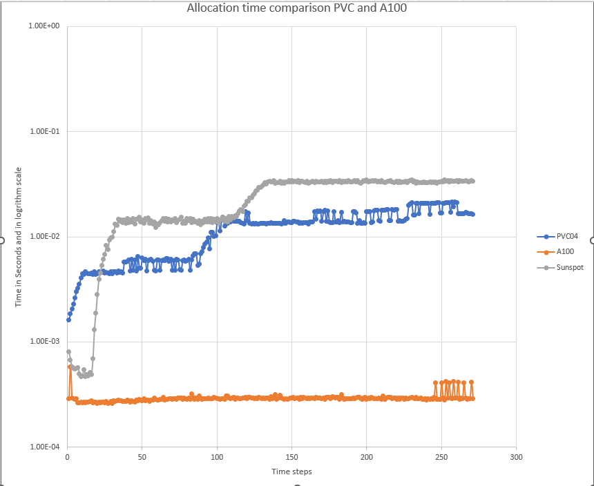
## Nov 21 2023
1. Working on TwoMoment_NeutrinoMatterSolverModule.F90 TwoMoment_DiscretizationModule_Collisions_Neutrinos.F90 TwoMoment_TimeSteppingModule.F90 by adding timer to see what causes 26ms GPU idle. 
## Nov 20 2023
1. Got iprof run of 16x16x16 relaxation case on sunspot
2. try to run vtune on ortce machines, quanshao@sdp125072, but got error 38.
<pre>
Libomptarget error: Source location information not present. Compile with -g or -gline-tables-only.
Libomptarget fatal error 1: failure of target construct while offloading is mandatory
vtune: Error: Application sets its own handler for signal 38 that is used for internal needs of the tool. Collection cannot continue. Refer to the Troubleshooting section of the online help for possible workarounds.
forrtl: error (76): Abort trap signal
</pre>
## Nov 17 2023
1. Thornado's relaxation compiles and runs on Sunspot with following changes to the buildRun.all.sh in /home/shaopingquan/ExaStar/thornado-GSD6461/SandBox/TwoMoment_OrderV/Executables
<pre>
export MPIR_CVAR_ENABLE_GPU=0
#   export FI_PROVIDER=sockets
module load  oneapi/eng-compiler/2023.10.15.002
module switch mpich/51.2/icc-all-pmix-gpu

</pre>
The times are worse
<pre>
       Timer_Total                              :     2.039285E+02 s
         Timer_IMEX                             :     1.956048E+02 s
         Timer_Euler                            :     0.000000E+00 s
         Timer_Poisson                          :     0.000000E+00 s
         Timer_Streaming                        :     0.000000E+00 s
           Timer_Streaming_Divergence           :     0.000000E+00 s 0.000000E+00
           Timer_Streaming_ObserverCorrections  :     0.000000E+00 s 0.000000E+00
           Timer_Streaming_Derivatives          :     0.000000E+00 s
           Timer_Streaming_Eigenvalues          :     0.000000E+00 s
           Timer_Streaming_NumericalFlux        :     0.000000E+00 s
           Timer_Streaming_NumericalFlux_InOut  :     6.722693E+00 s
           Timer_Streaming_NumericalFlux_RHS    :     6.465289E+00 s
           Timer_Streaming_NumericalFlux_LS     :     3.395362E+00 s
           Timer_Streaming_NumericalFlux_Update :     6.137787E+00 s
           Timer_Streaming_PrimitiveTwoMoment   :     0.000000E+00 s
           Timer_Streaming_Sources              :     0.000000E+00 s
           Timer_Streaming_LinearAlgebra        :     0.000000E+00 s
         Timer_Collisions                       :     1.930194E+02 s
           Timer_Collisions_PrimitiveFluid      :     6.094217E-03 s
           Timer_Collisions_PrimitiveTwoMoment  :     2.562205E+01 s
           Timer_Collisions_Solve               :     1.420913E+02 s
           Timer_Collisions_OuterLoop           :     1.319691E+02 s
           Timer_Collisions_InnerLoop           :     1.128033E+02 s
           Timer_Collisions_ComputeOpacity      :     1.471983E+01 s
           Timer_Collisions_ComputeRates        :     3.918974E+01 s
           Timer_Collisions_InitializeRHS       :     6.183593E+00 s
           Timer_Collisions_NeutrinoRHS         :     2.479573E+01 s
           Timer_Collisions_MatterRHS           :     4.735996E+00 s
           Timer_Collisions_SolveLS             :     3.411053E+01 s
           Timer_Collisions_UpdateFP            :     7.098278E+00 s
           Timer_Collisions_UpdateFP_out        :     8.023067E-01 s
           Timer_Collisions_CheckOuter          :     4.130428E-01 s
</pre>
## Nov 15-16 2023
1. Build hdf1.12.0 on DUT machie of ORTCE lab. The machine has a Ubuntu Operating system and the run of autogen.sh fails. Running
`quanshao@DUT755PVC:~/ExaStar/hdf512$ CC=/opt/hpc_software/libraries/intel/mpich/pvc51.2/bin/mpicc FC=/opt/hpc_software/libraries/intel/mpich/pvc51.2/bin/mpifort CXX=/opt/hpc_software/libraries/intel/mpich/pvc51.2/bin/mpicxx ./configure --enable-fortran --enable-cxx --enable-parallel --enable-unsupported --prefix=/nfs/site/home/quanshao/ExaStar/hdf512`. But got a error message
<pre>
libtool: warning: library '/opt/hpc_software/libraries/intel/mpich/pvc51.2/lib/libmpicxx.la' was moved.
/usr/bin/grep: /opt/hpc_software/libraries/intel/mpich/drop51.2/lib/libmpi.la: No such file or directory
/usr/bin/sed: can't read /opt/hpc_software/libraries/intel/mpich/drop51.2/lib/libmpi.la: No such file or directory
libtool:   error: '/opt/hpc_software/libraries/intel/mpich/drop51.2/lib/libmpi.la' is not a valid libtool archive
 
my echo $LD_LIBRARY_PATH shows:
/opt/hpc_software/libraries/intel/mpich/pvc51.2/lib:/opt/hpc_software/compilers/intel/nightly/20230816/opt/compiler/lib:/opt/hpc_software/compilers/intel/nightly/20230816/lib
 
and here is my configure line:
quanshao@DUT755PVC:~/ExaStar/hdf512$ CC=/opt/hpc_software/libraries/intel/mpich/pvc51.2/bin/mpicc FC=/opt/hpc_software/libraries/intel/mpich/pvc51.2/bin/mpifort CXX=/opt/hpc_software/libraries/intel/mpich/pvc51.2/bin/mpicxx ./configure --enable-fortran --enable-cxx --enable-parallel --enable-unsupported --prefix=/nfs/site/home/quanshao/ExaStar/hdf512
</pre>
2. Asked ORTCe channel, Gregg suggested to use INTEL MPI. Tried module load intel/mpi, there was a configure error. 
3. Trying module load  intel/oneapi/2023.2.1, and see a lot warnings when doing make -j8 "warning: redundant redeclaration of 'PMPI_Ssend". "make -j8" finished with a lot of warnning messages. Running make install. Here is errors:
<pre>
 /usr/bin/mkdir -p '/nfs/site/home/quanshao/ExaStar/hdf512/bin'
 /usr/bin/install -c h5redeploy '/nfs/site/home/quanshao/ExaStar/hdf512/bin'
/usr/bin/install: 'h5redeploy' and '/nfs/site/home/quanshao/ExaStar/hdf512/bin/h5redeploy' are the same file
make[2]: *** [Makefile:765: install-binSCRIPTS] Error 1
make[2]: Leaving directory '/nfs/site/home/quanshao/ExaStar/hdf512/bin'
make[1]: *** [Makefile:1000: install-am] Error 2
make[1]: Leaving directory '/nfs/site/home/quanshao/ExaStar/hdf512/bin'
make: *** [Makefile:662: install-recursive] Error 1
</pre>
4. DUT***PVC machine is slow, the compilation takes more than 10 minutes, while it takes less than 2 mins on sdpcloud PVC machines
5. Relaxation case compiles and runs on sdp693160 with old hdf57.  Here is the timing:
<pre>
       Timer_Total                              :     1.802631E+02 s
         Timer_IMEX                             :     1.476576E+02 s
         Timer_Collisions                       :     1.457741E+02 s
           Timer_Collisions_PrimitiveFluid      :     5.665064E-03 s
           Timer_Collisions_PrimitiveTwoMoment  :     2.040077E+01 s
           Timer_Collisions_Solve               :     1.087499E+02 s
           Timer_Collisions_OuterLoop           :     1.026653E+02 s
           Timer_Collisions_InnerLoop           :     9.394104E+01 s
           Timer_Collisions_ComputeOpacity      :     6.658610E+00 s
           Timer_Collisions_ComputeRates        :     3.319608E+01 s
           Timer_Collisions_InitializeRHS       :     4.150761E+00 s
           Timer_Collisions_NeutrinoRHS         :     2.152830E+01 s         
</pre>
## Mov 14 2023
1. FlashX with Thornado run hangs on PVC04 with the lastest delep-Ov and master branch of Thornado.
<pre>
commit 72f9d7d6311f407d8cd551603e7e2bbf695b5a79 (HEAD -> delep_Ov, origin/delep_Ov)
Merge: 03af9b63 513e2368
Author: akashdhruv <akashdhruv@gwmail.gwu.edu>
Date:   Tue Nov 7 21:10:37 2023 -0600

    Merge remote-tracking branch 'origin/main' into delep_Ov

commit 513e236887b55db2ff29856b2ba8e1ede63d341b
Merge: 1aff5889 51ca3a0a
Author: Akash Dhruv <akashdhruv@gwmail.gwu.edu>
Date:   Tue Nov 7 20:57:59 2023 -0600
</pre>
<pre>
Author: Sam Dunham <9784969+dunhamsj@users.noreply.github.com>
Date:   Tue Nov 7 11:19:41 2023 -0500

    only run MacOS runner if pushed from InterfaceWithPoseidon branch

commit e93f9187731d793766d37dd329a0ced89a8ef3b5
Merge: 8d67a30c 2ed77d37
Author: Eirik Endeve <endevee@ornl.gov>
Date:   Thu Oct 26 09:20:19 2023 -0400

    Merge branch 'master' of https://github.com/endeve/thornado
</pre>
## Nov 13 2023
1. FlashX with Thornado finally runs on PVC04 by setting up the right hdf5 library path. Here is the commit for FlashX and Thornado
<pre>
commit 432d59b7ddb2fcb2ebe013fa9e18d005414ea3c3 (HEAD -> delep_Ov_anl)
Author: Mathi Thavappiragasam <mthavappiragasam@x1921c3s1b0n0.hostmgmt.cm.americas.sgi.com>
Date:   Wed Nov 1 17:25:21 2023 +0000

    building Flash-X with thornado backend

commit 9720b4f330e2a038f1edb8d80bedf84fdd10a9bf (origin/delep_Ov, delep_Ov)
Author: Austin Harris <jaharris87@gmail.com>
Date:   Fri Jun 9 15:43:15 2023 -0400

    Update DeleptonizationWave initialization to use newer opacities interfaces
</pre>

<pre>
commit 0eae301d735c1481c0874d85b0a9a4629b264323 (HEAD, origin/frontier_workaround)
Author: Austin Harris <jaharris87@users.noreply.github.com>
Date:   Tue Jun 6 10:48:54 2023 -0400

    make dummy arguments explicitly-sized in Euler PL

commit 1217590613635f7db87fbf5616920f5c853ead78
Author: Austin Harris <jaharris87@users.noreply.github.com>
Date:   Mon Jun 5 14:58:35 2023 -0400

    Restructuring some of the logic for the Euler positivity limiter
</pre>
2. However, the case runs very slow and the results seems wrong as they are all zeros.
<pre>
     432 3.3356E-09 7.7214E-12  ( 0.391    ,   6.25    ,   6.25    ) |  2.075E-10 4.633E-12
 *** Wrote checkpoint file to streamingsinewave_hdf5_chk_0001 ****
 *** Wrote plotfile to streamingsinewave_forced_hdf5_plt_cnt_0000 ****

  INFO: SineWaveStreaming Error

    Sp           N          G1          G2          G3
    01  0.0000E+00  0.0000E+00  0.0000E+00  0.0000E+00
    02  0.0000E+00  0.0000E+00  0.0000E+00  0.0000E+00
</pre>
while on Sunspot the data look like:
<pre>
  INFO: SineWaveStreaming Error

    Sp           N          G1          G2          G3
    01  5.5923E-04  5.5923E-04  1.5383E-15  1.4516E-15
    02  5.5923E-04  5.5923E-04  1.5383E-15  1.4516E-15
[WARNING] yaksa: 3 leaked handle pool objects
[WARNING] yaksa: 3 leaked handle pool objects
</pre>
3. Tried Thorado relaxatoin on a PVC machine of ORtce cluster, the code compiles, but get hdf5 errors when running. 
## Nov 7-9 2023
1. Got a small standalone test code which compiles and runs on PVC04 with random numbers, and the file is reductionSpeed.f90. will run on JLSE's A100 system to see the performance comparison with PVC04 
2. Tried running FlashX with Thornado on Sunspot. With the code from Mathi, it compiles and runs on 6 cpu rank and 6 GPU tiles. 
3. One interesting thing is that if " module load hdf5 #cray-hdf5" in setup_sw_sunspot.sh is removed, the compilation fails due to cannot find the module of KindModule:
<pre>
ProgramHeaderModule.F90(3): error #7002: Error in opening the compiled module file.  Check INCLUDE paths.   [KINDMODULE]
  USE KindModule, ONLY: DP
------^
</pre>       
4. The error is related to hdf5 settings and the error message is buried in the middle of the log file. 
<pre>
RO_NONRELATIVISTIC -DHYDRO_RIEMANN_SOLVER_HLL -DTHORNADO_GPU -DTHORNADO_OMP_OL -D_OMP_OL -DTHORNADO_LA_ONEMKL -DTHORNADO_GIT_HASH=\"Before-Applications-Removal-1459-g0eae301d-dirty\" -DTHORNADO_GIT_DATE=\"2023-06-06\" -DTHORNADO_GIT_BRANCH=\"HEAD\" -DTHORNADO_GIT_URL=\"https://github.com/endeve/thornado.git\" ../..//Modules/InputOutput/InputOutputModuleHDF.F90 -o InputOutputModuleHDF.o
../..//Modules/InputOutput/InputOutputModuleHDF.F90(50): error #7013: This module file was not generated by any release of this compiler.   [HDF5]
  USE HDF5
------^
../..//Modules/InputOutput/InputOutputModuleHDF.F90(90): error #6683: A kind type parameter must be a compile-time constant.   [DP]
    REAL(DP), INTENT(in) :: Time
---------^
../..//Modules/InputOutput/InputOutputModuleHDF.F90(159): error #6683: A kind type parameter must be a compile-time constant.   [DP]
    REAL(DP), INTENT(out) :: &     
</pre>     


## Nov 6 2023
1. Worked on figureing out why solvels-fp-399? is 3X slower on PVC than on A100
2. Discussed with Brian and he suggested to test fopenmp-target-simd, and found out that this flag has a lots of issue for ocloc. Brian has filed a JIRA issue for this one: https://jira.devtools.intel.com/browse/XDEPS-6315
3. Will try to standalone test to see whether it can replicate the slowness issue. 
## Nov 3 2023
1. Added more timers in the code to see which one takes more time compared to A100 runs. 
2. Test the reproducer with the newest ifx,  Intel(R) Fortran 24.0-1372 (nightly-compiler/2023.11.02). even with -heap-arrays 0, the Direct way now is around 1000X faster than before. However, it seems that the individual assignment has become faster by 10X. Therefore, the Direct way is still around 20X slower than the Individual assignment. I propose to close the jira issue: https://jira.devtools.intel.com/browse/CMPLRLLVM-45457
<pre>
__omp_offloading_802_2c1be2_twomoment[...]attersolvermodule_mp_solvels_fp__l3994 |    5.99s |   4.51% |    6666 | 898.18us |   8.48us |   1.24ms |
__omp_offloading_802_2c1be2_twomoment[...]attersolvermodule_mp_solvels_fp__l3942 |    5.12s |   3.86% |    8239 | 621.92us |  20.48us | 850.88us |
__omp_offloading_802_2c1be2_twomoment[...]attersolvermodule_mp_solvels_fp__l4130 |    3.67s |   2.77% |    6666 | 551.25us |  20.00us | 725.12us |
__omp_offloading_802_2c1be2_twomoment[...]attersolvermodule_mp_solvels_fp__l3975 |    3.48s |   2.62% |    6666 | 522.16us |  18.56us | 693.76us |
__omp_offloading_802_2c1be2_twomoment[...]attersolvermodule_mp_solvels_fp__l3960 |    2.62s |   1.97% |    6666 | 392.78us |  14.40us | 558.56us |
__omp_offloading_802_2c1be2_twomoment[...]attersolvermodule_mp_solvels_fp__l4107 |  45.48ms |   0.03% |    6666 |   6.82us |   5.44us |  38.40us |
__omp_offloading_802_2c1be2_twomoment[...]attersolvermodule_mp_solvels_fp__l4156 |   6.24ms |   0.00% |    1573 |   3.96us |   3.04us |  26.08us |


                        twomoment_neutrinomattersolvermodule_solvels_fp_3944_gpu |    4.20s |   3.51% |   8239 | 509.48us |   9.22us | 723.97us |
                        twomoment_neutrinomattersolvermodule_solvels_fp_4133_gpu |    2.87s |   2.40% |   6666 | 431.15us |   9.22us | 715.78us |
                        twomoment_neutrinomattersolvermodule_solvels_fp_3977_gpu |    2.63s |   2.20% |   6666 | 394.51us |   9.22us | 553.98us |
                        twomoment_neutrinomattersolvermodule_solvels_fp_3997_gpu |    1.90s |   1.59% |   6666 | 285.29us | 119.81us | 355.33us |
                        twomoment_neutrinomattersolvermodule_solvels_fp_3962_gpu |    1.86s |   1.55% |   6666 | 278.39us |   6.14us | 443.39us |
                        twomoment_neutrinomattersolvermodule_solvels_fp_4110_gpu |  62.62ms |   0.05% |   6666 |   9.39us |   6.14us |  15.36us |
                        twomoment_neutrinomattersolvermodule_solvels_fp_4158_gpu |  10.30ms |   0.01% |   1573 |   6.55us |   5.12us |  10.24us |
</pre>
## Nov 1-2 2023
1. reran the newest code and the previous code, did not replicate the performance regression due to the merge with Oct 27 master. Interesting. Ran several runs. 
2. FlashX with Thornado/master hangs on PVC04
3. Relaxation 16x16x16 running time comparison between JLSE A100 and PVC04. Here are the largest differences:
<pre>
                                                        PVC04                      A100                   PVC04-A100
            Timer_IMEX                          :     1.747317E+02 s              1.285368E+02 s            46.10                                            
           Timer_Streaming_NumericalFlux_InOut  :     6.020492E+00 s              1.787175E+00 s            4.23
           Timer_Streaming_NumericalFlux_RHS    :     6.367417E+00 s              4.640298E+00 s            1.73
           Time_Collision                       :     1.725610E+02 s              1.279202E+02 s            44.64
           Timer_Collisions_Solve               :     1.266426E+02 s              1.072200E+02 s            19.42  
           Timer_Collisions_OuterLoop           :     1.165613E+02 s              1.014776E+02 s            15.08
           Timer_Collisions_InnerLoop           :     9.952693E+01 s              7.903135E+01 s            20.50
           Timer_Collisions_NeutrinoRHS         :     2.384875E+01 s              1.771042E+01 s       
</pre>

## Oct 31 2023
1. Mathi reported that FlashX/Thornado runs on PVCs. Tested his setup command line and running. I got
<pre>
 mpiexec -np 6 -ppn 6 -d 2 --cpu-bind depth  ./flashxsrun: error: Node failure on exaperf-sdpcloud-pvc04
srun: error: Node failure on exaperf-sdpcloud-pvc04DS_PER_RANK=1
srun: Force Terminated job 32549
quanshao@gojira:~> pcloud-pvc04.jf.intel.com] match_arg (lib/utils/args.c:166): unrecognized argument d
[mpiexec@exaperf-sdpcloud-pvc04.jf.intel.com] HYDU_parse_array (lib/utils/args.c:181): argument matching returned error
[mpiexec@exaperf-sdpcloud-pvc04.jf.intel.com] parse_args (mpiexec/get_parameters.c:312): error parsing input array
[mpiexec@exaperf-sdpcloud-pvc04.jf.intel.com] HYD_uii_mpx_get_parameters (mpiexec/get_parameters.c:47): unable to parse user arguments
[mpiexec@exaperf-sdpcloud-pvc04.jf.intel.com] main (mpiexec/mpiexec.c:46): error parsing parameters
</pre>
2. FlashX/Thornado run hangs with eng-05.15.003 aslo with MKL 2023.08.28 and nightly 2023.08.20.
3. The error message is 
<pre>
Target LEVEL0 RTL --> Error: runTargetTeamRegion:zeEventHostSynchronize failed with error code 1879048193, ZE_RESULT_ERROR_DEVICE_LOST
Libomptarget --> Executing target region abort target.
Libomptarget error: Run with
Libomptarget error: LIBOMPTARGET_DEBUG=1 to display basic debug information.
Libomptarget error: LIBOMPTARGET_DEBUG=2 to display calls to the compute runtime.
Libomptarget error: LIBOMPTARGET_INFO=4 to dump host-target pointer mappings.
TwoMoment_DiscretizationModule_Streaming.F90:2270:0: Libomptarget fatal error 1: failure of target construct while offloading is mandatory
</pre>>     
## Oct 30 2023
1. Contiued with Adam on running their roofline with Thornado. However, oneprof --metric-list does not work, i.e., gives segmenation fault. Discussed with Carolos, and he said that oneprof --metric-list does not work for our system. But oneprof $APPLICATION $INPUTS --group 1216 works. Tested with ze-gemm app, and found that it is indeed working:
<pre>
quanshao@exaperf-sdpcloud-pvc04:/localdisk/quanshao/ExaStar/roofline-org/Examples/ze_gemm> ../../tools/oneprofexe/oneprof ./ze_gemm 1000x1000 2 --group 1216
Level Zero Matrix Multiplication (matrix size: 1000 x 1000, repeats 2 times)
Target device: Intel(R) Data Center GPU Max 1550
Matrix multiplication time: 0.00300288 sec
Results are CORRECT with accuracy: 4.76852e-06
Matrix multiplication time: 0.00305696 sec
Results are CORRECT with accuracy: 4.76852e-06
Total execution time: 0.0750938 sec
[INFO] Result file is result.8031.bin
</pre>
2. Merge ms69 with the newest master dated Oct 23 2023, but see 10% performance regression:
<pre>
                                        Oct 23           Mid Oct
sineWave   [8,8,8]      O3        :     6.2197e+00      5.6065e+00
sineWave   [16,16,16]   O3        :     7.7251e+01      7.0337e+01
relax      [8,8,8]      O3        :     2.5685e+01          
relax      [16,16,16]   O3        :     2.0825e+02

</pre>
## Oct 27 2023
1. Had a meeting with Kwasniewski, Patryk, and Dziekonski, Adam for the roofline they are using, and it was found out the python version was the cause of the crashes. The version they are using is Python 3.10.12
2. Chong helped in to set up miniconda which makes the installation of python version very easy. 
3. Moved CMPLRLLVM-52215 to GSD-6817 per Lorri's suggestion
4. Tested the reproducer with the latest nightly compiler, nightly-compiler/2023.10.26 ( Intel(R) Fortran 24.0-1349), the reproducer still hangs. It looks like that -O0 was missing in Lorri's compilation line.
Further tests showed that UMD now plays a rule for hanging. Here is the summary from Lorri in the JIRA
<pre>
Shaoping and I have been doing further experiments.   
We were both using the same version of the ifx compiler (24-1349).
He is using UMD627, and noted that this test still hangs for both PVC and GEN9.
I am using a "hotfix" UMD, seemingly from around level 736 and do not see a hang on our local GEN9 system.
If I use a UMD627 from the rdrive, then I do see a hang on our local GEN9 system.
At this point, we're waiting for the experimental one to be available to the TCE's, when Shaoping will retry again.
If it works both GEN and PVC we'll all be happy.
If it works GEN, not PVC, this will be reassigned to the GSD project.
</pre>
##Oct 25-26 2023
1. Learn to run Thornado with a roofline tool suggest by Kwasniewski, Patryk   https://github.com/intel-sandbox/roofline. So far two observations:
   - python3 is needed otherwise   
   <pre>
   "Traceback (most recent call last):
    File "main.py", line 3, in <module>
    from pathlib import Path
    ImportError: No module named pathlib"
   </pre>
   - Got an error like:
   <pre>
    "DATAPORT_OUTPUT_READY_XECORE  :  Off
    Traceback (most recent call last):
    File "main.py", line 229, in <module>
      run_roofline(args)
    File "main.py", line 179, in run_roofline
      run_workloads(wl_info, args, wl_report_name)
    File "main.py", line 40, in run_workloads
      metric_groups, WL_oneprof_km_metrics, _ = get_metric_list(drop_cols_CB, drop_cols_nonCB, compute_metric, selected_groups=WL_oneprof_km_metrics)
    File "/localdisk/quanshao/ExaStar/roofline/utils.py", line 236, in get_metric_list
      oneprof_list = subprocess.run(['./tools/oneprofexe/oneprof', '--metric-list'], capture_output=True).stdout.decode()
    File "/usr/lib64/python3.6/subprocess.py", line 423, in run
      with Popen(*popenargs, **kwargs) as process:
    TypeError: __init__() got an unexpected keyword argument 'capture_output' "
   </pre>
And this error also happen for ze_gemm case.
2. Tried again on 26 with Patryk's suggestion, and same thing happened    
## Oct 24 2023
1. Relaxation case does not run with advisor as the first step of advisor run gives errors like:
<pre>
 [ComputeThermodynamicStates_Auxiliary_TABLE_Vector] Error
  iP, D, E, Y :  4093  1.032000000000000E+12  2.317372267736278E+19  1.347000000000000E-01

   wlEOSInversionModule ERROR: EOS Inversion Not Initialized

 [ComputeThermodynamicStates_Auxiliary_TABLE_Vector] Error
  iP, D, E, Y :  4094  1.032000000000000E+12  2.317372267736278E+19  1.347000000000000E-01

</pre>
however, the second step run is Okay. Upload "partially correct roofline results to GSD6461. This issue happens to the default umd627, 728 and 692 also. 
2. Got the OACC run of relaxation case and put the outputs under $GSD6461/GSD6461. 

## Oct 23 2023
1. Tested the newest compiler, nightly-compiler/2023.10.22 (Intel(R) Fortran 24.0-1349), the wrong values persist. Here is the output:
<pre>
nightly-compiler/2023.10.22
 Intel(R) Fortran 24.0-1349
 Intel(R) Fortran 24.0-1349
 Intel(R) Fortran 24.0-1349
gpu gpu  -1 -71776119069884416
 CPU CPU  T       140730218568480
 ITERATE_inner nIterations_Inner  F       140730218568480
 ITERATE_inner ITERATE_outer      T       140730218568480
 ITERATE_inner nIterations_Outer  F       140730218568480
 ITERATE_inner Beta_u_1           T       140730218568480
 ITERATE_inner nIterations_Inner  F       140730218568480
 ITERATE_inner                    T       140730218568480


Mon 23 Oct 2023 10:10:17 AM EDT
/localdisk/quanshao/sandbox/CMPLRLLVM-52215/maskValue on exaperf-sdpcloud-pvc04.jf.intel.com
quanshao@exaperf-sdpcloud-pvc04:/localdisk/quanshao/sandbox/CMPLRLLVM-52215/maskValue
</pre>
2. Provided ShaderDump with all the asm .ll to https://jira.devtools.intel.com/browse/GSD-6461
3. Get relaxation cases running on GPU-A100 machines of JLSE, gpu06. Have the iprof data, but iprof -l seems not working with OACC. 
4. Synchronize the GSD6461 with the JLSE GPU06 code. 
## Oct 18-20 2023
1. Testing umd692 and umd693 and also igc drivers from 14062 to 15443. 
2. summarized the results and put them to the JIRA, https://jira.devtools.intel.com/browse/GSD-5788
3. Profile the relaxation case and created a .spv file and uploaded to the JIRA https://jira.devtools.intel.com/browse/GSD-6461?filter=-2
## Oct 17 2023
1. Merged mms69 branch with the lastest master branch and found that the Streaming SineWave case runs almost 2X faster. Discussed with the developers at national labs, and it found out that the recent change of the initial guess reduced the iterations of the liner solvers, so leading to faster computing time. Here is the data:

<pre>
cat timeFOM_2023.08.20-2023.08.28.txt-umd692
                                                        Time(seconds)                             |                      Figure of Merit (FOM)
AppName     Grid      OpLevel :  2023.08.20-umd692   2023.08.20-dev627    TimeDiff   Percentage   |   2023.08.20-umd692   2023.08.20-dev627    FOM-Diff   Percentage
                     MKL Date :  2023.08.28               2023.08.28
-----------------------------    --------------------------------------------------------------       --------------------------------------------------------------
sineWave   [8,8,8]      O3    :     5.6065e+00          9.4682e+00      -3.8617e+00   -40.79%            2.2724e+07          1.3456e+07        9.2681e+06    68.88%
sineWave   [16,16,16]   O3    :     7.0337e+01          1.3478e+02      -6.4441e+01   -47.81%            2.8802e+07          1.5031e+07        1.3771e+07    91.62%
relax      [8,8,8]      O3    :     2.0817e+01          2.0464e+01       3.5318e-01     1.73%            4.0952e+07          4.1659e+07       -7.0680e+05    -1.70%
relax      [16,16,16]   O3    :     1.7703e+02          1.6591e+02       1.1119e+01     6.70%            3.8525e+07          4.1107e+07       -2.5818e+06    -6.28%
</pre>
2. Thornado compiles and runs on CPU only, the results are correct. 

## Oct 16 2023
1. Tested the release candidate rc02, thornado compiles and runs correctly with the candidate. The performance looks good.
2. Flash-X/Thronado compiles, but it hangs in OMP PRIVATE( uPR_L)  in Modules/TwoMoment/OrderV/TwoMoment_DiscretizationModule_Streaming.F90. Plan to run CPU only to see if the code works. 

## Oct 11 2023
1. Tried 75049 and did not see any performance improvement, but slightly degradation. https://gfx-assets-build.intel.com/artifactory/api/archive/download/open-linux-driver-builds/verify/dev_igc/open-linux-driver-verify-dev_igc-75049/artifacts/linux/sles/15.3/release?archiveType=zip
<pre>
cat timeFOM_2023.08.20-2023.08.28.txt75049
                                                        Time(seconds)                             |                      Figure of Merit (FOM)
AppName     Grid      OpLevel :  2023.08.2075049   2023.5.007-dev647    TimeDiff   Percentage   |   2023.08.2075049   2023.5.007-dev647    FOM-Diff   Percentage
                     MKL Date :  2023.08.28
-----------------------------    --------------------------------------------------------------       --------------------------------------------------------------
sineWave   [8,8,8]      O3    :     1.2547e+01          9.4460e+00       3.1010e+00    32.83%            1.0154e+07          1.3487e+07       -3.3334e+06   -24.71%
sineWave   [16,16,16]   O3    :     1.3882e+02          1.3354e+02       5.2778e+00     3.95%            1.4594e+07          1.5170e+07       -5.7680e+05    -3.80%
</pre>

## Oct 6 2023
1. Tested Thornado using the candidate SDK for MS69, and thornado compiles and runs fine with a little bit (less than 2%) performance improvement compared to the one in current MS69 report. 
<pre>
ml use /exaperf/validate/modulefiles
ml oneapi/eng-compiler/2023.10.15.002-rc01 
ml swap -f mpich/52.2/icc-sockets-gpu
</pre>
2. Tried the suggestions from Austin on FlashX/Thornado run. The second method by Austin helps the run passed the grid parts. But the code hangs on `2532     !$OMP TARGET TEAMS DISTRIBUTE PARALLEL DO &` of "Modules/TwoMoment/OrderV/TwoMoment_DiscretizationModule_Streaming.F90. It might be the time to try the CPU only runs. 
3. Tested the reproducer of https://jira.devtools.intel.com/browse/CMPLRLLVM-52215 on a Gen9 node, i.e., anepcdlin01, and it is found that as Lorri pointed out that the reproducer produces correct result. So the wrong value only happens on PVC systems. Updated the JIRA issue with this new findings. 

## Oct 5 2023
1. Suggested by Kwasniewski, Patryk that the slowdown seeing in open-linux-driver-verify-dev_igc-74802 might come from other source and test of open-linux-driver-ci-dev_igc-15399 has been performed. The test showed that the slowdown is in the igc driver of 15399. Here are the times using 15399:
<pre>
sineWave   [8,8,8]        1.2346e+01

sineWave   [16,16,16]     1.3893e+02
</pre>
It is noticed that extra warning messages appeared with 15399 and 74802.
<pre>
warning: VLA has been detected, the private memory size is set to 4096B. You can change the size by setting flag ForcePerThreadPrivateMemorySize to a value from [1024:20480]. Greater values can affect performance, and lower ones may lead to incorrect results of your program.
To make sure your program runs correctly you can set flag StackOverflowDetection to 1. This flag will print "Stack overflow detected!" if insufficient memory value has lead to stack overflow. It should be used for debugging only as it affects performance.

warning: VLA has been detected, the private memory size is set to 4096B. You can change the size by setting flag ForcePerThreadPrivateMemorySize to a value from [1024:20480]. Greater values can affect performance, and lower ones may lead to incorrect results of your program.
To make sure your program runs correctly you can set flag StackOverflowDetection to 1. This flag will print "Stack overflow detected!" if insufficient memory value has lead to stack overflow. It should be used for debugging only as it affects performance.

warning: VLA has been detected, the private memory size is set to 4096B. You can change the size by setting flag ForcePerThreadPrivateMemorySize to a value from [1024:20480]. Greater values can affect performance, and lower ones may lead to incorrect results of your program.
To make sure your program runs correctly you can set flag StackOverflowDetection to 1. This flag will print "Stack overflow detected!" if insufficient memory value has lead to stack overflow. It should be used for debugging only as it affects performance.


</pre>

2. Tested newest nightly, i.e., nightly-compiler/2023.10.04 (Intel(R) Fortran 24.0-1308) for the reproducer of https://jira.devtools.intel.com/browse/CMPLRLLVM-52215 and find the issue still persists. the reason of doing this test is that Lorri commented "I cannot reproduce this with the latest xmain compiler.". Updated the JIRA issue with the test result and ask the version of the compiler Lorri was testing. 
## Oct 3-4 2023
1. Obtained a reproducer for the wrong value of MASK starting from nightly 08.22/ Intel(R) Fortran 24.0-1202. Filed a JIRA for it, and here is the link: https://jira.devtools.intel.com/browse/CMPLRLLVM-52215
2. Tested open-linux-driver-verify-dev_igc-74802 for Thornado and also compared the run times for umd692 and umd693, and here is the result: 
<pre>
  Case             umd692   open-linux-driver-verify-dev_igc-74802     umd693 
sineWave [8,8,8]    9.4859e+00          1.2605e+01                       1.1712e+01
sineWave [16,16,16] 1.3178e+02          1.3617e+02                       1.5630e+02
</pre>
The log files are in /localdisk/quanshao/ExaStar/thornado/SandBox/TwoMoment_OrderV/Executables/GSD5788
# Oct 2 2023
1. Continue reducing Thornado to replicate the wrong MASK value since 08.22.
    - Modules/TwoMoment/TwoMoment_DiscretizationModule_Collisions_Neutrinos.F90 : Done 
    - Modules/TwoMoment/TwoMoment_NeutrinoMatterSolverModule.F90 : Done
    - Modules/TwoMoment/OrderV/TwoMoment_TimeSteppingModule.F90  : Done
    - Sandbox/TwoMoment_OrderV/ApplicationDriver_Neutrinos.F90   : Done
2. Discussed with Austin about the serial run crash inside the grid distribution. Sent an email to him with the files he asked. 
## Sept 28-29 2023
1. Code to output ITERATE_inner.
<pre>
   ITERATE_outer = .TRUE.
    ITERATE_inner = .TRUE.

    !$OMP TARGET ENTER DATA &
    !$OMP MAP( to: &
    !$OMP   ITERATE_outer, ITERATE_inner )

      !$OMP TARGET PARALLEL
      !$OMP Single
      print*, "gpu gpu ",ITERATE_inner(1), LOC(ITERATE_inner)
      !$OMP END Single
      !$OMP END TARGET PARALLEL

      print*,"CPU CPU ", ITERATE_inner(1), LOC(ITERATE_inner)

      !$OMP TARGET UPDATE FROM(ITERATE_inner, nIterations_Inner)
      print*,"ITERATE_inner nIterations_Inner ", ITERATE_inner(1), LOC(ITERATE_inner)

      !$OMP TARGET UPDATE FROM(ITERATE_inner, ITERATE_outer)
      print*,"ITERATE_inner ITERATE_outer     ", ITERATE_inner(1), LOC(ITERATE_inner)

      !$OMP TARGET UPDATE FROM(ITERATE_inner, nIterations_Outer)
      print*,"ITERATE_inner nIterations_Outer ", ITERATE_inner(1), LOC(ITERATE_inner)
      !$OMP TARGET UPDATE FROM(ITERATE_inner, Beta_u_1)
      print*,"ITERATE_inner Beta_u_1          ", ITERATE_inner(1), LOC(ITERATE_inner)

      !$OMP TARGET UPDATE FROM(ITERATE_inner, nIterations_Inner)
      print*,"ITERATE_inner nIterations_Inner ", ITERATE_inner(1), LOC(ITERATE_inner)
stop " wwwwwwwww "

  END SUBROUTINE SolveNeutrinoMatterCoupling_FP_Nested_AA
</pre>

Here is the result for 0822 for original code
<pre>
 gpu gpu -1      -71776119063216128
 CPU CPU  T       140721758803632
 ITERATE_inner nIterations_Inner  F       140721758803632
 ITERATE_inner ITERATE_outer      T       140721758803632
 ITERATE_inner nIterations_Outer  F       140721758803632
 ITERATE_inner Beta_u_1           T       140721758803632
 ITERATE_inner nIterations_Inner  F       140721758803632
 wwwwwwwww
</pre>
2. reducing Thornado for the wrong value of MASK after UPDATE FROM directive. 
   - set nIterations_Inner(:) = 1/0 and nIterations_Outer(:) = 1/0 does not affect 0820, i.e. ITERATE_inner(1)=T; however it affect 08.22, setting them to 1, make the output of ITERATE_inner(1)=T. 
   <pre>
     ITERATE_inner nIterations_Inner  T       140724786721344
     ITERATE_inner ITERATE_outer      T       140724786721344
     ITERATE_inner nIterations_Outer  T       140724786721344
     ITERATE_inner Beta_u_1           T       140724786721344
     ITERATE_inner nIterations_Inner  T       140724786721344
   </pre>
   - Simplified SolveNeutrinoMatterCoupling_FP_Nested_AA and created a SolveNeutrinoMatterCoupling_FP_Nested_AA_debug. The simplication includes remove all unnecessary variables, functions, etc. . 
   - Simplified  InitializeCollisions , but get T for all print out for both 0820 and 0822. Here are code: 
   <pre>
    !$OMP TARGET ENTER DATA &
    !$OMP MAP( to:  & 
    !$OMP          nIterations_Inner, nIterations_Outer ) &
    !$OMP MAP( alloc: GX_N )
   </pre>
   - The above issue is caused by deleting InitializeNeutrinoMatterSolver call. With this call, and removal of unnecessary variables in TARGET ENTER DATA, the code replicated the wrong value issue. 
   - Modules/TwoMoment/TwoMoment_DiscretizationModule_Collisions_Neutrinos.F90 almost in its simplest form
   - Modules/TwoMoment/TwoMoment_NeutrinoMatterSolverModule.F90 almost in its simplest form
   - Modules/TwoMoment/OrderV/TwoMoment_TimeSteppingModule.F90 working on it 
## Sept 27 2023
1. Working on Flash-X compilation and runs
   - Set -maxblocks=100000 (7000) make the code compile and run without the "SIGSEGV, Segmentation fault on the intrinsic allocation function" errror. https://jira.devtools.intel.com/browse/CMPLRLIBS-34599
   - However, the run of flashX has some issues:
       - ` mpirun -np ${NTOTRANKS} -ppn ${NRANKS} -envall /localdisk/quanshao/ExaStar/bin/gpu_tile_compact.sh ./flashx` gives error " OMP: Info #277: omp_get_nested routine deprecated, please use omp_get_max_active_levels instead. /localdisk/quanshao/ExaStar/bin/gpu_tile_compact.sh: line 46: 79264 Killed          "$@""
       - `mpiexec -env ZE_AFFINITY_MASK=0.0 -np 1 -ppn 2 ./flashx` and `mpiexec -env ZE_AFFINITY_MASK=0.0 -np 1 -ppn 1 ./flashx`, and `./flashx` all give:
       <pre>
        Done with refinement: total blocks =         4080
        [amr_morton_process]: Initializing surr_blks using standard orrery implementati
        on
        INFO: Grid_fillGuardCells is ignoring masking.
        iteration, no. not moved =            0        4079
        iteration, no. not moved =          100        4064
        ERROR: could not move all blocks in amr_redist_blk
        Try increasing maxblocks or use more processors
        nm2_old, nm2 =         4064        4064
        ABORTING !!!!!!!!!!!!!!!!!!!!!!!!!!!!!!!!!!!!!!!!
       </pre>
2. For the reproducer, allocating smaller memory gives different crash errors, but after the same print " nvarnvarnvar          108           4           4           4"
<pre>
Thread 1 "flashxJira" received signal SIGSEGV, Segmentation fault.
0x0000155549442c2f in rml::internal::LargeObjectCache::putList(rml::internal::LargeMemoryBlock*) () from /exaperf/nightly/compiler/2023.08.27/linux/lib/libiomp5.so
(gdb) bt
#0  0x0000155549442c2f in rml::internal::LargeObjectCache::putList(rml::internal::LargeMemoryBlock*) () from /exaperf/nightly/compiler/2023.08.27/linux/lib/libiomp5.so
#1  0x000015554943aa6f in rml::internal::TLSData::release() () from /exaperf/nightly/compiler/2023.08.27/linux/lib/libiomp5.so
#2  0x000015554943a948 in rml::internal::MemoryPool::onThreadShutdown(rml::internal::TLSData*) () from /exaperf/nightly/compiler/2023.08.27/linux/lib/libiomp5.so
#3  0x000015554943a5fd in doThreadShutdownNotification(rml::internal::TLSData*, bool) () from /exaperf/nightly/compiler/2023.08.27/linux/lib/libiomp5.so
#4  0x000015554943af3e in __TBB_mallocProcessShutdownNotification () from /exaperf/nightly/compiler/2023.08.27/linux/lib/libiomp5.so
#5  0x00001555493a6f5d in __kmp_internal_end_library (gtid_req=1350) at ../../src/kmp_runtime.cpp:669
#6  0x000015555533b003 in _dl_fini () from /lib64/ld-linux-x86-64.so.2
#7  0x0000155548537c49 in __run_exit_handlers () from /lib64/libc.so.6
#8  0x0000155548537dca in exit () from /lib64/libc.so.6
#9  0x0000155548520354 in __libc_start_main () from /lib64/libc.so.6
#10 0x000000000040c01a in _start () at ../sysdeps/x86_64/start.S:120
</pre>
## Sept 26 2023
1. Compilers tested for the slowness of Relaxation {8,8,8}
   - 08/20 no slow down. Base case
   - 08/22 slow down. Wrong MASK(1) value after TARGET UPDATE FROM
   - 09/17 slow down. Wrong MASK(1) value after TARGET UPDATE FROM
   - UMD 728 and 627 all have the problem. so it is not umd related. it is ifx related.
2. Discussed with Brian about ways to narrow down the issue. One thing found is that split the UPDATE FROM variables fix the issue. The second is that putting the subroutine CheckConvergence_Inner into a separate file and call the sub from Modules/TwoMoment/TwoMoment_NeutrinoMatterSolverModule.F90 replicated the issue. The 3rd one is that the caculations in the subroutine does not affect the issue. 
## Sept 25 2023
1. The compilation issue persists for nightly compiler 2023.09.24.
2. Proof reading the Thornado porting paper leading by ANL's Math and targeted at IPDPS-24
3. Discussed with Brian about the UPDATE FROM for MASK variable in Modules/TwoMoment/TwoMoment_NeutrinoMatterSolverModule.F90. It seems that splitting the update for four variable to update for individual variable makes the code work. Will do a sweep test of the compilers from 08/22 to 09/19 to see whether the issue has been fixed accidently. 

## Sept 22 2023
1. The compilation issue persists for nightly 0921. 
2. Focusing on SolveNeutrinoMatterCoupling_FP_Nested_AA of Modules/TwoMoment/TwoMoment_NeutrinoMatterSolverModule.F90
## Sept 21 2023
1. Thornado compilation hangs for 5 minutes on "TwoMoment_PositivityLimiterModule.F90", and then gets a fatal error and aborts starting from nightly 0920 /Intel(R) Fortran 24.0-1270. It compiles fine with Intel(R) Fortran 24.0-1252 and older ones. Reduced Thornado and got a reproducer, filed a jira: https://jira.devtools.intel.com/browse/CMPLRLLVM-51851
2. Tested nightly 0920 /Intel(R) Fortran 24.0-1270 with the reproducer of https://jira.devtools.intel.com/browse/CMPLRLLVM-50559 and confirmed that the issue has been fixed. Closed the jira issue. 
3. Tested nightly 0920 /Intel(R) Fortran 24.0-1270 with the reproducer of https://jira.devtools.intel.com/browse/CMPLRLLVM-51515. the issue has been fixed. Closed the jira. 
4. reviewed the abstract and introduction of the paper and send the comments and suggestions to Mathi and cc-ed Brice. 
## Sept 20 2023
1. The slowness still persist with ifx 2023.09.19 amd mkl 2023.09.18 and umd 728
2. The slowdown due to umd change starting from umd693 (https://jira.devtools.intel.com/browse/GSD-5788) is gone for open-linux-driver-ci-dev_igc-15269. Here are the times for the two kernel :
<pre>
                                                                        time
 kernel                                       14180                     15296                           14181
computegeometryx_cartesian__l153              15.68us                 14.88us                          33.28us
tive_twomoment_vector_richardson__l639        659.69ms                569.69ms                          1.26s 

</pre>
vimdiff  sineWave.O3.2023.08.20-2023.08.2814180-iprof sineWave.O3.2023.08.20-2023.08.2815296-iprof sineWave.O3.2023.08.20-2023.08.2814181-iprof
3. Try to figure out the more than 10X slow down for the small relaxation case:  vimdiff relax.O3.2023.08.20-2023.08.28-dev627xN801-iprof00 relax.O3.2023.08.22-2023.08.28-dev627xN801-
iprof00. The results are different for 1 cycle run.
   - Fm is the same for 0820 and 0822 for k_outer=0 and k_inner to 0 and 1. 
   - Mask are all TRUE for 0820 and all FALSE for 0822

## Sept 19 2023
1. Thornado runs with 2023.09.17 amd mkl 2023.09.17 and umd 728. The same slowness still persists. 
2. iprof runs for Relaxation with {8,8,8} shows that there are way more call to computeneutrinoopacityrates_brem__l1804 with new compiler than the old ones (08.20), i.e.,  32880/6094, the time for each call seems not changed too much. need run iprof. 
3. run with printing out k\_outer and k\_inner in SolveNeutrinoMatterCoupling_FP_Nested_AA of Modules/TwoMoment/TwoMoment_NeutrinoMatterSolverModule.F90 for 8x8x8 case. The k\_inners are different from the first cycle:
<pre>
relax.O3.2023.08.20-2023.08.28-dev627-iprof00                                                         relax.O3.2023.08.22-2023.08.28-dev627-iprof00
        Cycle = 00000001  t = 0.000000E+00 dt = 1.000000E-04                                          |          Cycle = 00000001  t = 0.000000E+00 dt = 1.000000E-04                                             outer outer =           0                                                                            |   outer outer =           0                                                                               inner inner =           0                                                                            |   inner inner =           0                                                                               inner inner =           1                                                                            |   inner inner =           1                                                                               inner inner =           2                                                                            |  ------------------------------------------------------------------------------------------------------   inner inner =           3                                                                            |  ------------------------------------------------------------------------------------------------------   inner inner =           4                                                                            |  ------------------------------------------------------------------------------------------------------   inner inner =           5                                                                            |  ------------------------------------------------------------------------------------------------------   outer outer =           1                                                                            |   outer outer =           1                                                                               inner inner =           0                                                                            |   inner inner =           0                                                                               inner inner =           1                                                                            |   inner inner =           1                                                                               inner inner =           2                                                                            |  ------------------------------------------------------------------------------------------------------   inner inner =           3                                                                            |  ------------------------------------------------------------------------------------------------------   inner inner =           4                                                                            |  ------------------------------------------------------------------------------------------------------   outer outer =           2                                                                            |  ------------------------------------------------------------------------------------------------------   inner inner =           0                                                                            |  ------------------------------------------------------------------------------------------------------   inner inner =           1                                                                            |  ------------------------------------------------------------------------------------------------------   inner inner =           2                                                                            |  ------------------------------------------------------------------------------------------------------   inner inner =           3                                                                            |  ------------------------------------------------------------------------------------------------------   outer outer =           3                                                                            |  ------------------------------------------------------------------------------------------------------   inner inner =           0                                                                            |  ------------------------------------------------------------------------------------------------------   inner inner =           1                                                                            |  ------------------------------------------------------------------------------------------------------          Cycle = 00000002  t = 1.000000E-04 dt = 1.040000E-04                                          |          Cycle = 00000002  t = 1.000000E-04 dt = 1.040000E-04

</pre>
4. Tried {4,4,4} and {8,4,4} the issue is not in these cases. the issue is neither in {16,16,16} case. 

## Sept 18 2023
1. It is noted that the 8x8x8 Relaxation case slows down at Cycle=216 and more than 10-100X slow down after 236 Cycle. 
   - iprof -l seems hanging for the all whole 271 simulations. It ran more than 30 minutes but it is still running. Kill the job. The iprof folder is more than 20G in size. 
   - set maxCycle = 250, and see a file size limit error from iprof. The limit is 2G, but the data to be written is more than 3G. The iprof folder is 4.4G.
   - set maxCycle = 238, and the iprof folder is 2.2G. "Perfetto trace saved: out.pftrace" 
2. Debuging using iprof -l to see what caused slow down by running the code to Cycle=238
   - nightly-mkl-cev_rls/2023.08.28
    - nightly-compiler/2023.08.20
    - nightly-compiler/2023.08.22

3. With nightly-mkl-cev_rls/2023.08.30 and  nightly-compiler/2023.08.20, thornado gives: 
<pre>

quanshao@exaperf-sdpcloud-pvc04:/localdisk/quanshao/ExaStar/thornado/SandBox/TwoMoment_OrderV/Executables> tail -10 relax.O3.2023.08.20-2023.08.30-dev627-iprof
warning: kernel __omp_offloading_802_302539_ylimitermodule_nonrelativistic_table_mp_APPLYPOSITIVITYlimiter_euler_nonrelativistic_table__l802  compiled SIMD32 allocated 256 regs and spilled around 280

Build succeeded.
ld: /exaperf/nightly/mkl-cev_rls/2023.08.30/lib/libmkl_sycl_blas.so: undefined reference to `sycl::_V1::detail::AccessorBaseHost::AccessorBaseHost(sycl::_V1::id<3>, sycl::_V1::range<3>, sycl::_V1::range<3>, sycl::_V1::access::mode, void*, int, int, bool, unsigned long, bool, sycl::_V1::property_list const&)'
ld: /exaperf/nightly/mkl-cev_rls/2023.08.30/lib/libmkl_sycl_blas.so: undefined reference to `sycl::_V1::detail::AccessorBaseHost::AccessorBaseHost(sycl::_V1::id<3>, sycl::_V1::range<3>, sycl::_V1::range<3>, sycl::_V1::access::mode, void*, int, int, unsigned long, bool, sycl::_V1::property_list const&)'
make: *** [../Makefile:75: ApplicationDriver_Neutrinos] Error 1
</pre>
4. Thornado works with nightly 2023.09.17 and mkl 2023.09.14 umd dev627. The relaxation {8,8,8} case is still 20 times slower than the benchmarking run:
<pre>

cat timeFOM_2023.09.17-2023.09.14.txt-dev627
                                                        Time(seconds)                             |                      Figure of Merit (FOM)
AppName     Grid      OpLevel :  2023.09.17-dev627   2023.5.007-dev647    TimeDiff   Percentage   |   2023.09.17-dev627   2023.5.007-dev647    FOM-Diff   Percentage
                     MKL Date :  2023.09.14
-----------------------------    --------------------------------------------------------------       --------------------------------------------------------------
sineWave   [8,8,8]      O3    :     9.7783e+00          9.4460e+00       3.3234e-01     3.52%            1.3029e+07          1.3487e+07       -4.5840e+05    -3.40%
sineWave   [16,16,16]   O3    :     1.3117e+02          1.3354e+02      -2.3728e+00    -1.78%            1.5445e+07          1.5170e+07        2.7440e+05     1.81%
relax      [8,8,8]      O3    :     4.0712e+02          1.9943e+01       3.8718e+02  1941.41%            2.0940e+06          4.2746e+07       -4.0652e+07   -95.10%
relax      [16,16,16]   O3    :     1.6737e+02          1.6671e+02       6.6170e-01     0.40%            4.0748e+07          4.0910e+07       -1.6170e+05    -0.40%
</pre>
## Sept 13-15 2023
1. Continue working on improving ms69 report by addressing reviewer's comments and suggestions and also proofreading. 
2. copied all the ms69 related result files to /shared/shared2/MS69, and add these files and the build run scripts to generated this files to to ms69 branch 
3. Did have 9.2 seconds IMEX time for StreamingSineWave {8,8,8} case on PVC04 using nightly-mkl-cev_rls/2023.08.28, nightly-compiler/ 2023.08.20, and neo/agama-devel-sp3/692-23.22.26516.20-692, but can only get 10.2 as the best time since 09/13/2023 on PVC04. Wondering what happened 1) with PVC04 machine, 2) the setup 3), source code changes? 4) run script changes.  BIG ????
4. git diff Aug 4 and Sept 14 did not show any code change can make the run slow.
5. Thornado works with nightly 2023.09.14 and mkl 2023.08.30 umd dev627. The relaxation {8,8,8} case is still 20 times slower than the benchmarking run:
<pre>
quanshao@exaperf-sdpcloud-pvc04:/localdisk/quanshao/ExaStar/thornado/SandBox/TwoMoment_OrderV/Executables> more timeFOM_2023.09.14-2023.08.30.txt-dev627
                                                        Time(seconds)                             |                      Figure of Merit (FOM)
AppName     Grid      OpLevel :  2023.09.14-dev627   2023.5.007-dev647    TimeDiff   Percentage   |   2023.09.14-dev627   2023.5.007-dev647    FOM-Diff   Percentage
                     MKL Date :  2023.08.30
-----------------------------    --------------------------------------------------------------       --------------------------------------------------------------
sineWave   [8,8,8]      O3    :     9.7823e+00          9.4460e+00       3.3635e-01     3.56%            1.3024e+07          1.3487e+07       -4.6370e+05    -3.44%
sineWave   [16,16,16]   O3    :     1.3317e+02          1.3354e+02      -3.7330e-01    -0.28%            1.5213e+07          1.5170e+07        4.2500e+04     0.28%
relax      [8,8,8]      O3    :     4.1522e+02          1.9943e+01       3.9528e+02  1982.05%            2.0531e+06          4.2746e+07       -4.0693e+07   -95.20%
relax      [16,16,16]   O3    :     1.6632e+02          1.6671e+02      -3.8470e-01    -0.23%            4.1004e+07          4.0910e+07        9.4600e+04     0.23%
</pre>
## Sept 12 2023
1. Thornado crashes with same forrtl error with nightly-compiler/2023.09.10.
2. Commented out "DEALLOCATE( EOS )" in Modules/EquationOfState/EquationOfStateModule_TABLE.F90 as a work around to the crash. Running Thornado with this work around and 2023.09.10. 
3. The slow down on the Relaxation small case is significant, starting from nightly-compiler/2023.08.22
<pre>
AppName     Grid      OpLevel :  2023.09.10-dev627   2023.5.007-dev647    TimeDiff   Percentage   |   2023.09.10-dev627   2023.5.007-dev647    FOM-Diff   Percentage
                     MKL Date :  2023.08.30
-----------------------------    --------------------------------------------------------------       --------------------------------------------------------------
sineWave   [8,8,8]      O3    :     9.7744e+00          9.4460e+00       3.2840e-01     3.48%            1.3034e+07          1.3487e+07       -4.5310e+05    -3.36%
sineWave   [16,16,16]   O3    :     1.3885e+02          1.3354e+02       5.3113e+00     3.98%            1.4590e+07          1.5170e+07       -5.8030e+05    -3.83%
relax      [8,8,8]      O3    :     4.1567e+02          1.9943e+01       3.9573e+02  1984.30%            2.0509e+06          4.2746e+07       -4.0695e+07   -95.20%
relax      [16,16,16]   O3    :     1.6938e+02          1.6671e+02       2.6685e+00     1.60%            4.0265e+07          4.0910e+07       -6.4450e+05    -1.58%
</pre>
4. Continue proof-reading ms report.
## Sept 11 2023
1. Continue modify the ms69 report, and reading other apps' report
2. Created a reproducer for the forrtl error related to deallocation, and submitted a JIRA https://jira.devtools.intel.com/browse/CMPLRLLVM-51515
## Sept 08 2023
1. reorganized the directories on PVC04. 
2.  Continue modify the ms69 report
3. With MKL  2023.08.30 and ifx 2023.09.07, and umd723, the StreamingSineWave case runs fine, but the Relaxation case crashed with "forrtl: severe (153): allocatable array or pointer is not allocated" and the runs are around 5-10 times slower than the usual runs. 
4. Tried a 5liner, but the forrtl: severe error did not appear. Need to figure out a reproducer. for the deallocation (EOS). reducing Thornado to /localdisk/quanshao/sandbox/allocDeallocPointer 
## Sept 07 2023
1. Continue modify the ms69 report by addressing the comments and suggestions from Todd, Brain, and Marcus. 
## Sept 06 2023
1. Test the reproducer of https://jira.devtools.intel.com/browse/CMPLRLLVM-50559, i.e., CMPLRLLVM-42119.f90, with nightly-compiler/2023.09.05, i.e.,Intel(R) Fortran 24.0-1238, the reproducer still fails for -O0. Xinmin said in the JIRA said that the issue was fixed in xmain. 
2. tested gfx-driver-ci-comp_igc-21028, but the app got "Segmentation fault (core dumped)" at the very beginning of the simulation. So I could not do the performance tests. One thing I noticed is that package size between open-linux-driver-ci-dev_igc-14181 and gfx-driver-ci-comp_igc-21028, the .zip file size is 1.5G for open-linux-driver-ci-dev_igc-14181, while it is only 101M for gfx-driver-ci-comp_igc-21028.
3. Working on improving the Relaxation 16x16x16 run speed. 
## Sept 05 2023
1. Replaced the vtune, advisor figures in the ms69 report, added a table listing the kernels with possible performance issue suggested by advisor, modified the text, .... ms69 thonado report 1st draft is ready for review.
## August 31 2023
1. IMPORTANT :  With oneapi/eng-compiler/2023.05.15.007, mpich/52.2-256/icc-sockets-gpu is loaded. On our PVC node, setting  FI_PROVIDER=sockets or not setting it does not help. The only help is to downgrade to mpich/51.2/icc-sockets-gpu
2. Vtune collection to work : with downgrading to mpich 51.2,  FI_PROVIDER=sockets and vtune -collect gpu-hotspots -data-limit=0 for eng-compiler/2023.05.15.007, vtune (build 626047) collection works. I have copied a build run script : buildRun.all.sh.vtune.eng007
3. Advisor starts at 14:40 08/31/2023 and finishes at 15.44 08/31/2023. 
4. Tested  open-linux-driver-ci-dev_igc-14181 and open-linux-driver-ci-dev_igc-14180, it is starting 14181 that there are 2X slow down for a lot of kernels. 
## August 30 2023
1. With the latest nightly, i.e., 08/27, and 08/29, Thornado relaxation case runs very slow after 200 some time steps, and finally crashed with "forrtl: severe (153): allocatable array or pointer is not allocate" of EOS in deallocating it in Modules/EquationOfState/EquationOfStateModule_TABLE.F90. 
2. The search shows that the issue starts from nightly 2023.08.21:
   MKL_DATE="2023.08.28"
   module load nightly-mkl-cev_rls/${MKL_DATE}
   - COMPILER_DATE="2023.08.27"  ## Slow down and deallocation errors  ////08.28 is an old version
   - COMPILER_DATE="2023.08.26"   ## Slow down and deallocation errors : Intel(R) Fortran 24.0-1220
   - COMPILER_DATE="2023.08.25"   ## Slow down and deallocation errors : Intel(R) Fortran 24.0-1220
   - COMPILER_DATE="2023.08.24"   ## Slow down and deallocation errors : Intel(R) Fortran 24.0-1202
   - COMPILER_DATE="2023.08.23"  ## Slow down and deallocation errors : Intel(R) Fortran 24.0-1202
   - COMPILER_DATE="2023.08.22"  ## Slow down and deallocation errors : Intel(R) Fortran 24.0-1202
   - COMPILER_DATE="2023.08.21"  ## sycl::V1::queue::memcpy : Intel(R) Fortran 24.0-1032
   - COMPILER_DATE="2023.08.20"  ## MS69 compiler : Intel(R) Fortran 24.0-1177
3. Working on the run Thornado with newest nightly and umd for MS69, and updating the Vtune, advisor, time/FOM data. 

## August 29 2023
1. Try different nightly and UMDs for flashx Segfault reproducer:
   - 2023.08.20 umd709    Intel(R) Fortran 24.0-1177 SegFault
   - 2023.08.20 devel627  Intel(R) Fortran 24.0-1177 SegFault
   - 2023.08.27 devel627  Intel(R) Fortran 24.0-1220 SegFault
   - 2023.08.27 umd709    Intel(R) Fortran 24.0-1220 SegFault
   - 2023.08.27 umd712    Intel(R) Fortran 24.0-1220 SegFault
2. Submitted a JIRA regard the seg fault of Allocation function, and here is the link: https://jira.devtools.intel.com/browse/CMPLRLLVM-51113   


## August 28 2023
1. continue proof-reading ms69 report
2. The reproducer for the segmentation fault on allocation function is ready, will file a jira tomorrow after it is tested with the latest nighty and agama. 
## August 21-25 2023
1. Thornado new works with nightly compiler 2023.08.17 and nightly MKL  2023.08.20. The performance is good. 
2. Thornado new works with nightly compiler 2023.08.20 and nightly MKL  2023.08.20. The performance is good. timeFOM_2023.08.20-2023.08.20.txt-dev627
3. `module use /nfs/pdx/home/mheckel/modules/modulefiles_nightly` and `module load nightly-advisor/23.2.0.614354`
4. Continue working on a reproducer to the seg fault issue in allocation. 

module load nightly-advisor/23.2.0.614354
IGC_EnableZEBinary=0
2. working compile a reproducer in /localdisk/quanshao/sandbox/flashX-segFault
## August 18 2023
1. Thornado new works with nightly compiler 2023.08.17 and nightly MKL  2023.08.16. The performance is good. 
2. continue reducing the code to replicate the seg fault related to rml::internal::MemoryPool::getFromLLOCache.
<pre>

 /localdisk/quanshao/ExaStar/Flash-X/lib/thornado/source/SandBox/Interface_FLASH/ThornadoInitializationModule.F90 : reduced to 2 calls.
 /localdisk/quanshao/ExaStar/Flash-X/lib/thornado/source/Modules/ProgramHeader/ProgramHeaderModule.F90     : self contained. tried reduced, it reduces. but decide to have the whole file.
 rt_init.F90  : reduced.
 RadTrans_init.F90 : reduced
 Driver_initSourceTerms.F90  : reduced
 Driver_initAll.F90          :
 Logfile_init.F90            :
  Logfile_create.F90         : reduced
/<pre>
## August 17 2023
1. Modified the buildRun.all.sh to accomandate mkl and nightly's inconsistent date. Now the log file name includes both the mkl and nightly compiler date, and so is the timeFOM file.
2. Thornado new compile and runs fine with nightly-mkl-cev_nightly/2023.08.14 and the default  nightly-compiler/2023.08.16
3. Continue reducing flashX with Thornado. 
   - /localdisk/quanshao/ExaStar/Flash-X/lib/thornado/source/SandBox/Interface_FLASH/ThornadoInitializationModule.F90 
4. Three souce code branches: (branch name: mpi-fin-thornado-bug)
   - /localdisk/quanshao/ExaStar/Flash-X/source/Grid/GridMain/AMR/Paramesh4/PM4_package
   - /localdisk/quanshao/ExaStar/Flash-X/lib/thornado/source
   - /localdisk/quanshao/ExaStar/Flash-X
5. One problem is that in Thornado there is a MPI_FINALIZE call based on num_device and num_device is not properbaly set. So adding omp_get_num_device to set num_device fixes the seg fault of `yaksu_handle_pool_elem_get`
6. But now we got:
<pre>
Thread 1 "flashx" received signal SIGSEGV, Segmentation fault.
0x0000155529e9ad89 in rml::internal::MemoryPool::getFromLLOCache(rml::internal::TLSData*, unsigned long, unsigned long) () from /exaperf/nightly/compiler/2023.08.08/linux/lib/libiomp5.so
(gdb) bt
0  0x0000155529e9ad89 in rml::internal::MemoryPool::getFromLLOCache(rml::internal::TLSData*, unsigned long, unsigned long) () from /exaperf/nightly/compiler/2023.08.08/linux/lib/libiomp5.so
1  0x0000155529e9b727 in scalable_aligned_malloc () from /exaperf/nightly/compiler/2023.08.08/linux/lib/libiomp5.so
2  0x0000000000d1d060 in for_allocate_handle ()
3  0x000000000079bdd9 in amr_redist_blk (new_loc=..., nprocs=1, mype=0, lnblocks_old=16) at mpi_amr_redist_blk.F90:170
5  0x00000000005ae38a in amr_morton_order_bittree (nprocs=1, mype=0, ref_count=0) at amr_morton_order_bittree.F90:142
6  0x00000000007b434e in amr_refine_derefine (force_rebalance=<error reading variable: Cannot access memory at address 0x0>) at mpi_amr_refine_derefine.F90:253
7  0x0000000000616fdb in gr_initparamesharrays (restart=.FALSE., xlboundary=-135, xrboundary=-135, ylboundary=-135, yrboundary=-135, zlboundary=-135, zrboundary=-135) at gr_initParameshArrays.F90:120
9  0x000000000060dbe6 in gr_expanddomain (particlesinitialized=.FALSE.) at gr_expandDomain.F90:110
11 0x000000000049a378 in grid_initdomain (restart=.FALSE., particlesinitialized=.FALSE.) at Grid_initDomain.F90:110
12 0x000000000041f7d2 in driver_initall () at Driver_initAll.F90:159
13 0x00000000006f6d8e in flashx () at main.F90:52
</pre>

## August 15-16 2023
1. nightly-mkl-cev_nightly/2023.08.13 seems broken, I got the following undefined reference errors in the linking stage:
<pre>
ld: /exaperf/nightly/mkl-cev_nightly/2023.08.13/lib//libmkl_sycl_sparse.so: undefined reference to `sycl::_V1::queue::memcpy(void*, void const*, unsigned long, sycl::_V1::event, sycl::_V1::detail::code_location const&)'
ld: /exaperf/nightly/mkl-cev_nightly/2023.08.13/lib//libmkl_sycl_blas.so: undefined reference to `sycl::_V1::queue::memset(void*, int, unsigned long, sycl::_V1::detail::code_location const&)'
</pre>
2. `export COMPILER_DATE="2023.08.13" module load nightly-mkl-cev_nightly/${COMPILER_DATE} module swap -f nightly-compiler/${COMPILER_DATE}`, i.e., using nightly compiler 8.13 with mkl 8.13 works.
3. Working on reducing FlashX to replicate the seg fault. 
   - Another seg fault with amr_mpi_real, nvar, nxb, nyb, nzb defined inside mpi_amr_redist_blk.F90
   <pre>
   0x000015551efb5ece in MPIR_Datatype_set_contents () from /soft/restricted/CNDA/mpich/drop51.2/mpich-ofi-sockets-icc-default-gpu-drop51/lib/libmpi.so.12
(gdb) bt
0  0x000015551efb5ece in MPIR_Datatype_set_contents () from /soft/restricted/CNDA/mpich/drop51.2/mpich-ofi-sockets-icc-default-gpu-drop51/lib/libmpi.so.12
1  0x000015551efb61ac in MPIR_Type_vector_impl () from /soft/restricted/CNDA/mpich/drop51.2/mpich-ofi-sockets-icc-default-gpu-drop51/lib/libmpi.so.12
2  0x000015551e6ea10d in PMPI_Type_vector () from /soft/restricted/CNDA/mpich/drop51.2/mpich-ofi-sockets-icc-default-gpu-drop51/lib/libmpi.so.12
3  0x0000155529163aac in pmpi_type_vector__ () from /soft/restricted/CNDA/mpich/drop51.2/mpich-ofi-sockets-icc-default-gpu-drop51/lib/libmpifort.so.12
5  0x00000000007995a0 in amr_redist_blk (new_loc=..., nprocs=1, mype=0, lnblocks_old=16) at mpi_amr_redist_blk.F90:39
7  0x00000000005aca26 in amr_morton_order_bittree (nprocs=1, mype=0, ref_count=48) at amr_morton_order_bittree.F90:43
8  0x00000000007abb21 in amr_refine_derefine (force_rebalance=<error reading variable: Cannot access memory at address 0x0>) at mpi_amr_refine_derefine.F90:28
9  0x0000000000615480 in gr_initparamesharrays (restart=.FALSE., xlboundary=-135, xrboundary=-135, ylboundary=-135, yrboundary=-135, zlboundary=-135, zrboundary=-135) at gr_initParameshArrays.F90:15
11 0x000000000060c2e6 in gr_expanddomain (particlesinitialized=.FALSE.) at gr_expandDomain.F90:110
13 0x0000000000499016 in grid_initdomain (restart=.FALSE., particlesinitialized=.FALSE.) at Grid_initDomain.F90:10
14 0x000000000041f65d in driver_initall () at Driver_initAll.F90:25
15 0x00000000006f502e in flashx () at main.F90:11

   </pre>
4. Progress for reduction
<pre>
mpi_amr_redist_blk.F90         1st reduce no other user Funcalls          no extra modules      cleaned before sub
amr_morton_order_bittree.F90   1st reduce no other user Funcalls          no extra modules      cleaned before sub
mpi_amr_refine_derefine.F90    1st reduce no other user Funcalls          no extra modules      cleaned before sub
gr_initParameshArrays.F90      1st reduce no other user Funcalls          no extra modules      cleaned before sub
Grid_initDomain.F90            1st reduce no other user Funcalls          no extra modules      cleaned before sub
Driver_initAll.F90             5 neccessary subroutines                   no extra modules      cleaned before sub
main.F90                       on other Funcalls.                         no extra modules      cleaned before sub

gr_expandDomain.F90            cleaned
-------  gr_createDomain.F90            removing statement block by block to reduce the file.   File Not needed to replicate the seg fault issue.
-------  RuntimeParameters_init.F90     removing statement block by block to reduce the file.   simplified to 1 function call, rp_initParameters().
Driver_setupParallelEnv.F90    removing statement block by block to reduce the file.            no function calls
Grid_init.F90                  removing statement block by block to reduce the file.            Calls to Driver_get* and gr_initSpecific remains
gr_initSpecific.F90            removing statement block by block to reduce the file.            only call to Paramesh_init() left.
Driver_initSourceTerms.F90     Burn_init and Deleptonize_init are empty files. so only call to RadTrans_init remains.
RadTrans_init.F90              only call to rt_init left besides Driver_get*.
rt_init.F90
/localdisk/quanshao/ExaStar/Flash-X/lib/thornado/source/SandBox/Interface_FLASH/ThornadoInitializationModule.F90
</pre>
## August 14 2023
1. Thornado-new works with nightly-compiler/2023.08.13 under nightly-mkl-cev_nightly/2023.08.08. There are some small variation in the performance:
<pre>
quanshao@exaperf-sdpcloud-pvc04:/localdisk/quanshao/ExaStar/thornado-new/SandBox/TwoMoment_OrderV/Executables> more timeFOM_2023.08.13.txt-dev627
                                                        Time(seconds)                             |                      Figure of Merit (FOM)
AppName     Grid      OpLevel :  2023.08.13-dev627   2023.5.007-dev647    TimeDiff   Percentage   |   2023.08.13-dev627   2023.5.007-dev647    FOM-Diff   Percentage
-----------------------------    --------------------------------------------------------------       --------------------------------------------------------------
sineWave   [8,8,8]      O3    :     9.7898e+00          9.4460e+00       3.4381e-01     3.64%            1.3014e+07          1.3487e+07       -4.7360e+05    -3.51%
sineWave   [16,16,16]   O3    :     1.3177e+02          1.3354e+02      -1.7753e+00    -1.33%            1.5375e+07          1.5170e+07        2.0440e+05     1.35%
relax      [8,8,8]      O3    :     2.0036e+01          1.9943e+01       9.2860e-02     0.47%            4.2548e+07          4.2746e+07       -1.9820e+05    -0.46%
relax      [16,16,16]   O3    :     1.6816e+02          1.6671e+02       1.4507e+00     0.87%            4.0557e+07          4.0910e+07       -3.5290e+05    -0.86%
</pre>

2. Continue on reducing FlashX code for seg fault issue: 
   - (pre) mpi_amr_redist_blk.F90         1st reduce no other user Funcalls.
   - (pre) amr_morton_order_bittree.F90   1st reduce no other user Funcalls
   - (pre) mpi_amr_refine_derefine.F90    1st reduce no other user Funcalls
   - (pre) gr_initParameshArrays.F90      1st reduce no other user Funcalls
   - Grid_initDomain.F90                  1st reduce no other user Funcalls            
   - Driver_initAll.F90                   5 neccessary subroutines to replicate the seg fault issue. 
   - main.F90 
3. reducing code:
   - mpi_amr_redist_blk.F90         1st reduce no other user Funcalls          $$$$$$$$$
   - amr_morton_order_bittree.F90   1st reduce no other user Funcalls          no extra modules
   - mpi_amr_refine_derefine.F90    1st reduce no other user Funcalls          no extra modules
   - gr_initParameshArrays.F90      1st reduce no other user Funcalls          no extra modules
   - Grid_initDomain.F90            1st reduce no other user Funcalls          no extra modules
   - Driver_initAll.F90             5 neccessary subroutines                   no extra modules
   - main.F90                       on other Funcalls.                         no extra modules
## August 11 2023
1. Same seg errors, and debugging them
   - adding print, stop, and changing compilation option can change the error message and the problematic line in the source code. 
   - working on change Flash-X/source/Grid/GridMain/AMR/Paramesh4/PM4_package/source files. 
   <pre>
 amr_redist_blk (new_loc=..., nprocs=<optimized out>, mype=<optimized out>, lnblocks_old=<optimized out>) at mpi_amr_redist_blk.F90:183
 0x0000000000587df4 in amr_redist_blk_.t164p.t165p.t166p.t167p () at amr_morton_order_bittree.F90:102
 amr_morton_order_bittree (nprocs=1, mype=0, ref_count=<optimized out>) at amr_morton_order_bittree.F90:103
 0x0000000000742fe5 in amr_refine_derefine (force_rebalance=<optimized out>) at mpi_amr_refine_derefine.F90:154
 0x00000000005e8e0c in gr_initparamesharrays (restart=.FALSE., xlboundary=-135, xrboundary=-135, ylboundary=-135, yrboundary=-135, zlboundary=-135, zrboundary=39334116) at gr_initParameshArrays.F90:120
 0x000000000049033d in gr_expanddomain_.t294p () at Grid_initDomain.F90:108
 grid_initdomain (restart=<optimized out>, particlesinitialized=.FALSE.) at Grid_initDomain.F90:110
 0x0000000000419b9e in driver_initall () at Driver_initAll.F90:159
 0x000000000067e2f6 in flashx () at main.F90:52
   </pre>

2. Here are the files being reduced to a single function call:
   - mpi_amr_redist_blk.F90         1st reduce no other user Funcalls.
   - amr_morton_order_bittree.F90   1st reduce no other user Funcalls
   - mpi_amr_refine_derefine.F90    1st reduce no other user Funcalls
   - gr_initParameshArrays.F90      1st reduce no other user Funcalls

## August 10 2023
1. Read through the WACCPD paper leaded by ANL 
2. Thornado-new run with  nightly-mkl-cev_nightly and get reasonably good performance. But with neo/agama-devel-sp3/704-23.26.26690.22-702, the IMEX time for sineWaveStreaming case is 11.05 seconds, i.e., around 20% slower than the best time I got on pvc04. 
3. FlashX with Thornado:
   - compiled without  -fopenmp-targets=spir64_gen -Xopenmp-target-backend "-device 12.60.7" and with OMP_TARGET_OFFLOAD=DISABLED, the code seg faulted after printing out "Too many blocks! ...". bt gives
   <pre>
   #0  _INTERNALf63d6d5f::__kmp_wait_template<kmp_flag_64<false, true>, true, false, true> (this_thr=0x1552fb3ea0c0, flag=0x15554beffbc4 <__kmp_hidden_helper_threads_num>, itt_sync_obj=0x0)
    at ../../src/kmp_wait_release.h:569
  0x000015554bb64390 in kmp_flag_64<false, true>::wait (this=<optimized out>, this_thr=<optimized out>, final_spin=<optimized out>, itt_sync_obj=<optimized out>) at ../../src/kmp_wait_release.h:1008
  _INTERNALf63d6d5f::__kmp_hyper_barrier_release (bt=4215185600, this_thr=0x15554beffbc4 <__kmp_hidden_helper_threads_num>, gtid=0, tid=1273949592, propagate_icvs=1274000024, itt_sync_obj=0xe0)
    at ../../src/kmp_barrier.cpp:1191
    0x000015554bb6cc8b in __kmp_fork_barrier (gtid=-79781696, tid=1274018756) at ../../src/kmp_barrier.cpp:2553
    0x000015554bbb538e in __kmp_launch_thread (this_thr=0x1552fb3ea0c0) at ../../src/kmp_runtime.cpp:6620
    0x000015554bc491ff in _INTERNAL1ebb3278::__kmp_launch_worker (thr=0x1552fb3ea0c0) at ../../src/z_Linux_util.cpp:559
    0x000015551fc3294a in start_thread () from /lib64/libpthread.so.0
    0x000015551f955d0f in clone () from /lib64/libc.so.6
   </pre>
   - trying gdb instead of gdb-oneapi. r
   - eng-compiler/2023.05.15.003 has the exactly the same issue.
   
## August 09 2023
1. FlashX with Thornado compiles but when run it, I got MAXBLOCKS=200, but total blocks on a processor is 4080, thus the code gives an error, and then segmentation fault. 
2. setting MAXBLOCKS=4096 in the setup line gets me to seg fault. 
3. trying -nxb=4 -nyb=4 -nzb=4 to see what happens. Same error and same segmentation fault. 
4. Seg fault at call to Allocate(unk_test(nvar,nxb,nyb,nzb)) where is Allocate(unk_test(876, 4, 4, 4)) compiled with -g -O1 O2 O3 and no opt level
   - test without set FI_PROVIDER=sockets   :  Fatal error in internal_Init_thread: Other MPI error
   - export ZE_AFFINITY_MASK=0.0            :  did not help
   - remove -r8 -i4                         :  compilation failed
  for module load oneapi/eng-compiler/2023.05.15.006, we have the following errors for `170       Allocate(unk_test(nvar,nxb,nyb,nzb))` in mpi_amr_redist_blk.F90:
<pre>
 Source terms initialized
 Too many blocks!  Increase MAXBLOCKS or use more processors.tot_blocks=
        4080 MAXBLOCKS=         200
         876           4           4           4

Thread 1 "flashx" received signal SIGSEGV, Segmentation fault.
0x000015552bda8d89 in rml::internal::MemoryPool::getFromLLOCache(rml::internal::TLSData*, unsigned long, unsigned long) () from /soft/restricted/CNDA/updates/2023.05.15.001/oneapi/compiler/eng-20230512/compiler/linux/compiler/lib/intel64_lin/libiomp5.so
(gdb) bt
  0x000015552bda8d89 in rml::internal::MemoryPool::getFromLLOCache(rml::internal::TLSData*, unsigned long, unsigned long) ()
   from /soft/restricted/CNDA/updates/2023.05.15.001/oneapi/compiler/eng-20230512/compiler/linux/compiler/lib/intel64_lin/libiomp5.so
  0x000015552bda9727 in scalable_aligned_malloc () from /soft/restricted/CNDA/updates/2023.05.15.001/oneapi/compiler/eng-20230512/compiler/linux/compiler/lib/intel64_lin/libiomp5.so
  0x00000000009b8140 in for_allocate_handle ()
  0x00000000005b19c5 in amr_redist_blk (new_loc=..., nprocs=1, mype=0, lnblocks_old=16) at mpi_amr_redist_blk.F90:170
  0x00000000004d1bf7 in amr_redist_blk_.t268p.t269p.t270p.t271p () at amr_morton_order_bittree.F90:139
  amr_morton_order_bittree (nprocs=1, mype=0, ref_count=<optimized out>) at amr_morton_order_bittree.F90:142
  0x00000000005bb58c in amr_refine_derefine (force_rebalance=<error reading variable: Cannot access memory at address 0x0>) at mpi_amr_refine_derefine.F90:253
  0x00000000005065cc in gr_initparamesharrays (restart=.FALSE., xlboundary=-135, xrboundary=-135, ylboundary=-135, yrboundary=-135, zlboundary=-135, zrboundary=40348388) at gr_initParameshArrays.F90:120
  0x0000000000445aca in gr_expanddomain_.t294p () at Grid_initDomain.F90:108
  grid_initdomain (restart=<optimized out>, particlesinitialized=.FALSE.) at Grid_initDomain.F90:110
  0x0000000000419662 in driver_initall () at Driver_initAll.F90:159
  0x000000000056908f in flashx () at main.F90:52
</pre>

5. But SIGSEGV seg fault on different line when the code is compiled with FFLAGS_DEBUG:
<pre>
Thread 1 "flashx" received signal SIGSEGV, Segmentation fault.
0x0000155521144956 in yaksu_handle_pool_elem_get () from /soft/restricted/CNDA/mpich/drop51.2/mpich-ofi-sockets-icc-default-gpu-drop51/lib/libmpi.so.12
(gdb) bt
0  0x0000155521144956 in yaksu_handle_pool_elem_get () from /soft/restricted/CNDA/mpich/drop51.2/mpich-ofi-sockets-icc-default-gpu-drop51/lib/libmpi.so.12
1  0x000015552114b4a4 in yaksa_type_create_vector () from /soft/restricted/CNDA/mpich/drop51.2/mpich-ofi-sockets-icc-default-gpu-drop51/lib/libmpi.so.12
2  0x0000155520eec329 in MPIR_Typerep_create_vector () from /soft/restricted/CNDA/mpich/drop51.2/mpich-ofi-sockets-icc-default-gpu-drop51/lib/libmpi.so.12
3  0x0000155520ef5008 in MPIR_Type_vector () from /soft/restricted/CNDA/mpich/drop51.2/mpich-ofi-sockets-icc-default-gpu-drop51/lib/libmpi.so.12
4  0x0000155520ef60e0 in MPIR_Type_vector_impl () from /soft/restricted/CNDA/mpich/drop51.2/mpich-ofi-sockets-icc-default-gpu-drop51/lib/libmpi.so.12
5  0x000015552062a10d in PMPI_Type_vector () from /soft/restricted/CNDA/mpich/drop51.2/mpich-ofi-sockets-icc-default-gpu-drop51/lib/libmpi.so.12
6  0x000015552b0a3aac in pmpi_type_vector__ () from /soft/restricted/CNDA/mpich/drop51.2/mpich-ofi-sockets-icc-default-gpu-drop51/lib/libmpifort.so.12
8  0x00000000007de7d6 in amr_redist_blk (new_loc=..., nprocs=1, mype=0, lnblocks_old=16) at mpi_amr_redist_blk.F90:180
10 0x00000000005dd07b in amr_morton_order_bittree (nprocs=1, mype=0, ref_count=0) at amr_morton_order_bittree.F90:142

</pre>
## August 08 2023 
1. For oneapi/eng-compiler/2023.05.15.007, we need to set ONEAPI_MPICH_OVERRIDE=mpich/52.2/icc-sockets-gpu in front of loading the 007 SDK /Ato make the code with mpi run. Tried this on Sunspot, and the thornado runs fine. (Good) . Downgrade to 51.2 also helps.
2. The link undefined reference errors are because of the link path, in site/sdpcloud.pvc.intel.com/Makefile.h it had "LIB_HDF5  = -L$(HDF5_PATH)/lib -lhdf5_fortran -lhdf5 " shoud be "LIB_HDF5  = -L$(HDF5_PATH)/lib64 -lhdf5_fortran -lhdf5" as there is no /lib under hdf5. 

## August 07 2023
1. Worked on compilation of FlashX on PVC04. 
    - Fixed a compilation issue by "DEFINES += -DTHORNADO_EULER_NOGPU" in SandBox/Interface_FLASH/Makefile.Flash,
    - Found a bug in the original FlashX/Thornado suite, and discussed with Austin at our Thornado bi-weekly meeting. Austin fixed the bug and pushed it to the repository. 
## August 04 2023
1. iprof seems not working with Thornado using  oneapi/eng-compiler/2023.05.15.007. 
   - iprof/0.12.0 seg fault for module load iprof  (which is iprof/0.12.0)
   - iprof/0.11.? works 
   - iprof/0.10 crash due to undefined symobl, ./ApplicationDriver_beacon_intel: symbol lookup error: /soft/restricted/CNDA/mpich/drop51.2/mpich-ofi-sockets-icc-default-gpu-drop51/lib/libmpi.so.12: undefined symbol: zeDevicePciGetPropertiesExt
Trace location: /localdisk/quanshao/ExaStar/lttng-traces/iprof-20230804-113635 for iprof/0.10
2. Thornado ms69-merging branch gets back to ms69 on https://github.com/endeve/thornado. it runs with latest nightly-mkl-cev_nightly/2023.08.01 and 2023.08.02. As agama-devel-627 is used, the runs are little bit slower than the runs using oneapi/eng-compiler/2023.05.15.007.
3.
## August 3 2023
1. The default Vtune sgemenation faults and here is the error message:
<pre>
vtune: Using result path `/localdisk/quanshao/ExaStar/thornado-new/SandBox/TwoMoment_OrderV/Executables/vtune_sineWave.2023.05.15-dev627'
vtune: Executing actions 12 % Loading '24612-24618.0.trace' file               Intel(R) VTune(TM) Profiler 2023.2.0 (build 625795) feedback tool
Copyright (C) 2009 Intel Corporation. All rights reserved.

Intel(R) VTune(TM) Profiler 2023.2.0 pre-release; 625795 experienced an unexpected error.

Please send a problem report: amplxe-feedback --send-crash-report "/tmp/amplxe-log-quanshao/2023-08-03-10-25-24-571368.vtune/crash_info.txt"

Report data may be used to improve product stability. Our apologies for the inconvenience and thank you for your assistance.

Exception: 0xb, Segmentation&nbsp;fault
</pre>

2. Filed a jira for the performance regression: https://jira.devtools.intel.com/browse/GSD-5788
## August 2 2023
1. quanshao@exaperf-sdpcloud-pvc04:/localdisk/quanshao/ExaStar/thornado-new/SandBox/TwoMoment_OrderV/Executables> vimdiff sdump-026559/OCL_asm5adc10d3f7917126_simd32_entry_0157.asm  sdump-026560/OCL_asmf72f883c8f4b87d2_simd16_entry_0157.asm
2. Thornado works on new nightly compiler tested on PVC18. The format of the timeFOM\*.txt has been also changed to reflect which umd is used. 
<pre>
quanshao@exaperf-sdpcloud-pvc18:/localdisk/quanshao/ExaStar/thornado-new/SandBox/TwoMoment_OrderV/Executables> more timeFOM_2023.08.01.txt-dev627
                                                        Time(seconds)                             |                      Figure of Merit (FOM)
AppName     Grid      OpLevel :  2023.08.01-dev627   2023.05.15-umd692    TimeDiff   Percentage   |   2023.08.01-dev627   2023.05.15-umd692    FOM-Diff   Percentage
-----------------------------    --------------------------------------------------------------       --------------------------------------------------------------
sineWave   [8,8,8]      O3    :     9.2973e+00          9.2673e+00       3.0013e-02     0.32%            1.3703e+07          1.3748e+07       -4.4400e+04    -0.32%
sineWave   [16,16,16]   O3    :     1.3451e+02          1.3560e+02      -1.0908e+00    -0.80%            1.5061e+07          1.4940e+07        1.2120e+05     0.81%
relax      [8,8,8]      O3    :     2.0100e+01          2.1081e+01      -9.8037e-01    -4.65%            4.2412e+07          4.0440e+07        1.9724e+06     4.88%
relax      [16,16,16]   O3    :     1.6771e+02          1.8245e+02      -1.4741e+01    -8.08%            4.0665e+07          3.7380e+07        3.2855e+06     8.79%
</pre>
3. Thornado also works with oneapi/eng-compiler/2023.05.15.007 and here is the performance data:
<pre>
quanshao@exaperf-sdpcloud-pvc18:/localdisk/quanshao/ExaStar/thornado-new/SandBox/TwoMoment_OrderV/Executables> more timeFOM_2023.05.007.txt-dev627
                                                        Time(seconds)                             |                      Figure of Merit (FOM)
AppName     Grid      OpLevel :  2023.05.007-dev627   2023.05.15-umd692    TimeDiff   Percentage   |   2023.05.007-dev627   2023.05.15-umd692    FOM-Diff   Percentage
-----------------------------    --------------------------------------------------------------       --------------------------------------------------------------
sineWave   [8,8,8]      O3    :     9.1338e+00          9.2673e+00      -1.3355e-01    -1.44%            1.3948e+07          1.3748e+07        2.0100e+05     1.46%
sineWave   [16,16,16]   O3    :     1.3306e+02          1.3560e+02      -2.5392e+00    -1.87%            1.5225e+07          1.4940e+07        2.8510e+05     1.91%
relax      [8,8,8]      O3    :     2.0293e+01          2.1081e+01      -7.8797e-01    -3.74%            4.2010e+07          4.0440e+07        1.5702e+06     3.88%
relax      [16,16,16]   O3    :     1.6755e+02          1.8245e+02      -1.4898e+01    -8.17%            4.0703e+07          3.7380e+07        3.3237e+06     8.89%
</pre>
## August 1 2023
1. With LIBOMP_TARGET_DEBUG=1, we see that number of teams is different for UMD692 and UMD693.
<pre>
quanshao@exaperf-sdpcloud-pvc04:/localdisk/quanshao/ExaStar/thornado-new/SandBox/TwoMoment_OrderV/Executables> grep "l153 with pointer" -A10 sineWaveTDebug.O3.2023.05.15-umd692-xN16-iprof
Target LEVEL0 RTL --> Assumed kernel SIMD width is 32
Target LEVEL0 RTL --> Preferred team size is multiple of 64
Target LEVEL0 RTL --> Team sizes = {1024, 1, 1}
Target LEVEL0 RTL --> Number of teams = {448, 1, 1}
quanshao@exaperf-sdpcloud-pvc04:/localdisk/quanshao/ExaStar/thornado-new/SandBox/TwoMoment_OrderV/Executables> grep "l153 with pointer" -A10 sineWaveTDebug.O3.2023.05.15-umd693-xN16-iprof
Target LEVEL0 RTL --> Assumed kernel SIMD width is 16
Target LEVEL0 RTL --> Preferred team size is multiple of 32
Target LEVEL0 RTL --> Team sizes = {1024, 1, 1}
Target LEVEL0 RTL --> Number of teams = {224, 1, 1}
</pre>
with num_teams(448) simdlen(32) on line 15 of ./Modules/Geometry/GeometryComputationModule.F90 we see almost 50 improvement of the performance using UMD693. 
<pre>
quanshao@exaperf-sdpcloud-pvc04:/localdisk/quanshao/ExaStar/thornado-new/SandBox/TwoMoment_OrderV/Executables> grep "l153 |" sineWaveTDebug.O3.2023.05.15-umd69?-xN16-iprof
sineWaveTDebug.O3.2023.05.15-umd692-xN16-iprof:__omp_offloading_802_2c1d43_geometryc[...]le_mp_computegeometryx_cartesian__l153 | 22.08us |   0.21% |     1 |  22.08us | 22.08us | 22.08us |
sineWaveTDebug.O3.2023.05.15-umd693-xN16-iprof:__omp_offloading_802_2c1d55_geometryc[...]le_mp_computegeometryx_cartesian__l153 |  2.01ms |  15.36% |     1 |   2.01ms | 2.01ms |  2.01ms |
</pre>

2. Binary Search for which commit leads to the 5000X-ish slow down from 026516 to 026690
   026516    39.04us 
   026561    103.22ms
   026690    105.02ms
   026535    39.04us
   026525    38.56us
   026545    38.72us
   026555    38.72us
   026557    38.56us
   026559    39.04us
   026560    100.15ms
3. It is also true that starting from 026560, the computeprimitive_twomoment_vector_richardson__l639 kernel slows down by 2X. Here is the detail (for some reason iprof stops working, so LIBOMPTARGET_PLUGIN_PROFILE=T is used:
<pre>
quanshao@exaperf-sdpcloud-pvc04:/localdisk/quanshao/ExaStar/thornado-new/SandBox/TwoMoment_OrderV/Executables> grep "Kernel 50" sineWave2StepsTDebug.O3.2023.05.15026559-xN16-iprof
Target LEVEL0 RTL --> Kernel 50: Entry = 0x0000000000859028, Name = __omp_offloading_802_2c1d3e_arrayutilitiesmodule_mp_arraypack3d_2__l581, NumArgs = 11, Handle = 0x00000000083a10b0
Kernel 50                 : __omp_offloading_802_2c1d40_twomoment_utilitiesmodule_mp_computeprimitive_twomoment_vector_richardson__l639
                          : Host Time (msec)                        Device Time (msec)
Name                      :      Total   Average       Min       Max     Total   Average       Min       Max     Count
Kernel 50                 :     268.57      0.93      0.32     37.64    113.54      0.39      0.29      0.60    288.00
quanshao@exaperf-sdpcloud-pvc04:/localdisk/quanshao/ExaStar/thornado-new/SandBox/TwoMoment_OrderV/Executables> grep "Kernel 58" sineWave2StepsTDebug.O3.2023.05.15026560-xN16-iprof
Target LEVEL0 RTL --> Kernel 58: Entry = 0x0000000000859819, Name = __omp_offloading_802_2c1d48_arrayutilitiesmodule_mp_arrayunpack1d_8__l933, NumArgs = 19, Handle = 0x00000000063dfb80
Kernel 58                 : __omp_offloading_802_2c1d53_twomoment_utilitiesmodule_mp_computeprimitive_twomoment_vector_richardson__l639
Kernel 58                 :     342.78      1.19      0.62     16.53    228.49      0.79      0.59      1.18    288.00
</pre>
4. 026560  === _66804  ApplicationDriver_beacon_inte_66842
   026559  === _73311  ApplicationDriver_beacon_inte_73354
## July 31 2023
1. Setting simdlen(32) in the kernel in line 626 of SandBox/TwoMoment_OrderV/TwoMoment_UtilitiesModule_OrderV.F90 (as  LIBOMPTARGET_DEBUG=1 show the SIMD length has changed from 32 in UMD692  to 16 in UMD693). For ms69 branch adding simdlen(32) and simd only improves performance by a little. sindWave8x8x8: 1.1342e+01 and sineWave16x16x16: 1.4831e+02, still much slower than UMD692: 9.6497e+00 and 1.3670e+02, while SIMDlen(64) make the run slower, i.e., 1.1785e+01 and 1.6159e+02.
2. working on ms69-merging branch. Setting simdlen(32) and adding simd to line 639 of Modules/TwoMoment/OrderV/TwoMoment_UtilitiesModule.F90 makes the 16x16x16 case hang. 
3. Found that that there is a kenerl which is around 6000X slower with UMD693 than with UMD692. Here is the detail:
<pre>
quanshao@exaperf-sdpcloud-pvc04:/localdisk/quanshao/ExaStar/thornado-new/SandBox/TwoMoment_OrderV/Executables> grep l153  sineWaveDebug.O3.2023.05.15-umd693-xN16-iprof.0?
sineWaveDebug.O3.2023.05.15-umd693-xN16-iprof.01:__omp_offloading_802_2c1d37_geometryc[...]le_mp_computegeometryx_cartesian__l153 | 101.45ms |  46.54% |     1 | 101.45ms | 101.45ms | 101.45ms |
sineWaveDebug.O3.2023.05.15-umd693-xN16-iprof.02:__omp_offloading_802_2c1d39_geometryc[...]le_mp_computegeometryx_cartesian__l153 |  99.52ms |  46.76% |     1 |  99.52ms |  99.52ms |  99.52ms |
sineWaveDebug.O3.2023.05.15-umd693-xN16-iprof.03:__omp_offloading_802_2c1d31_geometryc[...]le_mp_computegeometryx_cartesian__l153 | 101.97ms |  47.20% |     1 | 101.97ms | 101.97ms | 101.97ms |
sineWaveDebug.O3.2023.05.15-umd693-xN16-iprof.04:__omp_offloading_802_2c1d3e_geometryc[...]le_mp_computegeometryx_cartesian__l153 |  98.86ms |  46.56% |     1 |  98.86ms |  98.86ms |  98.86ms |
quanshao@exaperf-sdpcloud-pvc04:/localdisk/quanshao/ExaStar/thornado-new/SandBox/TwoMoment_OrderV/Executables> grep l153  sineWaveDebug.O3.2023.05.15-umd692-xN16-iprof.0?
sineWaveDebug.O3.2023.05.15-umd692-xN16-iprof.01:__omp_offloading_802_2c1d43_geometryc[...]le_mp_computegeometryx_cartesian__l153 |  16.80us |   0.02% |     1 |  16.80us |  16.80us |  16.80us |
sineWaveDebug.O3.2023.05.15-umd692-xN16-iprof.02:__omp_offloading_802_2c1d4c_geometryc[...]le_mp_computegeometryx_cartesian__l153 |  16.32us |   0.02% |     1 |  16.32us |  16.32us |  16.32us |
sineWaveDebug.O3.2023.05.15-umd692-xN16-iprof.03:__omp_offloading_802_2c1d4d_geometryc[...]le_mp_computegeometryx_cartesian__l153 |  16.64us |   0.02% |     1 |  16.64us |  16.64us |  16.64us |
sineWaveDebug.O3.2023.05.15-umd692-xN16-iprof.04:__omp_offloading_802_2c1d44_geometryc[...]le_mp_computegeometryx_cartesian__l153 |  16.64us |   0.02% |     1 |  16.64us |  16.64us |  16.64us |
</pre>

4. However, a small reproducer cannot reproduce the slowness due occured starting from UMD693. Here is the times for a reproducer:
<pre>
quanshao@exaperf-sdpcloud-pvc04:/localdisk/quanshao/sandbox> grep l141 umd69*
umd692.txt:__omp_offloading_802_2c1d0e_simdwidth_IP_computegeometryx_cartesian__l141 |  92.48us |   0.52% |     1 |  92.48us |  92.48us |  92.48us |
umd693.txt:__omp_offloading_802_2c1d0e_simdwidth_IP_computegeometryx_cartesian__l141 |  98.08us |   0.56% |     1 |  98.08us |  98.08us |  98.08us |
</pre>
## July 28 2023
1. The regression is due to the SIMD length used. for UMD692, simdwidth of 32 is used, while 16 is used for umd693
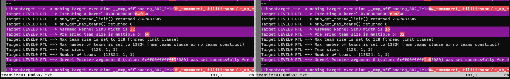
2. A small reproducer did not replicate the difference in simdwith. (/localdisk/quanshao/sandbox/simdWidth.f90 on pvc04)
## July 27 2023
1. Merged ms69-merging with the latest master branch. the branch runs on PVC04, Florentia, Sunspot with oneapi/eng-compiler/2023.05.15.007 
2. Thornado runs with UMD="neo/agama-devel-sp3/697-23.26.26690.19-697, but there is a performance regression for the sineWaveStreaming case while there is a performance improvement for relaxation case with a finer grid, i.e. {16,16,16}. Here are the times: 
<pre>
                     grid            UMD692            UMD697(best of 4)
sineWaveStreaming   {8,8,8}      9.6497e+00 s          1.094431E+01 s
sineWaveStreaming   {16,16,16}   1.3670e+02 s          1.586623E+02 s
relaxation          {8,8,8}      2.0878e+01 s          2.025325E+01 s
relaxation          {16,16,16}   1.7876e+02 s          1.629495E+02 s

</pre>
A performance regression with UMD697 (ran today) for my sineWaveStreaming case (more than 10%), but performance improvement for the relaxation case with a finer grid.
3. More tests have been done and it is found that the performance variation is not related to the default compiler loaded, nor to the PVC node used. Runs have been performed with UMD692, 693, 697 today on PVC04
4. Brian said the the IGC change happened starting from UMD693. Zypper installed UMD693 and tests found out that the performance variation starts from UMD693.
5. iprof runs showed that 50% of the time change comes from a kernel, i.e. omp_offloading_802_2c1d40_twomoment[...]tive_twomoment_vector_richardson__l639 |    9.04s with UMD692, but it is 18.20s with UMD693. Here is the detail:


 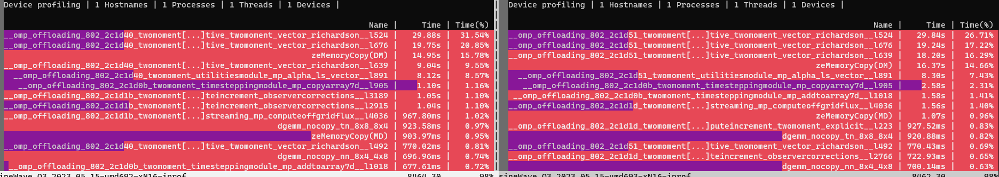

## July 26 2023
1. Sunspot results: /home/shaopingquan/ExaStar/thornado-new/SandBox/TwoMoment_OrderV/Executables. Spent almost half day to run Thornado ms69-merging on Sunspot, but the runs got segmentation fault with the lastest compilers on July 25 2023.
2. With the workarounds from Colleen, the ms69-merging branch compiles and runs with oneapi/eng-compiler/2023.05.15.007 and got expected performance:
  <pre>
::::::::::::::
timeFOM_2023.05.15.007.txt.02
::::::::::::::
                                             Time(seconds)                         |              Figure of Merit (FOM)
AppName     Grid      OpLevel :  2023.05.15.007   2023.05.15.07    TimeDiff   Percentage  |    2023.05.15.007   2023.05.15.07    FOM-Diff   Percentage
-----------------------------    ------------------------------------------------       ------------------------------------------------
sineWave   [8,8,8]      O3    :  9.9709e+00   0.0000e+00   9.9709e+00     0.00%         1.2777e+07   0.0000e+00   1.2777e+07     0.00%
sineWave   [16,16,16]   O3    :  1.6510e+02   0.0000e+00   1.6510e+02     0.00%         1.2270e+07   0.0000e+00   1.2270e+07     0.00%
relax      [8,8,8]      O3    :  2.2164e+01   0.0000e+00   2.2164e+01     0.00%         3.8463e+07   0.0000e+00   3.8463e+07     0.00%
relax      [16,16,16]   O3    :  1.8750e+02   0.0000e+00   1.8750e+02     0.00%         3.6373e+07   0.0000e+00   3.6373e+07     0.00%
::::::::::::::

  </pre>
  Here are some workarounds in the buildRun.all.sh 
  <pre>
     module purge
     export COMPILER_DATE="2023.05.15.007"
     module restore
     module load oneapi/eng-compiler/${COMPILER_DATE}
     module load mpich/51.2/icc-all-pmix-gpu
     export LIBOMPTARGET_LEVEL_ZERO_MEMORY_POOL=device,128,64,16384

  </pre>
 3. Thornado compiles and runs with neo/agama-devel-sp3/692-23.22.26516.20-692 for both ms69 and ms69-merging branch. The performance is expected. 
## July 25 2023
1. Try newly merged ms69-merging on JLSE floretia. The code compiles and runs fine with oneapi/eng-compiler/2023.05.15.007.  If older version of compiler is used, NaNs might be obtained for the relaxation case and the run may crash. The performance is good. Sent an email to all the collabrators.  
  <pre>
  ac.squan@jlselogin7:~/ExaStar/thornado-new/SandBox/TwoMoment_OrderV/Executables> cat timeFOM_2023.05.15.007.txt
                                             Time(seconds)                         |              Figure of Merit (FOM)
    AppName     Grid      OpLevel :  2023.05.15.007   2023.05.15.07    TimeDiff   Percentage  |    2023.05.15.007   2023.05.15.07    FOM-Diff   Percentage
    -----------------------------    ------------------------------------------------       ------------------------------------------------
    sineWave   [8,8,8]      O3    :  1.0189e+01   0.0000e+00   1.0189e+01     0.00%         1.2504e+07   0.0000e+00   1.2504e+07     0.00%
    sineWave   [16,16,16]   O3    :  1.4987e+02   0.0000e+00   1.4987e+02     0.00%         1.3517e+07   0.0000e+00   1.3517e+07     0.00%
    relax      [8,8,8]      O3    :  1.9337e+01   0.0000e+00   1.9337e+01     0.00%         4.4087e+07   0.0000e+00   4.4087e+07     0.00%
    relax      [16,16,16]   O3    :  1.5861e+02   0.0000e+00   1.5861e+02     0.00%         4.2997e+07   0.0000e+00   4.2997e+07     0.00%
  </pre>
2. On Sunspot export FI_PROVIDER=sockets leads to Thornado segmentation fault on Sunspot with oneapi/eng-compiler/2023.05.15.003. It took me a lot of time to find it out. (what a life).
## July 24 2023
1. Thornado works with neo/agama-devel-sp3/691-23.22.26516.18-688, and performance is as good as usual. 
2. Debugging: 
   - In ms69: git difftool 3c54099f32a5e2cf3858e383ceb48f628558caf1 SandBox/TwoMoment_OrderV/TwoMoment_NeutrinoMatterSolverModule_OrderV.F90   and in mergingMaster: git difftool Modules/TwoMoment/TwoMoment_NeutrinoMatterSolverModule.F90. May need revisit. 

3. Thornado merging master branch compiles and runs with good performance. Here is the detail:
  <pre>
   quanshao@exaperf-sdpcloud-pvc04:/localdisk/quanshao/ExaStar/thornado-mergingMaster/SandBox/TwoMoment_OrderV/Executables> tail timeFOM_2023.05.15.txt-umd674
                                             Time(seconds)                         |              Figure of Merit (FOM)
   AppName     Grid      OpLevel :  2023.05.15   2023.04.01    TimeDiff   Percentage  |    2023.05.15   2023.04.01    FOM-Diff   Percentage
   -----------------------------    ------------------------------------------------       ------------------------------------------------
   sineWave   [8,8,8]      O3    :  9.3332e+00   0.0000e+00   9.3332e+00     0.00%         1.3650e+07   0.0000e+00   1.3650e+07     0.00%
   sineWave   [16,16,16]   O3    :  1.3810e+02   0.0000e+00   1.3810e+02     0.00%         1.4669e+07   0.0000e+00   1.4669e+07     0.00%
   relax      [8,8,8]      O3    :  2.2313e+01   0.0000e+00   2.2313e+01     0.00%         3.8205e+07   0.0000e+00   3.8205e+07     0.00%
   relax      [16,16,16]   O3    :  1.9929e+02   0.0000e+00   1.9929e+02     0.00%         3.4222e+07   0.0000e+00   3.4222e+07     0.00%
   quanshao@exaperf-sdpcloud-pvc04:/localdisk/quanshao/ExaStar/thornado-mergingMaster/SandBox/TwoMoment_OrderV/Executables>
  </pre>
4. Push the changes to https://github.com/endeve/thornado  

## July 21 2023
1. quanshao@exaperf-sdpcloud-pvc04:/localdisk/quanshao/ExaStar/thornado> git difftool 3c54099f32a5e2cf3858e383ceb48f628558caf1
1. With all the fixes in Modules/TwoMoment/TwoMoment_NeutrinoMatterSolverModule.F90 merged to the mergingMaster branch. The sineWaveStreaming and relaxatoin cases are running, and here is the performance running with neo/agama-devel-sp3/674-23.22.26516.8-673 and nightly-compiler/2023.05.15 under /localdisk/quanshao/ExaStar/thornado-mergingMaster/SandBox/TwoMoment_OrderV/Executables
<pre>
cat timeFOM_2023.05.15.txt-umd674
                                             Time(seconds)                         |              Figure of Merit (FOM)
AppName     Grid      OpLevel :  2023.05.15   2023.04.01    TimeDiff   Percentage  |    2023.05.15   2023.04.01    FOM-Diff   Percentage
-----------------------------    ------------------------------------------------       ------------------------------------------------
sineWave   [8,8,8]      O3    :  9.4182e+00   0.0000e+00   9.4182e+00     0.00%         1.3527e+07   0.0000e+00   1.3527e+07     0.00%
sineWave   [16,16,16]   O3    :  1.3750e+02   0.0000e+00   1.3750e+02     0.00%         1.4733e+07   0.0000e+00   1.4733e+07     0.00%
relax      [8,8,8]      O3    :  2.7860e+01   0.0000e+00   2.7860e+01     0.00%         3.0599e+07   0.0000e+00   3.0599e+07     0.00%
relax      [16,16,16]   O3    :  2.2360e+02   0.0000e+00   2.2360e+02     0.00%         3.0500e+07   0.0000e+00   3.0500e+07     0.00%
</pre>
## July 20 2023
1. Debuggging the NaNs in the mergeMaster branch.
   - Found that the merge did not take up the changes in MS69 branch. On line 394, it was "!$OMP MAP( allocate" and it has been changed to "!$OMP MAP( always, to :". The change makes the print out on GPU of EmAb_T(1,1,1,1) correct.
   - With the above fix, the case with a grid of {2,2,1} runs. But have NaNs and has Errors like 
   <pre>
         wlEOSInversionModule ERROR: Second Argument (E, P, or S) Outside Table Bounds

         [ComputeTemperatureFromSpecificInternalEnergy_TABLE_Vector] Error
         iP, D, E, Y :    62  0.000000000000000E+00  0.000000000000000E+00  0.000000000000000E+00
   </pre>
   - The iP is random. MS69 with D, E, Y, being zero and report no error. here is the range for Max and Min of D, T, Y, E, P, and S.
   <pre>
      Min/Max D   [g cm^-3] =  1.661E+003 3.164E+015
      Min/Max T         [K] =  1.160E+009 1.839E+012
      Min/Max Y             =  1.000E-002 6.000E-001
      Min/Max E  [erg g^-1] = -1.391E+017 1.611E+032
      Min/Max P [dyn cm^-2] =  5.094E+021 5.110E+036
      Min/Max S       [k_B] =  1.492E-003 1.267E+012
   </pre>
   - Debug shows that some of D, E, Y has wrong values, out of bound values ( iP, E, Y, D       409 -4.994012558089596E+135  0.136475929473795   7.662304666415259E-013) on GPU before getting in ComputeTemperatureFromSpecificInternalEnergy_TABLE_Vector in Modules/EquationOfState/EquationOfStateModule_TABLE.F90
   - The above function is called by UpdateTemperature_Packed in Modules/TwoMoment/TwoMoment_NeutrinoMatterSolverModule.F90
## July 18-19 2023
1. Thornado runs with neo/agama-devel-sp3/688-23.22.26516.18-688 and with old weaklib.  The newest (recently updated) weaklib might reorgnized souce code, and thus there is function name mismatch error during the compilation. 
2. Debugging NaNs in thornado-mergingMaster's relaxation case. SineWaveStreaming case runs fine. 
   - find that Chi_EmAb(iN_E,iS,iN_X) is either 0.0 or NaNs inside Modules/TwoMoment/TwoMoment_NeutrinoMatterSolverModule.F90   - find that Chi_EmAb(iN_E,iS,iN_X) is either 0.0 or NaNs inside Modules/TwoMoment/TwoMoment_NeutrinoMatterSolverModule.F90   - find that Chi_EmAb(iN_E,iS,iN_X) is either 0.0 or NaNs inside Modules/TwoMoment/TwoMoment_NeutrinoMatterSolverModule.F90
   -  LogE_P , LogD_P , LogT_P , Y_P are the same between ms69 and mergingMaster in ./Modules/Opacities/NeutrinoOpacitiesComputationModule.F90
   -  EmAb_T(:,:,:,:,iS) on line 774 in Modules/Opacities/NeutrinoOpacitiesComputationModule.F90 is different. With 774         print*, EmAb\_T(1,1,1,1,1), ms69 prints -15.7973, while mergingMaster branch prints -15.7822.
   -  The EmAb_T on the CPU side is the same. It is read from a hdf file in ./Modules/Opacities/OpacityModule_TABLE.F90. Here is the code and the print out
   <pre>
    print*, EmAb_T(1,1,1,1,1), EmAb_T(1,1,1,1,2)
    print*, EmAb_T(2,1,1,1,1), EmAb_T(2,1,1,1,2)
    print*, EmAb_T(1,2,1,1,1), EmAb_T(1,2,1,1,2)

    Merging Master
    -15.7973213257127       -100.000000000000
    -15.7821554822667       -100.000000000000
    -15.7305822165830       -100.000000000000

    MS69
    -15.7973213257127       -100.000000000000
    -15.7821554822667       -100.000000000000
    -15.7305822165830       -100.000000000000
   </pre>
   So MS69 has the right value on GPU.

## July 17 2023
1. Continue debugging the NAN issue with newly merged Thornado's relaxation case. 
2. It is found that the NANs occur inside SolveNeutrinoMatterCoupling_FP_Nested_AA called from TwoMoment_DiscretizationModule_Collisions_Neutrinos.F90 under /localdisk/quanshao/ExaStar/thornado-mergingMaster/Modules/TwoMoment. As I saw output of "dddd000666" but not "dddd000777" in the file.

## July 14 2023
1. Thornado runs with neo/agama-devel-sp3/686-23.22.26516.18-685
2. The recently merged ms69 with the uptodated master has a runtime error as
<pre>
Libomptarget message: explicit extension not allowed: host address specified is 0x00000000020ae7d0 (672 bytes), but device allocation maps to host at 0x00000000020ae7d0 (224 bytes)
Libomptarget error: Call to getTargetPointer returned null pointer (device failure or illegal mapping).
Libomptarget error: Run with
Libomptarget error: LIBOMPTARGET_DEBUG=1 to display basic debug information.
Libomptarget error: LIBOMPTARGET_DEBUG=2 to display calls to the compute runtime.
Libomptarget error: LIBOMPTARGET_INFO=4 to dump host-target pointer mappings.
Libomptarget error: Source location information not present. Compile with -g or -gline-tables-only.
Libomptarget fatal error 1: failure of target construct while offloading is mandatory
forrtl: error (76): Abort trap signal
</pre>
Google suggests that "either one missed to release a previous mapping or you have a different size of the allocation".    
The fix problem happens on line 3409 as  "MeshE % Width, MeshX(1) % Width, MeshX(2) % Width, MeshX(3) % Width" have been mapped already. Removing the mappping here solve the crash. 
3. Relaxation case compilation broken due to the old weaklib library. Updated and fixed merge conflicts. The code compiles but got 
<pre>
 [ComputeTemperatureFromSpecificInternalEnergy_TABLE_Vector] Error
  iP, D, E, Y :  2785  0.000000000000000E+00  0.000000000000000E+00  0.000000000000000E+00

   wlEOSInversionModule ERROR: NAN in Argument(s)

</pre>     

## July 13 2023
1. Thornado compiles and runs with neo/agama-devel-sp3/685-23.22.26516.18-685
2. Filed a JIRA for almost 20X slown down on PVC using OpenMP comparing to on JLSE A100 using OpenACC. Here is the link: https://jira.devtools.intel.com/browse/CMPLRLLVM-49464. For the reproducer, here is the time and number of teams on PVC
<pre>
 neo/agama-devel-sp3/685-23.22.26516.18-685
 Intel(R) Fortran 24.0-1106  / ifx (IFX) 2024.0.0 Mainline 20230712

Compile with
ifx -fPIC -fpp -xCore-AVX512 -O3 -fiopenmp -fopenmp-targets=spir64_gen -Xopenmp-target-backend "-device 12.60.7" -DTHORNADO_OMP_OL distributeTeamParallelDoReduction.f90 -o distributeTeamParallelDoReduction.exe
                                          __omp_offloading_802_2c1cf3_MAIN___l31 |   3.88ms |  67.83% |     5 | 776.45us | 760.64us | 800.32us |
                                          Target LEVEL_ZERO RTL --> Number of teams = {448, 1, 1}
Compile with  teamCap
ifx -fPIC -fpp -xCore-AVX512 -O3 -fiopenmp -fopenmp-targets=spir64_gen -Xopenmp-target-backend "-device 12.60.7" -DTHORNADO_OMP_OL -mllvm -vpo-paropt-atomic-free-red-global-buf-size=4096 distributeTeamParallel
DoReduction.f90 -o distributeTeamParallelDoReduction.exe
                                          __omp_offloading_802_2c1cf3_MAIN___l31 |   3.86ms |  65.76% |     5 | 772.06us | 760.80us | 794.40us |
                                          Target LEVEL_ZERO RTL --> Number of teams = {448, 1, 1}
Compile with setNumTeams
ifx -fPIC -fpp -xCore-AVX512 -O3 -fiopenmp -fopenmp-targets=spir64_gen -Xopenmp-target-backend "-device 12.60.7" -DTHORNADO_OMP_OLnX_G distributeTeamParallelDoReduction.f90 -o distributeTeamParallelDoReduction
.exe
                                          __omp_offloading_802_2c1cf3_MAIN___l35 |   1.32ms |  42.46% |     5 | 263.14us | 248.80us | 273.44us |
                                          Target LEVEL_ZERO RTL --> Number of teams = {1024, 1, 1}
Compile with setNumTeams teamCap
ifx -fPIC -fpp -xCore-AVX512 -O3 -fiopenmp -fopenmp-targets=spir64_gen -Xopenmp-target-backend "-device 12.60.7" -DTHORNADO_OMP_OLnX_G -mllvm -vpo-paropt-atomic-free-red-global-buf-size=4096 distributeTeamPara
llelDoReduction.f90 -o distributeTeamParallelDoReduction.exe
                                          __omp_offloading_802_2c1cf3_MAIN___l35 | 730.56us |  29.24% |     5 | 146.11us | 143.04us | 149.28us |
                                          Target LEVEL_ZERO RTL --> Number of teams = {4096, 1, 1}
</pre>

And here is the time on JLSE A100.
<pre>
distTreamReduct.04.txt:distributeteamparalleldoreduction_39_gpu | 213.41us |   9.90% |     5 | 42.68us | 38.75us |  52.10us
</pre>
## July 12 2023
1. Thornado compiles and runs with oneapi/eng-compiler/2023.05.15.003. The performance is good. 
<pre>
cat timeFOM_2023.05.15.003.txt
                                             Time(seconds)                         |              Figure of Merit (FOM)
AppName     Grid      OpLevel :  2023.05.15.003   2023.04.01    TimeDiff   Percentage  |    2023.05.15.003   2023.04.01    FOM-Diff   Percentage
-----------------------------    ------------------------------------------------       ------------------------------------------------
sineWave   [8,8,8]      O3    :  9.5253e+00   1.2754e+01  -3.2291e+00   -25.32%         1.3375e+07   9.9889e+06   3.3863e+06    33.90%
sineWave   [16,16,16]   O3    :  1.4072e+02   1.5465e+02  -1.3935e+01    -9.01%         1.4397e+07   1.3099e+07   1.2973e+06     9.90%
relax      [8,8,8]      O3    :  2.1172e+01   4.0511e+01  -1.9339e+01   -47.74%         4.0265e+07   2.1043e+07   1.9222e+07    91.34%
relax      [16,16,16]   O3    :  1.8065e+02   2.4705e+02  -6.6401e+01   -26.88%         3.7753e+07   2.7606e+07   1.0147e+07    36.76%
</pre>
2. Thornado compiles and runs with  oneapi/eng-compiler/.2023.05.15.005-rc04. The performance is good. 
<pre>
quanshao@exaperf-sdpcloud-pvc04:/localdisk/quanshao/ExaStar/thornado/SandBox/TwoMoment_OrderV/Executables> more timeFOM_2023.05.15.005-rc04.txt
                                             Time(seconds)                         |              Figure of Merit (FOM)
AppName     Grid      OpLevel :  2023.05.15.005-rc04   2023.04.01    TimeDiff   Percentage  |    2023.05.15.005-rc04   2023.04.01    FOM-Diff   Percentage
-----------------------------    ------------------------------------------------       ------------------------------------------------
sineWave   [8,8,8]      O3    :  9.5523e+00   1.2754e+01  -3.2021e+00   -25.11%         1.3337e+07   9.9889e+06   3.3485e+06    33.52%
sineWave   [16,16,16]   O3    :  1.3532e+02   1.5465e+02  -1.9334e+01   -12.50%         1.4971e+07   1.3099e+07   1.8716e+06    14.29%
relax      [8,8,8]      O3    :  2.0029e+01   4.0511e+01  -2.0483e+01   -50.56%         4.2564e+07   2.1043e+07   2.1520e+07   102.27%
relax      [16,16,16]   O3    :  1.6628e+02   2.4705e+02  -8.0770e+01   -32.69%         4.1015e+07   2.7606e+07   1.3409e+07    48.57%
</pre>
## July 11 2023
1. Test the reproducer of https://jira.devtools.intel.com/browse/GSD-4704 with newer UMDs, neo/agama-devel-sp3/683-23.22.26516.18-682 and neo/agama-devel-sp3/671-23.22.26516.8-671. The issue has been fixed. Updated this JIRA issue with the finding and ask the issue to be closed. 
2. Thornado runs correctly with the newest UMD and without AGRF. However, there is a little bit slow down without using AGRF. Here is the time comparison:
<pre>

quanshao@exaperf-sdpcloud-pvc04:/localdisk/quanshao/ExaStar/thornado/SandBox/TwoMoment_OrderV/Executables> more timeFOM_2023.05.15.txt*-umd683
::::::::::::::
timeFOM_2023.05.15.txt-NoAGRF-umd683
::::::::::::::
                                             Time(seconds)                         |              Figure of Merit (FOM)
AppName     Grid      OpLevel :  2023.05.15   2023.04.01    TimeDiff   Percentage  |    2023.05.15   2023.04.01    FOM-Diff   Percentage
-----------------------------    ------------------------------------------------       ------------------------------------------------
sineWave   [8,8,8]      O3    :  1.0117e+01   1.2754e+01  -2.6376e+00   -20.68%         1.2593e+07   9.9889e+06   2.6042e+06    26.07%
sineWave   [16,16,16]   O3    :  1.4732e+02   1.5465e+02  -7.3340e+00    -4.74%         1.3752e+07   1.3099e+07   6.5220e+05     4.98%
relax      [8,8,8]      O3    :  2.0522e+01   4.0511e+01  -1.9989e+01   -49.34%         4.1540e+07   2.1043e+07   2.0496e+07    97.40%
relax      [16,16,16]   O3    :  1.7280e+02   2.4705e+02  -7.4254e+01   -30.06%         3.9468e+07   2.7606e+07   1.1863e+07    42.97%
::::::::::::::
timeFOM_2023.05.15.txt-umd683
::::::::::::::
                                             Time(seconds)                         |              Figure of Merit (FOM)
AppName     Grid      OpLevel :  2023.05.15   2023.04.01    TimeDiff   Percentage  |    2023.05.15   2023.04.01    FOM-Diff   Percentage
-----------------------------    ------------------------------------------------       ------------------------------------------------
sineWave   [8,8,8]      O3    :  9.8392e+00   1.2754e+01  -2.9151e+00   -22.86%         1.2948e+07   9.9889e+06   2.9594e+06    29.63%
sineWave   [16,16,16]   O3    :  1.4281e+02   1.5465e+02  -1.1844e+01    -7.66%         1.4186e+07   1.3099e+07   1.0864e+06     8.29%
relax      [8,8,8]      O3    :  2.0603e+01   4.0511e+01  -1.9909e+01   -49.14%         4.1378e+07   2.1043e+07   2.0334e+07    96.63%
relax      [16,16,16]   O3    :  1.7325e+02   2.4705e+02  -7.3800e+01   -29.87%         3.9365e+07   2.7606e+07   1.1759e+07    42.60%

</pre>
## July 10 2023

1. Continued working on making a small reproducer to replicate the slowness of a kernel in TwoMoment_NeutrinoMatterSolverModule_OrderV.F90
2. Made a reproducer, with old UMD, the issue exist, but good news is that with the new UMD682, we see great speed up with num_teams(nX_G), Here are some run results using iprof with LIBOMPTARGET_DEBUG=1
<pre>
quanshao@exaperf-sdpcloud-pvc04:/localdisk/quanshao/sandbox> ./runDistTeamReduct.sh
 3) gcc/10.2.0-gcc-10.2.0-yudlyez <aL>                 7) intel_compute_runtime/release/agama-devel-627 <aL>  11) lttng-ust/2.12.0-gcc-10.2.0-gyrt24r <aL>      15) iprof/0.12.0(default)

                                          __omp_offloading_802_2c1cf4_MAIN___l31 |   3.77ms |  90.57% |     5 | 754.85us | 729.44us | 795.04us |
                                          Target LEVEL_ZERO RTL --> Number of teams = {448, 1, 1}
                                          Target LEVEL_ZERO RTL --> Team sizes = {1024, 1, 1}

      Set num_teams(nX_G)
                                          __omp_offloading_802_2c1cf4_MAIN___l35 | 742.24us |  63.92% |     5 | 148.45us | 147.20us | 150.08us |
                                          Target LEVEL_ZERO RTL --> Number of teams = {4096, 1, 1}
                                          Target LEVEL_ZERO RTL --> Team sizes = {64, 1, 1}
  NEW NEW NEW agama
 2) spack/linux-opensuse_leap15-x86_64(default) <aL>   5) userspace-rcu/0.11.1-gcc-10.2.0-2yyvqtf <aL>   8) ruby/2.7.1-gcc-10.2.0-g5tqnvc <aL>          11) neo/agama-devel-sp3/682-23.22.26516.18-682

                                          __omp_offloading_802_2c1cf4_MAIN___l31 |   2.79ms |  90.82% |     5 | 557.57us | 508.80us | 598.24us |
                                          Target LEVEL_ZERO RTL --> Number of teams = {896, 1, 1}
                                          Target LEVEL_ZERO RTL --> Team sizes = {1024, 1, 1}

      Set num_teams(nX_G)
                                          __omp_offloading_802_2c1cf4_MAIN___l35 | 479.20us |  66.28% |     5 | 95.84us | 88.16us | 99.84us |
                                          Target LEVEL_ZERO RTL --> Number of teams = {4096, 1, 1}
                                          Target LEVEL_ZERO RTL --> Team sizes = {64, 1, 1}
</pre>

## July 7 2023
1. Run relaxation case on A100 with  TwoMoment_NeutrinoMatterSolverModule_OrderV.F90 on PVC04 to figure out a smaller reproducer. 
2. relaxation runs on ortce-a100-80G2 with nvhpc22.7 and the Timer_IMEX   :    1.592779E+01 s which is 1 second faster than the runs on JLSE A100 machine. 
3. iprof is not available on ortce machines. Trying to figure out way to do the profiling
4. qsub -n 1 -t 20 -q gpu_a100 -I is not working on JLSE mahcine even the machine in the queue is available. The command stucks and gives a message of "Wait for job 688620 to start..."
<pre>
ac.squan@jlselogin7:~/ExaStar> qstat -f
JobID   JobName  User           WallTime  QueuedTime  RunTime  TimeRemaining  Nodes  State   Location  Mode         Procs  Preemptable  Queue          StartTime  Index
=========================================================================================================================================================================
671208  N/A      ac.dganyushin  01:00:00  1585:33:06  N/A      N/A            4      queued  None      script       4      False        presque        N/A        None
688620  N/A      ac.squan       00:20:00  02:24:50    N/A      N/A            1      queued  None      interactive  1      False        gpu_a100       N/A        None
</pre>

5. Using Fortran Intrinsic Timer to minize the reproducer:
   PVC                           A100
  2.530813217163086E-003         2.8889999999970328E-004
6. JLSE qsub is back so use iprof.
 
   | PVC04  | gpu07 |  Note | 
   | :----: | :---:|  :----: |
   |  1.27ms      |  267.87us     |   |
   | 1.17ms       |  226.14us     |  |
   | 1.39ms       |  81.60us      | N_nu, E_nu, F_nu_d_1, SUM_Ef, SUM_V1 == C_Ef, C_V_d_1|   
   |  703.04us    |  59.39us      |  F_nu_d1, SUM_V1, == C_V_d_1|
   |584.16us      |  33.79us      |F_nu_d1, SUM_V1, == C_V_d_1|
   | 474.24us     |  33.50us      | remove extra privates and Reduction|
   | 482.56us     |  44.77us      | |
   | 370.88us     |  32.51us      | |
## July 6 2023
1. JLSE A100: twomoment_neutrinomattersolvermodule_orderv_initializerhs_fp_1886_gpu            |  67.46ms |   0.47% |    271 | 248.93us | 244.96us | 406.88us |
    PVC     : __omp_offloading_802_2c1c1a_twomoment[...]dule_orderv_mp_initializerhs_fp__l1847 |   3.00ms |   1.14% |     2 |   1.50ms |   1.33ms |   1.67ms | 
    - with REDUCTION clause removed, the number of teams is 4096, `Target LEVEL0 RTL --> Team sizes = {64, 1, 1}  Target LEVEL0 RTL --> Number of teams = {4096, 1, 1}`, the time is `| 868.48us |   0.49% |     1 | 868.48us | 868.48us | 868.48us |`
    - with the calculations of the outmost loop commented out, the number of teams did not get changed, but the time is 20X reduced. `initializerhs_fp__l1847 |  61.44us |   0.03% |     1 |  61.44us |  61.44us |  61.44us |`
    - with computing of C_Y, C_Ef, C_V_d_1/2/3, the time is `| 330.08us |   0.19% |     1 | 330.08us | 330.08us | 330.08us | `


2. Thornado works fine with neo/agama-devel-sp3/680-23.22.26516.14-678
3. The libsycl.so.6 issue persist in nightly 2023.07.05. 
4. Examine which part of code is the most time consuming
<pre>
quanshao@exaperf-sdpcloud-pvc04:/localdisk/quanshao/ExaStar/thornado/SandBox/TwoMoment_OrderV/Executables> grep "initializerhs_fp__l1847 |" *.Debug
all-l2028-2032setToSs.Debug: __omp_offloading_802_2c1c19_twomoment[...]dule_orderv_mp_initializerhs_fp__l1847 |   1.28ms |   0.72% |     1 |   1.28ms |   1.28ms |   1.28ms |
all-l2028-2032setToSum.Debug:__omp_offloading_802_2c1c16_twomoment[...]dule_orderv_mp_initializerhs_fp__l1847 |   1.56ms |   0.89% |     1 |   1.56ms |   1.56ms |   1.56ms |
allwithReduction-Ex-l2028-2032.Debug:floading_802_2c1c16_twomoment[...]dule_orderv_mp_initializerhs_fp__l1847 |   1.11ms |   0.63% |     1 |   1.11ms |   1.11ms |   1.11ms |
allwithReduction.Debug:      __omp_offloading_802_2c1c15_twomoment[...]dule_orderv_mp_initializerhs_fp__l1847 |   1.25ms |   0.71% |     1 |   1.25ms |   1.25ms |   1.25ms |
allOuterCalcs.Debug:           omp_offloading_802_2c1c18_twomoment[...]dule_orderv_mp_initializerhs_fp__l1847 | 858.24us |   0.49% |     1 | 858.24us | 858.24us | 858.24us |
L2028-L2032_L1866-1909.Debug:__omp_offloading_802_2c1c11_twomoment[...]dule_orderv_mp_initializerhs_fp__l1847 | 788.80us |   0.45% |     1 | 788.80us | 788.80us | 788.80us |
L2028-L2032_L1873-1909.Debug:__omp_offloading_802_2c1c1a_twomoment[...]dule_orderv_mp_initializerhs_fp__l1847 | 632.64us |   0.36% |     1 | 632.64us | 632.64us | 632.64us |
L2028-L2032_L1877-1909.Debug:__omp_offloading_802_2c1c19_twomoment[...]dule_orderv_mp_initializerhs_fp__l1847 | 679.84us |   0.39% |     1 | 679.84us | 679.84us | 679.84us |
L2028-L2032_L1882-1909.Debug:__omp_offloading_802_2c1c13_twomoment[...]dule_orderv_mp_initializerhs_fp__l1847 | 638.72us |   0.36% |     1 | 638.72us | 638.72us | 638.72us |
L2028-L2032_L1883-1909.Debug:__omp_offloading_802_2c1c10_twomoment[...]dule_orderv_mp_initializerhs_fp__l1847 | 601.28us |   0.34% |     1 | 601.28us | 601.28us | 601.28us |
L2028-L2032_L1888-1909.Debug:__omp_offloading_802_2c1c16_twomoment[...]dule_orderv_mp_initializerhs_fp__l1847 | 567.84us |   0.33% |     1 | 567.84us | 567.84us | 567.84us |
L2028-L2032_L1896-1909.Debug:__omp_offloading_802_2c1c1a_twomoment[...]dule_orderv_mp_initializerhs_fp__l1847 | 434.40us |   0.25% |     1 | 434.40us | 434.40us | 434.40us |
L2028-L2032_L1905-1909.Debug:__omp_offloading_802_2c1c19_twomoment[...]dule_orderv_mp_initializerhs_fp__l1847 | 368.48us |   0.21% |     1 | 368.48us | 368.48us | 368.48us |
L1899-L1903Th.Debug:         __omp_offloading_802_2c1c62_twomoment[...]dule_orderv_mp_initializerhs_fp__l1847 | 136.96us |   0.08% |     1 | 136.96us | 136.96us | 136.96us |
L2028-L2032.Debug:           __omp_offloading_802_2c1c0f_twomoment[...]dule_orderv_mp_initializerhs_fp__l1847 | 337.60us |   0.19% |     1 | 337.60us | 337.60us | 337.60us |
noOutLoop.Debug:             __omp_offloading_802_2c1c16_twomoment[...]dule_orderv_mp_initializerhs_fp__l1847 |  60.80us |   0.03% |     1 |  60.80us |  60.80us |  60.80us |
allwithReductionTh32.Debug : __omp_offloading_802_2c1c65_twomoment[...]dule_orderv_mp_initializerhs_fp__l1847 | 976.48us |   0.56% |     1 | 976.48us | 976.48us | 976.48us |
allOuterCalcsTh32.Debug:     __omp_offloading_802_2c1c68_twomoment[...]dule_orderv_mp_initializerhs_fp__l1847 | 509.92us |   0.29% |     1 | 509.92us | 509.92us | 509.92us |
allwithReduction-Ex-l2028-2032Th32.Debug: ing_802_2c1c66_twomoment[...]dule_orderv_mp_initializerhs_fp__l1847 | 435.20us |   0.25% |     1 | 435.20us | 435.20us | 435.20us |
noOutLoopTh32.Debug:         __omp_offloading_802_2c1c64_twomoment[...]dule_orderv_mp_initializerhs_fp__l1847 |  67.52us |   0.04% |     1 |  67.52us |  67.52us |  67.52us |
L2028-L2032Th32.Debug:       __omp_offloading_802_2c1c63_twomoment[...]dule_orderv_mp_initializerhs_fp__l1847 | 233.44us |   0.13% |     1 | 233.44us | 233.44us | 233.44us |
L1899-L1903Th32.Debug:       __omp_offloading_802_2c1c65_twomoment[...]dule_orderv_mp_initializerhs_fp__l1847 |  96.00us |   0.05% |     1 |  96.00us |  96.00us |  96.00us |
</pre>
5. Did a vtune run and compiled the code with -g but vtune cannot show the assembly and source code. 
## July 5 2023

1. Issues: 
   - num_teams capping
   <pre>
   Libomptarget --> Launching target execution __omp_offloading_802_2c1c17_twomoment_neutrinomattersolvermodule_orderv_mp_initializerhs_fp__l1847 with pointer 0x0000000007d6f0c0 (index=544).
Target LEVEL0 RTL --> Executing a kernel 0x0000000007d6f0c0...
Target LEVEL0 RTL --> omp_get_thread_limit() returned 2147483647
Target LEVEL0 RTL --> omp_get_max_teams() returned 0
Target LEVEL0 RTL --> Assumed kernel SIMD width is 32
Target LEVEL0 RTL --> Preferred team size is multiple of 64
Target LEVEL0 RTL --> Max number of teams is set to 4096 (num_teams clause or no teams construct)
Target LEVEL0 RTL --> Capping maximum team size to 1024 due to kernel constraints (reduction).
Target LEVEL0 RTL --> Capping maximum thread groups count to 1024 due to kernel constraints (reduction).
Target LEVEL0 RTL --> Team sizes = {64, 1, 1}
Target LEVEL0 RTL --> Number of teams = {1024, 1, 1}
</pre>

1. with all the changes related to Relaxation cases, Thornado runs faster and here is the running time using UMD="neo/agama-devel-sp3/673-23.22.26516.8-673" and 2023.05.15 nightly compiler. 
<pre>
cat timeFOM_2023.05.15.txt-umd673
                                             Time(seconds)                         |              Figure of Merit (FOM)
AppName     Grid      OpLevel :  2023.05.15   2023.04.01    TimeDiff   Percentage  |    2023.05.15   2023.04.01    FOM-Diff   Percentage
-----------------------------    ------------------------------------------------       ------------------------------------------------
sineWave   [8,8,8]      O3    :  1.0659e+01   1.2754e+01  -2.0953e+00   -16.43%         1.1952e+07   9.9889e+06   1.9636e+06    19.66%
sineWave   [16,16,16]   O3    :  1.4355e+02   1.5465e+02  -1.1106e+01    -7.18%         1.4113e+07   1.3099e+07   1.0135e+06     7.74%
relax      [8,8,8]      O3    :  2.1589e+01   4.0511e+01  -1.8922e+01   -46.71%         3.9488e+07   2.1043e+07   1.8444e+07    87.65%
relax      [16,16,16]   O3    :  1.7766e+02   2.4705e+02  -6.9388e+01   -28.09%         3.8387e+07   2.7606e+07   1.0782e+07    39.06%
</pre>
Comparing to the one using UMD="neo/agama-devel-sp3/672-23.22.26516.8-672" and the same nightly 
<pre>
 cat timeFOM_2023.05.15.txt-umd672
                                             Time(seconds)                         |              Figure of Merit (FOM)
AppName     Grid      OpLevel :  2023.05.15   2023.04.01    TimeDiff   Percentage  |    2023.05.15   2023.04.01    FOM-Diff   Percentage
-----------------------------    ------------------------------------------------       ------------------------------------------------
sineWave   [8,8,8]      O3    :  9.8554e+00   1.2754e+01  -2.8990e+00   -22.73%         1.2927e+07   9.9889e+06   2.9382e+06    29.41%
sineWave   [16,16,16]   O3    :  1.4548e+02   1.5465e+02  -9.1755e+00    -5.93%         1.3926e+07   1.3099e+07   8.2620e+05     6.31%
relax      [8,8,8]      O3    :  3.0514e+01   4.0511e+01  -9.9974e+00   -24.68%         2.7938e+07   2.1043e+07   6.8946e+06    32.76%
relax      [16,16,16]   O3    :  2.2945e+02   2.4705e+02  -1.7599e+01    -7.12%         2.9723e+07   2.7606e+07   2.1175e+06     7.67%
</pre>


With the set of num_teams on on line 1847 of TwoMoment_NeutrinoMatterSolverModule_OrderV.F90. we got the following FOM and performance data:
<pre>
cat timeFOM_2023.05.15.txt-umd678
                                             Time(seconds)                         |              Figure of Merit (FOM)
AppName     Grid      OpLevel :  2023.05.15   2023.04.01    TimeDiff   Percentage  |    2023.05.15   2023.04.01    FOM-Diff   Percentage
-----------------------------    ------------------------------------------------       ------------------------------------------------
sineWave   [8,8,8]      O3    :  9.8798e+00   1.2754e+01  -2.8745e+00   -22.54%         1.2895e+07   9.9889e+06   2.9063e+06    29.10%
sineWave   [16,16,16]   O3    :  1.4201e+02   1.5465e+02  -1.2645e+01    -8.18%         1.4266e+07   1.3099e+07   1.1664e+06     8.90%
relax      [8,8,8]      O3    :  2.0567e+01   4.0511e+01  -1.9944e+01   -49.23%         4.1449e+07   2.1043e+07   2.0406e+07    96.97%
relax      [16,16,16]   O3    :  1.7216e+02   2.4705e+02  -7.4886e+01   -30.31%         3.9613e+07   2.7606e+07   1.2008e+07    43.50%
</pre>

2. Thornado works with UMD677 and UMD678.
3. Tunning effort (a  )
 
    on JLSE A100: twomoment_neutrinomattersolvermodule_orderv_initializerhs_fp_1886_gpu            |  67.46ms |   0.47% |    271  | 248.93us | 244.96us | 406.88us |
    while on PVC: __omp_offloading_802_2c1c1a_twomoment[...]dule_orderv_mp_initializerhs_fp__l1846 |    1.37s |   7.97% |     271 |   5.04ms |   4.95ms |   5.16ms |
<pre>     
Libomptarget --> Launching target execution __omp_offloading_802_2c1c15_twomoment_neutrinomattersolvermodule_orderv_mp_initializerhs_fp__l1846 with pointer 0x00000000071d1580 (index=544).
Target LEVEL0 RTL --> Executing a kernel 0x00000000071d1580...
Target LEVEL0 RTL --> omp_get_thread_limit() returned 2147483647
Target LEVEL0 RTL --> omp_get_max_teams() returned 0
Target LEVEL0 RTL --> Team sizes = {1024, 1, 1}
Target LEVEL0 RTL --> Number of teams = {448, 1, 1}
</pre> 
so change the number of teams to num_teams(nX_G) on line 1847 of TwoMoment_NeutrinoMatterSolverModule_OrderV.F90.                
Then we get :    __omp_offloading_802_2c1c17_twomoment[...]dule_orderv_mp_initializerhs_fp__l1847 | 399.82ms |   2.46% |     271 |   1.48ms |   1.16ms |   1.91ms |
4. set num_teams on line 722 of TwoMoment_DiscretizationModule_Collisions_Neutrinos_OrderV.F90, i.e., !$OMP TARGET TEAMS DISTRIBUTE PARALLEL DO SIMD COLLAPSE(7) num_teams(4096) did not make observable performance differences for the kernel. 


## June 30 2023
1. Perfromance improvement. 
  - 3.031338E+01 s     Original
  - 2.356802E+01 s     Store SIZE(A) before the kernel and use it as the kernel loop count; weaklib Distributions/Library/wlInterpolationModule.F90  relax.O3.2023.05.15.ms69-umd673.sizeOf
  - 2.231973E+01 s     Add SIMD TwoMoment_NeutrinoMatterSolverModule_OrderV.F90 L2287; removed parallel do and simd Distributions/Library/wlInterpolationModule.F90 L488 L514. relax.O3.2023.05.15.MS69Prof-umd673.01
  - 2.149343E+01 s     Inlined LinearInterp2D_4DArray_2DAligned_Point inside  LogInterpolateSingleVariable_2D2D_Custom_Aligned
  2.157493E+01 s
2. computeneutrinorhs_fp__l2287  iprof results
   - 2.95s  num_teams(4096)
   - 2.96s  num_teams(8192)
   - 3.74s  num_teams(32768)
   - 3.49s  num_teams(16384)
   num_teams(4096, 4, 1) does not work
## June 29 2023
1. The default umd is umd551, and it does not work with the new nightly. your code may hang. Switch to a new umd will solve the issue. 
2. Thornado runs 2X slower on PVC than on JLSE A100. iprof found that a kernel in wlinterpolationmodule_loginterpolatesinglevariable_2d2d_custom_aligned_370 is 8X slower on PVC than on A100. Changing the num_teams to 256 and 1024 seems not helping.
3. Discussed with Brian, we finally found that computing the loop count on GPU using the Fortran intrinsic function SIZE of an array might be the reason for the slow down as the num_teams is only 448 while the loop count is 4096 for the run
4. Made a reproducer and filed a jira for performance reason. https://jira.devtools.intel.com/browse/CMPLRLLVM-49108
5. A workaround is to save the SIZE(A) to a variable before the OpenMP directive and use the variable as the loop count. This save around 7 seconds on PVC04. relax.O3.2023.05.15.ms69-umd673.sizeOf
<pre>
gpu07:
  Timer_Total                            :     5.293960E+01 s
  Timer_IMEX                             :     1.742517E+01 s

pvc04 with store SIZE(A) before the kernel and use it as the kernel loop count :  relax.O3.2023.05.15.ms69-umd673.sizeOf
  Timer_Total                            :     2.590873E+01 s
  Timer_IMEX                             :     2.356802E+01 s

pvc04_original: (relax.O3.2023.05.15.ms69-umd673)
  Timer_Total                            :     3.266890E+01 s
  Timer_IMEX                             :     3.031338E+01 s

</pre>


## June 27-28 2023
1. Thornado compiles and runs fine with nightly 2023.05.15 and UMD=neo/agama-devel-sp3/67666666-23.22.26516.8-673
2. Relaxation cases runs on A100 systems of JLSE with nvhpc/23.3, but not nvhpc/22.7
3. On gpu07@jlse, relaxation's IMEX time is around half of the IMEX time on PVC04. Here is the detail:
<pre>
gpu07:
  Timer_Total                            :     5.293960E+01 s
  Timer_IMEX                             :     1.742517E+01 s

pvc04:   
  Timer_Total                            :     3.266890E+01 s
  Timer_IMEX                             :     3.031338E+01 s

</pre>

4. iprof and nsys profile --trace mpi,openacc,cudnn,cuda,cublas,osrt,nvtx -o ${logfile}.nsys then nsys stats shows that there is a huge difference, around 8X, for __omp_offloading_802_2c1bfe_wlinterpo[...]nglevariable_2d2d_custom_aligned__l370 and Construct@wlInterpolationModule.F90:375. Distributions/Library/wlInterpolationModule.F90. here is the detail:
<pre>
A100: 

 Time (%)  Total Time (ns)  Num Calls    Avg (ns)       Med (ns)      Min (ns)     Max (ns)    StdDev (ns)                                          Name
 --------  ---------------  ---------  -------------  -------------  -----------  -----------  -----------  ------------------------------------------------------------------------------------
      6.1    2,148,573,472      6,937      309,726.6      304,772.0      300,223   16,325,244    200,156.6  Compute Construct@NeutrinoOpacitiesComputationModule.F90:1222
      6.0    2,116,115,551     13,874      152,523.8      151,301.0        1,550   16,311,933    205,970.2  Wait@NeutrinoOpacitiesComputationModule.F90:1222
      5.2    1,836,600,600      6,937      264,754.3      262,892.0      259,902      477,104     14,580.9  Compute Construct@NeutrinoOpacitiesComputationModule.F90:1488
      5.1    1,808,706,110     13,874      130,366.6      130,631.0        2,310      464,994    127,861.3  Wait@NeutrinoOpacitiesComputationModule.F90:1488
      4.3    1,521,214,734      6,937      219,290.0      218,731.0      213,162      275,313      4,001.2  Compute Construct@TwoMoment_NeutrinoMatterSolverModule_OrderV.F90:2369
      4.2    1,491,355,060     13,874      107,492.8      108,310.5        2,210      267,382    104,569.4  Wait@TwoMoment_NeutrinoMatterSolverModule_OrderV.F90:2369
      3.7    1,312,028,136      6,937      189,134.8      187,641.0      185,741      328,342      9,942.5  Compute Construct@NeutrinoOpacitiesComputationModule.F90:1749
      3.6    1,284,635,151     13,874       92,593.0       92,901.0        2,270      321,433     89,859.4  Wait@NeutrinoOpacitiesComputationModule.F90:1749
      2.9    1,032,501,271      5,208      198,252.9      198,262.0      181,911      309,532      9,451.8  Compute Construct@wlInterpolationModule.F90:375
      2.9    1,011,967,739     10,416       97,155.1       95,046.0        2,120      303,402     94,523.6  Wait@wlInterpolationModule.F90:375


PVC: 
                                                                            Name |     Time | Time(%) |   Calls |  Average |      Min |      Max |
__omp_offloading_802_2c1bfe_wlinterpo[...]nglevariable_2d2d_custom_aligned__l370 |    8.32s |  32.30% |    5208 |   1.60ms |   1.53ms |   1.69ms |
__omp_offloading_802_2c1be1_twomoment[...]orderv_mp_computeneutrinorhs_fp__l2287 |    2.81s |  10.90% |    6937 | 404.88us | 391.68us | 461.60us |
__omp_offloading_802_2c1bfe_wlinterpo[...]nglevariable_2d2d_custom_aligned__l484 |    1.98s |   7.70% |    1302 |   1.52ms |   1.51ms |   1.59ms |
__omp_offloading_802_2c1c04_neutrinoo[...]omputeneutrinoopacityrates_pair__l1485 |    1.84s |   7.16% |    6937 | 265.81us | 250.24us | 320.00us |
__omp_offloading_802_2c1c04_neutrinoo[...]computeneutrinoopacityrates_nes__l1219 |    1.80s |   6.99% |    6937 | 259.70us | 242.56us | 323.36us |
__omp_offloading_802_2c1be1_twomoment[...]dule_orderv_mp_initializerhs_fp__l1846 |    1.33s |   5.17% |     271 |   4.91ms |   4.82ms |   5.04ms |
__omp_offloading_802_2c1c04_neutrinoo[...]omputeneutrinoopacityrates_brem__l1746 |    1.16s |   4.50% |    6937 | 167.02us | 162.88us | 220.96us |
__omp_offloading_802_2c1be1_twomoment[...]lvermodule_orderv_mp_solvels_fp__l2708 | 886.70ms |   3.44% |    6666 | 133.02us |   4.48us | 188.48us |


</pre>
## June 26 2023
1. Thornado compiles and runs fine with nightly 2023.05.15 and UMD=neo/agama-devel-sp3/675-23.22.26516.8-673
2. Merging ms69 with the latest master
3. Modifying the ms69 report according to Todd's comments. 
## June 23 2023
1. Thornado compiles and runs fine with nightly 2023.05.15 and UMD="neo/agama-devel-sp3/674-23.22.26516.8-673"
2. libmkl_sycl.so issue persists with 2023.06.23.
3. Cleaned up /TwoMoment_NeutrinoMatterSolverModule_OrderV.F90
4. Merge ms69 with the latest master from https://github.com/endeve/thornado.git     
   Fixed the merged conflicts for the following files
      - Build/Machines/Makefile_beacon_intel
      - Modules/Euler/Euler_PositivityLimiterModule_NonRelativistic_TABLE.F90
      - Modules/Fields/FluidFieldsModule.F90
      - Modules/Opacities/OpacityModule_TABLE.F90
      - Modules/TwoMoment/OrderV/TwoMoment_DiscretizationModule_Streaming.F90 /localdisk/quanshao/ExaStar/thornado/SandBox/TwoMoment_OrderV/TwoMoment_DiscretizationModule_Streaming_OrderV.F90
      - SandBox/TwoMoment_OrderV/ApplicationDriver.F90 : nSpecies = 6 but now changed to 1. 
      - SandBox/TwoMoment_OrderV/TwoMoment_NeutrinoMatterSolverModule_OrderV.F90 was deleted and does not exist under ./Modules/TwoMoment/OrderV either. Sent an email to the group. 

## June 22 2023
1. Tested IMM effect on the latest UMD,i.e., neo/agama-devel-sp3/673-23.22.26516.8-673 and the trend is the same, i.e., IMM=1 and 0 are both slower than run without set IMM.  here is the result
<pre>
::::::::::::::
timeFOM_2023.05.15.txt-IMM0-umd673
::::::::::::::
                                             Time(seconds)                         |              Figure of Merit (FOM)
AppName     Grid      OpLevel :  2023.05.15   2023.04.01    TimeDiff   Percentage  |    2023.05.15   2023.04.01    FOM-Diff   Percentage
-----------------------------    ------------------------------------------------       ------------------------------------------------
sineWave   [8,8,8]      O3    :  1.1945e+01   1.2754e+01  -8.0925e-01    -6.34%         1.0666e+07   9.9889e+06   6.7670e+05     6.77%
sineWave   [16,16,16]   O3    :  1.5186e+02   1.5465e+02  -2.7879e+00    -1.80%         1.3340e+07   1.3099e+07   2.4050e+05     1.84%
relax      [8,8,8]      O3    :  3.8526e+01   4.0511e+01  -1.9856e+00    -4.90%         2.2128e+07   2.1043e+07   1.0846e+06     5.15%
relax      [16,16,16]   O3    :  2.4434e+02   2.4705e+02  -2.7059e+00    -1.10%         2.7911e+07   2.7606e+07   3.0570e+05     1.11%
::::::::::::::
timeFOM_2023.05.15.txt-IMM1-umd673
::::::::::::::
                                             Time(seconds)                         |              Figure of Merit (FOM)
AppName     Grid      OpLevel :  2023.05.15   2023.04.01    TimeDiff   Percentage  |    2023.05.15   2023.04.01    FOM-Diff   Percentage
-----------------------------    ------------------------------------------------       ------------------------------------------------
sineWave   [8,8,8]      O3    :  1.1334e+01   1.2754e+01  -1.4200e+00   -11.13%         1.1240e+07   9.9889e+06   1.2515e+06    12.53%
sineWave   [16,16,16]   O3    :  1.4851e+02   1.5465e+02  -6.1429e+00    -3.97%         1.3641e+07   1.3099e+07   5.4190e+05     4.14%
relax      [8,8,8]      O3    :  3.8384e+01   4.0511e+01  -2.1272e+00    -5.25%         2.2210e+07   2.1043e+07   1.1662e+06     5.54%
relax      [16,16,16]   O3    :  2.4014e+02   2.4705e+02  -6.9059e+00    -2.80%         2.8400e+07   2.7606e+07   7.9390e+05     2.88%
::::::::::::::
timeFOM_2023.05.15.txt-umd673
::::::::::::::
                                             Time(seconds)                         |              Figure of Merit (FOM)
AppName     Grid      OpLevel :  2023.05.15   2023.04.01    TimeDiff   Percentage  |    2023.05.15   2023.04.01    FOM-Diff   Percentage
-----------------------------    ------------------------------------------------       ------------------------------------------------
sineWave   [8,8,8]      O3    :  9.9417e+00   1.2754e+01  -2.8126e+00   -22.05%         1.2815e+07   9.9889e+06   2.8260e+06    28.29%
sineWave   [16,16,16]   O3    :  1.4424e+02   1.5465e+02  -1.0411e+01    -6.73%         1.4045e+07   1.3099e+07   9.4550e+05     7.22%
relax      [8,8,8]      O3    :  3.0598e+01   4.0511e+01  -9.9130e+00   -24.47%         2.7861e+07   2.1043e+07   6.8174e+06    32.40%
relax      [16,16,16]   O3    :  2.3056e+02   2.4705e+02  -1.6488e+01    -6.67%         2.9580e+07   2.7606e+07   1.9742e+06     7.15%
</pre>
## June 21 2023
1. Build Thornado from Flash-X. 
    - buildRun.sh inside ${FLASH_HOME}
    - add a directory under ${FLASH_HOME}/sites and add Makefile.h and Makefile.h.???? under this directory. For example summit.olcf.ornl.gov/
    - Add .o file name to Makefile.Flash and the path of source files to $(THORNADO_DIR)/Build/Makefile_Path
    - ./build.sh is written in line 130 of libUtils.py, which call the library's libinfo.py

2. Thornado runs with the latest UMD, i.e., neo/agama-devel-sp3/673-23.22.26516.8-673

## June 20 2023
1. Thornado successfully ran on PVC15 with FOM output comparing to baseline FOM simulated using nightly 2023.04.01. The most recent working nightly is 2023.05.15, and the tested UMD is 665. On PVC15
2. Tested Thornado with the newer UMDs (umd670 and above) as noted by Brain there might be something intesting with the new UMDs. In conclusion, Thornado compiles and runs fine with the UMD671 and above. Nightly 2023.05.15 is used. The are more warnings of register spill starting from UMD672, but the performance change is very minimal. Here are some details:
<pre>
quanshao@exaperf-sdpcloud-pvc04:/localdisk/quanshao/ExaStar/thornado/SandBox/TwoMoment_OrderV/Executables> more timeFOM_2023.05.15.txt-umd670
                                             Time(seconds)                         |              Figure of Merit (FOM)
AppName     Grid      OpLevel :  2023.05.15   2023.04.01    TimeDiff   Percentage  |    2023.05.15   2023.04.01    FOM-Diff   Percentage
-----------------------------    ------------------------------------------------       ------------------------------------------------
sineWave   [8,8,8]      O3    :  9.5479e+00   1.2754e+01  -3.2065e+00   -25.14%         1.3344e+07   9.9889e+06   3.3546e+06    33.58%
sineWave   [16,16,16]   O3    :  1.4313e+02   1.5465e+02  -1.1518e+01    -7.45%         1.4154e+07   1.3099e+07   1.0542e+06     8.05%
relax      [8,8,8]      O3    :  3.0480e+01   4.0511e+01  -1.0031e+01   -24.76%         2.7969e+07   2.1043e+07   6.9253e+06    32.91%
relax      [16,16,16]   O3    :  2.2865e+02   2.4705e+02  -1.8403e+01    -7.45%         2.9828e+07   2.7606e+07   2.2219e+06     8.05%
quanshao@exaperf-sdpcloud-pvc04:/localdisk/quanshao/ExaStar/thornado/SandBox/TwoMoment_OrderV/Executables> more timeFOM_2023.05.15.txt-umd671
                                             Time(seconds)                         |              Figure of Merit (FOM)
AppName     Grid      OpLevel :  2023.05.15   2023.04.01    TimeDiff   Percentage  |    2023.05.15   2023.04.01    FOM-Diff   Percentage
-----------------------------    ------------------------------------------------       ------------------------------------------------
sineWave   [8,8,8]      O3    :  9.8154e+00   1.2754e+01  -2.9390e+00   -23.04%         1.2980e+07   9.9889e+06   2.9909e+06    29.94%
sineWave   [16,16,16]   O3    :  1.4247e+02   1.5465e+02  -1.2183e+01    -7.88%         1.4220e+07   1.3099e+07   1.1202e+06     8.55%
relax      [8,8,8]      O3    :  3.0612e+01   4.0511e+01  -9.8998e+00   -24.44%         2.7849e+07   2.1043e+07   6.8054e+06    32.34%
relax      [16,16,16]   O3    :  2.2774e+02   2.4705e+02  -1.9306e+01    -7.81%         2.9946e+07   2.7606e+07   2.3402e+06     8.48%
quanshao@exaperf-sdpcloud-pvc04:/localdisk/quanshao/ExaStar/thornado/SandBox/TwoMoment_OrderV/Executables> more timeFOM_2023.05.15.txt-umd672
                                             Time(seconds)                         |              Figure of Merit (FOM)
AppName     Grid      OpLevel :  2023.05.15   2023.04.01    TimeDiff   Percentage  |    2023.05.15   2023.04.01    FOM-Diff   Percentage
-----------------------------    ------------------------------------------------       ------------------------------------------------
sineWave   [8,8,8]      O3    :  9.8554e+00   1.2754e+01  -2.8990e+00   -22.73%         1.2927e+07   9.9889e+06   2.9382e+06    29.41%
sineWave   [16,16,16]   O3    :  1.4548e+02   1.5465e+02  -9.1755e+00    -5.93%         1.3926e+07   1.3099e+07   8.2620e+05     6.31%
relax      [8,8,8]      O3    :  3.0514e+01   4.0511e+01  -9.9974e+00   -24.68%         2.7938e+07   2.1043e+07   6.8946e+06    32.76%
relax      [16,16,16]   O3    :  2.2945e+02   2.4705e+02  -1.7599e+01    -7.12%         2.9723e+07   2.7606e+07   2.1175e+06     7.67%
quanshao@exaperf-sdpcloud-pvc04:/localdisk/quanshao/ExaStar/thornado/SandBox/TwoMoment_OrderV/Executables> more timeFOM_2023.05.15.txt-umd673
                                             Time(seconds)                         |              Figure of Merit (FOM)
AppName     Grid      OpLevel :  2023.05.15   2023.04.01    TimeDiff   Percentage  |    2023.05.15   2023.04.01    FOM-Diff   Percentage
-----------------------------    ------------------------------------------------       ------------------------------------------------
sineWave   [8,8,8]      O3    :  9.8933e+00   1.2754e+01  -2.8611e+00   -22.43%         1.2878e+07   9.9889e+06   2.8887e+06    28.92%
sineWave   [16,16,16]   O3    :  1.4113e+02   1.5465e+02  -1.3525e+01    -8.75%         1.4355e+07   1.3099e+07   1.2554e+06     9.58%
relax      [8,8,8]      O3    :  3.0520e+01   4.0511e+01  -9.9908e+00   -24.66%         2.7932e+07   2.1043e+07   6.8885e+06    32.73%
relax      [16,16,16]   O3    :  2.2882e+02   2.4705e+02  -1.8225e+01    -7.38%         2.9804e+07   2.7606e+07   2.1987e+06     7.96%

</pre>

Here is the register spills
<pre>
quanshao@exaperf-sdpcloud-pvc04:/localdisk/quanshao/ExaStar/thornado/SandBox/TwoMoment_OrderV/Executables> grep spill *O3.2023.05.15.ms69-umd671* |wc -l
14
quanshao@exaperf-sdpcloud-pvc04:/localdisk/quanshao/ExaStar/thornado/SandBox/TwoMoment_OrderV/Executables> grep spill *O3.2023.05.15.ms69-umd672* |wc -l
20
quanshao@exaperf-sdpcloud-pvc04:/localdisk/quanshao/ExaStar/thornado/SandBox/TwoMoment_OrderV/Executables> grep spill *O3.2023.05.15.ms69-umd673* |wc -l
20
</pre>

## June 14, 16 2023
1. Works on test affects of IMM Thornado's running time. To set IMM on or off one needs to set the following two variables to 1 or zero. for example: `LIBOMPTARGET_LEVEL_ZERO_USE_IMMEDIATE_COMMAND_LIST=1` and `SYCL_PI_LEVEL_ZERO_USE_IMMEDIATE_COMMANDLISTS=1`
2. It is that without set the above two variables the sineWaveStreaming case runs less than 10 seconds, but with IMM=0, it is around 12.5 seconds, and with IMM=1, it is 12.0 seconds. Similar trend is found for the Relaxation {8,8,8} grid case. Here is the detail:

  | runs          | IMM=1        |  IMM=0      | Not set IMM      |
  | :----:        | :----:       | :----:      | :-----: |
  | SinvWave run1 |      1.1977e+01    |          1.2699e+01    |           9.7111e+00 |
  | SineWave run2 |      1.2077e+01    |          1.2543e+01    |           9.6409e+00 |
  | Relaxation run1 |          3.9845e+01  |         4.0529e+01  |             3.0507e+01|
  | Relaxation run2 |          3.9649e+01  |         4.0198e+01  |            3.0362e+01 |


3. As PVC04 is down, move to PVC15 and checkout weaklib, and it seems that the weaklib is updated and in no longer compatible with Thornado we have. Need do more investigation.   

## June 13 2023
1. Relaxation case was run on A100 using OpenACC by ORNL, and as we found there is warp misalignment error when the code is compiled with nvhpc22.7 for !$OMP TARGET TEAMS DISTRIBUTE PARALLEL DO SIMD. 
2. Thornado sineWaveStreaming and relaxation cases compiles and runs fine with nightly compiler 2023.05.03 and neo/agama-devel-sp3/666-23.17.26241.22-665 for -O3. 
3. Run Thornado's sineWaveStreaming and relaxation with the new software stack, i.e., oneapi/eng-compiler/.2023.05.15.003-rc11, but there is a regression in performace. It is supposed that compared to the run with nightly-compiler 2023.04.01, the speedup for {8, 8,8} should be 30%. But we get less than 5% improvement. Here is the FOM result:
<pre>
quanshao@exaperf-sdpcloud-pvc04:/localdisk/quanshao/ExaStar/thornado/SandBox/TwoMomentOrderV/Executables> more timeFOM.2023.05.15.003-rc11.txt
                                             Time(seconds)                         |              Figure of Merit (FOM)
AppName     Grid      OpLevel :  .2023.05.15.003-rc11   2023.04.01    TimeDiff   Percentage  |    .2023.05.15.003-rc11   2023.04.01    FOM-Diff   Percentage
-----------------------------    ------------------------------------------------       ------------------------------------------------
sineWave   [8,8,8]      O3    :  1.2158e+01   1.2754e+01  -5.9668e-01    -4.68%         1.0479e+07   9.9889e+06   4.9020e+05     4.91%
sineWave   [16,16,16]   O3    :  1.4950e+02   1.5465e+02  -5.1504e+00    -3.33%         1.3551e+07   1.3099e+07   4.5130e+05     3.45%
relax      [8,8,8]      O3    :  4.0004e+01   4.0511e+01  -5.0767e-01    -1.25%         2.1310e+07   2.1043e+07   2.6710e+05     1.27%
relax      [16,16,16]   O3    :  2.3928e+02   2.4705e+02  -7.7692e+00    -3.14%         2.8502e+07   2.7606e+07   8.9640e+05     3.25%
</pre>
By switch the compiler and umd, it is found that the slowdown is because of the compiler. Here is the result using 2023.05.15.003-rc11 and umd627
<pre>
quanshao@exaperf-sdpcloud-pvc04:/localdisk/quanshao/ExaStar/thornado/SandBox/TwoMoment_OrderV/Executables> more timeFOM-.2023.05.15.003-rc11.txtumd627
                                             Time(seconds)                         |              Figure of Merit (FOM)
AppName     Grid      OpLevel :  .2023.05.15.003-rc11   2023.04.01    TimeDiff   Percentage  |    .2023.05.15.003-rc11   2023.04.01    FOM-Diff   Percentage
-----------------------------    ------------------------------------------------       ------------------------------------------------
sineWave   [8,8,8]      O3    :  1.2044e+01   1.2754e+01  -7.1046e-01    -5.57%         1.0578e+07   9.9889e+06   5.8920e+05     5.90%
sineWave   [16,16,16]   O3    :  1.5210e+02   1.5465e+02  -2.5577e+00    -1.65%         1.3320e+07   1.3099e+07   2.2030e+05     1.68%
relax      [8,8,8]      O3    :  3.9942e+01   4.0511e+01  -5.6933e-01    -1.41%         2.1343e+07   2.1043e+07   3.0000e+05     1.43%
relax      [16,16,16]   O3    :  2.4039e+02   2.4705e+02  -6.6567e+00    -2.69%         2.8370e+07   2.7606e+07   7.6450e+05     2.77%
</pre>
Here are the results using 2023.05.03 using umd627 and devel627
<pre>
quanshao@exaperf-sdpcloud-pvc04:/localdisk/quanshao/ExaStar/thornado/SandBox/TwoMoment_OrderV/Executables> more timeFOM_2023.05.03.txtumd627
                                             Time(seconds)                         |              Figure of Merit (FOM)
AppName     Grid      OpLevel :  2023.05.03   2023.04.01    TimeDiff   Percentage  |    2023.05.03   2023.04.01    FOM-Diff   Percentage
-----------------------------    ------------------------------------------------       ------------------------------------------------
sineWave   [8,8,8]      O3    :  9.5895e+00   1.2754e+01  -3.1649e+00   -24.81%         1.3286e+07   9.9889e+06   3.2967e+06    33.00%
sineWave   [16,16,16]   O3    :  1.3849e+02   1.5465e+02  -1.6159e+01   -10.45%         1.4628e+07   1.3099e+07   1.5284e+06    11.67%
relax      [8,8,8]      O3    :  3.0405e+01   4.0511e+01  -1.0107e+01   -24.95%         2.8038e+07   2.1043e+07   6.9949e+06    33.24%
relax      [16,16,16]   O3    :  2.2667e+02   2.4705e+02  -2.0379e+01    -8.25%         3.0088e+07   2.7606e+07   2.4819e+06     8.99%

</pre>

<pre>
quanshao@exaperf-sdpcloud-pvc04:/localdisk/quanshao/ExaStar/thornado/SandBox/TwoMoment_OrderV/Executables> more timeFOM_2023.05.03.txtdevel627
                                             Time(seconds)                         |              Figure of Merit (FOM)
AppName     Grid      OpLevel :  2023.05.03   2023.04.01    TimeDiff   Percentage  |    2023.05.03   2023.04.01    FOM-Diff   Percentage
-----------------------------    ------------------------------------------------       ------------------------------------------------
sineWave   [8,8,8]      O3    :  9.7439e+00   1.2754e+01  -3.0104e+00   -23.60%         1.3075e+07   9.9889e+06   3.0861e+06    30.90%
sineWave   [16,16,16]   O3    :  1.4473e+02   1.5465e+02  -9.9209e+00    -6.41%         1.3997e+07   1.3099e+07   8.9800e+05     6.86%
relax      [8,8,8]      O3    :  3.0297e+01   4.0511e+01  -1.0214e+01   -25.21%         2.8138e+07   2.1043e+07   7.0947e+06    33.71%
relax      [16,16,16]   O3    :  2.2669e+02   2.4705e+02  -2.0359e+01    -8.24%         3.0085e+07   2.7606e+07   2.4793e+06     8.98%
</pre>


## June 12 2023
1. With the help from Chaberek, Jakub and Whitney, Brian, I have tested the ci-neo-master-026509, ci-neo-master-026510, and ci-neo-master-026561 with nightly compiler 2023.05.11 and 2023.06.11. The reproducer fails exactly the same way as UMD608 for 026509, and runs successfully with 026510 and 026561. But when I run Thornado code with ci-neo-master-026561, there are lot of issues such as sineWaveStreaming case gets segmentation fault and NaNs in relaxation cases. So I leave this JIRA open and will test Thornado with a newer UMD which has the fix in it once it is available. Please see https://jira.devtools.intel.com/browse/GSD-4704 for the details. 
2. Working on put ms69 to Flash-X submodule in my local branch. 
    * Change .gitmodules 's branch row of thornado
    * git submodule update --init --remote; then cd to the submodule and git checkout ms69

## June 07-09 2023
1. Thornado runs fine with neo/agama-devel-sp3/664-23.17.26241.21-664
2. The libsycl.so version issue persists in nightly 0607
3. Git cloned Flash-X, get all the submodules in. Get the build script from Mathi, and also the Makefile.h for intel PVC system. but still have problem in compilation.
<par>

A setup internal error has occured, if possible please email the following
debugging info to flash-x-users@lists.cels.anl.gov
Arguments: ['/home/shaopingquan/ExaStar/Flash-X/bin/setup.py', 'StreamingSineWave', '-auto', '-3d', '+cartesian', '-nxb=16', '-nyb=4', '-nzb=4', '+pm4dev', 'Bittree=True', 'ImprovedSort=True', 'AltMorton=True', '+uhd', 'nE=16', 'swE=1', 'nSpecies=6', 'nNodes=2', 'nMoments=4', 'momentClosure=MINERBO', 'thornadoOrder=ORDER_V', '-objdir=StreamingSineWave', '+thornado', '-site=sunspot.alcf.anl.gov', '-parfile=tests/test_amr_3d.par', 'thornadoGPU=INTEL', 'thornadoOMP_OL=True']
Python Version: 3.6.15
Platform Details: linux
Traceback (most recent call last):
  File "/home/shaopingquan/ExaStar/Flash-X/bin/setup.py", line 317, in <module>
    raise e
  File "/home/shaopingquan/ExaStar/Flash-X/bin/setup.py", line 302, in <module>
    main()
  File "/home/shaopingquan/ExaStar/Flash-X/bin/setup.py", line 222, in main
    generateMakefile(configInfo, machDir)
  File "/home/shaopingquan/ExaStar/Flash-X/bin/genFiles.py", line 540, in generateMakefile
    configInfo['libConfigInfo'])
  File "/home/shaopingquan/ExaStar/Flash-X/bin/genFiles.py", line 659, in setRedirectFlags
    args=args, makefilename=makefilename)
  File "/home/shaopingquan/ExaStar/Flash-X/bin/libUtils.py", line 146, in getLibFlags
    self.makeBinary(libDir,base,makefilename)
  File "/home/shaopingquan/ExaStar/Flash-X/bin/libUtils.py", line 247, in makeBinary
    status = subprocess.check_call('./build.sh', shell=False)
  File "/usr/lib64/python3.6/subprocess.py", line 311, in check_call
    raise CalledProcessError(retcode, cmd)
subprocess.CalledProcessError: Command './build.sh' returned non-zero exit status 2.

</par>


## June 06 2023
1. Proof-reading the MS69 report
2. Run OpenMC successfully with the help of Cong
3. Thornado runs fine with neo/agama-devel-sp3/663-23.17.26241.21-662
4. Learn DCPC++
## June 05 2023
1. Changed the build run scrip of https://jira.devtools.intel.com/browse/GSD-4704 and make it running on quanshao@sdp103018 or ORTCE lab using the local installed UMDs. The enviromental variables need to be set are : 
<pre>
GRAPHICS_RT_INSTALL_DIR=/nfs/site/home/jchabere/neo-master-025766/linux/ubuntu/22.04
export PATH=$GRAPHICS_RT_INSTALL_DIR/usr/bin:$PATH
export CPATH=$GRAPHICS_RT_INSTALL_DIR/usr/include:$CPATH
export LIBRARY_PATH=$GRAPHICS_RT_INSTALL_DIR/usr/lib/x86_64-linux-gnu:$LIBRARY_PATH
export LD_LIBRARY_PATH=$GRAPHICS_RT_INSTALL_DIR/usr/lib/x86_64-linux-gnu:$LD_LIBRARY_PATH
export LD_LIBRARY_PATH=$GRAPHICS_RT_INSTALL_DIR/usr/local/lib:$LD_LIBRARY_PATH
export LD_LIBRARY_PATH=$GRAPHICS_RT_INSTALL_DIR/usr/lib/x86_64-linux-gnu/intel-opencl:$LD_LIBRARY_PATH
export PKG_CONFIG_PATH=$GRAPHICS_RT_INSTALL_DIR/usr/lib/x86_64-linux-gnu/pkgconfig:$PKG_CONFIG_PATH
export INCLUDE=$GRAPHICS_RT_INSTALL_DIR/usr/include:$INCLUDE
</pre>

tested for the locally installed UMD, i.e., neo-master-025766, the code passed, while for the default umd 025812, the code gives error for high level optimization build. This is expected. Updated the JIRA with this information so Jakub can start working on narrowing down which commit is responsible for the error. 

2. Thornado dev branch works fine with neo/agama-devel-sp3/661-23.17.26241.21-661 and nightly-compiler 2023.05.03. The performance improvement is similar.
3. Thornado still has issues with the latest nightly compiler, i.e., 2023.06.04 related to libsycl version. 
4. Added -ze-intel-enable-auto-large-GRF-mode option effects on Thornado performance to MS69 report and finished the 1st draft of the conclusion. 

## June 1-2 2023
1. Thornado works with neo/agama-devel-sp3/658-23.17.26241.19-658, and we got similar performance improvement comparing to nightly 2023.04.01 with the default UMD. 
2. The relaxation case fails, and it seems to be a compiler bug. Removing SIMD on line 1947 of Modules/EquationOfState/EquationOfStateModule_TABLE.F90, I got “CUDA Exception: Warp Misaligned Address”, while further removing TEAMS DISTRIBUTE, I got “CUDA Exception: Warp Illegal Address”.  The subroutine is SUBROUTINE ComputeDependentVariable_TABLE_Vector. 
<pre>
CUDA Exception: Warp Illegal Address
The exception was triggered at PC 0x155491b59650 (wlInterpolationUtilitiesModule.F90:630)


CUDA Exception: Warp Misaligned Address
The exception was triggered at PC 0x155491b51c50 (wlInterpolationUtilitiesModule.F90:630)

Thread 1 "ApplicationDriv" received signal CUDA_EXCEPTION_6, Warp Misaligned Address.
[Switching focus to CUDA kernel 0, grid 58, block (0,0,0), thread (0,0,0), device 0, sm 0, warp 2, lane 0]
0x0000155491b51ca0 in wlinterpolationutilitiesmodule_linearinterp3d_3darray_point_ ()
    at /home/ac.squan/ExaStar//weaklib/Distributions/Library/wlInterpolationUtilitiesModule.F90:630
630       SUBROUTINE LinearInterp3D_3DArray_Point &
(cuda-gdb) where
#0  0x0000155491b51ca0 in wlinterpolationutilitiesmodule_linearinterp3d_3darray_point_ ()
    at /home/ac.squan/ExaStar//weaklib/Distributions/Library/wlInterpolationUtilitiesModule.F90:630
#1  0x0000155491ba16d0 in wlinterpolationmodule_loginterpolatesinglevariable_3d_custom_point_ ()
    at /home/ac.squan/ExaStar//weaklib/Distributions/Library/wlInterpolationModule.F90:603
#2  0x0000155491eb8c80 in nvkernel_equationofstatemodule_table_computedependentvariable_table_vector__F1L1947_18_<<<(1,1,1),(128,1,1)>>> ()
    at /home/ac.squan/ExaStar//thornado-dev/Modules/EquationOfState/EquationOfStateModule_TABLE.F90:1966
</pre>
3. The libsycl.so version issue still persists in nightly compiler 2023.06.01. This is just a link issue. 

## May 31 2023
1. Discussed GSD-4704 with Jakub and taught him on how to use ORTCE systems, and he now can reproduce the issue on ORTCE PVC machine. 
2. Starting debugging Relaxation Fatal error: expression 'HX_CU_CALL_CHECK' on JLSE A100. Here is the detail:
<pre>
[gpu07:52972] *** Process received signal ***
[gpu07:52972] Signal: Aborted (6)
[gpu07:52972] Signal code:  (-6)
Fatal error: expression 'HX_CU_CALL_CHECK(p_cuStreamSynchronize(stream[dev]))' (value 1) is not equal to expression 'HX_SUCCESS' (value 0)
[gpu07:52972] [ 0] /lib64/libpthread.so.0(+0x168c0)[0x151db33f08c0]
[gpu07:52972] [ 1] /lib64/libc.so.6(gsignal+0x10d)[0x151db2bb9c6b]
[gpu07:52972] [ 2] /lib64/libc.so.6(abort+0x177)[0x151db2bbb305]

</pre>

## May 30 2023
1. Thornado has issues in compilation on sdp125072.jf.intel.com which is a pvc sysem of ortce. The error is "error #5102: Cannot open include file 'mpif.h'". The reason to run Thornado on this system is : 1) Tuan is running Thornado on a Ubuntu system 2) GSD-4704 is also being investigated on this system. 
2. Taught Tuan and run on how to build Thornado
3. libsycl.so.6 error still persists with nighty 2023.05.29
4. Thornado runs fine with the latest UMD, i.e., neo/agama-devel-sp3/657-23.17.26241.18-657. There is a 5% regression in sineWaveStreaming [8,8,8] case. 

<pre>
                                             Time(seconds)                         |              Figure of Merit (FOM)
AppName     Grid      OpLevel :  2023.05.03   2023.04.01    TimeDiff   Percentage  |    2023.05.03   2023.04.01    FOM-Diff   Percentage
-----------------------------    ------------------------------------------------       ------------------------------------------------
sineWave   [8,8,8]      O3    :  1.0213e+01   1.2754e+01  -2.5413e+00   -19.93%         1.2474e+07   9.9889e+06   2.4855e+06    24.88%
sineWave   [16,16,16]   O3    :  1.4271e+02   1.5465e+02  -1.1940e+01    -7.72%         1.4195e+07   1.3099e+07   1.0960e+06     8.37%
relax      [8,8,8]      O3    :  3.0298e+01   4.0511e+01  -1.0214e+01   -25.21%         2.8137e+07   2.1043e+07   7.0939e+06    33.71%
relax      [16,16,16]   O3    :  2.2689e+02   2.4705e+02  -2.0163e+01    -8.16%         3.0059e+07   2.7606e+07   2.4533e+06     8.89%
</pre>


Second time run gets the expected performance
<pre>

cat timeFOM_2023.05.03.txt-umd657
                                             Time(seconds)                         |              Figure of Merit (FOM)
AppName     Grid      OpLevel :  2023.05.03   2023.04.01    TimeDiff   Percentage  |    2023.05.03   2023.04.01    FOM-Diff   Percentage
-----------------------------    ------------------------------------------------       ------------------------------------------------
sineWave   [8,8,8]      O3    :  9.7405e+00   1.2754e+01  -3.0139e+00   -23.63%         1.3080e+07   9.9889e+06   3.0908e+06    30.94%
sineWave   [16,16,16]   O3    :  1.3927e+02   1.5465e+02  -1.5379e+01    -9.94%         1.4546e+07   1.3099e+07   1.4465e+06    11.04%
relax      [8,8,8]      O3    :  3.0335e+01   4.0511e+01  -1.0176e+01   -25.12%         2.8102e+07   2.1043e+07   7.0592e+06    33.55%
relax      [16,16,16]   O3    :  2.2695e+02   2.4705e+02  -2.0100e+01    -8.14%         3.0050e+07   2.7606e+07   2.4449e+06     8.86%

</pre>

## May 24-25 2023
1. libsycl.so.6 error still persists with nighty 2023.05.23
2. libsycl.so.6 error still persists with nighty 2023.05.24
3. UMD neo/agama-devel-sp3/652-23.17.26241.14-651 behaves similar to the other umds, i.e., performance improvement for {8,8,8} cases around 30% based on FOM, around 5% for {16,16,16} cases. 
4. neo/agama-devel-sp3/653-23.17.26241.15-653 behaves well and similiar to other UMDs.
<pre>
cat timeFOM_2023.05.03.txt-umd653
                                             Time(seconds)                         |              Figure of Merit (FOM)
AppName     Grid      OpLevel :  2023.05.03   2023.04.01    TimeDiff   Percentage  |    2023.05.03   2023.04.01    FOM-Diff   Percentage
-----------------------------    ------------------------------------------------       ------------------------------------------------
sineWave   [8,8,8]      O3    :  9.6697e+00   1.2754e+01  -3.0847e+00   -24.19%         1.3175e+07   9.9889e+06   3.1865e+06    31.90%
sineWave   [16,16,16]   O3    :  1.4425e+02   1.5465e+02  -1.0408e+01    -6.73%         1.4044e+07   1.3099e+07   9.4520e+05     7.22%
relax      [8,8,8]      O3    :  3.0293e+01   4.0511e+01  -1.0218e+01   -25.22%         2.8141e+07   2.1043e+07   7.0978e+06    33.73%
relax      [16,16,16]   O3    :  2.2815e+02   2.4705e+02  -1.8901e+01    -7.65%         2.9893e+07   2.7606e+07   2.2870e+06     8.28%
</pre>


## May 22-23 2023
1. Due to out-of-space of /opt, the new nightlies did not get installed run "sudo /shared/maint/tools/prune_nightly.py", and then install all the newer nightlies and UMDs.
2. libsycl error still persists with nighty 2023.05.21
3. neo/agama-devel-sp3/651-23.17.26241.14-651 and nightly 2023.05.03 works fine for Thornado. 
4. libsycl.so.6 error still persists with nighty 2023.05.22

## May 18-19 2023
1. nightly 2023.05.03 and umd neo/agama-devel-sp3/648-23.17.26241.13-648 works fine for Thornado
2. Discussed with TTLs and managers about working on FLASH_X. MS69 is the highest priority, and Flash_X will be lower priority. 
3. Sent an email to flash-x@lists.cels.anl.gov asking for the access of the source code, so I can try it on intel SDPCLOUD's PVC system
4. Modified the buildRun.all.sh script to have the ability to run the two cases with all the optimization levels. For -O0, the grid of {16,16,16} will not be run as it takes very long time. 
5. Run the cases with 2023.04.01 and umd-devel-602 as the base benchmark cases
6. Run the cases with 2023.05.01 and umd650 and got the FOM. Here is the results. for -O0, the Auto GRF slows down the simulation but for hight optimization levels, it speed the simulation up. 
<pre>
cat timeFOM_2023.05.03.txt-umd650
                                             Time(seconds)                         |              Figure of Merit (FOM)
AppName     Grid      OpLevel :  2023.05.03   2023.04.01    TimeDiff   Percentage  |    2023.05.03   2023.04.01    FOM-Diff   Percentage
-----------------------------    ------------------------------------------------       ------------------------------------------------
sineWave   [8,8,8]      O0    :  6.8212e+01   3.2469e+01   3.5743e+01   110.09%         1.8677e+06   3.9238e+06  -2.0561e+06   -52.40%
sineWave   [8,8,8]      O1    :  1.0865e+01   1.4234e+01  -3.3682e+00   -23.66%         1.1725e+07   8.9507e+06   2.7747e+06    31.00%
sineWave   [8,8,8]      O2    :  1.0139e+01   1.3309e+01  -3.1698e+00   -23.82%         1.2566e+07   9.5728e+06   2.9928e+06    31.26%
sineWave   [8,8,8]      O3    :  9.7893e+00   1.2754e+01  -2.9651e+00   -23.25%         1.3014e+07   9.9889e+06   3.0256e+06    30.29%
sineWave   [16,16,16]   O1    :  1.5763e+02   1.6807e+02  -1.0433e+01    -6.21%         1.2852e+07   1.2054e+07   7.9780e+05     6.62%
sineWave   [16,16,16]   O2    :  1.4526e+02   1.5463e+02  -9.3660e+00    -6.06%         1.3946e+07   1.3102e+07   8.4470e+05     6.45%
sineWave   [16,16,16]   O3    :  1.4399e+02   1.5465e+02  -1.0667e+01    -6.90%         1.4070e+07   1.3099e+07   9.7050e+05     7.41%
relax      [8,8,8]      O0    :  4.0773e+02   3.4444e+02   6.3288e+01    18.37%         2.0908e+06   2.4750e+06  -3.8417e+05   -15.52%
relax      [8,8,8]      O1    :  3.0444e+01   4.0237e+01  -9.7935e+00   -24.34%         2.8002e+07   2.1187e+07   6.8155e+06    32.17%
relax      [8,8,8]      O2    :  3.0641e+01   4.0351e+01  -9.7107e+00   -24.07%         2.7822e+07   2.1127e+07   6.6955e+06    31.69%
relax      [8,8,8]      O3    :  3.0301e+01   4.0511e+01  -1.0210e+01   -25.20%         2.8134e+07   2.1043e+07   7.0905e+06    33.69%
relax      [16,16,16]   O1    :  2.2810e+02   2.4817e+02  -2.0068e+01    -8.09%         2.9899e+07   2.7481e+07   2.4178e+06     8.80%
relax      [16,16,16]   O2    :  2.2743e+02   2.4636e+02  -1.8931e+01    -7.68%         2.9987e+07   2.7683e+07   2.3043e+06     8.32%
relax      [16,16,16]   O3    :  2.2970e+02   2.4705e+02  -1.7349e+01    -7.02%         2.9691e+07   2.7606e+07   2.0851e+06     7.55%
</pre>
## May 17 2023
1. Further investigation of -fopenmp-targets=spir64_gen -Xopenmp-target-backend "-device 12.60.7 -options -ze-intel-enable-auto-large-GRF-mode" effects (umd646 uses this option, while other umds do not use this one). Runs the cases with/without iprof and onetrace. Buid the code with nightly compiler 0503 and 0401, intel_compute_runtime/release/agama-devel-602 and neo/agama-devel-sp3/646-23.13.26032.30-646. 
It can be seen from the followin figure, that the performance improvement is 3.36 seonds compared the runs between 0401-devel602 and 0503-umd646, while it is 2.46 seconds for 0503 between devel602 and umd646.


The improvement decreases when the profiling tools are used. It is 1.07 seconds using onetrace, while it is 1.23 seconds using iprof. 


both iprof and onetrace shows that the speeed up is maily from H2D memory copy, i.e. down from 513ms to 38.08ms from iprof, down from 478ms to 39ms from onetrace. The effects on other offload kernels are very minimal. 


## May 16 2023
1. With nightly-compiler 05/15, the issue with /exaperf/nightly/mkl-cev/2023.04.19/lib/intel64/libmkl_sycl.so still persists.
2. nightly 2023.05.03 and umd neo/agama-devel-sp3/646-23.13.26032.30-646 works fine for Thornado
## May 15 2023
1. Filed a JIRA regarding the Log10 and error code 13 with umd609+ for high optimization levels. Here is the link :  https://jira.devtools.intel.com/browse/CMPLRLLVM-47715
2. With nightly-compiler 05/14, the issue with /exaperf/nightly/mkl-cev/2023.04.19/lib/intel64/libmkl_sycl.so still persists. 
3. Try newest UMD, i.e., neo/agama-devel-sp3/644-23.13.26032.30-644 and nightly 05/03. This combination works
4. Prepared slides for today's Thornado bi-weekly meeting and discussed the results and Flash-X runs.
5. Running omp code to test the thread binding. 

## May 12 2023
1. Reducing sandbox/Log10-Thornado-fafb
   - replicated the wrong value issue, no register spills.  wlEOSInversionModule.F90 has no extra subroutines or functions. 209d4d077d7f051916ee80f88c94c7bbbc670e9d
   - added more outputs to the screen to help identify the issue. 
   - tested nightly 2023.05.11 and 2023.05.02, nightly compiler does not affect the issue.
   - tested 4 umds, i.e., neo/agama-devel-sp3/608-23.05.25593.18-i606 neo/agama-devel-sp3/609-23.09.25812.14-609  neo/agama-devel-sp3/643-23.13.26032.29-642, neo/agama-devel-sp3/644-23.13.26032.30-644. it is clearly shows the issue starts from umd609, and it persists into umd644. 
Here is the output 
<pre>
==> logfile_umd608_O1.txt <==
  iP, D, Log10D, T, ErrorCode :     3    1.03200000E+12    1.20136797E+01    1.00432895E-56    0
  iP, D, Log10D, T, ErrorCode :     4    1.03200000E+12    1.20136797E+01    1.00432895E-56    0

==> logfile_umd608_O2.txt <==
  iP, D, Log10D, T, ErrorCode :     3    1.03200000E+12    1.20136797E+01    1.00432895E-56    0
  iP, D, Log10D, T, ErrorCode :     4    1.03200000E+12    1.20136797E+01    1.00432895E-56    0

==> logfile_umd608_O3.txt <==
  iP, D, Log10D, T, ErrorCode :     3    1.03200000E+12    1.20136797E+01    1.00432895E-56    0
  iP, D, Log10D, T, ErrorCode :     4    1.03200000E+12    1.20136797E+01    1.00432895E-56    0


tail -n 2 logfile_umd609*
==> logfile_umd609_O0.txt <==
  iP, D, Log10D, T, ErrorCode :     3    1.03200000E+12    1.20136797E+01    1.00432895E-56    0
  iP, D, Log10D, T, ErrorCode :     4    1.03200000E+12    1.20136797E+01    1.00432895E-56    0

==> logfile_umd609_O1.txt <==
  iP, D, Log10D, T, ErrorCode :     3    1.03200000E+12    1.20408062E+01    0.00000000E+00   13
  iP, D, Log10D, T, ErrorCode :     4    1.03200000E+12    1.20408062E+01    0.00000000E+00   13

==> logfile_umd609_O2.txt <==
  iP, D, Log10D, T, ErrorCode :     3    1.03200000E+12    1.20408062E+01    0.00000000E+00   13
  iP, D, Log10D, T, ErrorCode :     4    1.03200000E+12    1.20408062E+01    0.00000000E+00   13

==> logfile_umd609_O3.txt <==
  iP, D, Log10D, T, ErrorCode :     3    1.03200000E+12    1.20408062E+01    0.00000000E+00   13
  iP, D, Log10D, T, ErrorCode :     4    1.03200000E+12    1.20408062E+01    0.00000000E+00   13


tail -n 2 logfile_umd644*
==> logfile_umd644_O0.txt <==
  iP, D, Log10D, T, ErrorCode :     3    1.03200000E+12    1.20136797E+01    1.00432895E-56    0
  iP, D, Log10D, T, ErrorCode :     4    1.03200000E+12    1.20136797E+01    1.00432895E-56    0

==> logfile_umd644_O1.txt <==
  iP, D, Log10D, T, ErrorCode :     3    1.03200000E+12    1.20408062E+01    0.00000000E+00   13
  iP, D, Log10D, T, ErrorCode :     4    1.03200000E+12    1.20408062E+01    0.00000000E+00   13

==> logfile_umd644_O2.txt <==
  iP, D, Log10D, T, ErrorCode :     3    1.03200000E+12    1.20408062E+01    0.00000000E+00   13
  iP, D, Log10D, T, ErrorCode :     4    1.03200000E+12    1.20408062E+01    0.00000000E+00   13

==> logfile_umd644_O3.txt <==
  iP, D, Log10D, T, ErrorCode :     3    1.03200000E+12    1.20408062E+01    0.00000000E+00   13
  iP, D, Log10D, T, ErrorCode :     4    1.03200000E+12    1.20408062E+01    0.00000000E+00   13
</pre>

2. Created a git version of sandbox/Log10-Thornado-fafb, and started working with sandbox/Log10-Thornado-fafb. e20f06861e57d50d1e4763d0b7ec450300264bcd (origin/master)
   run the test case with UMD608 and 609, the sample output now looks like
<pre>
       tail -n 2 logfile_umd608*
==> logfile_umd608_O0.txt <==
 [ComputeThermodynamicStates_Auxiliary_TABLE_Vector] Error
  iP, D, E, Y :     4  1.032000000000000E+12  2.317372267736279E+19  1.347000000000000E-01  1.004328952224135E-56    0

==> logfile_umd608_O1.txt <==
 [ComputeThermodynamicStates_Auxiliary_TABLE_Vector] Error
  iP, D, E, Y :     4  1.032000000000000E+12  2.317372267736278E+19  1.347000000000000E-01  1.004328952224147E-56    0

==> logfile_umd608_O2.txt <==
 [ComputeThermodynamicStates_Auxiliary_TABLE_Vector] Error
  iP, D, E, Y :     4  1.032000000000000E+12  2.317372267736278E+19  1.347000000000000E-01  1.004328952224147E-56    0

==> logfile_umd608_O3.txt <==
 [ComputeThermodynamicStates_Auxiliary_TABLE_Vector] Error
  iP, D, E, Y :     4  1.032000000000000E+12  2.317372267736278E+19  1.347000000000000E-01  1.004328952224147E-56    0


tail -n 2 logfile_umd609*
==> logfile_umd609_O0.txt <==
 [ComputeThermodynamicStates_Auxiliary_TABLE_Vector] Error
  iP, D, E, Y :     4  1.032000000000000E+12  2.317372267736279E+19  1.347000000000000E-01  1.004328952224135E-56    0

==> logfile_umd609_O1.txt <==
 [ComputeThermodynamicStates_Auxiliary_TABLE_Vector] Error
  iP, D, E, Y :     4  1.032000000000000E+12  2.317372267736278E+19  1.347000000000000E-01  0.000000000000000E+00   13

==> logfile_umd609_O2.txt <==
 [ComputeThermodynamicStates_Auxiliary_TABLE_Vector] Error
  iP, D, E, Y :     4  1.032000000000000E+12  2.317372267736278E+19  1.347000000000000E-01  0.000000000000000E+00   13

==> logfile_umd609_O3.txt <==
 [ComputeThermodynamicStates_Auxiliary_TABLE_Vector] Error
  iP, D, E, Y :     4  1.032000000000000E+12  2.317372267736278E+19  1.347000000000000E-01  0.000000000000000E+00   13

</pre>

## May 11 2023
1. Tried the newest umd, i.e., neo/agama-devel-sp3/643-23.13.26032.29-642, the wrong value issue still exist. will making a reproducer based on this umd. 
2. Continue on reducing the code based on 401a3adcdd2c2bce6b38fada619e873e4c1c6050 : DebugLOG10-35
   - replicated the issue, register spill (0, 2, 2, 2), removed Modules/TimeStepping and Modules/ProgramHeader/ProgramHeaderModule.F90 is minimal, Examples/ is removed, removed/ is removed, DebugLOG10-35 : 6526efadb3f3c7d9187b7bbb5b89fe3240336f67 
   - replicated the issue, register spill (0, 2, 2, 2), removed Modules/Units/PhysicalConstantsModule.f90, rm017, removed weaklibDebug/Distributions/OpacitySource. DebugLOG10-35  : 5f243581f5630288cd7c88ec89e7e275d7c88f38
3. Now switch to reducing weaklib package.    
   - replicated the issue, register spill (0, 2, 2, 2), removed weaklibDebug/Distributions/OpacitySource, Distributions/UnitTests, weaklibDebug/Distributions/EOSSource/wlEOSInversionModule.F90 is the only file in this directory: rm018:  down to 17 source files (Horay!!!) : DebugLOG10-36  : 9205a812c28319a2d120fa5605600d25fc3f023c
   - replicated the issue, register spill (0, 0, 0, 0), down to 13 files. 
   - replicated the issue, register spill (0, 0, 0, 0), removing hdf5, weaklib_tables. c15d9af8548ab5a907c1da567d9a4a1fe78fc8f4 and weaklib: 8f7e1d50c3c8514483bf2d0552d31837ae82778c
4. Try to move all the file into one directory and to see whether we can compile and run the code.
   - The issue happens for JIT compilation also.                                                                                                  
                                                                                                                                                                                                                                                                                  
## May 10 2023
1. Added code in the buildRun script to output the statistics of the register spills and the code errors. 
2. Continue on reduce the code based on 8cfa9f60176e0c1862657f4ccd16bcf45a0bcecd and starting with DebugLOG10-29
   - replicated the issue, register spill (0, 2, 2, 2), Modules/EquationOfState/EquationOfStateModule_TABLE.F90 being reduced to its minimal.  DebugLOG10-29 :  2e550b8275c1057e0029dd7f32fb832c1b679132
   - replicated the issue, register spill (0, 2, 2, 2),  Modules/EquationOfState/EquationOfStateModule_TABLE.F90 is the only file left and is minimal. DebugLOG10-30 : rm013 : ffc24ed0010e3cad438843f39ebbc3f5d0d65cdd
   - replicated the issue, register spill (0, 2, 2, 2),  Modules/Fields/RadiationFieldsModule.F90 is the only file left and is minimal. DebugLOG10-30 : rm014 : 285605c2cadb29fe469ddd6423e06a0d7470a37d
   - replicated the issue, register spill (0, 2, 2, 2),  SandBox/TwoMoment_OrderV is the only directory inside Sandbox, several files are removed from Modules/Library : DebugLOG10-30 : 250da0d73ab3a8e5c9b123e762c3f05b3cea3c07
   - replicated the issue,  register spill (0, 2, 2, 2), Modules/RadHydro  and Modules/TwoMoment_Relativistic are removed along with some other files. DebugLOG10-31 : c9ab2f87b92883f338f39ba55d2fd585b8bacc93
   - replicated the issue,  register spill (0, 2, 2, 2), Modules/Geometry is removed, Modules/Mesh/MeshModule.F90 is minimal. DebugLOG10-32 : rm015 :  6aefe988fa8ffef6c5663e05d24444dda763977b
   - replicated the issue,  register spill (0, 2, 2, 2), Modules/Library/ReferenceElementModule.F90 is the only file left in this directory, and is minimal. rm016, only 24 files left: DebugLOG10-33 :   eb56f1c28b17cd536fb4c88cd5c23b7ef9df1889
## May 09 2023
1. Working on to reduce function/subroutine calls in the files: Modules/TwoMoment/TwoMoment_BoundaryConditionsModule.F90,  Modules/Runtime/ProgramInitializationModule.f90, and SandBox/TwoMoment_OrderV/ApplicationDriver_Neutrinos.F90 with commit : 29440ff6f4d84bed071d8e0a8b213b3d4036e59e : starting with DebugLOG10-23
   - replicated the issue, register spill (0, 11, 11, 11), SandBox/TwoMoment_OrderV/ApplicationDriver_Neutrinos.F90 is now barely minimum.   DebugLOG10-23 : 8f024697170de5e1cedd11b1314405b040531ee8
   - replicated the issue, register spill (0, 11, 11, 11), removed /Modules/Runtime/ProgramInitializationModule.f90 and changed the makefile for the app. DebugLOG10-24 : rm010 bc30eaf0e9648610d202641137a89a3de8853d01
   - replicated the issue, register spill (0, 11, 11, 11), Modules/TwoMoment/TwoMoment_BoundaryConditionsModule.F90 in it's minimal. DebugLOG10-25 : 0128c28b4c031447d46de002bb3ed9df3f4a093e
   - replicated the issue, register spill (0, 9, 9, 9), removed all the files under Modules/Euler   DebugLOG10-26 : b920df57face9cab3a7a47d76a223b6fc40d412f
   - replicated the issue, register spill (0, 6, 6, 6), removed all the files under Modules/Opacities and Modules/InputOutput    DebugLOG10-26 : rm012 : e55b423740c1acf9d3a2376cf12af2f84a41353e

2. Run vtune collection for sineWaveStreaming and Relaxation. 
   - Vtune collections are successful for nightly 0419 and devel602 : relax.O3.2023.04.19.ms69-devel602-vtune, sineWave.O3.2023.04.19.ms69-devel602-vtune; vtune_relax.2023.04.19-devel602, vtune_sineWave.2023.04.19-devel602
   - Vtune collection for sineWaveStreaming crash, while it is successful for Relaxation with nightly 0503 and umd639 and A21_SDK_MKLROOT_OVERRIDE=/exaperf/nightly/mkl-cev/2023.04.19.  sineWave.O3.2023.05.03.ms69-umd639-vtune
   Here is the error message :
   <pre>
   MKL Warning: Incompatible OpenCL driver version. GPU performance may be reduced.
   terminate called after throwing an instance of 'sycl::_V1::exception'
   what():  Level-Zero error:700000041879048196
   On device: 'Intel(R) Data Center GPU Max 1550'
   in kernel: oneapi::mkl::blas::dgemm_itcopy
   forrtl: error (76): Abort trap signal
   Image              PC                Routine            Line        Source
   libtpsstool.so     00001520ACE6E633  Unknown               Unknown  Unknown
   libtpsstool.so     00001520ACE6F970  Unknown               Unknown  Unknown
   libtpsstool.so     00001520ACE54AA8  Unknown               Unknown  Unknown
   </pre>
## May 08 2023
1. added options for running the code using ze-intel-enable-auto-large-GRF-mode depending on the umd starts with intel_compute_runtim\* or not. This will automate the benchmarking testing daily for ms69-dev branch. 
2. The same error with 05.04 still exsits with 05.07.
3. return back to 98191ed605a2a57364ed3cd2febc433385207325 where only ApplicationDriver_Neutrinos.F90 is left under thornado/SandBox/TwoMoment_OrderV, and can reproduce the issue. starting rm006 again.
   - replicated the issue, register spill (0, 16, 17, 17): removed all old file to removed by doing "mv \*Old\* removed/", branch started : log10-org-07  : DebugLOG10-10
   - replicated the issue, register spill (0, 13, 13, 13) : removed 3 more src files under Modules/TwoMoment to removed. rm006 : DebugLOG10-10
   - replicated the issue, register spill (0, 11, 11, 11) : removed 2 more src files under Modules/TwoMoment to removed. rm007 : DebugLOG10-11
   - The issue is gone if Modules/TwoMoment/TwoMoment_BoundaryConditionsModule.F90 is removed. register spill (0, 11, 11, 11) rm008## : DebugLOG10-12
4. Retrun back to f00bb2d7ce2d472e810297c307fa50b17609224d and make a branch: log10-8                                                             
   - replicated the issue, register spill (0, 11, 11, 11) : DebugLOG10-20
   - replicated the issue, register spill (0, 11, 11, 11) : removed 2 more src files under Modules/TwoMoment to removed. rm009 : DebugLOG10-21
   - replicated the issue, register spill (0, 11, 11, 11), only TwoMoment_BoundaryConditionsModule.F90 left. rm 009: DebugLOG10-22:6aeabc4a7faddad2a1e3b96037822e6ee33defce    95 Fortran files left in total
## May 05 2023
1. With nightly-compiler/2023.05.04, Thornado compilation fails with the following message: ld: warning: libsycl.so.6, needed by /exaperf/nightly/mkl-cev/2023.04.19/lib/intel64/libmkl_sycl.so. Discussed with Brian, and he said " Looks like with 5.4 they bumped libsycl to "7", so we need an MKL that can use "7".  Don't know when we will get such a thing and I have NO idea why they needed to bump libsycl.so.7" and so We can't use MKL with 5.4 until we get a new CEV version that uses "7".
2. As it is observed that the Thornado's relaxation case with the test code runs fine and the number of register spill are down, and also for -O0 compilation, there is no register spill. So testing of the block size of General Register File is performed. Got the instruction of how to use GRF from Marcus and test it on the ms69 dev branch, and found that with GRF set by users, the code runs with good performance for some cases for using -Xopenmp-target-backend "-device 12.60.7 -options -ze-opt-large-register-file". Usuing -Xopenmp-target-backend "-device 12.60.7 -options -ze-intel-enable-auto-large-GRF-mode" improves the performance of the all cases. The improvement is seens using new umds (i.e., 609 and 637): Here are some results:
<pre>
quanshao@exaperf-sdpcloud-pvc04:/localdisk/quanshao/ExaStar/thornado-dev/SandBox/TwoMoment_OrderV/Executables> more timeFOM_2023.05.03.txt-umdAGRF637
                                             Time(seconds)                         |              Figure of Merit (FOM)
AppName     Grid      OpLevel :  2023.05.03   2023.04.01    TimeDiff   Percentage  |    2023.05.03   2023.04.01    FOM-Diff   Percentage
-----------------------------    ------------------------------------------------       ------------------------------------------------
sineWave   [8,8,8]      O3    :  9.7137e+00   1.3001e+01  -3.2871e+00   -25.28%         1.3116e+07   9.7996e+06   3.3161e+06    33.84%
sineWave   [16,16,16]   O3    :  1.4296e+02   1.5761e+02  -1.4643e+01    -9.29%         1.4170e+07   1.2854e+07   1.3165e+06    10.24%
relax      [8,8,8]      O3    :  3.0304e+01   4.0148e+01  -9.8443e+00   -24.52%         2.8131e+07   2.1234e+07   6.8978e+06    32.49%
relax      [16,16,16]   O3    :  2.2834e+02   2.4636e+02  -1.8022e+01    -7.32%         2.9868e+07   2.7683e+07   2.1849e+06     7.89%

quanshao@exaperf-sdpcloud-pvc04:/localdisk/quanshao/ExaStar/thornado-dev/SandBox/TwoMoment_OrderV/Executables> more timeFOM_2023.05.03.txt-umdAGRF609
                                             Time(seconds)                         |              Figure of Merit (FOM)
AppName     Grid      OpLevel :  2023.05.03   2023.04.01    TimeDiff   Percentage  |    2023.05.03   2023.04.01    FOM-Diff   Percentage
-----------------------------    ------------------------------------------------       ------------------------------------------------
sineWave   [8,8,8]      O3    :  9.7234e+00   1.3001e+01  -3.2774e+00   -25.21%         1.3103e+07   9.7996e+06   3.3030e+06    33.71%
sineWave   [16,16,16]   O3    :  1.4270e+02   1.5761e+02  -1.4905e+01    -9.46%         1.4196e+07   1.2854e+07   1.3426e+06    10.45%
relax      [8,8,8]      O3    :  3.0029e+01   4.0148e+01  -1.0119e+01   -25.20%         2.8388e+07   2.1234e+07   7.1549e+06    33.70%
relax      [16,16,16]   O3    :  2.2543e+02   2.4636e+02  -2.0930e+01    -8.50%         3.0253e+07   2.7683e+07   2.5703e+06     9.28%                                 

</pre>

However, for UMD602 (intel_compute_runtime/release/agama-devel-602), the improvement is small.

<pre>
cat timeFOM_2023.05.03.txt-devel602AGRF
                                             Time(seconds)                         |              Figure of Merit (FOM)
AppName     Grid      OpLevel :  2023.05.03   2023.04.01    TimeDiff   Percentage  |    2023.05.03   2023.04.01    FOM-Diff   Percentage
-----------------------------    ------------------------------------------------       ------------------------------------------------
sineWave   [8,8,8]      O3    :  1.2365e+01   1.3001e+01  -6.3539e-01    -4.89%         1.0303e+07   9.7996e+06   5.0353e+05     5.14%
sineWave   [16,16,16]   O3    :  1.5090e+02   1.5761e+02  -6.7075e+00    -4.26%         1.3425e+07   1.2854e+07   5.7140e+05     4.45%
relax      [8,8,8]      O3    :  3.9681e+01   4.0148e+01  -4.6704e-01    -1.16%         2.1484e+07   2.1234e+07   2.4990e+05     1.18%
relax      [16,16,16]   O3    :  2.3853e+02   2.4636e+02  -7.8268e+00    -3.18%         2.8591e+07   2.7683e+07   9.0840e+05     3.28%
</pre>


3. Continuing on the wrong value issue: 
   - Starting with 4 src files under thornado/Modules/TwoMoment back. DebugLOG10-09- : rm006#
   - grep "SIMD32 allocated 128 regs" DebugLOG10-09-relax.O3.2023.05.02-umdP637 |wc -l show 11 for -O1-O3, but 0 for -O0. 
   
## May 04 2023 at 5:30pm
1. Thornado ms69 branch runs with nightly-compiler/2023.05.03 and devel602. 

2. removing the last 4 files,i.e. TwoMoment_ClosureModule.f90 TwoMoment_UtilitiesModule.f90, TwoMoment_CharacteristicDecompositionModule.f90, and TwoMoment_BoundaryConditionsModule.f90 make the issue go away. Need to invesigate which one make the code run fine. 
obj.txt and ftrnSrc.txt in  /localdisk/quanshao/ExaStar/thornado/SandBox/TwoMoment_OrderV/Executables record files being removed. rm006# has some issues. 
   - replicated the same issue by putting ComputeThermodynamicStates_Auxiliary_TABLE_Vector_Debug just after InitializeFields. 
   - replicated the same issue by deleting extra subroutine/functions calls after InitializeEquationOfState_TABLE and  InitializeDriver
   - replicated the same issue by using weaklibDebug and read data from fort.123 instead of using hdf5.
   - replicated the same issue by removing 5 files to rm003, the files are in /localdisk/quanshao/ExaStar/thornado/SandBox/TwoMoment_OrderV/removed
   - replicated the same issue by removing all the Fortran source files in /localdisk/quanshao/ExaStar/thornado/SandBox/TwoMoment_OrderV/ except ApplicationDriver_Neutrinos.F90. rm005  :: DebugLOG10-07
## May 03 2023
1. Some observation: new nightly compilers (I tested 0501 and 0502 for Thorando) with default umd551 may get your Fortran code hang.  Switching to newer UMDs (I mainly use intel_compute_runtime/release/agama-devel-602) can fix the issue. Turning off ICL can be another alternative.
2. Thornado ms69 branch runs with nightly-compiler/2023.05.02 and devel602.
3. Start fresh to debug LOG10 issue using  nightly-compiler/2023.05.02 and umd637. Test for all optimization levels. The log files start with "DebugLOG10"
   - replicated the same issue by putting ComputeThermodynamicStates_Auxiliary_TABLE_Vector_Debug at the beginning of Update_IMEX_RK of SandBox/TwoMoment_OrderV/TwoMoment_TimeSteppingModule_OrderV.F90.  Commit number : 1d150ce26b86930250309e76721685a0377b6e3b
   - replicated the same issue by putting ComputeThermodynamicStates_Auxiliary_TABLE_Vector_Debug before the call of Update_IMEX_RK in ApplicationDriver_Neutrinos.F90


## May 02 2023
1. Thornado ms69 branch runs with nightly-compiler/2023.05.01 and devel602. The log and FOM track files are in a form of \*2023.05.01\*-devel602\*
2. Thornado ms69 branch relaxation case gets wrong value with nightly-compiler/2023.05.01 and umd637.
3. With a little bit change in the source code, the wrong value can be gone and the code runs. One example is call ComputeThermodynamicStates_Auxiliary_TABLE_Vector at the begining of subroutine Update_IMEX_RKin SandBox/TwoMoment_OrderV/TwoMoment_TimeSteppingModule_OrderV.F90. The code runs in -O1, and -O3, but fails on -O2. So getting a reproducer seems very challenging. It seems that -O2 might the possible, robust way to replicate the issue, but this needs to be tested. 


## May 01 2023
1. Tried to isolate the issue with LOG10 being wrong value. 
2. Create 5 source FORTRAN files with all the related functions and subroutines in the orginal Thornado code which can replicate the issue. 

## April 28 2023
1. Found out there is some difference in LOG10 evaluation using UMD619. Here is the detail:
<pre>
O0 X: Shaoping fafb:   2.317372267736297E+19 -2.582969369231330E+23  2.317372267736297E+19 -2.582969369231330E+23
O2 X: Shaoping fafb:   2.317372267736278E+19  2.344399063245001E+19  2.317372267736278E+19  2.344399063245001E+19
so X is the same in line 426 of ./Distributions/EOSSource/wlEOSInversionModule.F90

O2 X_a X_b: -2.782388357552442E+17 -2.702679550872238E+17 -2.782388357552442E+17 -2.702679550872238E+17
O0 X_a X_b:  8.088777989883919E+18  2.583201106458104E+23  8.088777989883919E+18  2.583201106458104E+23

O0 LogD Y : Shaoping fafb:   1.201367969729119E+01  1.347000000000000E-01  1.201367969729119E+01  1.347000000000000E-01
O2 LogD Y : Shaoping fafb:   1.204080623690786E+01  1.347000000000000E-01  1.204080623690786E+01  1.347000000000000E-01


O2 LogD D : Shaoping fafb:   1.204080623690786E+01  1.032000000000000E+12  1.204080623690786E+01  1.032000000000000E+12
O0 LogD D : Shaoping fafb:   1.201367969729119E+01  1.032000000000000E+12  1.201367969729119E+01  1.032000000000000E+12
O2 umd608 : Shaoping fafb:   1.201367969729119E+01  1.032000000000000E+12  1.201367969729119E+01  1.032000000000000E+12
O2 printD : aaa=  aaa=  aaa=  aaa=  12.0137 12.0137 12.0137 12.0137
12.0136796886726
</pre>
LogD is different between O2 O0, and umd608 and umd609. This result is /home/quanshao/bb.txt

2. The simple reproducer does not replicate the issue. Discussed with Bill, and will try to get the original code Thornado to see whether the issue can be reproduced using only several files. 

## April 27 2023
1. Thornado ms69 runs with nightly-compiler/2023.04.26 and devel602.
2. Thornado's relaxation get wrong value still with nightly-compiler/2023.04.26 and the latest umd, i.e., neo/agama-devel-sp3/636-23.13.26032.22-631. The issue started from neo/agama-devel-sp3/609-23.09.25812.14-609
3. The relaxation case fails with -O1-O3, buth runs fine with -O0.
4. Details:
<pre>
      Evolving from t = 0.00E+00 to t = 1.00E+02

        Cycle = 00000001  t = 0.000000E+00 dt = 1.000000E-04
 sizeD            4
fffab  fffab  fffab  fffab  1.50849e+19 1.50849e+19 1.50849e+19 1.50849e+19 -2.58297e+23 -2.58297e+23 -2.58297e+23 -2.58297e+23

fafbDebug fafbDebug fafbDebug fafbDebug 1.50849e+19 1.50849e+19 1.50849e+19 1.50849e+19 -2.58297e+23 -2.58297e+23 -2.58297e+23 -2.58297e+23

 Shaoping iP, D, E, Y :     1    4  6.388734803444475-316  6.388730850919309-316  3.035539328048619-320  7.662304666415259E-13  2.578424383593871E-02  1.347000000000000E-01

   wlEOSInversionModule ERROR: Returned Successfully

 [ComputeThermodynamicStates_Auxiliary_TABLE_Vector] Error
  iP, D, E, Y :     1    4  1.032000000000000E+12  2.317372267736278E+19  1.347000000000000E-01  7.662304666415259E-13  2.578424383593871E-02  1.347000000000000E-01       0
</pre>

5. Discussed with Bill Dieter, he suggested to use array to store the result in the offload region and then print the data out in CPU. Here is the -O2 and -O0 results for "fa and fab"
<pre>
Debug-relax.O2.2023.04.09-umdP619.saved001

 sizeD            4
 Shaoping iP, D, E, Y :     1    4  1.134667220173803-310  1.581010066691989-322  1.581010066691989-322  7.662304666415259E-13  2.578424383593871E-02  1.347000000000000E-01  2.345196151311803E+19  2.344399063245001E+19
 Shaoping fafb:   2.345196151311803E+19  2.344399063245001E+19  2.345196151311803E+19  2.344399063245001E+19

   wlEOSInversionModule ERROR: Unable to Find Any Root

 [ComputeThermodynamicStates_Auxiliary_TABLE_Vector] Error
  iP, D, E, Y :     1    4  1.032000000000000E+12  2.317372267736278E+19  1.347000000000000E-01  7.662304666415259E-13  2.578424383593871E-02  1.347000000000000E-01      13

And Debug-relax.O0.2023.04.09-umdP619.saved001
 Shaoping iP, D, E, Y :     1    4  0.000000000000000E+00  1.152900890962816-310  1.152900890962816-310  7.662304666415259E-13  2.578424383593892E-02  1.347000000000000E-01  1.508494468747905E+19 -2.582969369231330E+23
 Shaoping fafb:   1.508494468747905E+19 -2.582969369231330E+23  1.508494468747905E+19 -2.582969369231330E+23

   wlEOSInversionModule ERROR: Returned Successfully

 [ComputeThermodynamicStates_Auxiliary_TABLE_Vector] Error
  iP, D, E, Y :     1    4  1.032000000000000E+12  2.317372267736297E+19  1.347000000000000E-01  7.662304666415259E-13  2.578424383593892E-02  1.347000000000000E-01       0
</pre>

## April 26 2023
1. Thornado ms69 runs with nightly-compiler/2023.04.25 and devel602. The changes in FOM are negligible. With ICL not set FOM gains around 1-5%.
2. Roofline using nightly-compiler/2023.04.03, the default UMD (UMD551),  and IGC_EnableZEBinary=0 works for Thornado. Spent a lot of time try to replicate the previous successfull roofline collection. Saved the buildRun.all.sh to buildRun.all.sh.Roofline.0403
3. Advisor 23.1.0.613901 roofline works with the exact stack for Thornado sineWaveStreaming case. 
4. It seems that even with the new Advisor, we still need IGC_EnableZEBinary=0. Otherwise I got "GTPin ERROR: startPos == 0". 
 
## April 25 2023
1. Run Thornado ms69 branch with newest mkl and umd602, Thornado runs with ICF being T or F, or not set. It seems that we gain some performance by using the new MKL. The gain is around 1-5%.
2. Continue writing the report. Finished the first draft about the roofline. Included a snapshot of the source code to demonstrate that some kernels have performance issues due to the large private memory required and some other kernels are due to the large number of the argument/parameters which leads to register pressure or GRF spill. Need to write the conclusion and future work.

## April 24 2023
1. The segFault near DGEMM calls still persist in nightly-compiler/2023.04.23
2. With the ICL off, i.e., export LIBOMPTARGET_LEVEL_ZERO_USE_IMMEDIATE_COMMAND_LIST=F, the bug is gone, and Thornado runs as fast as it compiled with 04.01.
3. Continue writing MS69 report
4. Had insight meeting with Todd. 


## April 21 2023
1. ms69 runs with nighly-compiler/2023/04.19 and umd602
2. ms69 relaxation runs with nighly-compiler/2023/04.20 and umd602, but sineWaveStreaming get segfault near the DGEMM call in ./Modules/Library/LinearAlgebraModule.F90. 
3. Discuss with Brian, and he replicate the segfault with a standalone DGEMM. It seems to me it is an ifx issue.
4. Continue learning of Roofline and written the report

Here is the error message:
<pre>
    Libomptarget --> Is the device 0 (local ID 0) initialized? 1
    Libomptarget --> Device 0 is ready to use.
    Libomptarget --> Call to __tgt_get_interop_property with interop object 0x000000000b9a5b00, property ID 7
    Libomptarget --> Call to omp_get_interop_ptr with interop 0x000000000b9a5b00, property ID -7
    Libomptarget --> Checking whether device 0 is ready.
    Libomptarget --> Is the device 0 (local ID 0) initialized? 1
    Libomptarget --> Device 0 is ready to use.
    Libomptarget --> Call to __tgt_get_interop_property with interop object 0x000000000b9a5b00, property ID 9
    Libomptarget --> Call to omp_get_interop_ptr with interop 0x000000000b9a5b00, property ID -8
    Libomptarget --> Checking whether device 0 is ready.
    Libomptarget --> Is the device 0 (local ID 0) initialized? 1
    Libomptarget --> Device 0 is ready to use.
    Libomptarget --> Call to __tgt_get_interop_property with interop object 0x000000000b9a5b00, property ID 5
    ./buildRun.all.sh: line 65: 171246 Segmentation fault      (core dumped) ./${APP_NAME}_${THORNADO_MACHINE}
</pre>
 
## April 19-20 2023
1. ms69 runs with nighly-compiler/2023/04.18 and umd602
2. ms69 AOT failed with UMD627 and UMD628 with Seg fault, and got wrong result with JIT 
3. Got vtune result for SineWaveStreaming and Relaxation with {8,8,8} with nightly-compiler/2023.04.17 and UMD602, and added the results to MS69 report. 
4. Continue writing the report
5. Reading papers, watching videos, and learning from Marcus about Roofline. Got an paper name "Roofline: An Insightful Visual Performance Model for Floating-Point Programs and Multicore Architectures" by S. Williams, A. Waterman, and David Patterson of Comm. of the ACM April 2008. 

## April 17-18 2023
1. ms69 runs with nighly-compiler/2023/04.16 and umd602
2. testing ms69 wiht umd625 as the serial number of IGC has changed. Hopefully, this umd fixes the wrong value issue. 
3. Seg fault from UMD625. Here is the detail

<pre>
    Libomptarget (pid:164058)  --> Device 0 is ready to use.
    Target LEVEL0 RTL (pid:164058)  --> Device 0: Loading binary from 0x000000000087c330
    Target LEVEL0 RTL (pid:164058)  --> Expecting to have 508 entries defined
    Target LEVEL0 RTL (pid:164058)  --> Base L0 module compilation options: -cl-std=CL2.0
    Target LEVEL0 RTL (pid:164058)  --> Created module from image #0.
    Target LEVEL0 RTL (pid:164058)  --> Module link is not required
    Target LEVEL0 RTL (pid:164058)  --> Looking up device global variable '__omp_offloading_entries_table_size' of size 8 bytes on device 0.
    Target LEVEL0 RTL (pid:164058)  --> ZE_CALLER: zeModuleGetGlobalPointer ( GlobalModule, Name, &TgtSize, &TgtAddr )
    ./buildRun.all.sh: line 65: 164058 Segmentation fault      (core dumped) ./${APP_NAME}_${THORNADO_MACHINE}
</pre>


4. Editing and writing the MS69 report.

## April 12-14 2023
1. Runing ms69 rep with umd602 as it is the one ANL testing now.
3. Uploaded the draft MS69 report to teams FILE
3. Contine writing MS69 report

## April 11 2023
1. The crash happens also for -g starting with umd609. 
2. The ms69 branch runs fine with 2023.04.10. the performance changes are mininal.
3. The crash exists in umd611.
4. Discussed with Brian and Marcus, and they suggested to used IGC_ForceOCLSIMDWidth=16 and LIBOMPTARGET_LEVEL_ZERO_USE_IMMEDIATE_COMMAND_LIST. The simd16 works with UMD609, but the ICL does not help.

## April 10 2023
1. The crash happens with smaller grid {2,1,1}, but adding a print statement near the place where the issue occurs makes the code runs fine. 

<pre>
Shaoping  Shaoping  Shaoping  Shaoping  1.032e+12 1.032e+12 1.032e+12 1.032e+12 12.0137 12.0137 12.0137 12.0137 132 132 132 132 7 7 7 7


prodprod111=  prodprod111=  prodprod111=  prodprod111=  1.50849e+19 1.50849e+19 1.50849e+19 1.50849e+19 -2.58297e+23 -2.58297e+23 -2.58297e+23 -2.58297e+23


 Shaoping iP, D, E, Y :     1    4  1.482196937523740-323  0.000000000000000E+00  1.976262583364986-323  7.662304666415259E-13  2.578424383593871E-02  1.347000000000000E-01
</pre>

1. The ms69 branch runs fine with 2023.04.09. the performance changes are mininal. 
<pre>
AppName     Grid      OpLevel :  2023.04.09   2023.04.01    TimeDiff   Percentage  |    2023.04.09   2023.04.01    FOM-Diff   Percentage
-----------------------------    ------------------------------------------------       ------------------------------------------------
sineWave   [8,8,8]      O3    :  1.3397e+01   1.3778e+01  -3.8015e-01    -2.76%         9.5094e+06   9.2470e+06   2.6239e+05     2.84%
sineWave   [16,16,16]   O3    :  1.5836e+02   1.5379e+02   4.5670e+00     2.97%         1.2793e+07   1.3173e+07  -3.7990e+05    -2.88%
relax      [8,8,8]      O3    :  4.0558e+01   4.1055e+01  -4.9758e-01    -1.21%         2.1019e+07   2.0764e+07   2.5470e+05     1.23%
relax      [16,16,16]   O3    :  2.4787e+02   2.4953e+02  -1.6569e+00    -0.66%         2.7514e+07   2.7331e+07   1.8270e+05     0.67%
</pre>

## April 07 2023
1. Added UMD information/tests in the buildRun.all.sh script.
2. While testing different UMDs, such as UMD608 and UMD611, it is found that Thornado's Relaxation case gets wrong values and exit with messages as 
<pre>
[ComputeThermodynamicStates_Auxiliary_TABLE_Vector] Error
  iP, D, E, Y :  3934  1.032000000000000E+12  2.317372267736278E+19  1.347000000000000E-01

   wlEOSInversionModule ERROR: Unable to Find Any Root

 [ComputeThermodynamicStates_Auxiliary_TABLE_Vector] Error
  iP, D, E, Y :  3935  1.032000000000000E+12  2.317372267736278E+19  1.347000000000000E-01

   wlEOSInversionModule ERROR: Unable to Find Any Root
</pre>
3. Tested with the latest UMDs and found that the issue started from UMD609. Debugging to find out the exact cause and file a JIRA if necessary. 
4. The issue also appears for grid ={2,2,2}, and this will speedup the debugging. 

## April 06 2023
1. running ms-daily with nightly 2023-04-01, 04-04 with -g and without -g for all optimization levels.
2. Tested the newest UMD, i.e.,neo/agama-devel-sp3/608-23.05.25593.18-i606. the performance impact is minimal
3. Double check FOM calculation in the code with hand calculation. It is found that nE is 16 for Relaxation, while it is 8 for SineWaveStreaming
4. Scored Q1 OKRs and also filled in Q2 OKRs.
5. Continue writing MS69 report
## April 05 2023
1. Created a ms-daily branch which will include FOM calculation and comparison for daily performance check.
2. Added FOM comparison in timeFOM$COMPILER_DATE.txt for ms69 and ms68-daily branch. Here is an example:
<pre>
                                             Time(seconds)                         |              Figure of Merit (FOM)
AppName     Grid      OpLevel :  2023.04.02   2023.04.01    TimeDiff   Percentage  |    2023.04.02   2023.04.01    FOM-Diff   Percentage
-----------------------------    ------------------------------------------------       ------------------------------------------------
sineWave   [8,8,8]      O3    :  1.3372e+01   1.3241e+01   1.3160e-01     0.99%         9.5273e+06   9.6220e+06  -9.4680e+04    -0.98%
sineWave   [16,16,16]   O3    :  1.6118e+02   1.5742e+02   3.7565e+00     2.39%         1.2569e+07   1.2869e+07  -2.9990e+05    -2.33%
relax      [8,8,8]      O3    :  4.0772e+01   4.0935e+01  -1.6320e-01    -0.40%         2.0909e+07   2.0826e+07   8.3300e+04     0.40%
relax      [16,16,16]   O3    :  2.4828e+02   2.4793e+02   3.4480e-01     0.14%         2.7469e+07   2.7508e+07  -3.8200e+04    -0.14%
</pre>

3. Push ms69 to https://github.com/intel-sandbox/performance.exascale.codesign.workloads.nre.thornado-feb2022. It was in https://github.com/endeve/thornado.git 
## April 04 2023
1. Tested the default vtune and found that vtune works for Thornado
2. advisor's roofline. 
   - it takes around 3 minutes of cylce, so 81*3=243 minutes for the whole sineWaveStreaming case. To reduce the time for roofline, we run the application to only 10 timesteps.
   - The survey part of the advisor is fast, finished in several minutes. However the post processing of the trip count is very slow. For 10 timesteps, a normal run takes around 5 seconds but the roofline run takes 65 mintues, around 780X slower. 
   - Roofline kind of works for nightly compiler 2023.03.10 and 2023.04.03. both of them have been tsted. 
3. Finish FOM for both sineWaveStreaming and Relaxatoin cases.    
## April 03 2023

1. Thornado runs with night-compiler/2023.04.03 with -g and without it for all the optimization levels.
2. Set Base_Date to 2023-04-01. Ran cases to have timeComp_2023.04.01.txt which compares 2023-04-01 to 2023-03-10. The timeComp with a date after April 01 2023 is based on April 01 2023. Here is an example: 
<pre>
AppName     OpLevel  :  2023.04.02   2023.04.01    TimeDiff   Percentage
--------------------------------------------------------------------------------
sineWave       O0    :  40.110570     40.111420    -.000850    -0.0021%
sineWave       O1    :  18.067400     18.141490    -.074090    -0.4084%
sineWave       O2    :  16.803030     16.967730    -.164700    -0.9707%
sineWave       O3    :  16.716010     16.748750    -.032740    -0.1955%
relax          O0    :  389.886300     392.387200    -2.500900    -0.6374%
relax          O1    :  59.402670     59.284140    .118530    0.1999%
relax          O2    :  59.535500     59.623380    -.087880    -0.1474%
relax          O3    :  59.825960     59.537440    .288520    0.4846%

</pre>
3. Contiue wiring ms69 report.

## March 31 2023
1. Thornado runs with night-compiler/2023.03.30 with -g and without it for all the optimization levels.
2. Continue gathering data for ms69 report
3. Continue writting ms69 report. 
## March 30 2023
1. Continue working on written ms69 report
2. Sent an email to ANL contact discussing the possibility for Thornado code to compute Figure of Merit and output it. 
3. mpich issue appears after repave when I ran Thornado using  night-compiler/2023.03.28. The issue has been fixed by Chris and Thornado now compiles and runs on PVC04 without the workaround of mpich,i.e. using mpich 49.1. `module switch -f mpi/aurora_mpich/icc-sockets/51.2 mpi/aurora_mpich/icc-sockets/49.1`

## March 29 2023
1. Thornado runs with night-compiler/2023.03.28 with -g and without it for all the optimization levels.
2. Updated buildRun.all.sh to automatically compute the performance changes for a new compiler versus a base compiler. The changes are made to ms69 and ms68-daily. A timeComp_$DATE.txt is created and it has a format of 
<pre>
AppName         Grid        OpLevel  :  2023.03.27   2023.03.10    TimeDiff   Percentage
--------------------------------------------------------------------------------
sineWave       [8,8,8]         O3    :  13.374790     13.953070    -0.578280    -4.1445%
sineWave       [16,16,16]      O3    :  159.726500     158.933100    0.793400    0.4992%
relax          [8,8,8]         O3    :  40.314010     43.617980    -3.303970    -7.5748%
relax          [16,16,16]      O3    :  246.340200     249.011000    -2.670800    -1.0726%
</pre>

3. Continue writing the report. 
## March 28 2023

1. added bugFixes-improvement.txt to ms69 branch and committed to repository.
2. Tested the reproducer of https://jira.devtools.intel.com/browse/CMPLRLLVM-42047 with the latest nightly compiler, i.e. night-compiler/2023.03.26. The issue has been fixed and thus the jira is closed.
3. https://jira.devtools.intel.com/browse/XDEPS-5468 has been closed as Thornado now compiles and runs fine with the latest compilers and runtime libraries.
4. Thornado runs with night-compiler/2023.03.26 with -g and without it for all the optimization levels.
5. Started writting ms69 report. 

## March 27 2023
1. Thornado runs with night-compiler/2023.03.26 with -g and without it for all the optimization levels.
2. The performance regression appeared from night-compiler/2023.03.11 has been fixed, and https://jira.devtools.intel.com/browse/XDEPS-6173 is closed. The slowdown is caused by the much smaller team number of the new compiler/library. The fix is implemented through https://jira.devtools.intel.com/browse/CMPLRLLVM-45632
3. The relaxation case crashed on JLSE A100 machine:
<pre>
[gpu06:57782] *** Process received signal ***
[gpu06:57782] Signal: Aborted (6)
[gpu06:57782] Signal code:  (-6)
Fatal error: expression 'HX_CU_CALL_CHECK(p_cuStreamSynchronize(stream[dev]))' (value 1) is not equal to expression 'HX_SUCCESS' (value 0)
[gpu06:57782] [ 0] /lib64/libpthread.so.0(+0x168c0)[0x148e8d0ba8c0]
[gpu06:57782] [ 1] /lib64/libc.so.6(gsignal+0x10d)[0x148e8c486cdb]
[gpu06:57782] [ 2] /lib64/libc.so.6(abort+0x177)[0x148e8c488375]

</pre>
4. Created a ms69-fast which has simd for the parallel for collapse clause. The speed improvement is marginal. 

## March 24 2023
1. Move to PVC04 from PVC03. 
2. Thornado runs with night-compiler/2023.03.23
3. Created a ms68 branch for https://github.com/endeve/thornado.git
4. Created a script to extract top 80% time consuming GPU kernels and the total GPU time for all kernels. 
5. `IGC_OverrideOCLMaxParamSize=4096` is needed as `error: Total size of kernel arguments exceeds limit!` appears for sineWaveStreaming and Relaxation case for -O1-O3 except -O0.
<pre>
ApplicationDriver_Neutrinos.o \
-L/localdisk/quanshao/ExaStar/hdf57/lib64 -lhdf5_fortran -lhdf5    -qmkl -lmkl_sycl
Compilation from IR - skipping loading of FCL

error: Total size of kernel arguments exceeds limit! Total arguments size: 2504, limit: 2048
in kernel: 'twomoment_positivitylimitermodule_mp_applypositivitylimiter_twomoment_'
error: backend compiler failed build.

error: Total size of kernel arguments exceeds limit! Total arguments size: 2328, limit: 2048
in kernel: 'twomoment_positivitylimitermodule_orderv_mp_applypositivitylimiter_twomoment_'
error: backend compiler failed build.

error: Total size of kernel arguments exceeds limit! Total arguments size: 2504, limit: 2048
in kernel: 'twomoment_positivitylimitermodule_mp_applypositivitylimiter_twomoment_'
error: backend compiler failed build.

error: Total size of kernel arguments exceeds limit! Total arguments size: 2328, limit: 2048
in kernel: 'twomoment_positivitylimitermodule_orderv_mp_applypositivitylimiter_twomoment_'
error: backend compiler failed build.

Build failed with error code: -11
Command was: ocloc -file /tmp/ifx11607568631eI1KI/ifxspirvoutTJ4bhH -output_no_suffix -spirv_input -output /tmp/ifx11607568631eI1KI/ifxspirvoutHULpqK -options "-cl-take-global-address -cl-match-sincospi" -device 12.60.7
ifx: error #10401: error running 'Offline Compiler'
make: *** [../Makefile:106: ApplicationDriver_Neutrinos] Error 1
</pre>


## March 23 2023
1. Thornado runs with night-compiler/2023.03.22 both with -g or without -g for all the optimization levels on PVC03
2. `module switch -f mpi/aurora_mpich/icc-sockets/51.2 mpi/aurora_mpich/icc-sockets/49.1` is no longer needed on PVC03
3. `IGC_OverrideOCLMaxParamSize=4096` is needed as `error: Total size of kernel arguments exceeds limit! Total arguments size: 2328, limit: 2048` in `ApplyPositivityLimiter_TwoMoment` of `SandBox/TwoMoment_OrderV/TwoMoment_PositivityLimiterModule_OrderV.F90`  for compilation of Relaxation application with -O3. 


## March 22 2023
1. Continuing removal of workarounds
   1. Modules/Opacities/NeutrinoOpacitiesComputationModule.F90     
       Adding back SIMD to !$OMP TARGET TEAMS DISTRIBUTE PARALLEL DO  COLLAPSE() directives. it take very long time for  each cycle for the relaxation app with -O0. As these offload kernels are doing reduction/summation. They give wrong results still. So workarounds remain.    (relax.O*.2023.03.10.NeuOpacComputMod  versus relax.O*.2023.03.10.base4RmSIMD)
      -O0: with SIMD runs very slow, 10X slower. And results are different for the first 10 cycles.
      -O1: results are the same, but with SIMD the code runs faster:  1m18.229s to 1m13.808s w/ SIMD.
      -O2: results are little bit different.  1m14.961s to  1m12.729s
      -O3: results are exactly the same. 1m15.928s to  1m11.427s   

      For sineWaveStreaming case, the results are the same for -O0 -O1, -O3, but there are some difference with -O2. The time are very similar. 
       
2. Copied thornado and thornado-dev to /shared/quanshao/pvc19 and also to pvc03 localdisk. run the dev and thornado on pvc03, the runs are fine.
3. Will move to PVC03 as the data for the report needs to be generated from E2 machine and PVC19 might be loaned out. 
       


## March 20-21 2023
1. Thornado runs for this nightly compiler, i.e. night-compiler/2023.03.20. 
2. Removing work arounds as requested by ANL in devOffload2Funcs branch of https://github.com/endeve/thornado
   1. Modules/Library/ReferenceElementModuleX_Lagrange.F90 
   2. Modules/TwoMoment/TwoMoment_PositivityLimiterModule.F90        
 **Results not changing and very small variation of simulation time** 

   3. SandBox/TwoMoment_OrderV/TwoMoment_DiscretizationModule_Collisions_OrderV.F90        
 **No Result changes. 2 seconds out of 1m5s slower for Relaxation simulation   ( 1m5.729s to 1m7.505s)**
   4. SandBox/TwoMoment_OrderV/TwoMoment_UtilitiesModule_OrderV.F90     
    **See slightly result differences in**      
       - sineWaveStreaming case: (G2 and G3 from 1.8401E-16  to 1.8982E-16, and time from 0m23.014s to 0m24.405s)
       - relaxation case: (speciese 02 Error form 3.9265E-16 to 3.4665E-16, and time from 1m7.505s to 1m1.952s)
    **Run all optimization level, all case runs, results look correct. time for -O0-O3**     
    SineWaveStreaming:  0m53.652s,  0m24.972s, 0m24.272s, 0m23.124s      
    Relaxation       :  7m17.177s,  1m5.231s,  1m5.874s,  1m4.688s       
   5. SandBox/TwoMoment_OrderV/TwoMoment_DiscretizationModule_Streaming_OrderV.F90   (*base4RmSIMD)      
    **removed all the workaround except the bug fixes regarding data transferring back and from GPU/CPU**
    SineWaveStreaming:  1m1.798s, 0m24.017s,  0m22.209s,  0m21.563s
    Relaxation       :  8m8.842s, 1m18.229s,  1m14.961s, 1m15.928s
    The slowdown might be caused by using A = [11, 12, 135, bb, cc, dd] 


## March 19 2023
1. Installed night-compiler/2023.03.19 to PVC19, and Thornado runs for this nightly compiler. 
2. Started to remove workarounds in the code.
3. Learning Lammpa and Kokokos
## March 17 2023
1. Thornado runs for night-compiler/2023.03.15 and night-compiler/2023.03.16
2. Download LAMMPS and run the cases. Onething to be noted is that unlike thornado, lammps needs load module before run the script. Learned LAMMPS.
3. Continued Learning DCP++/SYCL
## March 16 2023
1. Moved back to PVC19 as PVC04 was occupied.
2. Thornado runs for night-compiler/2023.03.14 with the same slowndown as night-compiler/2023.03.11.
3. Test Thornado with new vtune and advisor suggested by Marcus, both tools work for Thornado.
4. Did debugging dungeon with Sergey. There are a lot of issues. changed several UMD, and it seems UMD573 and 588 are better. There are errors and then gdb goes to inifinity loop(feel)
<pre>
Error while mapping shared library sections:
`in-memory-0xe60d9a0-0xe60e590': not in executable format: file format not recognized
Error while mapping shared library sections:
`in-memory-0x2653a2e0-0x26542cf0': not in executable format: file format not recognized
Error while mapping shared library sections:
`in-memory-0x1aff1780-0x1aff9b50': not in executable format: file format not recognized
</pre>

## March 15 2023
1. Moved to pvc04 for running Thornado as PVC19 has been used for other purpose in recent days.
2. Thornado runs for night-compiler/2023.03.12. 
3. Further examine of the reproducer both by looking at the assembly code and the iprof data, it is found that the executable is bascially the same comparing from night-compiler/2023.03.10 and night-compiler/2023.03.11.
4. One other thing observed is that the executables generated by 03.10 and 03.11 produce the same time if they are run in the same nightly compiler enviroment.
5. 'ldd perfRegression0311.exe' shows that there are libraries for different location:
<pre>
quanshao@exaperf-sdpcloud-pvc04:/localdisk/quanshao/sandbox> ldd perfRegression0311.exe
        linux-vdso.so.1 (0x00007ffc1c7a8000)
        libimf.so => /exaperf/nightly/compiler/2023.03.11/linux/compiler/lib/intel64_lin/libimf.so (0x00007ff647b3e000)
        libm.so.6 => /lib64/libm.so.6 (0x00007ff6477fd000)
        libiomp5.so => /exaperf/nightly/compiler/2023.03.11/linux/compiler/lib/intel64_lin/libiomp5.so (0x00007ff6473b7000)
        libomptarget.so => /exaperf/nightly/compiler/2023.03.11/linux/lib/libomptarget.so (0x00007ff646c3e000)
        libpthread.so.0 => /lib64/libpthread.so.0 (0x00007ff646a1e000)
        libc.so.6 => /lib64/libc.so.6 (0x00007ff646649000)
        libgcc_s.so.1 => /soft/packaging/spack-builds/linux-opensuse_leap15-x86_64/gcc-10.2.0/gcc-10.2.0-yudlyezca7twgd5o3wkkraur7wdbngdn/lib64/libgcc_s.so.1 (0x00007ff646431000)
        libdl.so.2 => /lib64/libdl.so.2 (0x00007ff64622d000)
        libintlc.so.5 => /exaperf/nightly/compiler/2023.03.11/linux/compiler/lib/intel64_lin/libintlc.so.5 (0x00007ff6480b8000)
        /lib64/ld-linux-x86-64.so.2 (0x00007ff647f28000)
        librt.so.1 => /lib64/librt.so.1 (0x00007ff646025000)
        libz.so.1 => /lib64/libz.so.1 (0x00007ff645e0e000)
        libsvml.so => /exaperf/nightly/compiler/2023.03.11/linux/compiler/lib/intel64_lin/libsvml.so (0x00007ff6447e5000)
        libirng.so => /exaperf/nightly/compiler/2023.03.11/linux/compiler/lib/intel64_lin/libirng.so (0x00007ff647fa3000)
</pre>
Using `diff` command, it is found that `libomptarget.so` is different but the other libraries are the same. Put this information in  https://jira.devtools.intel.com/browse/CMPLRLLVM-45686.
<pre>
quanshao@exaperf-sdpcloud-pvc04:~> diff /exaperf/nightly/compiler/2023.03.11/linux/lib/libomptarget.so /exaperf/nightly/compiler/2023.03.10/linux/lib/libomptarget.so
Binary files /exaperf/nightly/compiler/2023.03.11/linux/lib/libomptarget.so and /exaperf/nightly/compiler/2023.03.10/linux/lib/libomptarget.so differ
quanshao@exaperf-sdpcloud-pvc04:~> diff /exaperf/nightly/compiler/2023.03.11/linux/compiler/lib/intel64_lin/libimf.so /exaperf/nightly/compiler/2023.03.10/linux/compiler/lib/intel64_lin/libimf.so
quanshao@exaperf-sdpcloud-pvc04:~> diff /exaperf/nightly/compiler/2023.03.11/linux/compiler/lib/intel64_lin/libiomp5.so /exaperf/nightly/compiler/2023.03.10/linux/compiler/lib/intel64_lin/libiomp5.so
quanshao@exaperf-sdpcloud-pvc04:~> diff /exaperf/nightly/compiler/2023.03.11/linux/compiler/lib/intel64_lin/libintlc.so.5 /exaperf/nightly/compiler/2023.03.10/linux/compiler/lib/intel64_lin/libintlc.so.5
quanshao@exaperf-sdpcloud-pvc04:~> diff /exaperf/nightly/compiler/2023.03.11/linux/compiler/lib/intel64_lin/libsvml.so /exaperf/nightly/compiler/2023.03.10/linux/compiler/lib/intel64_lin/libsvml.so
quanshao@exaperf-sdpcloud-pvc04:~> diff /exaperf/nightly/compiler/2023.03.11/linux/compiler/lib/intel64_lin/libirng.so /exaperf/nightly/compiler/2023.03.10/linux/compiler/lib/intel64_lin/libirng.so
</pre>
## March 13-14 2023 
1. Thornado runs with night-compiler/2023.03.12 but there is a significant slowdown for relaxation case, around 2 times slowdown. For  relax.O3.2023.03.09, i.e., night-compiler/2023.03.09, the total time is 3m23.100s, while for relax.O3.2023.03.12, i.e., night-compiler/2023.03.12, it is 3m23.100s. The slowdown is for all the relaxation runs with -O0 to -O3. But no slowdown was observed for the sineWaveCase. 
2. A binary search find the slowdown happens with night-compiler/2023.03.11. slowRelax.O3.2023.03.10 gives total time of 3m39.933s, while slowRelax.O3.2023.03.11 has 6m31.827s. 
3. By running the iprof, it is found that the slowdown happens for serveral subroutines, the slowdown is more than 10X. 

   
4. Created a reproducer and submitted a JIRA issue: https://jira.devtools.intel.com/browse/CMPLRLLVM-45686


## March 10 2023
1. Worked with Brian and the compiler team, and it is found out that the compiler team has changed the memory pool algorithm around 02/23/2023. Now we need to specify the total pool memory size, and it was by default is 2*AllocSize*Capacity. With device,128,64,16384, the sineWaveStreaming xN=16 case has a similar running time on a single tile on PVC19, i.e. With one tile and "device,128,64,16384"     02/22 time: 1.985544E+02; 02/23 time:  1.992484E+02
2. However, I am curious why the memory pool size affects the total time spending on zeCommandQueueExecuteCommandLists?  it is 7.4* seconds now. But it was 38.* seconds for compiler later than 03/23 with "device, 128, 64. "
3. Runing the xN=16 case to see the implicit scaling and memory pool size effects. Here is the summary of the total running time.
   | Memory Pool size  | 1 tile  | 2tile Implicit Scaling|
   | :----: | :---:| :---:|
   |device, 128, 64, 256| 2.336504E+02 |1.974490E+02|
   |device, 128, 64, 512| 2.321290E+02 |1.928077E+02|
   |device, 128, 64, 1024| 2.289316E+02 |1.931925E+02 |
   |device, 128, 64, 2048|2.287311E+02 |1.921058E+02 |
   |device, 128, 64, 4096| 2.162748E+02|2.139987E+02 |
   |device, 128, 64, 8192| 2.112430E+02|2.139894E+02 |
   |device, 128, 64, 16384| 1.881633E+02|2.344927E+02 |
   |device, 128, 64, 32768| 1.972256E+02|2.254370E+02 |
4. Thornado runs fine with night-compiler/2023.03.09   

## March 09 2023
1. It was found that there is huge slow down for sineWaveStreaming case with xN=16 using  oneapi/eng-compiler/2022.12.30.003 and night-compiler/2023.03.08, i.e., the total simulation time increases from 2.046245E+02 s to 2.415243E+02 s, a 20% increase. This is believed only to be only caused by the compiler as intel_compute_runtime/release/agama-devel-551 is used for both the runs. The data are `quanshao@exaperf-sdpcloud-pvc19:/localdisk/quanshao/ExaStar/thornado-dev/SandBox/TwoMoment_OrderV/Executables> vimdiff sineWave.O3.2022.12.30.003.xN16Slow.full sineWave.O3.2023.03.08.xN16Slow.full`

2. After a binary search, I found that the slowndown appears with nightly-compiler/2023.02.23. Using `quanshao@exaperf-sdpcloud-pvc19:/localdisk/quanshao/ExaStar/thornado-dev/SandBox/TwoMoment_OrderV/Executables> ./grep-zem.sh sineWave.O3.2023.02.22.xN16Slow.03 sineWave.O3.2023.02.23.xN16Slow.03` produce the following results:
<pre>
grep data from sineWave.O3.2023.02.22.xN16Slow.03
 3) rdma-core/36.3-gcc-10.2.0-l2rnrjy <aL>             7) intel_gpu_env/multi_gpu <aL>         11) nightly-compiler/2023.02.22
 4) libpciaccess/0.16-gcc-10.2.0-kluhisj <aL>         11) nightly-compiler/2023.02.22                                      18) ruby/2.7.1-gcc-10.2.0-g5tqnvc <aL>
  zeCommandQueueExecuteCommandLists |    1.49s |   4.56% | 153438 |   9.71us |   1.27us |  61.71ms |     0 |
                          zeMemFree |  57.93ms |   0.18% |    515 | 112.48us |   6.67us | 587.99us |     0 |
                   zeMemAllocDevice |   5.57ms |   0.02% |    515 |  10.82us |   2.89us |  49.33us |     0 |


grep data from sineWave.O3.2023.02.23.xN16Slow.03
 3) rdma-core/36.3-gcc-10.2.0-l2rnrjy <aL>             7) intel_gpu_env/multi_gpu <aL>         11) nightly-compiler/2023.02.23
 4) libpciaccess/0.16-gcc-10.2.0-kluhisj <aL>         11) nightly-compiler/2023.02.23                                      18) ruby/2.7.1-gcc-10.2.0-g5tqnvc <aL>
  zeCommandQueueExecuteCommandLists |    7.30s |  18.40% | 153438 |  47.61us |   1.25us |  12.88ms |     0 |
                          zeMemFree | 994.19ms |   2.50% |  16526 |  60.16us |   6.36us | 425.98us |     0 |
                   zeMemAllocDevice |  83.58ms |   0.21% |  16526 |   5.06us |   1.74us | 848.93us |     0 |
</pre>

## March 08 2023
1. Pushed the modification of removing "-heap-arrays 0" to `ms68-daily` branch from pvc07.
2. On our most updated PVC system, i.e. PVC07, and the SineWaveStreaming case's performance beats JLSE A100, here is the best time on PVC07:
 <pre>
   8^3:    Timer_Total                              :     1.448475E+01 s
            Timer_IMEX                              :     1.328777E+01 s
     From “sineWave.O3.2022.12.30.003.05”

    16^3:  Timer_Total                              :     1.644413E+02 s
            Timer_IMEX                              :     1.581564E+02 s
      From “sineWave.O3.2022.12.30.003.xN16.03
 </pre>
and Here is the time from JLSE A100:
<pre>
8^3
OpenACC
       Timer_Total                              :     1.532623E+01 s
         Timer_IMEX                             :     1.278870E+01 s 

OpenMP
       Timer_Total                              :     1.635235E+01 s
         Timer_IMEX                             :     1.273631E+01 s 

16^3
OpenACC
       Timer_Total                              :     1.687941E+02 s
         Timer_IMEX                             :     1.501259E+02 s 
OpenMP
       Timer_Total                              :     1.873397E+02 s
         Timer_IMEX                             :     1.702501E+02 s

</pre>

Here are the runs on PVC07:
<pre>
quanshao@exaperf-sdpcloud-pvc07:/localdisk/quanshao/ExaStar/thornado-dev/SandBox/TwoMoment_OrderV/Executables> grep Timer_Total sineWave.O3.2022.12.30.003.*
sineWave.O3.2022.12.30.003.01:       Timer_Total                              :     1.457252E+01 s
sineWave.O3.2022.12.30.003.02:       Timer_Total                              :     1.455657E+01 s
sineWave.O3.2022.12.30.003.03:       Timer_Total                              :     1.449417E+01 s
sineWave.O3.2022.12.30.003.04:       Timer_Total                              :     1.451648E+01 s
sineWave.O3.2022.12.30.003.05:       Timer_Total                              :     1.448475E+01 s
sineWave.O3.2022.12.30.003.xN16.01:       Timer_Total                              :     1.650114E+02 s
sineWave.O3.2022.12.30.003.xN16.02:       Timer_Total                              :     1.649310E+02 s
sineWave.O3.2022.12.30.003.xN16.03:       Timer_Total                              :     1.644413E+02 s
sineWave.O3.2022.12.30.003.xN16.2tiles.01:       Timer_Total                              :     2.018250E+02 s
sineWave.O3.2022.12.30.003.xN16.2tiles.02:       Timer_Total                              :     2.011067E+02 s
quanshao@exaperf-sdpcloud-pvc07:/localdisk/quanshao/ExaStar/thornado-dev/SandBox/TwoMoment_OrderV/Executables> grep Timer_IMEX sineWave.O3.2022.12.30.003.*
sineWave.O3.2022.12.30.003.01:         Timer_IMEX                             :     1.333921E+01 s
sineWave.O3.2022.12.30.003.02:         Timer_IMEX                             :     1.336234E+01 s
sineWave.O3.2022.12.30.003.03:         Timer_IMEX                             :     1.329939E+01 s
sineWave.O3.2022.12.30.003.04:         Timer_IMEX                             :     1.331306E+01 s
sineWave.O3.2022.12.30.003.05:         Timer_IMEX                             :     1.328777E+01 s
sineWave.O3.2022.12.30.003.xN16.01:         Timer_IMEX                             :     1.587663E+02 s
sineWave.O3.2022.12.30.003.xN16.02:         Timer_IMEX                             :     1.587271E+02 s
sineWave.O3.2022.12.30.003.xN16.03:         Timer_IMEX                             :     1.581564E+02 s
sineWave.O3.2022.12.30.003.xN16.2tiles.01:         Timer_IMEX                             :     1.955845E+02 s
sineWave.O3.2022.12.30.003.xN16.2tiles.02:         Timer_IMEX                             :     1.947979E+02 s
</pre>
However, we can see that using 2 tiles and implicit scaling makes the simulation slower by around 30%. Further investigation needed.

## March 07 2023
1. Thornado's sineWaveStreaming case compile and runs with nightly-compiler/2023.03.06 both -g and no -g option with `module switch -f mpi/aurora_mpich/icc-sockets/51.2 mpi/aurora_mpich/icc-sockets/49.1` other
wise, we got "./ApplicationDriver_Neutrinos_beacon_intel: error while loading shared libraries: libduns.so: cannot open shared object file: No such file or directory"
2. "-heap-arrays 0" is no longer needed in the compilation line, and removing it improves the performance of sineWaveStreaming case a lit bit. tests has been done on Florentia01 and sunsport machines.  
3. Addressed some questions and runs some cases for JIRA issues. 
## March 06 2023
1. Thornado's sineWaveStreaming case compile and runs with nightly-compiler/2023.03.05 both -g and no -g option. 
2. Using latest nightly-compiler/2023.03.05 and neo/agama-devel-sp3/573-23.05.25593.9-i572, we got "ERROR: Memory allocation error", and thus filed a JIRA. https://jira.devtools.intel.com/browse/CMPLRLLVM-45457. The other one is the direct way of array assignment on GPU is around 1000X time slower than the individual way of array assignment. 
3. Latest nightly and agama does not work for a reproducer. Here is the detail:
<pre>
quanshao@exaperf-sdpcloud-pvc19:/localdisk/quanshao/sandbox> ml list
Currently Loaded Modulefiles:
 1) spack/linux-opensuse_leap15-x86_64(default) <aL>   5) libpciaccess/0.16-gcc-10.2.0-kluhisj <aL>                         9) nightly-compiler/2023.03.05
 2) libnl/3.3.0-gcc-10.2.0-h7m7thf <aL>                6) hwloc/master-gcc-10.2.0-fbu4tbk <aL>                             10) neo/agama-devel-sp3/582-22.53.25242.13
 3) rdma-core/36.3-gcc-10.2.0-l2rnrjy <aL>             7) mpi/aurora_mpich/icc-sockets/49.1 <aL>
 4) libfabric/1.14.0-gcc-10.2.0-hp2bsva <aL>           8) oneapi/eng-compiler/2022.10.15.006(default:default:oneapi) <aL>

Key:
(symbolic-version)  <module-tag>  <aL>=auto-loaded
quanshao@exaperf-sdpcloud-pvc19:/localdisk/quanshao/sandbox> ifx -what  -fPIC -fpp -xCore-AVX512 -heap-arrays 0 -fiopenmp -fopenmp-targets=spir64_gen -Xopenmp-target-backend "-device 12.60.7" arrayAssignPerfGPU.f90  -o arrayAssignPerfGPU.exe
 Intel(R) Fortran 23.0-1549
 Intel(R) Fortran 23.0-1549
warning: <unknown>:0:0: loop not vectorized: the optimizer was unable to perform the requested transformation; the transformation might be disabled or specified as part of an unsupported transformation ordering
 Intel(R) Fortran 23.0-1549
Compilation from IR - skipping loading of FCL
Error! Loading of IGC library has failed! Filename: libigc.so.1
Error! IGC initialization failure. Error code = -6
Command was: ocloc -file /tmp/ifx1551073995zGrA2x/ifxspirvoutU6awxu -output_no_suffix -spirv_input -output /tmp/ifx1551073995zGrA2x/ifxspirvoutDEP0jy -options "-cl-take-global-address -cl-match-sincospi" -device 12.60.7
ifx: error #10401: error running 'Offline Compiler'

</pre>

## March 03 2023
1. Thornado compiles and runs with nightly-compiler/2023.03.02 with neo/agama-devel-sp3/573-23.05.25593.9-i572. UMD 577 still has ocloc errors.
2. For sineWaveStreaming case wiht xN=[16,16,16], LIBOMPTARGET_LEVEL0_MEMORY_POOL=device,128,32,4096 is needed to minimize the time spending on zeMem operations. 
3. It seems that we have a lot wait time due to a huge number smaller memory transfer from H to D or D to H. will examine further. 

## March 01-02 2023
1. Worked with Brain to understand while direct way of array assignment is slower than the individual way using the vtune assembly code. Generated vtune results for the three different options in compilation. 

2. There is no new nightly compiler but a new UMD. So run Thornado with nightly-compiler/2023.02.28 and neo/agama-devel-sp3/577-22.53.25242.13-i576. But got the following error message for AOT compilation: 
<pre>
  INFO: Initializing Program: Relaxation

Libomptarget error: Run with
Libomptarget error: LIBOMPTARGET_DEBUG=1 to display basic debug information.
Libomptarget error: LIBOMPTARGET_DEBUG=2 to display calls to the compute runtime.
Libomptarget error: LIBOMPTARGET_INFO=4 to dump host-target pointer mappings.
Libomptarget error: Source location information not present. Compile with -g or -gline-tables-only.
Libomptarget fatal error 1: failure of target construct while offloading is mandatory
forrtl: error (76): Abort trap signal
Image              PC                Routine            Line        Source
libpthread-2.31.s  00001491ADD11F80  Unknown               Unknown  Unknown
libc-2.31.so       00001491AD96318B  gsignal               Unknown  Unknown
libc-2.31.so       00001491AD964585  abort                 Unknown  Unknown
libomptarget.so    00001491AE1D532D  Unknown               Unknown  Unknown
libomptarget.so    00001491AE1D6AD3  Unknown               Unknown  Unknown
libomptarget.so    00001491AE1CD8C2  Unknown               Unknown  Unknown
libomptarget.so    00001491AE1CEBB0  __tgt_target_data     Unknown  Unknown

</pre>

For JIT compilation, the error message is: 
<pre>
Compilation from IR - skipping loading of FCL
Error! Loading of IGC library has failed! Filename: libigc.so.1
Error! IGC initialization failure. Error code = -6
Command was: ocloc -file /tmp/ifx0680195863Ae3LcO/ifxspirvoutzaYCDP -output_no_suffix -spirv_input -output /tmp/ifx0680195863Ae3LcO/ifxspirvoutyEX6dM -options "-cl-take-global-address -cl-match-sincospi" -device 12.60.7
ifx: error #10401: error running 'Offline Compiler'
</pre>


## Feb 28 2023
1. Got a reproducer which shows the direct array assignment is much slower than the individual assignment, Here is the output of the time:
<pre>
quanshao@exaperf-sdpcloud-pvc19:/localdisk/quanshao/sandbox> ifx -what -O3 arrayAssignPerf.f90
 Intel(R) Fortran 23.0-1522
quanshao@exaperf-sdpcloud-pvc19:/localdisk/quanshao/sandbox> ./a.out
 tS Direct    =   0.446305036544800
 tS Individual =   0.167897939682007
quanshao@exaperf-sdpcloud-pvc19:/localdisk/quanshao/sandbox> ./a.out
 tS Direct    =   0.455104112625122
 tS Individual =   0.171993017196655
quanshao@exaperf-sdpcloud-pvc19:/localdisk/quanshao/sandbox> ./a.out
 tS Direct    =   0.446247100830078
 tS Individual =   0.171082019805908
quanshao@exaperf-sdpcloud-pvc19:/localdisk/quanshao/sandbox> ifx -what -O3  -xCore-AVX512  arrayAssignPerf.f90
 Intel(R) Fortran 23.0-1522
quanshao@exaperf-sdpcloud-pvc19:/localdisk/quanshao/sandbox> ./a.out
 tS Direct    =   0.635138034820557
 tS Individual =   0.175489902496338
quanshao@exaperf-sdpcloud-pvc19:/localdisk/quanshao/sandbox> ./a.out
 tS Direct    =   0.631273984909058
 tS Individual =   0.173599958419800
quanshao@exaperf-sdpcloud-pvc19:/localdisk/quanshao/sandbox> ./a.out
 tS Direct    =   0.629533052444458
 tS Individual =   0.173935174942017
quanshao@exaperf-sdpcloud-pvc19:/localdisk/quanshao/sandbox> ifx -what -O3  -xCore-AVX512  -heap-arrays 0 arrayAssignPerf.f90
 Intel(R) Fortran 23.0-1522
quanshao@exaperf-sdpcloud-pvc19:/localdisk/quanshao/sandbox> ./a.out
 tS Direct    =    1.32858920097351
 tS Individual =   0.177342891693115
quanshao@exaperf-sdpcloud-pvc19:/localdisk/quanshao/sandbox> ./a.out
 tS Direct    =    1.23829698562622
 tS Individual =   0.174139022827148
quanshao@exaperf-sdpcloud-pvc19:/localdisk/quanshao/sandbox> ./a.out
 tS Direct    =    1.22002005577087
 tS Individual =   0.172413825988770
</pre>

2. Filed a JIRA for the above issue: https://jira.devtools.intel.com/browse/CMPLRLLVM-45297
3. Get to mpiifx and mpiifort are also script, and this is why the linker does not accepts user specified library path as the /usr/lib64 takes precedence in the script.
4. Thornado compiles and runs with nightly-compiler/2023.02.27 both -g and no -g option.
## Feb 27 2023
1.  With nightly-compiler/2023.02.26, the "LEVEL0 error ..." was gone, and results of the relaxation and sineWaveStreaming cases look correct. Aslo tried this nightly with neo/agama-devel-sp3/573-23.05.25593.9-i572, the two cases runs fine.
2. Tried to make Thornado linked with user specified hdf5 without using mpiifort wrapper from ANL, but did not success. Will ask help from Tech leaders. 

## Feb 24 2023
1. Mathi pointed out that his runs of nX  = [ 16, 16, 16 ] on JLSE's A100 machine are much faster than what I got. Rerun the case on JLSE's A100 gpu07 machine, got a close time, but there are still several seconds different. 
2. Run the 16^3 cases with iprof and iprof -l to figure help figure out the slowness on PVCs.
3. Thornado compiles and runs with nightly-compiler/2023.02.23  both -g and no -g option. But emits errors "LEVEL0 error:".
4. Got issues in login JLSE machines. send an email to ANL and they said "It looks like ssh-guard got activated on the ip you ssh from. I've unblocked it for now."

## Feb 23 2023
1. More tests of sineWaveStreaming case with  nX  = [ 16, 16, 16 ] have been performed on JLSE PVC Florentia01 and JLSE A100 gpu06 with the updated code.  The case runs 34 seconds faster on PVC than on A100 out of total running time of 226 seconds, around 15% speedup.  On PVC system, i.e., on florentai01 of JLSE, the fastest total time is 226.27 seconds and IMEX time is 216.68 seconds, while on JLSE A100, i.e. gpu06, the total simulation time is 260.53 seconds and IMEX time is 249.89 seconds. 
2. Thornado compiles and runs with nightly-compiler/2023.02.22  both -g and no -g option. But emits errors "LEVEL0 error:". 
3. Ran SineWaveStreaming Cases with nX  = [ 32, 32, 32 ] on PVC19, florentia01, and gpu_07.  Here is the total time for these three runs:64m31.337s, 59m45.928s, 64m52.325s. However using 2 tiles with implicit scaling decrease the run on PVC19 to 50m57.639s. 2-tile implicit scaling does not give us 2X speedup. 

## Feb 22 2023
1. Thornado compiles and runs with nightly-compiler/2023.02.20  both -g and no -g option. But emits errors "LEVEL0 error: Querying information about a deleted kernel". The error is related to ifx, not UMD
2. With the offload of two initailization code in  `TwoMoment_DiscretizationModule_Streaming_OrderV.F90`, i.e., `InitializeIncrement_ObserverCorrections` and `InitializeIncrement_Divergence_X`. SineWaveStreaming case runs on PVC system as faster as on JLSE A100 system, with the fastest overall time on PVC is 16.7 seconds and on JLSE A100 is 15.3 seconds. An email sent to ANL and ORNL contacts reporting this news with the data attached. The tests have been done on PVC19, JLSE A100, JLSE Florentia01, and Sunspot.  

## Feb 21 2023
1. Thornado compiles and runs with nightly-compiler/2023.02.16  both -g and no -g option. But emits errors "LEVEL0 error: Querying information about a deleted kernel", but the simulation continues. I found that there is already a jira for this error message, and here is: https://jira.devtools.intel.com/browse/CMPLRLLVM-45026. Discussed with Brian, he suggested using "export  ONEAPI_MODULE_OVERRIDE=oneapi/eng-compiler/2022.12.30.003 module load nightly-compiler" to have a newer UMD. But the error messages persist. 
2. Found out that the CPU code for `InitializeIncrement_ObserverCorrections` and `InitializeIncrement_Divergence_X` in `TwoMoment_DiscretizationModule_Streaming_OrderV.F90` accouts for 0.173 seconds in 1  time step of sineWaveStreaming case on PVC system, while it is 0.0349 seconds on JLSE's A100 system. For the whole sineWaveStreaming run, these codes will cost 13.8seconds on PVC while it is 2.79 seconds on A100 systems.  Presented this foundings to Marcus and also ORNL and ANL collaborators. 

## Feb 16-17 2023
1. Thorando can now be built with only `-qmkl`, initially for `dgemm`, it seems that `-lmkl_sycl -lsycl -lOpenCL` are also needed. 
2. Successfully build and installed hdf-1.12.0 using Nvidia's compilers on JLSE A100 machine. The package is installed in /home/ac.squan/ExaStar/hdf5-12-nvidia. `-fPIC` and `--enable-shared` is the key for the error " .rodata can not be used when making a shared object".
3. Thornado compiles and runs with nightly-compiler/2023.02.16  both -g and no -g option.
4. Continue working on the performance of sineWaveStreaming case.

## Feb 14-15 2023
1. Thornado compiles and runs with nightly-compiler/2023.02.13 and 14 both -g and no -g option.
2. Continue figuring where the waiting is in thornado
3. Get on JLSE and run the code on A100 to collect CPU hotspots, but did not see anything very useful
4. Get familiar with ortce machine, and git clone or scp codes and related packages to ortce.

## Feb 13 2023
1. Thornado compiles and runs with nightly-compiler/2023.02.10
2. After some debugging, it is found that ` LIBOMPTARGET_LEVEL_ZERO_USE_MULTIPLE_COMPUTE_QUEUES=1` works with the latest umd, i.e. neo/agama-devel-sp3/553-22.49.25018.21-i550. 
3. The link option -lOpenCL is not need, and this option slows the simulation by around 3 seconds. 
4. Will be working with thornado-dev for speedup of pvc19 runs. 

## Feb 10 2023
1. Debugging NaNs due to the immediate command list. The print orders are wrong.  It seems to print out host first, then kernels. see https://jira.devtools.intel.com/browse/XDEPS-5711
2. File ` TwoMoment_DiscretizationModule_Streaming_OrderV.F90`: 1) dU_X1 are NaNs on line 1080.  2) Guess is that NumericalFlux on line 836 being NaNs already. But print shows NumericalFlux is not NaNs near this location. 3). 
3. Still working on TwoMoment_DiscretizationModule_Streaming_OrderV.F90 and the debugging file is TwoMoment_DiscretizationModule_Streaming_OrderV.F90.debug
## Feb 09 2023
1. Thornado sineWaveStreaming case compiles and runs fine and with correct results on aus-admin1. The running node is x1003c1s4b0n0, and 
    - `uname -r` gives "5.14.21-150400.24.11_12.0.52-cray_shasta_c" 
    - ` sudo cm node show -I` shows "x1003c1s4b0n0        bnewton-sp4-oneapi-squashfs 5.14.21-150400.24.11_12.0.52-cray_shasta_c False                2023-02-08T22:27:41.049+0000     default              bt"
2. Vtune also worked, `vtune-backend --allow-remote-access --enable-server-profiling --data-directory=vtune-aus` and chrome are used to view the resuls.
3. NaNs appear for a smaller case with nX  = [ 2, 2, 2 ], nE  = 2, and nSpecies = 1. Focusing on this size for debugging using print statement. It is `M` in `ComputeTally_TwoMoment` of `./SandBox/TwoMoment_OrderV/TwoMoment_TallyModule_OrderV.F90` being NaNs. 'ComputeTally_TwoMoment` is called in `ComputeTally` which is called inside `./SandBox/TwoMoment_OrderV/ApplicationDriver.F90`.


## Feb 08 2023
1. ICL makes sineWaveStreaming case crashed with seg fault for oneapi/eng-compiler/2022.12.30.002, but got NaNs with the newest nightly. I have tried neo/agama-devel-sp3/553-22.49.25018.21-i550, neo/agama-prerelease/604-22.39.024259.12316-main, and also the default one. Will focus on the latest nightly and figuring out the NaNs issue.
2. Thorando compiles and runs with nightly-compiler/2023.02.07 for both debug and non-debug build.
3. Test thornado on Australias. 
## Feb 07 2023
1. Discussed with Marcus regarding the sineWaveStreaming case's slowness on PVC. We both looked through the `iprof -l` results and agreed that there are a lot of undetected waiting in PVC runs. Marcus will advice me on some tuning parameters and I will test them. 
```
LIBOMPTARGET_LEVEL_ZERO_USE_IMMEDIATE_COMMAND_LIST=1
LIBOMPTARGET_LEVEL_ZERO_USE_MULTIPLE_COMPUTE_QUEUES=1
```
2. Thornado compiles and runs with nightly-compiler/2023.02.06
3. `export LIBOMPTARGET_LEVEL_ZERO_USE_IMMEDIATE_COMMAND_LIST=1` run of sineWaveStreaming case on Florentia built using module load oneapi/eng-compiler/2022.12.30.002 crashed with the following message: 
<pre>
        Cycle = 00000001  t = 0.000000E+00 dt = 1.250000E-02
./buildRun.sineWave.sh: line 53: 61186 Segmentation fault      ./${APP_NAME}_${THORNADO_MACHINE}


        Cycle = 00000001  t = 0.000000E+00 dt = 1.250000E-02
Segmentation fault
Trace location: /home/ac.squan/lttng-traces/iprof-20230207-142252

THAPI::Warning: florentia01 PID 51761 TID 51761 zeFenceCreate was called but never returned
BACKEND_OMP | 1 Hostnames | 1 Processes | 1 Threads |

                  Name |    Time | Time(%) | Calls |  Average |     Min |    Max |
ompt_target_enter_data | 35.78ms |  75.49% |    42 | 851.91us |   467ns | 9.46ms |


Libomptarget --> Call to __tgt_get_interop_property with interop object 0x000000000b6331b0, property ID 9
Libomptarget --> Call to omp_get_interop_ptr with interop 0x000000000b6331b0, property ID -8
Libomptarget --> Checking whether device 0 is ready.
Libomptarget --> Is the device 0 (local ID 0) initialized? 1
Libomptarget --> Device 0 is ready to use.
Libomptarget --> Call to __tgt_get_interop_property with interop object 0x000000000b6331b0, property ID 5
./buildRun.sineWave.sh: line 53: 73448 Segmentation fault      ./${APP_NAME}_${THORNADO_MACHINE}
</pre>
## Feb 06 2023
1. Thornado two apps compile and run with nightly-compiler/2023.02.05
2. Run sineWaveStreaming case on A100 and compare the "iprof -l" results with the ones on PVC (florentia). Learning https://ui.perfetto.dev/. 
## Feb 03 2023
1. Thornado two apps compile and run with nightly-compiler/2023.02.02 for all opt levels and with/without debug. 
2. Finished all required train from Workday.
3. Started to using iprof and Pefectto to profile sineWaveStreaming case to see where the slown down is. The location of this investigation is `/localdisk/quanshao/ExaStar/thornado-perf` 
## Feb 01-02 2023
1. SineWaveStreaming and Relaxation case compiled and ran successuflly with nightly-compiler/2023.01.31
2. The two cases also compiles and runs on Australis using oneapi/2022.3.001.20221013_MKL1017. Australis uses pbs. pbs_rsub, pbs_rstat, qsub. etc. 
3. Read two chapters of SYCL specification and DPCP++ book.
## Jan 31 2023
1. SineWaveStreaming and Relaxation case compiled and ran successuflly with nightly-compiler/2023.01.30 for all optimization levels and with/without -g. `ifx -what` shows Intel(R) Fortran 23.0-1433
2. Run sineWaveStreaming cases on pvc19, florentia, and sunspot, and compile the run time to a ppt slide. Presented the slides to Thornado group meeting. The GPU level zero running time on PVC is very similar to A100 GPU time, but there are huge differences in total time. The main reason (guessing) is data transfer. Need to figure this out. 

## Jan 30 2023
1. Successfully built hdf5-1.10.7 and updated the README.md of ms68 with the instructions on how to build hdf5. Things to be noted are 1) autoconfig 2.7.0 and newer is needed to avoid loopopt=1 errors. 2) need to run ./autogen.sh before run the configure. 3)need to specify mpi enabled fortran, c, c++ compiler. 
2. Also built hdf5-1.12.0, and compared the run time for SineWaveStreaming case using the default, newly built hdf5-1.10.7, hdf5-1.12.0, and the differences in the running time is negligible. 
3. SineWaveStreaming and Relaxation case compiles and runs fine with nightly-compiler 2023.01.29 of course with the workaround by moving the "OMP TARGET UPDATE FROM" outside a loop.


## Jan 26-27 2023 
1. Modified the source codes 1) Modules/EquationOfState/EquationOfStateModule.F90 2) Modules/EquationOfState/EquationOfStateModule_TABLE.F90 1) to avoid ICE 2) to speed up the computing in most of time as currently, "OMP TARGET UPDATE FROM" is inside a Do loop, which means there can be a lot of small data transferred from GPU to CPU. By moving the OMP directive outside of the do loop, the data transfer only happens once. However, as the ANL and ORNL developers pointed out, this peace of code will be executed and immediately followed by a STOP statement. So the speedup is not that important. But from my point of view, the change is to provide a good role model for the future coding. The changes have been commited to ms68-daily. 
2. With the modified code, both sineWaveStreaming and relaxation cases compile and run correctly with nightly-compiler/2023.01.24 and nightly-compiler/2023.01.25( including debug runs). o
3. Tried to compile hdf5-1.10.7, but got:
<pre>
checking for dummy main to link with Fortran libraries... unknown
configure: error: in `/localdisk/quanshao/hdf5-1.10.7/hdf5-1.10.7':
configure: error: linking to Fortran libraries from C fails
See `config.log' for more details

/usr/bin/ld: cannot find -loopopt=1
icx: error: linker command failed with exit code 1 (use -v to see invocation)
configure:7632: $? = 1
</pre>


## Jan 25 2023
1. sineWaveStreaming case compiles and runs fine with nightly-compiler/2023.01.24, i.e., Intel(R) Fortran 23.0-1433, while relaxation case only compiles and runs with -O0, -O1, -O2. 
2. However, the relaxation case failed compilation with an ICE in Modules/EquationOfState/EquationOfStateModule_TABLE.F90 with -O3. The cause is that the "OMP UPDATE FROM" is inside a do loop. Created a reproducer and filed a JIRA: https://jira.devtools.intel.com/browse/CMPLRLLVM-44182
3. Discussed with ANL and ORNL developers' regarding the issue. 

## Jan 24 2023
1. Working to improve the README.md for ms68 branch.
2. Added a baseline results and performance data to ms68 branch
3. Figuring out how to build hdf57 which is used by Thornado
4. SineWaveStreaming and Relaxation works with nightly-compiler/2023.01.23

## Jan 23 2023
1. "ifx -what " of nightly-compiler/2023.01.23 gives  Intel(R) Fortran 23.0-1413, and sineWaveStreamig and Relaxation cases of Thornado runs correctly
2. Tried runing sineWaveStreaming case on florentia of JLSE and sunspot of ALCF. It seems that the running time is around 37 seconds which is around 7 seconds faster than Dahai's A100 run. Will have more detailed results tomorrow. 

## Jan 20 2023
1. "ifx -what " of nightly-compiler/2023.01.19 gives  Intel(R) Fortran 23.0-1413, and sineWaveStreamig and Relaxation cases of Thornado runs correctly
2. worked on to figure out the simulation time comparison between PVC and A100 for sineWaveStreaming case. For neo/agama-devel-sp3/553-22.49.25018.21-i550 and nightly-compiler/2023.01.19, sineWave case runs 7 seconds faster on PVC19 than the one on A100. 
A100: (/home/ac.squan/ExaStar/thornado-cuda/thornado_cuda_0805_2022/SandBox/TwoMoment_OrderV/Executables/sw_run_a100.gpu00_08-20-2022.log)
<pre>
       Timer_Total                              :     4.443205E+01 s
         Timer_IMEX                             :     2.117554E+01 s
         Timer_Euler                            :     0.000000E+00 s
         Timer_Poisson                          :     0.000000E+00 s
         Timer_Streaming                        :     2.106842E+01 s
           Timer_Streaming_Divergence           :     1.563498E+01 s 7.421049E-01
           Timer_Streaming_ObserverCorrections  :     5.266196E+00 s 2.499569E-01
           Timer_Streaming_Derivatives          :     2.753872E-01 s
           Timer_Streaming_Eigenvalues          :     1.800380E-02 s
           Timer_Streaming_NumericalFlux        :     1.556741E+00 s
           Timer_Streaming_NumericalFlux_InOut  :     1.004971E+00 s
           Timer_Streaming_NumericalFlux_RHS    :     3.502815E+00 s
           Timer_Streaming_NumericalFlux_LS     :     1.986102E+00 s
           Timer_Streaming_NumericalFlux_Update :     5.345271E+00 s
           Timer_Streaming_PrimitiveTwoMoment   :     1.210920E+01 s
           Timer_Streaming_Sources              :     1.269258E-01 s
           Timer_Streaming_LinearAlgebra        :     1.498605E+00 s
</pre>
PVC19: (/localdisk/quanshao/ExaStar/thornado/SandBox/TwoMoment_OrderV/Executables/sineWave.O3.onetrace)
<pre>
       Timer_Total                              :     3.740188E+01 s
         Timer_IMEX                             :     3.579820E+01 s
         Timer_Euler                            :     0.000000E+00 s
         Timer_Poisson                          :     0.000000E+00 s
         Timer_Streaming                        :     3.553191E+01 s
           Timer_Streaming_Divergence           :     2.585545E+01 s 7.276683E-01
           Timer_Streaming_ObserverCorrections  :     9.337264E+00 s 2.627853E-01
           Timer_Streaming_Derivatives          :     6.761353E-01 s
           Timer_Streaming_Eigenvalues          :     1.191044E-02 s
           Timer_Streaming_NumericalFlux        :     8.123527E-01 s
           Timer_Streaming_NumericalFlux_InOut  :     2.583073E+00 s
           Timer_Streaming_NumericalFlux_RHS    :     3.882350E+00 s
           Timer_Streaming_NumericalFlux_LS     :     2.931065E+00 s
           Timer_Streaming_NumericalFlux_Update :     5.993764E+00 s
           Timer_Streaming_PrimitiveTwoMoment   :     1.589457E+01 s
           Timer_Streaming_Sources              :     2.055974E-01 s
           Timer_Streaming_LinearAlgebra        :     1.779962E+00 s
</pre>

However, for Timer_IMEX, A1000 is 14seconds faster than PVC19. Need more investigation. 


## Jan 19 2023
1. "ifx -what " of nightly-compiler/2023.01.18 gives  Intel(R) Fortran 23.0-1413, and sineWaveStreamig and Relaxation cases of Thornado runs correctly
2. The both case runs correctly with nightly-compiler/2023.01.18 and neo/agama-devel-sp3/553-22.49.25018.21-i550
3. use 'sudo /opt/scripts/update_nightly.sh' to get the default /opt/exaperf/modulefiles
4. The newest vtune works for the collection if the new agama-devel-sp3 is used. Tested it on umd553. However, for sineWaveStreaming case we need "-data-limit=0" option. Here is the whole line:
   `vtune -collect gpu-hotspots -knob characterization-mode=global-local-accesses -data-limit=0 -r $VT_OUTPUT ./${APP_NAME}_${THORNADO_MACHINE}`

## Jan 17-18 2023
1. "ifx -what " of nightly-compiler/2023.01.16 gives  Intel(R) Fortran 23.0-1413, and sineWaveStreamig and Relaxation cases of Thornado runs correctly
2. "ifx -what " of nightly-compiler/2023.01.17 gives  Intel(R) Fortran 23.0-1413, and sineWaveStreamig and Relaxation cases of Thornado runs correctly 
3. sineWaveStreamig and Relaxation cases of Thornado runs correctly with nightly-compiler/2023.01.17 and neo/agama-devel-sp3/552-22.49.25018.21-i550
4. Filed JIRA for sycl::stream printing wrong global_id inside a hierarchical parallel kernel. https://jira.devtools.intel.com/browse/CMPLRLLVM-43783

## Jan 12-13 2023
1. "ifx -what " of nightly-compiler/2023.01.11 shows nightly-compiler/2023.01.11
2. sineWaveStreamig and Relaxation cases of Thornado runs correctly for both debugging and optimized runs.
3. The error from oneapi/eng-compiler/2022.12.30.002 " ZE Error (yaksuri_ze_load_module:src/backend/ze/hooks/yaksuri_zei_type_hooks.c,65,0): 0x7800000f " are related to MPI as adviced by Brian. By "export MPIR_CVAR_ENABLE_GPU=0" (tested) or  export ONEAPI_MPICH_GPU=NO_GPU made the error message disappear. 
4. nightly-compiler/2023.01.12 causes "InvalidArraySize: Array size must be at least 1:" for all the runs of thornado. JIRA CMPLRLLVM-43595

## Jan 11 2023
1. "ifx -what" of  nightly-compiler/2023.01.10 shows Intel(R) Fortran 23.0-1387. Both SineWaveStreaming and Relaxation cases runs correctly with this nightly.
2. Investigating why SineWaveStreaming case runs 2-3X slower on Intel GPU than on A100. One thing noticed is that Dahai's run used an older version of code. Sent an email ask Dahai or Mathi to run the newest sineWaveStreaming code on A100 and share result with me as I do not have access of A100. 
3. Discussed with Marcus about sycl::stream issues: 1) segmentation fault if it is used outside the kernel. a warning or error message would be better in compilation stage. 2) sycl::stream seems not work well with the Hierarchical parallel kernel. 
4. Learning Level0 queuue, command list, immediate command list etc.. Here is the link : https://spec.oneapi.io/level-zero/latest/core/PROG.html

## Jan 10 2023
1. Had a meeting with National Labs and found out the intel GPU run of sineWaveStreaming case is 3 time slower than the run on A100. i.e. 40 or so seconds on intel GPU, but 14 seconds on A100. One thing noticed is that OpenACC is used for A100 run, but openmp is used for intel GPU run.
2. It is decide to see whether there are some unneccessary memory transfer to intel GPU run. Profiling tool may tell us. 
3. "ifx -what" of  nightly-compiler/2023.01.09 shows Intel(R) Fortran 23.0-1387. Both SineWaveStreaming and Relaxation cases runs correctly with this nightly.

## Jan 09 2023
1. "ifx -what" of  nightly-compiler/2023.01.08 shows Intel(R) Fortran 23.0-1387.
2. sineWaveStreamig and Relaxation cases of Thornado runs correctly for both debugging and optimized runs.
3. Conituned prepared the ms68 thornado presentation slides for the group.

## Jan 06 2023
1. Modified the build and run script to build and run the apps both in debug and optimized mode. The logfile of the debug run ends with .debug.
2. "ifx -what" of  nightly-compiler/2023.01.05 shows Intel(R) Fortran 23.0-1387.
3.  sineWaveStreamig and Relaxation cases of Thornado runs correctly for both debugging and optimized runs. 

## Jan 05 2023
1. "ifx -what" of  nightly-compiler/2023.01.04 shows Intel(R) Fortran 23.0-1378.
2. Both sineWaveStreamig and Relaxation cases of Thornado compiles and runs correctly on pvc19.
3. Tested the reproudcer of https://jira.devtools.intel.com/browse/CMPLRLLVM-42500 using nightly-compiler/2023.01.04. The reproducer passed. 
4. Compile and Run sineWaveStreamig and Relaxation cases of Thornado using nightly-compiler/2023.01.04 and -g. Both case runs correctly. so close CMPLRLLVM-42500

## Jan 04 2023

1. "ifx -what" of  nightly-compiler/2023.01.03 shows Intel(R) Fortran 23.0-1366.  Both sineWaveStreamig and Relaxation cases of Thornado compiles and runs correctly on pvc19.
2. Tried sineWaveStreamig and Relaxation cases on ATS1 using nightly-compiler/2023.01.03. The runs are slow and some are crashed. The output frequency for sineWaveStreaming is every time-step. 
   | case  | Opt level | status|  
   | :----: | :---:| :---:|
   |sineWaveStreaming| O0 | compiles and runs correctly in 8m11.487s| 
   |sineWaveStreaming| O1 | compiles and runs with NaNs from Cycle =2| 
   |sineWaveStreaming| O2 | compiles and runs with NaNs from Cycle =11| 
   |sineWaveStreaming| O3 | compiles and runs with NaNs from Cycle =11| 

   For Relaxation case, the code compiles but gets NAN's from Cycle = 2 for -O1, -O2, -O3 with an error message of " wlEOSInversionModule ERROR: NAN in Argument(s)". The inner loop goes to 100, i.e. max iteration limit.  For -O0, the case hung at Cycle =1.

3. Tried sineWaveStreaming and Relaxation cases on sunspot with the latest engineering drop, i.e., oneapi/eng-compiler/2022.12.30.002. Both cases runs correctly. However, there is one issue with the enviromental variables. Just found out that with the new oneapi/eng-compiler/2022.12.30.002 on sunspot, we can no longer use: "export SYCL_DEVICE_FILTER=LEVEL_ZERO", instead we need to use "export ONEAPI_DEVICE_SELECTOR=level_zero:gpu" to select level 0 gpu device. Otherwise, we get "ONEAPI_DEVICE_SELECTOR parsing error.".  Also, the value needs to be in lower case.   Here is the link with details: https://intel.github.io/llvm-docs/EnvironmentVariables.html#oneapi_device_selector
4. The log file names are :  sineWave.O3.2022.12.30.002 and relax.O3.2022.12.30.002

## Jan 03 2023

1. "ifx -what" of  nightly-compiler/2023.01.02 shows Intel(R) Fortran 23.0-1366. 
2. Both sineWaveStreamig and Relaxation cases of Thornado compiles and runs correctly on pvc19.
3. Working on the ppt for internal discussion on ms68 thornado report.
 


## Dec 28 2022
1. "ifx -what" of nightly-compiler/2022.12.27 Intel(R) Fortran 23.0-1352
2. Both sineWaveStreamig and Relaxation cases of Thornado compiles and runs correctly on pvc19.
## Dec 21 2022
1. "ifx -what" of nightly-compiler/2022.12.20 Intel(R) Fortran 23.0-1313
2. Both sineWaveStreamig and Relaxation cases of Thornado compiles and runs correctly on pvc19.

## Dec 16 2022
1. Starting using pvc19
2. "ifx -what" of nightly-compiler/2022.12.15 and 2022.12.13 both show  Intel(R) Fortran 23.0-1313
3. Running sineWaveStreaming and Relaxation cases on pvc19 using above nightlies.  
3. Both sineWaveStreaming and Relaxation cases compile and run correctly on pvc19 using above nightlies.  

## Dec 14-15 2022
1. Thornado compiles and runs fine with nightly-compiler/2022.12.12 on pvc17
2. Uploaded Thornado code with the workaroudn to sunspot, and tried compile and run it again with mpiifort by Brain. But it failed again. It is found out that there is only mpifort on sunspot, no mpiifx. 
3. From https://alcf.anl.gov/support-center/aurora/getting-started-sunspot#getting-help, we can see we need to do "module purge" and "module restore" to have Intel OneAPI SDK + Aurora optimized MPICH loaded. Put this two command in the build-run script for the sineWavestreaming and relaxation cases, these two cases compiles and runs correctly without NaNs. **Module load oneapi/eng-compiler/2022.10.15.006** does not work, and it will have the error reported on Dec 13 2022
4. Created a ms69-lab-sunspot branch in https://github.com/endeve/thornado, and emailed to Mathi about the foundings. He said he will try this new branch. This new branch has the workaround for the ICE due to "parallel do simd" in a target function. The workaround is to remove "parallel do". The two build-run scripts have now made to sunspot only, i.e., all the paths are based on the sunspot code tree. Now the compiler is mpifort, not mpiifx, using "module purge; module restore"

## Dec 13 2022
1. nightly-compiler/2022.12.10 has an "ifx -what" of " Intel(R) Fortran 23.0-1292.
2. Wrote a buildRun.all.sh script to run the sineWaveStreaming and Relaxation cases automatically for all the optimization levels. 
3. Got access to sunspot. compile thornado sineWaveStreaming cases. but got errors when run it:
<pre>
using ifx for compilation:
-L/home/shaopingquan/ExaStar/hdf57/lib64 -lhdf5_fortran -lhdf5    -qmkl -lmkl_sycl -lsycl -lOpenCL
/usr/lib64/gcc/x86_64-suse-linux/7/../../../../x86_64-suse-linux/bin/ld: /var/tmp/pbs.7864.amn-0001/ifx0695537686kpC8J0/ifxrpNkA0-ProgramInitializationModule.o: undefined reference to symbol 'mpi_init_'
/usr/lib64/gcc/x86_64-suse-linux/7/../../../../x86_64-suse-linux/bin/ld: /soft/restricted/CNDA/updates/mpich/50.1/mpich-ofi-all-icc-default-pmix-gpu-drop50/lib/libmpifort.so.12: error adding symbols: DSO missing from command line
make: *** [../Makefile:74: ApplicationDriver] Error 1

</pre>

using mpiifort
<pre>
-L/home/shaopingquan/ExaStar/hdf57/lib64 -lhdf5_fortran -lhdf5    -qmkl -lmkl_sycl -lsycl -lOpenCL
/usr/lib64/gcc/x86_64-suse-linux/7/../../../../x86_64-suse-linux/bin/ld: warning: libfabric.so.1, needed by /soft/restricted/CNDA/updates/mpich/50.1/mpich-ofi-all-icc-default-pmix-gpu-drop50/lib//libmpifort.so, not found (try using -rpath or -rpath-link)
/usr/lib64/gcc/x86_64-suse-linux/7/../../../../x86_64-suse-linux/bin/ld: /soft/restricted/CNDA/updates/mpich/50.1/mpich-ofi-all-icc-default-pmix-gpu-drop50/lib//libmpi.so: undefined reference to `fi_fabric@FABRIC_1.1'
/usr/lib64/gcc/x86_64-suse-linux/7/../../../../x86_64-suse-linux/bin/ld: /soft/restricted/CNDA/updates/mpich/50.1/mpich-ofi-all-icc-default-pmix-gpu-drop50/lib//libmpi.so: undefined reference to `fi_getinfo@FABRIC_1.3'
/usr/lib64/gcc/x86_64-suse-linux/7/../../../../x86_64-suse-linux/bin/ld: /soft/restricted/CNDA/updates/mpich/50.1/mpich-ofi-all-icc-default-pmix-gpu-drop50/lib//libmpi.so: undefined reference to `fi_dupinfo@FABRIC_1.3'
/usr/lib64/gcc/x86_64-suse-linux/7/../../../../x86_64-suse-linux/bin/ld: /soft/restricted/CNDA/updates/mpich/50.1/mpich-ofi-all-icc-default-pmix-gpu-drop50/lib//libmpi.so: undefined reference to `fi_freeinfo@FABRIC_1.3'
/usr/lib64/gcc/x86_64-suse-linux/7/../../../../x86_64-suse-linux/bin/ld: /soft/restricted/CNDA/updates/mpich/50.1/mpich-ofi-all-icc-default-pmix-gpu-drop50/lib//libmpi.so: undefined reference to `fi_version@FABRIC_1.0'
make: *** [../Makefile:74: ApplicationDriver] Error 1
</pre>
## Dec 12 2022
1. nightly-compiler/2022.12.08 has an "ifx -what" of " Intel(R) Fortran 23.0-1292.
2. Thornado compiles and runs with 1208

## Dec 9 2022
1. Thornado sineWaveStreaming and relaxation cases runs correctly with nightly compiler 2022.12.07
2. Found possible redundant map to clause in SandBox/TwoMoment_OrderV/TwoMoment_DiscretizationModule_Streaming_OrderV.F90 for variables dZ1, dZ2,...., and so is the ASSOCIATE clause.
3. Test the reproducer of CMPLRLLVM-41159 and confirm the issue with the reproducer has been fixed with the latest nightly compiler. 

## Dec 7 8 2022
1. Got a reproducer and filed a jira: https://jira.devtools.intel.com/browse/CMPLRLLVM-42500
2. Applied a sunspot account from ANL. 
3. Reset the password for JLSE website
4. Got access to sunspot
5. Thornado runs with nightly-compiler/2022.12.06
6. the reproducer of CMPLRLLVM-42500 has the exact same issu with nightly-compiler/2022.12.06 


## Dec 06 2022
1. Thornado's sineWaveStreaming and relaxation compile fine with -g and high optimization level, i.e. -O1 and above. But get the "LLVM ERROR " for -g and -O0.
2. Try and error indicates lines 828 and 959 of Modules/TwoMoment/TwoMoment_PositivityLimiterModule.F90 are the cause of the compilation errors.
3. It is found that `!$OMP REDUCTION( min: MinTheta_2 )` on the above two lines are the issue.
4. Will try a reproducer and then file a jira.
5. Had the biweek meeting with ANL, and provide the workaround for the ICE in TwoMoment_PositivityLimiterModule_OrderV.F90.
6. Got to know that the relaxation case gets NaNs with eng-compiler/2022.10.15.004. 

## Dec 5 2022
1. nightly-compiler/2022.12.01 has a "ifx -what" of Intel(R) Fortran 23.0-1268. Will test Thornado running. 
2. Thornado's sineWaveStreaming and Relaxation compiles and runs with the 12.01. The results are correct.
3. Build OpenMC and run it successfully with the help from Chong
4. Thornado failed to compile with -O0 -g for debugging version, and here is the error message:
<pre>

/localdisk/quanshao/ExaStar/mpifort -fc=ifx -fPIC -fpp -xCore-AVX512  -heap-arrays 0  -c -DMICROPHYSICS_ -DMOMENT_CLOSURE_MINERBO -DNEUTRINO_MATTER_SOLVER_EMAB -DTWOMOMENT_ORDER_V -DGRAVITY_SOLVER_ -DHYDRO_NONRELATIVISTIC -DHYDRO_RIEMANN_SOLVER_HLL -DTHORNADO_GPU -DTHORNADO_OMP_OL -D_OMP_OL -DTHORNADO_LA_ONEMKL -DTHORNADO_EULER_NOGPU -g -warn all -O0  -fiopenmp -fopenmp-targets=spir64  -I/localdisk/quanshao/ExaStar/hdf57/include    -qmkl -fpp  /localdisk/quanshao/ExaStar/thornado/Modules/TwoMoment/TwoMoment_PositivityLimiterModule.F90
/localdisk/quanshao/ExaStar/thornado/Modules/TwoMoment/TwoMoment_PositivityLimiterModule.F90(586): remark #7712: This variable has not been used.   [ICR]
    INTEGER  :: iNode, iZ1, iZ2, iZ3, iZ4, iS, iCR, iP_Z, iP_X, iNodeE, iNodeX
-----------------------------------------------^
/localdisk/quanshao/ExaStar/thornado/Modules/TwoMoment/TwoMoment_PositivityLimiterModule.F90(586): remark #7712: This variable has not been used.   [ICR]
    INTEGER  :: iNode, iZ1, iZ2, iZ3, iZ4, iS, iCR, iP_Z, iP_X, iNodeE, iNodeX
-----------------------------------------------^
!prof branch_weights are not allowed for this instruction

Wrong number of operands

!prof branch_weights are not allowed for this instruction

Wrong number of operands

LLVM ERROR: Broken module found, compilation aborted!
 #0 0x0000564f5ee2246b llvm::sys::PrintStackTrace(llvm::raw_ostream&, int) (/opt/exaperf/nightly/compiler/2022.12.01/linux/bin-llvm/clang-offload-bundler+0xda146b)
 #1 0x0000564f5ee20af2 llvm::sys::RunSignalHandlers() (/opt/exaperf/nightly/compiler/2022.12.01/linux/bin-llvm/clang-offload-bundler+0xd9faf2)
 #2 0x0000564f5ee22aef SignalHandler(int) Signals.cpp:0:0
 #3 0x00007f1cba5a0f80 __restore_rt (/lib64/libpthread.so.0+0x13f80)
 #4 0x00007f1cba1f218b raise (/lib64/libc.so.6+0x3a18b)
 #5 0x00007f1cba1f3585 abort (/lib64/libc.so.6+0x3b585)
 #6 0x0000564f5edf341e llvm::report_fatal_error(llvm::Twine const&, bool) (/opt/exaperf/nightly/compiler/2022.12.01/linux/bin-llvm/clang-offload-bundler+0xd7241e)
 #7 0x0000564f5edf32e7 llvm::report_fatal_error(char const*, bool) (/opt/exaperf/nightly/compiler/2022.12.01/linux/bin-llvm/clang-offload-bundler+0xd722e7)
 #8 0x0000564f5ef9c42d llvm::UpgradeDebugInfo(llvm::Module&) (/opt/exaperf/nightly/compiler/2022.12.01/linux/bin-llvm/clang-offload-bundler+0xf1b42d)
 #9 0x0000564f5efef3d0 (anonymous namespace)::BitcodeReader::materializeModule() BitcodeReader.cpp:0:0
#10 0x0000564f5ee7548a llvm::Module::materializeAll() (/opt/exaperf/nightly/compiler/2022.12.01/linux/bin-llvm/clang-offload-bundler+0xdf448a)
#11 0x0000564f5efeca70 llvm::BitcodeModule::getModuleImpl(llvm::LLVMContext&, bool, bool, bool, llvm::function_ref<llvm::Optional<std::__1::basic_string<char, std::__1::char_traits<char>, std::__1::allocator<char>>> (llvm::StringRef)>) (/opt/exaperf/nightly/compiler/2022.12.01/linux/bin-llvm/clang-offload-bundler+0xf6ba70)
#12 0x0000564f5efed738 llvm::parseBitcodeFile(llvm::MemoryBufferRef, llvm::LLVMContext&, llvm::function_ref<llvm::Optional<std::__1::basic_string<char, std::__1::char_traits<char>, std::__1::allocator<char>>> (llvm::StringRef)>) (/opt/exaperf/nightly/compiler/2022.12.01/linux/bin-llvm/clang-offload-bundler+0xf6c738)
#13 0x0000564f5eefee34 llvm::parseIR(llvm::MemoryBufferRef, llvm::SMDiagnostic&, llvm::LLVMContext&, llvm::function_ref<llvm::Optional<std::__1::basic_string<char, std::__1::char_traits<char>, std::__1::allocator<char>>> (llvm::StringRef)>) (/opt/exaperf/nightly/compiler/2022.12.01/linux/bin-llvm/clang-offload-bundler+0xe7de34)
#14 0x0000564f5ee2ab77 ObjectFileHandler::makeTargetSymbolTable() OffloadBundler.cpp:0:0
#15 0x0000564f5ee29c1b ObjectFileHandler::WriteBundleEnd(llvm::raw_fd_ostream&, llvm::StringRef) OffloadBundler.cpp:0:0
#16 0x0000564f5ee25047 clang::OffloadBundler::BundleFiles() (/opt/exaperf/nightly/compiler/2022.12.01/linux/bin-llvm/clang-offload-bundler+0xda4047)
#17 0x0000564f5ed1f2c5 std::__1::__function::__func<main::$_4, std::__1::allocator<main::$_4>, llvm::Error ()>::operator()() ClangOffloadBundler.cpp:0:0
#18 0x0000564f5ed1d99b main::$_1::operator()(std::__1::function<llvm::Error ()>) const ClangOffloadBundler.cpp:0:0
#19 0x0000564f5ed1b99e main (/opt/exaperf/nightly/compiler/2022.12.01/linux/bin-llvm/clang-offload-bundler+0xc9a99e)
#20 0x00007f1cba1dd34d __libc_start_main (/lib64/libc.so.6+0x2534d)
#21 0x0000564f5ed19aa9 _start (/opt/exaperf/nightly/compiler/2022.12.01/linux/bin-llvm/clang-offload-bundler+0xc98aa9)
ifx: error #10105: /opt/exaperf/nightly/compiler/2022.12.01/linux/bin-llvm/clang-offload-bundler: core dumped
ifx: warning #10102: unknown signal(1018211584)
ifx: error #10106: Fatal error in /opt/exaperf/nightly/compiler/2022.12.01/linux/bin-llvm/clang-offload-bundler, terminated by unknown
make: *** [/localdisk/quanshao/ExaStar/thornado/Build/Makefile_Suffixes:6: TwoMoment_PositivityLimiterModule.o] Error 1

</pre>


## Dec 1,2 2022  
1. SYCL_DEVICE_FILTER is deprecated. Here is the message:
<pre>
WARNING: The enviroment variable SYCL_DEVICE_FITLER is deprecated. Please use ONEAPI_DEVICE_SELECTOR instead.
For more details, please refer to:
https://github.com/intel/llvm/blob/sycl/sycl/doc/EnvironmentVariables.md#oneapi_device_selector
</pre>
2. Thornado runs with nightly-compiler/2022.11.30. on pvc17
3. Will try to remove SIMD as https://jira.devtools.intel.com/browse/CMPLRLLVM-39067 says for small values, the issue has been fixed.

## Nov 29,30 2022
1. "ifx -what" shows nightly-compiler/2022.11.27 of Intel(R) Fortran 23.0-1117 while it is Intel(R) Fortran 23.0-1239 for nightly-compiler/2022.11.27.
2. The  getAccData error comes back to nightly-compiler/2022.11.28. Here is the error message: "ld: /exaperf/nightly/mkl-cev/2022.11.02/lib/intel64//libmkl_sycl.so: undefined reference to `sycl::_V1::detail::AccessorBaseHost::getAccData()' "
3. nightly-compiler/2022.11.29 is now Intel(R) Fortran 23.0-1239, and Thornado compiles and runs with this new nightly compiler. 
4. ICE in TwoMoment_PositivityLimiterModule_OrderV.F90 is filed as https://jira.devtools.intel.com/browse/CMPLRLLVM-40431 and has been fixed in recent nightly compilers. 

## Nov 28 2022
1. JIRA issue https://jira.devtools.intel.com/browse/CMPLRLLVM-41535 has been fixed by a duplicated issue https://jira.devtools.intel.com/browse/CMPLRLLVM-41577
2. The "ocloc core dumped error" still persists for Thornado with nightly-compiler/2022.11.27.
3. Thornado works with nightly-compiler/2022.11.27 with array assignment workaround.
4. Compiled and run Thornado without the workaround of https://jira.devtools.intel.com/browse/CMPLRLLVM-40431, the code compiles and runs with correct results. The reproducer also does not ICE. So close the JIRA issue. 

## Nov 21-23 2022
1. Created a JIRA for the wrong results when the code compiled with -O0 for array assignment of ``` AA=[A(1), B(j), A(3), B(4)]```. Here is the link: https://jira.devtools.intel.com/browse/CMPLRLLVM-42047
2. A JIRA for ICE with print arrays inside an offload region. https://jira.devtools.intel.com/browse/CMPLRLLVM-42053. However, Brian filed one before, thus this one was closed as a duplicate. 
3. A JIRA "ocloc core dump" error for Thornado. The code leads/trigges this error is the arrray assignment in the above item 1. The jira is : https://jira.devtools.intel.com/browse/XDEPS-5468
4. Per Xinming's request, cloned a new JIRA from https://jira.devtools.intel.com/browse/CMPLRLLVM-39067 as the reproducer runs correctly with new compilers. But with a larger size, the reproducer fails. The new jira is : https://jira.devtools.intel.com/browse/CMPLRLLVM-42119


## Nov 18 2022
1. Thornado compiles and runs with  nightly-compiler/2022.11.17 which has a "ifx -what" of Intel(R) Fortran 23.0-1239 on pvc17
2. Tried the reproducer of  https://jira.devtools.intel.com/browse/CMPLRLLVM-36460, the reproducer runs fine.
3. Tried to remove the work around of CMPLRLLVM-36460, but got NaNs. it is found out the -O0 is the reason of NAN. so rerun the reproducer with -O0, and found that AA did not get assigned. will try a reproducer.
4. Compiled Thornado with -O3 and with removal of the workaround in ./SandBox/TwoMoment_OrderV/TwoMoment_UtilitiesModule_OrderV.F90, and got:
     <pre>
     -L/localdisk/quanshao/ExaStar/hdf57/lib64 -lhdf5_fortran -lhdf5    -qmkl -lmkl_sycl -lsycl -lOpenCL
     ifx: error #10105: ocloc: core dumped
     ifx: warning #10102: unknown signal(-1001089280)
     ifx: error #10106: Fatal error in ocloc, terminated by unknown
     ifx: error #10401: error running 'Offline Compiler'
     make: *** [../Makefile:74: ApplicationDriver] Error 1
     </pre>
5. Also got an ICE for print A inside a offload region. there is a warning message. So will try a reproducer and file a jira, but the jira should be a low priority.     

## Nov 16,17 2022
1. Thornado compiles and runs with nightly-compiler/2022.11.15 on pvc07 and pvc17.

## Nov 15 2022
1. The reproducer of  https://jira.devtools.intel.com/browse/CMPLRLLVM-36460 compiles and runs with out errors using nightly-compiler/2022.11.14, with "ifx -what" gives Intel(R) Fortran 23.0-1117. But fails for the one before, i.e., 11.13, 11.12, 11.11, 11.10, and the "ifx -what" gives Intel(R) Fortran 23.0-1198.
2. The above reproducer fails with nightly-compiler/2022.09.25, although "ifx -what" also gives:  Intel(R) Fortran 23.0-1117.
3. Compile and run Thornado relaxation case with nightly-compiler/2022.11.14, got "ld: /exaperf/nightly/mkl-cev/2022.11.02/lib/intel64//libmkl_sycl.so: undefined reference to `sycl::_V1::detail::AccessorBaseHost::getAccData()'". Reported the issue to Brian, and he is working with mkl team to see what the issue is. 
4. The reproducer also fails with engineering build 10.15.005
5. Running Thornado with 11.13 for both relaxation and sineWaveStreaming cases. 


## Nov 11 2022
1. Thornado compiles and runs with nightly-compiler/2022.11.09. pvc07
2. Testing oneapi/eng-compiler/2022.10.15.005. the code runs.  pvc07
3. test run for the fix of https://jira.devtools.intel.com/browse/CMPLRLLVM-36460 using  oneapi/eng-compiler/2022.10.15.005. This new engineering drop seems not fix the issue. Convene the founding to Bill Dieter

## Nov 8-10 2022
1. The code contine ICE with nightly-compiler/2022.11.07 (tested on pvc17).
2. The code gives "Cannot open include file 'mkl_omp_offload.f90" with nightly-compiler/2022.11.8 and even 2022.11.07 on Nov 09 2022. Discussing with Brian regarding where to find this file. It is found out that I do not have proper mkl version in "ml avail". `export A21_SDK_MKLROOT_OVERRIDE=/exaperf/nightly/mkl-cev/2022.10.06` is in my build script. Change it to ` `export A21_SDK_MKLROOT_OVERRIDE=/exaperf/nightly/mkl-cev/2022.11.02' which is inmy "ml avail" solves the issue. 
3. Bill has a fix for https://jira.devtools.intel.com/browse/CMPLRLLVM-36460, but it is cherry picked to ANL engineering build 10.15.005. We  do not have this on our system. Will try it when it is on our system. 
## Nov 7 2022.
1. The code ICE with nightly-compiler/2022.11.06.
2. Continue reading the ms68 whole report.

## Nov 3-4. 2022
1. SineWaveStreaming and Relaxation cases are all runing fine with  nightly-compiler/2022.11.02
2. But ICE for nightly-compiler/2022.11.03.
3. Learning "How to READ Gen-Assembly" https://www.intel.com/content/www/us/en/developer/articles/technical/introduction-to-gen-assembly.html?wapkw=introduction%20to%20gen%20assembly
4. Read the MS68 whole report
## Nov 2. 2022
1. The issue is related to "TARGET POINTER" and a JIRA is filed, and here is the link: https://jira.devtools.intel.com/browse/CMPLRLLVM-41535
2. One thing to notice is that the nightlies, i.e. 10.28, 10.29 and 10.30 all have the same serial number: 23.0-1197.
3. removed old software package to free some space to install the newest nightly compilers. Instruction is on share-point.  

## Nov 1 2022
1. Trying nightly-compiler/2022.10.30, but see ICE for Modules/TwoMoment/TwoMoment_NeutrinoMatterSolverModule.F90 with -O1, -O2, -O3, but Not -O0.
  - [:heavy_check_mark:] nightly-compiler/2022.10.27 
  - [:heavy_check_mark:] nightly-compiler/2022.10.28 
  - [:x:] nightly-compiler/2022.10.29 
2. it is found that line 3057-3076 in  Modules/TwoMoment/TwoMoment_NeutrinoMatterSolverModule.F90 is one kerenl causes ICE. 
3. Continue learning OpenMP for C/C++ and DPC++/SYCL.

## Oct 28, 31 2022
1. Added back SIMD to SandBox/TwoMoment_OrderV/TwoMoment_PositivityLimiterModule_OrderV.F90. Relaxation and SineWaveStreaming cases are running and the results are agreed with the baseline. So Tag this as nightly10-24-2022
2. All the cases work with 2022.10.28 tested on pvc09
3. Learning OpenMP for C/C++

## Oct 27 2022
1. Discussed with Brian, he suggested to test nightly-compiler/2022.10.22 as it gives a large ifx serial number, i.e., Intel(R) Fortran 23.0-1194 than nightly-compiler/2022.10.25 which has  Intel(R) Fortran 23.0-1117.  The 2022.10.22 still give wrong results. So the SIMD on lines 1900 and 2106 cannot be added back due to the wrong result for -O0.
2. Tested for different large values of MAX_SIZE1, and the reproducer fails with -O0 for it being "256,512, 1024, 2048, and 4096"
<pre>
 ifx -what -O0 -g -warn all -fiopenmp -fopenmp-targets=spir64 -heap-arrays 0 sumSIMD.f90 -o sumSIMD.exe
 Intel(R) Fortran 23.0-1194

 Failed!!!, there are   5440.000     wrong values
 with MAX_SIZE1=         256 MAX_SIZE2=          64 and MAX_SIZE2=          16

 Failed!!!, there are   10880.00     wrong values
 with MAX_SIZE1=         512 MAX_SIZE2=          64 and MAX_SIZE2=          16

 Failed!!!, there are   21824.00     wrong values
 with MAX_SIZE1=        1024 MAX_SIZE2=          64 and MAX_SIZE2=          16


 Failed!!!, there are   43648.00     wrong values
 with MAX_SIZE1=        2048 MAX_SIZE2=          64 and MAX_SIZE2=          16

 Failed!!!, there are   87360.00     wrong values
 with MAX_SIZE1=        4096 MAX_SIZE2=          64 and MAX_SIZE2=          16
</pre>

## Oct 26 2022
Revomg SIMD clause and found that https://jira.devtools.intel.com/browse/CMPLRLLVM-39067 works with small values for MAX_SIZE# but fails with large values even with the newest nightly compiler. Reopened the issue and will talk to Lorri to see whether we can put it as a high priority. 

## Oct 24-25 2022
removing workarounds such as inlined function and deleted simd clause.

## Oct 21 2022
1. According the compiler team the ICE is mainly caused by -fpe0 flag. So remove the -fpe0 flag from the makefile and keep the source code intact.  -fpe0 will be brought back when CMPLRLLVM-41159 is fixed.  SandBox/TwoMoment_OrderV/TwoMoment_DiscretizationModule_Streaming_OrderV.F90
2. Removed workarounds in Modules/Opacities/NeutrinoOpacitiesComputationModule.F90, i.e. added back SIMD to the code for doing summation. SineWaveStreaming case runs fine for all optimization level. But for Relaxation case, the code runs and gets correct results for high level of optimization, i.e., -O1-O3. The code does not converge for -O0.  Warnings are observed for the Modules/Opacities/NeutrinoOpacitiesComputationModule.F90 files. It says: "warning: <unknown>:0:0: loop not vectorized: the optimizer was unable to perform the requested transformation ordering". So I am thinking to have the workaround in the code. Here is the comparison of the compilation log between the code without SIMD and with SIMD. 
From the following figures, we can see that compiler currently cannot perform loop vectorization for the changes. 

 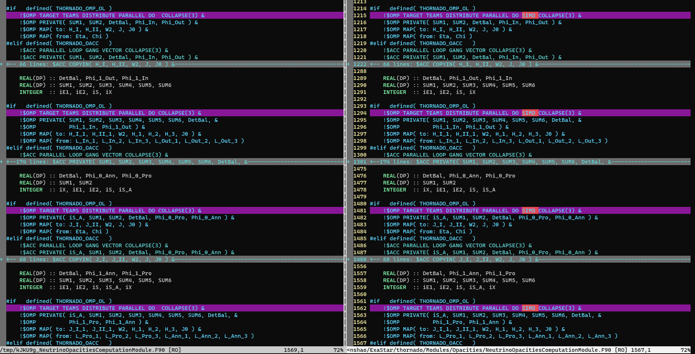
 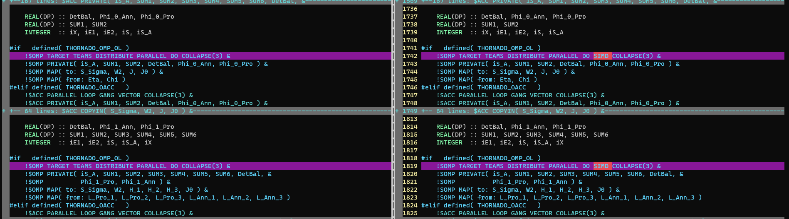
 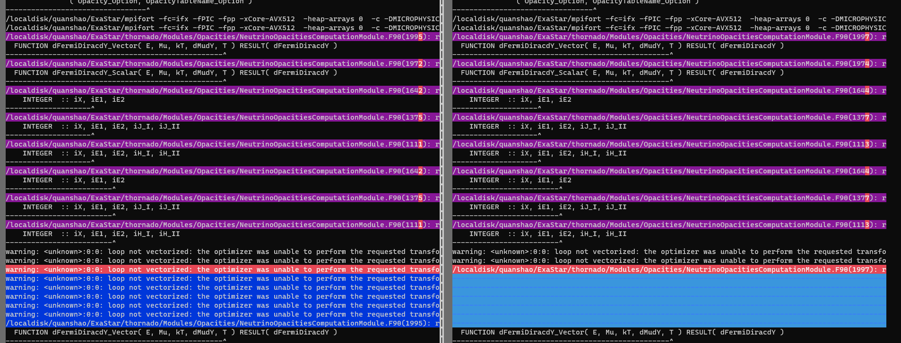

3. So ```Modules/Opacities/NeutrinoOpacitiesComputationModule.F90``` will have the workaround, i.e. have SIMD removed. 

4. Comments are removed:  Modules/Library/ReferenceElementModuleX_Lagrange.F90

## Oct 20 2022
1. After a lot of trial and error, a reproducer is finally obtained with three source files. it is found that: 
* ICE only appears for the compilation with -O2. The code compiles successfully for other optimization levels.
* Removing several lines of code in TwoMoment_DiscretizationModule_Streaming_OrderV.f90 may also make the compilation successful.
* The code compiles if SIMD on line 165 is removed
* The code compiles with nightly-compiler/2022.08.23  Intel(R) Fortran 23.0-1031, but gives ICE for the compiler after. The latest one I tried is: nightly-compiler/2022.10.19   Intel(R) Fortran 23.0-1177
2. A Jira issue has been filed: https://jira.devtools.intel.com/browse/CMPLRLLVM-41159

## Oct 19 2022
1. Started from Baseline to remove workarounds. created a "ms68-baseline" branch, and rerun SineWaveStreaming and Relaxation case with this branch. The two cases runs and results look correct using nightly 2022-0823 and umd 604. 
2. Using nightly 1018 gets ICE in TwoMoment_PositivityLimiterModule_OrderV.F90. Here is the JIRA: https://jira.devtools.intel.com/browse/CMPLRLLVM-40431. 
3. The code of line 767-886 in SandBox/TwoMoment_OrderV/TwoMoment_DiscretizationModule_Streaming_OrderV.F90 caused ICE for -O2, but the code compiles and runs fine for -O0,O1, O3. Removing SIMD solves ICE, and remove several lines of the code also make the compile successful. Will try a reproducer. 

## Oct 18 2022
1. Workaround removal caused some conflicted observations,i.e., got ICEs which are not supposed to get. so will be start with the baseline again, and redo the removal process. 
2. Helped Tuan with his run of SineWaveStreaming case on his system.

## Oct 17 2022
1. Verfied the latest nightlies for https://jira.devtools.intel.com/browse/CMPLRLLVM-36460. All the latest from 10.12 to 10.16 still have the same issue for the reproducer. 
2. Working with Tuan as he continues facing the table generation issue for SineWaveStreaming case. 
3. Attended mentor circle meeting. 
4. Workarouds for the inlined functions cannot be removed yet due to ICEs 

## Oct 13-14 2022
1. Continue proof reading and making changes to the report
2. Tried the new softare stacks, module use /exaperf/validate/modulefiles, and module load oneapi/eng-compiler/2022.10.15.003-rc3. Thornado still get ICE.
3. Ky has proof read the report and has a lot of great suggestions. The suggestion has been acommandated. Thus the 1st draft of the report is ready. 

## Oct 12 2022

1. run the SineWaveStreaming and Relaxation case for all the optimization level, i.e. -O0 to -O3 with nightly 0823 and umd 604 as the baseline results for removing the workarounds. All the result files (log files)  has a name in the format of sineWave.O#.0823.604.baseline and relax.O#.0823.604.baseline
2. removing inline functions. 
3. The ShiftVec function cannot be inline now as it gives GPU table not be able to generate error. While a reproducer gives ICE with the nightly 08-23 to 10-11. Here is the jira issue: https://jira.devtools.intel.com/browse/CMPLRLLVM-40906

4. Continue proof-reading MS 68 report. Accommodating peers' suggestions.  


## Oct 10,11 2022

1. Continue proof reading the ms68 report and modify it according to the suggestions and comments by peers.
2. Thornado has link issue with latest nightly compiler, i.e. after 10.07. Discussced with Brian, the latest nightly uses different mkl and thus need to set A21_SDK_MKLROOT_OVERRIDE=/exaperf/nightly/mkl-cev/2022.10.06
3. A target function can only be executed by the calling thread, 2037 !!!i.e. 1 thread. So parallel do inside a target function/subroutine does not really make sense her.
4. Thornado continue has ICE with the newest compiler. Trying to narrow down it and get a reproducer. 

## Oct 5-7 2022
1. Proof read the ms68 report. Discussed with Marcus regarding his comments and suggestions. Run vtune collection 3 times for SineWaveStreaming case with xN={8,8,8} to see whether there are issues with the previous collection. 
2. Discussed again with Marcus. Made modification to the reports. 
3. New runs have been performed for the report using nighlty-0823 and prq-17. 
4. The data in the report have been updated

## Oct 4 2022
1. Having done more investigation, it is apparent that removing of workarounds of assigning arrays individually rather than AA=[A(1), B(j), A(3), B(4)] is not possible until  CMPLRLLVM-36460
2. Removed inlined function in FUNCTION EddingtonTensorComponents_dd of TwoMoment_UtilitiesModule_OrderV.F90. The results for both SineWaveStreaming and Relaxation agrees with the baseline. the log file is sineWave.O3.0823.604.inline1 and relax.O3.0823.umd604.nX8.inline1 on pvc07. The baseline log files are:sineWave.O3.0823.604.baseline and relax.O3.0823.umd604.nX8.baseline
3. Removed inline function Alpha_LS in  SUBROUTINE ComputeIncrement_FixedPoint_Richardson of TwoMoment_DiscretizationModule_Collisions_OrderV.F90. log file is:  sineWave.O3.0823.604.inline2 and  relax.O3.0823.umd604.inline2

## Oct 3 2022
1. Adding comments and a psuedo reproducer to https://jira.devtools.intel.com/browse/CMPLRLLVM-40308
2. Starts removes the workarounds to see which one is not needed any more as compiler may have already fixed the issue.
3. Discussed with Bill regarding which JIRA issue will be a high priority.
4. Array assignment seems not working for the whole code, although the reproducer works with the new compilers.


## Sept 28-30 2022
1. Continue writing the ms68 report. 
2. The relaxation case is running on GPU and gives the correct results compared to the CPU run. Cleaned up the code, merged with the latest master branch, created a new branch: ms69-lab and pushed to https://github.com/endeve/thornado.
3. The ms69-lab is tested for both the relaxation and the sinewavestreaming case on pvc07 for -O0 and -O3. All the runs finished successfully.
4. Got the vtune collection and run vtune backend with chrome browser to view the results. Capture vtune results and added to the ms68 report. 
5. Finished the 1st draft of ms68. Will proof read next week.

## Sept 26, 27 2022
1. Ran SineWaveStreaming case on pvc12 using nightly-compiler/2022.08.23 and neo/agama-prerelease/604-22.39.024259.12316-main for xN=8 to examine LIBOMPTARGET_LEVEL0_MEMORY_POOL effects. The runs are much faster than the runs on pvc17 using nightly-compiler/2022.08.23 and neo/agama-prerelease/579-22.36.024108.12156-main. Updated the ms68 report data with the pvc12 results. 
2. Supada reserved pvc12 for her use, and then I changed to pvc07. 
3. Set up all the code on pvc07 on Sept 27 2022.


## Sept 23 2022
1. Run the ms68-daily code which was updated with the latest master from https://github.com/endeve/thornado. Result differences are observed with the updated code compared to the old one. One thing noticed is the change of M_inner form 2 to 3 in ApplicationDriver_Neutrinos.F90. Send an email to Eirik and Austin on the code and result changes.
2. For the Relaxation case using LIBOMPTARGET_LEVEL0_MEMORY_POOL=device,32,64, 2048 is almost 2 times faster than using LIBOMPTARGET_LEVEL0_MEMORY_POOL=device,64, 32, 2048
3. AS it was observed that the tally output costs a lot of time, the performance data for SineWaveStreaming case will be updated by outputting the tally data with the frequency of 100 cycles. Therefore, for MS68, all the simulations are done with Wcycle=100. 
4. Rerun the cases in the ms68 drafts and updated the data.


## Sept 22 2022
1. Tested sineWaveStreaming cases with nightly 08232033 and umd600 for nX=8 and nX=16. All the cases run fine.
2. Did notice that the differences in the running time for -O0 and -O3 executables are narrower, i.e. For -O3, the total running time is 1m5.045s, while it is 1m21.957s for -O0. I am using nightly 0823 and umd600 and pvc17. eng 06.30.002:  1m11.639s for O3, and 1m52.067s for O0. So my tests show that O0 is much faster for then new compiler and umd,  while O3 is a little bit faster than the old ones.
3. Update the code with the latest master. 

## Sept 21 2022
1. Created a new function of ShiftRHS_FP in which the temporary arrays for the private variables of the teams are removed. The code is much simpler and faster. Now the results are match with the CPU simulations for the Cycle==1. 
 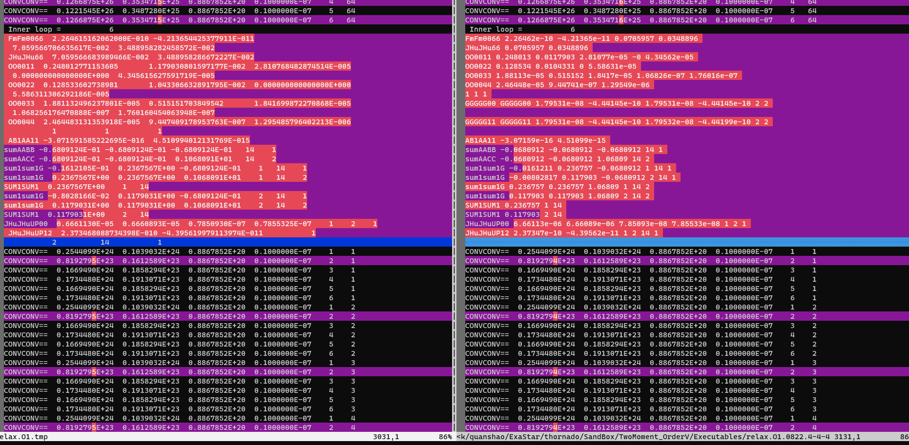

2. With the above fix and the fixes in weaklib, the relaxation code is running and compared well with the cpu runs. Here shows  the comparison for xN=8 runs.

 

3. Push the code to intel github as ms68-daily 


## Sept 20 2022
2. Made a reproducer for arrays being private for TARGET TEAMS DISTRIBUTE. The code give random results for nX_G=64 and AnFp=128, i.e.sometime it passes, sometime is fails. for larger nX_G and/or AnFp the code consistently fails but the number wrong results are somehow still random. This is compiled by -O1. 
3. Compiled by -O0, the reproducer hangs. 
4. Compiled by -O2,-O3, the reproducer fails.
5. on gojira, the reproducer passes for nX_G=128 and AnFp=128, but fails for nX_G=128 and AnFp=512; on ats3, the reproducer passes for  nX_G=128 and AnFp=512, but fails nX_G=1024 and AnFp=512
6. Discussed with Brian, and then submitted a JIRA issue. https://jira.devtools.intel.com/browse/CMPLRLLVM-40308
   
## Sept 19 2022
   * F == FVEC_inner, G == GVEC_inner, A == AMAT_inner, B == BVEC_inner. 
1. Continuing debugging divergence issue of Relaxation application.
2. OrderedICE.f90(56): error #5415: Feature not yet implemented: ORDERED construct inside of a TARGET or a DECLARE TARGET region is not yet implemented.
3. It is found that `Alpha(1:Mk, iN_X)` becomes very different starting from inner loop ==3. Here we are only examining `Alpha(1,14), Alpha(2, 14)` at inner loop == 2 and 3 respectively. 

  | variable          |  CPU innerloop=2 | GPU innerloop=2   |   CPU innerloop=3 | GPU innerloop=3     |
  | :----:            |  :----:          | :-----:           | :-----:           | :-----:           |
  | Alpha(1,14)       | -0.2673316E-01   | -0.0267332        | -0.7682529E-01    |-2.26905e-05       |
  | Alpha(2,14)       | 0.1026733E+01    |   1.02673         | 0.1076825E+01     | 1.00002           |

  Here is the screen output and the code:
  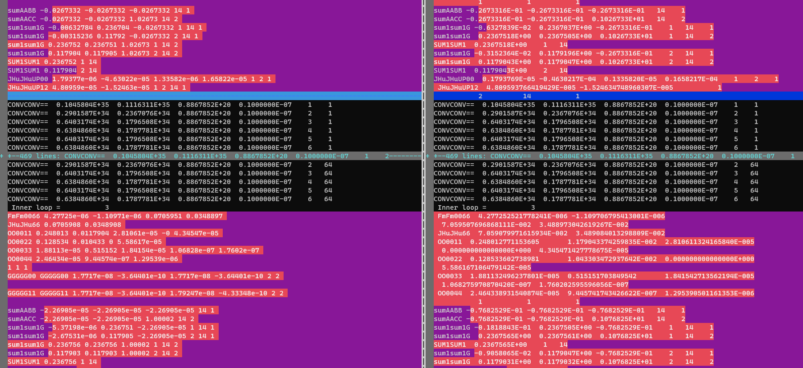
 GPU code:

```
  2794             SUM1 = SUM1 + B(iM,iN_X)
  2795             if( iN_X==14)then
  2796                !$OMP critical
  2797                print*,"sumAABB", SUM1, B(iM,iN_X),  Alpha(iM,iN_X), iN_X, iM
  2798                !$omp end critical
  2799             end if
  2800           END DO
  2801           Alpha(Mk,iN_X) = One - SUM1
  2802             if( iN_X==14)then
  2803                !$OMP critical
  2804                print*,"sumAACC", SUM1, Alpha(1,iN_X), Alpha(2,iN_X),iN_X, Mk
  2805                !$omp end critical
  2806             end if
```

  cpu code:      

```
  2787             SUM1 = SUM1 + B(iM,iN_X)
  2788             if( iN_X==14)then
  2789                write(*,"(A,3e15.7,2i5)") "sumAABB", SUM1, B(iM,iN_X), Alpha(iM,iN_X), iN_X, iM
  2790             end if
  2791           END DO
  2792           Alpha(Mk,iN_X) = One - SUM1
  2793             if( iN_X==14)then
  2794                write(*,"(A,3e15.7,3i5)") "sumAACC", SUM1, Alpha(1,iN_X), Alpha(2, iN_X), iN_X, Mk
  2795             end if
```

4. Now it is found that `A` and `F' are different at inner loop ==3 with iM=1,i.e. last inner loop =2. With the following code on lines 2655-2659:
 ```
          if(iN_X==14 .and. iFP.le.10)then
             !$omp critical
             print*, "AFFM0011=", A(iFP,iM,iN_X), F(iFP,iM,iN_X),  Fm(iFP,iN_X), iFP,iM,iN_X
             !$omp end critical
          end if
 ```    

 The screen output: 

  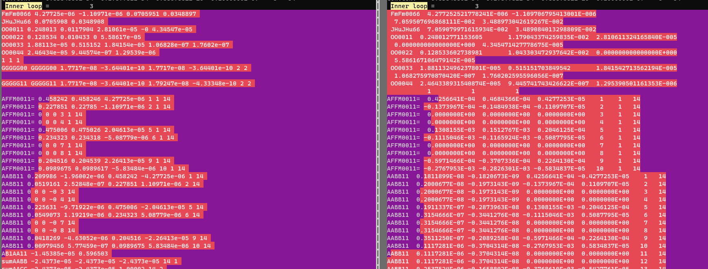 

 so it is  F == FVEC_inner,A == AMAT_inner that have differences with the second index of 1. FVEC_inner(:, 1, :) and AMAT_inner(:,1,:)
 But A(:,1,:) i.e.  AMAT_inner(:,1,:) is computed inside SolveLS_FP, so the reason for the difference is FVEC_inner(:,1,:). 


## Sept 16 2022
1. `/opt/script/check_speed.sh` fails on pvc12 and pvc17. Discussed with Marcus, he found out that the issue is with old KMD.
2. Ran SineWaveStreaming case on pvc12 which just got updated to SPR-E2 processor, and found 12 seconds speed up, i.e. from 1m on pvc17 to 0m48.295 seconds on pvc12. Here are the profile results for pvc12 and pvc17.
   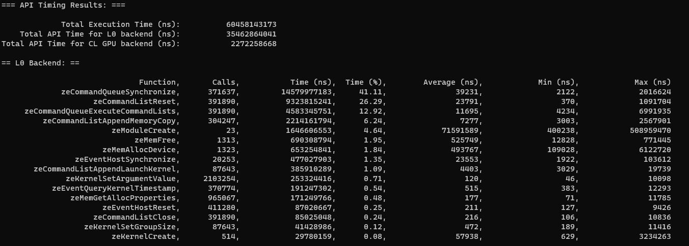
   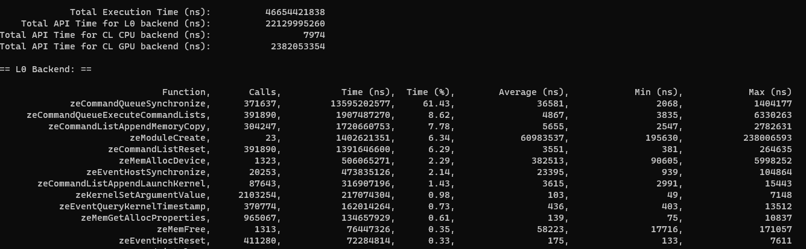  

3. However, when rerun the case, the speed up is gone. However, I see a bit of slow down. One reason could be check_speed failed.    
4. Debugging the divergent of Relaxation code. It seems to me that `Gm` and `Fm` first have difference between GPU and CPU runs. Here is the code and the comparison between GPU and CPU runs.   
   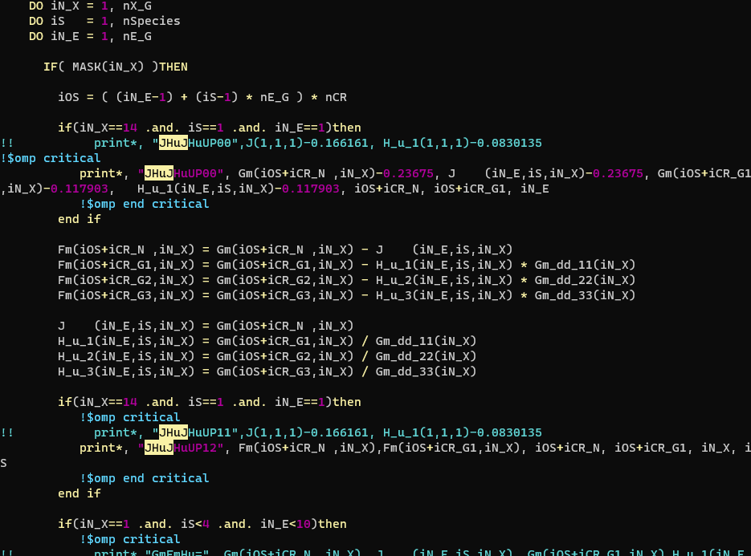
   
  
## Sept 15 2022
1. run Implicit and Explicit scaling for SineWaveStreaming application using 1 and 2 tiles. But there is almost no performance changes by using 2 tiles and implicit scaling. 
2. Had a discussion with Marcus and Brian. 
   * Thornado cannot do explicit scaling as explicit scaling need run apps with mpi. But thornado does not support mpi runs now.
   * vtune needs to be working with the latest umds.
   * There are either not enough work items for GPU or cash line contention in the most expensive kernels, so using two tiles does not improve performance is expected. 
   * latest umd makes the code run 30 seconds faster, i.e. from 1m30s (umd553) to 1min (umd579)

## Sept 12-14 2022
1. Examine effects of Public Memory Pool Size on the performance of sineWaveStreaming cases. Writting the report on this topic.   
2. For xN={16,16,16} it is found that LIBOMPTARGET_LEVEL0_MEMORY_POOL=device,16,32 works Okay as the device memory allocation and free only account for 5% of the total simulation time. 
3. Had a meeting with national lab contacts, and here are the minutes:
   * cases: SineWaveStream xN={8,8,8}, and xN={16,16,16}
   * code : my code 
   * performance metrix : running time
4. ICE appears for ASSOCIATE in Fortran code. submitted a JIRA: https://jira.devtools.intel.com/browse/CMPLRLLVM-40199   
   

## Sept 07-09 2022
1. Running SineWaveStreaming on pvc17 
2. Compiling SineWaveStreaming on pvc17 using parallel compilation scheme. The code compiles with `make -j 4` but has a dependency error for `Euler_PositivityLimiterModule_NonRelativistic_TABLE`. Discussed with National Lab's contacts. Then updated the ms68-lab with the latest master, however, the dependency issue still exist. It turns out that “LinearAlgebraModule.o”  is missing for compiling “Euler_PositivityLimiterModule_NonRelativistic_TABLE.o.” By adding it to line 88 of Modules/Euler/Makefile_Euler_Dependencies makes the parallel compilation working.
3. Adding parallel compilation timings to the ms68 report for both AOT and JIT compilation for 1/2/4/8/16 parallel threads used for compiling. `time` command is used to do the timing except for JIT zeModuleCreate time is used for device compilation time. oneTrace is used to collect zeModuleCreate time.


## Sept 06 3022

1. Setup thornado-ms68 in pvc12 /localdisk to run SineWaveStreaming case fore milestone 68
2. Run the SineWaveStreaming cases with eng-0630-002 for nX={8,8,8} and nX={16,16,16}. The cases run fine.
3. The above two grid sized cases also run fine with the nightly-0824 and umd577.
## Sept 1 2022
1. Further debugging shows that "G(iFP,iM,iN_X)" is corrupted before getting to `SolveLS_FP` function. Here corrupted means " kind of random value, but reasonable right, no huge numbers or NaNs". This nature of the problem makes the debugging very difficult. 
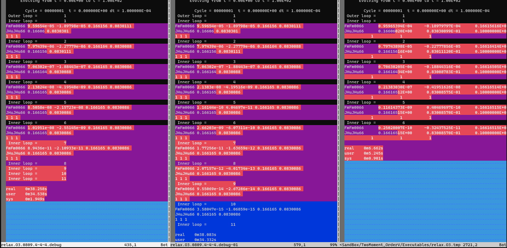

2. It is finally found that "G(iFP,iM,iN_X)" is corrupted in `ShiftRHS_FP` subroutine. And changing the size of the private variable "FTMP" and "GTMP" from `(1:n_FP,1:M)` to `(-n_FP:2*n_FP,-M:2*M)` make the code runs and converges. It seems to me that the issue is with `teams distribute` construct. This issue is similar to https://jira.devtools.intel.com/browse/CMPLRLLVM-39083, but this random values happen on all optimization level. i.e. -O0 -- -03. Once the range of the team private variables has been extended, the code shows consistent convergence: 


## Aug 30 2022
1. Contine debugging of the not converging for {4,4,4} case.  Now, it seems that `G(iFP, 1, iN_X)` is corrupted. 
```
2812           DO iM = 1, Mk
2813             SUM1 = SUM1 + G(iFP,iM,iN_X) * Alpha(iM,iN_X)
2814             if( (iFP==162 .or. iFP==161) .and. iN_X==1)then
2815                !$OMP critical
2816                print*,"sum1sum1G", SUM1, G(iFP,iM,iN_X),  Alpha(iM,iN_X), iFP
2817                !$omp end critical
2818             end if
2819
2820           END DO
```

and the results: 
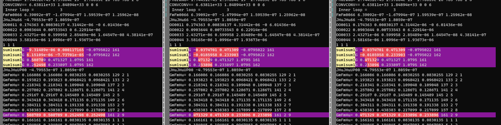
" vimdiff  relax.O1.0822.4-4-4.01   relax.O1.0822.4-4-4.02  relax.O1.0822.4-4-4.03"

## Aug 30 2022.
1. Tried lastes ms68-lab on JLSE's Arcticus and Florentia machines. The Relaxation case with xN={8,8,8} runs on both machines with -O3. But the solution procedures seem to be very different. The log files have been transferred to pvc12  and with names: "relax.O3.jlse-ats-8-8-8  relax.O3.jlse-pvc-8-8-8  relax.O3.jlse-pvc-8-8-8-weaklib" 
2. The original default case runs fine, i.e. xN={1,1,1} on both Arcticus and Florentia with -O3.  
   
## Aug 29 2022
1. It seems to me that the MAP clause is need for the variables declared to be targets in modules, not the one declared to be targets in the main program. `LogEs_T` and the others are declared to be target in `OpacityModule_Table` model, so `always` is needed. So adding `always` to MAP clause for varaibles declared to be targes in module files.
2. Adding "always" to `map` clause in `./Modules/EquationOfState/EquationOfStateModule_TABLE.F90`, but still see NaNs. Detailed investigations needed. 
3. But changing "omp target map(to" to "omp target map(alays, to" in the place needed, the Relaxation case runs with xN={2,2,2}. 


   
## Aug 26 2022
1. Find an ICE for a small code, and discussed with Brian. Submitted a JIRA: https://jira.devtools.intel.com/browse/CMPLRLLVM-39814   
2. The codes compile if compiled separatly. Investigating "MAP (always)". 
## Aug 25 2022
1. There is an internet outage in my region. Learning OpenMP from openmp-examples-5-2.pdf, and OpenMP45_Bertoni.pdf.   
## Aug 24 2022
1. Debugging shows that NaN may come from `weaklib`. So change the case to xN={1,1,1} and found we got NaNs also.
2. Stick with xN={1,1,1} case fore debugging NaNs. 
3. Added `always` to !$OMP MAP(to: LogEs_T, LogDs_T, LogTs_T, Ys_T, LogEtas_T &` as the `SIZE(LogEs_T)` is zero and causes NaNs in ` CALL LogInterpolateSingleVariable_2D_Custom_Point` on line 428 of `Modules/Opacities/OpacityModule_TABLE.F90`. 
4. However, NaNs are still seen. Need to investigate.

## Aug 23 2022
1. Try to fix NaNs using nightly 08.21
    in `ComputeNeutrinoRHS_FP` of TwoMoment_NeutrinoMatterSolverModule_OrderV.F90 (with iN_E, iS, iN_X are all 1)
    * [:heavy_check_mark:] J, and H_u_1 (H_u_2, H_u_3), C_J, vDotH, C_H_d_1,vDotK_d_1 have valid values 
    * [:x:] Eta_T and Chi_T are NaNs due to (Chi_EmAb, Eta_NES, Eta_Pair, Eta_Brem) and (Chi_NES,Chi_Pair,Chi_Brem) are all NaNs. 
    * [:x:] Kappa is also NaN as Kappa is computed from Chi_T
    * [:x:] J0 is 1 here, but it should be  0.599958.
3. Try to figure out J0 is 1.
    * J0 is computed in `ComputeEquilibriumDistributions_DG` with E,D, T, Y as inputs in `./Modules/Opacities/NeutrinoOpacitiesComputationModule.F90`
    * Mp(iX),  Mn(iX),  T(iX) are NaNs on GPU for iX==1 in `ComputeEquilibriumDistributions`, and D(1), T(1),Y(1) are zero on CPU while E(1) has the correct value, i.e.5.244457053521155E-058.
    * go back to ` ComputeOpacities_Packed` in `TwoMoment_NeutrinoMatterSolverModule_OrderV.F90` to see why. 
    * T(1) is NaN inside `InitializeRHS_FP` of `TwoMoment_NeutrinoMatterSolverModule_OrderV.F90`, while E(1),D(1), and Y(1) has a valid value. (line 1841).
    * investigating `./SandBox/TwoMoment_OrderV/TwoMoment_DiscretizationModule_Collisions_Neutrinos_OrderV.F90`

## Aug 22 2022
1. Found that it is difficult to found out where the issue comes from by printing out variables and the code runs fine with `oneapi/eng-compiler/2022.06.30.002`. Decided to do a sweep runs to see which versionof compiler causes problems.

2. Here is a lit of compiler tested.
  | Nightly           |  O3-debug |  03     |
  | :----:            |  :----:   | :-----: |
  | 08.21             |  NaNs(2)  |         |
  | 08.15             |  NaNs(2)  |         |
  | 08.14             |  NaNs(1)  |         |
  | 08.12             |  NaNs(1)  |         |
  | 08.11             |  NaNs(2)  |         |
  | 08.10             | Cannot Be Installed  |         |
  | 08.09             | Not Converge (4). Randomnes  |         |
  | 08.03             | Not Converge (4). Randomnes  |         |
  | 08.01             | Not Converge (4). Randomnes  |         |
  | 07.15             | Not Converge (4). Randomnes  |         |
  | 07.13             | Not Converge (4). Randomnes  |         |
  | 07.12             | Converge  |         |
  | 07.11             | Converge  |         |
  | 07.01             | Converge  |         |
  | Eng 06.30.002     |

<pre>
Checking for file conflicts: ..............................................................................................................................................................................[done]
(1/2) Installing: exaperf_nightly_compiler_2022.08.10-1.0-1.x86_64 .......................................................................................................................................[error]
Installation of exaperf_nightly_compiler_2022.08.10-1.0-1.x86_64 failed:
Error: Subprocess failed. Error: RPM failed: error: unpacking of archive failed on file /exaperf/nightly/compiler/2022.08.10/linux/lib/emu/libOclCpuBackEnd_emu.so.2020.11.11.0;6303fe66: cpio: read failed - No such file or directory
error: exaperf_nightly_compiler_2022.08.10-1.0-1.x86_64: install failed

Abort, retry, ignore? [a/r/i] (a): a
Problem occurred during or after installation or removal of packages:
Installation has been aborted as directed.

</pre>

## Aug 19 2022
1. Discussed with Brian about the data transfer issues in ` ComputeRates_Packed` of TwoMoment_NeutrinoMatterSolverModule_OrderV.F90
2. Tried to `!$OMP TARGET UPDATE FROM (J, H_u_1, H_u_2, H_u_3, MASK, J0)`, the divergence issue still exist. This was tested on gojira as the HPC cloud nodes are off power. 
3. Tried to compile CPU code on gojira, but has library not found issues. 

## Aug 17,18 2022

1. Reading the Journal paper by Eirik. Will find a time to discuss the connection between the paper and the code.
2. For iN_X, it is found that for the 1st inner loop, H and J was changed, but after the 1st inner loop, they maintain their values.
3. After long debugging (random convergence issue for random iN_X, iN_E and iS. It now seems to me that there a lot of issue in data transfer to/from GPU in GPU in subroutine ComputeRates_Packed of TwoMoment_NeutrinoMatterSolverModule_OrderV.F90. For example, J, H_u_1, H_u_2, and H_u_3 are passed in, and for GPU simulations, these variables have updated values on GPU, but not on CPU. However, when we set pointers to these variables, we do it on CPU, and then we map these pointers to GPU in the following subroutines.  In this way, I do not think the pointers has the updated values. So, ComputeNeutrinoOpacityRates_NES may not give us correct results. 
4. Send an email to Eirik and Austin to see what they think. Hopefully we will have a team meeting to discuss this and the paper. 

We also may have issues with other variables, such as Eta_NES_P, Chi_NES_P, L_NES__In__u_1_P, etc…
## Aug 15,16 2022
1. Run the code with the latest nightly, i.e. nightly-compiler/2022.08.14, a lot more NaNs appeared. Discussed with Brian, and found out that the issue may start from nightly-compiler/2022.08.11. Here is the jira filed by Brian, https://jira.devtools.intel.com/browse/CMPLRLLVM-39557
2. Sent an email for the updates of ms68-lab branch. 
3. Debugging will be using nightly-compiler/2022.08.09. It shows that J and H_u_1 in around line 2435 of ComputeNeutrinoRHS_FP subroutine of "TwoMoment_NeutrinoMatterSolverModule_OrderV.F90" are the reason for the differences. Here are the code and the result comparison:

 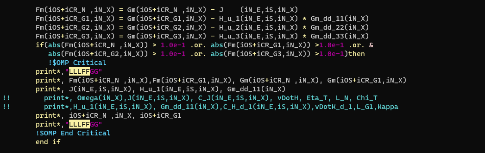
 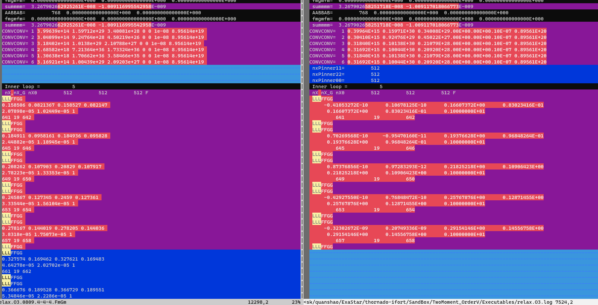

 According to CPU calculation, J and H_u_1 should be having very similar values of Gm. 

## Aug 12 2022
1. Debugging with turnning off the offload regions inside the inner loop of subroutine `SolveNeutrinoMatterCoupling_FP_Nested_AA` in 200~TwoMoment_NeutrinoMatterSolverModule_OrderV.F90 help me found that `ComputeRates_Packed1 might be the cause of the slow convergence or no convergence. These function computes a lot of file-scoped variables and these variable is used in `ComputeNeutrinoRHS_FP`.
2. Will focus on these two subroutines.
 * `ComputeNeutrinoOpacityRates_NES`: 1636   ->  [:heavy_check_mark:]
 * `ComputeNeutrinoOpacityRates_Pair`: 1654  ->  [:heavy_check_mark:]
 * `ComputeNeutrinoOpacityRates_Brem`: 1672  ->  [:heavy_check_mark:]

3. It seems now the issue is due to wrong calculation of J and H_u_1. As the print out using the following code in `ComputeNeutrinoRHS_FP` on lines : 2439 shows huge difference between GPU and CPU simulations 

```
2438         Fm(iOS+iCR_G3,iN_X) = Gm(iOS+iCR_G3,iN_X) - H_u_3(iN_E,iS,iN_X) * Gm_dd_33(iN_X)
2439         if(abs(Fm(iOS+iCR_N ,iN_X)) > 1.0e-1 .or. abs(Fm(iOS+iCR_G1,iN_X)) >1.0e-1 .or. &
2440            abs(Fm(iOS+iCR_G2,iN_X)) > 1.0e-1 .or. abs(Fm(iOS+iCR_G3,iN_X)) >1.0e-1)then
2441            !$OMP Critical
2442         print*,"LLLFFGG"
2443         print*, Fm(iOS+iCR_N ,iN_X),Fm(iOS+iCR_G1,iN_X), Gm(iOS+iCR_N ,iN_X), Gm(iOS+iCR_G1,iN_X)
2444         print*, J(iN_E,iS,iN_X), H_u_1(iN_E,iS,iN_X), Gm_dd_11(iN_X)
2445 !!        print*, Omega(iN_X),J(iN_E,iS,iN_X), C_J(iN_E,iS,iN_X), vDotH, Eta_T, L_N, Chi_T
2446 !!        print*,H_u_1(iN_E,iS,iN_X), Gm_dd_11(iN_X),C_H_d_1(iN_E,iS,iN_X),vDotK_d_1,L_G1,Kappa
2447         print*, iOS+iCR_N ,iN_X, iOS+iCR_G1
2448         print*,"LLLFFGG"
2449         !$OMP End Critical
2450         end if
```

and CPU code 
```
2421         if((iOS+iCR_N)>288 .and. (iOS+iCR_N)<306 .and. iN_X==21)then
2422             print*,"LLLFFGG"
2423            write(*,"(4e20.8)") Fm(iOS+iCR_N ,iN_X),Fm(iOS+iCR_G1,iN_X), Gm(iOS+iCR_N ,iN_X), Gm(iOS+iCR_G1,iN_X)
2424            write(*,"(4e20.8)") J(iN_E,iS,iN_X), H_u_1(iN_E,iS,iN_X), Gm_dd_11(iN_X)
2425 !!           write(*,"(7e20.8)") Omega(iN_X),J(iN_E,iS,iN_X), C_J(iN_E,iS,iN_X), vDotH, Eta_T, L_N, Chi_T
2426 !!           write(*,"(6e20.8)") H_u_1(iN_E,iS,iN_X), Gm_dd_11(iN_X),C_H_d_1(iN_E,iS,iN_X),vDotK_d_1,L_G1,Kappa
2427            print*, iOS+iCR_N ,iN_X, iOS+iCR_G1
2428             print*,"LLLFFGG"
2429         end if
```

And here are the result comparison     
  <pre>
 LLLFFGG
     -0.63495986E-08      0.28828689E-08      0.47194937E+00      0.23446887E+00
      0.47194938E+00      0.23446887E+00      0.10000000E+01
         289          21         290
 LLLFFGG
 LLLFFGG
     -0.10183163E-07      0.46488124E-08      0.49494721E+00      0.24515244E+00
      0.49494722E+00      0.24515244E+00      0.10000000E+01
         293          21         294
 LLLFFGG
 LLLFFGG
     -0.13043096E-07      0.60762395E-08      0.48553971E+00      0.23977488E+00
      0.48553973E+00      0.23977488E+00      0.10000000E+01
         297          21         298
 LLLFFGG
 LLLFFGG
     -0.15536737E-07      0.76036673E-08      0.42556493E+00      0.20902827E+00
      0.42556495E+00      0.20902826E+00      0.10000000E+01
         301          21         302
 LLLFFGG
 LLLFFGG
     -0.15267437E-07      0.78982154E-08      0.34724970E+00      0.16967564E+00
      0.34724971E+00      0.16967563E+00      0.10000000E+01
         305          21         306
 LLLFFGG
GPU GPU GPU GPU
 Inner loop =           5
 nX,nX_G nX0         512         512         512 F
LLLFFGG
0.449968 0.231813 0.450279 0.231957
0.000311229 0.000143859 1
289 21 290
LLLFFGG
LLLFFGG
0.471824 0.24234 0.472157 0.242489
0.000333348 0.000148605 1
293 21 294
LLLFFGG
LLLFFGG
0.462781 0.23699 0.463115 0.237133
0.000333794 0.000143553 1
297 21 298
LLLFFGG
LLLFFGG
0.405497 0.206547 0.4058 0.20667
0.000303319 0.000122243 1
301 21 302
LLLFFGG
LLLFFGG
  </pre>
## Aug 11 2022

1. Run a smaller case of Relaxation application, i.e. `nX={4,4,4}, nSpecies = 3, nE=4` with 1) `oneapi/eng-compiler/2022.06.30.002` (left),  2)  `nightly-compiler/2022.08.09` (middle)), 3) CPU (right). The three runs seems all converged. But the actual results of variables in `TwoMoment_NeutrinoMatterSolverModule_OrderV.F90` are different. 2) and 3) are more closer, while 1) has a significant difference. Assuming CPU gives the right results, then 1) is wrong. Here is the screen output, and the code for output:

```
2662
2663       IF ( Mk == 2 ) THEN
2664
2665 !$OMP TARGET UPDATE FROM(A, B, MASK(iN_X))
2666         DO iN_X = 1, 1
2667           IF( MASK(iN_X) )THEN
2668             AA11 = Zero
2669             AB1  = Zero
2670             DO iFP = 1, n_FP
2671               AA11 = AA11 + A(iFP,1,iN_X) * A(iFP,1,iN_X)
2672               AB1  = AB1  + A(iFP,1,iN_X) * B(iFP  ,iN_X)
2673               print*,"AABBAB=", iFP, A(iFP,1,iN_X),  B(iFP ,iN_X)
2674               print*,"summmm=", AA11, AB1
2675             END DO
2676             IF( ABS( AA11 ) < SqrtTiny )THEN
2677               tmp00 = Zero
2678             ELSE
2679               tmp00 = AB1 / AA11
2680             END IF
2681             if(iN_X .eq. 1)then
2682                print*,"CPUBBB00",  tmp00,AB1, AA11
2683             endif
2684           END IF
2685         END DO
```

  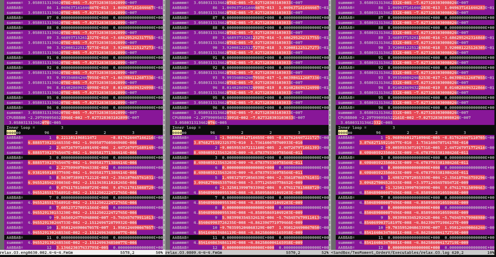  


However, for the case with `nX={4,4,4}, nSpecies = 6, nE=16`, `nightly-compiler/2022.08.09` runs does not converge and for the 1 cycle and 1 outer loop, the inner went to 100, and still did not converge, and got the following message:
<pre>
 Inner loop =          99
 oooooo         768           2           2          99
 Inner loop =         100
 oooooo         768           2           2         100

   wlEOSInversionModule ERROR: Second Argument (E, P, or S) Outside Table Bounds

 [ComputeTemperatureFromSpecificInternalEnergy_TABLE_Vector] Error
  iP, D, E, Y :    45  0.000000000000000E+00  0.000000000000000E+00  0.000000000000000E+00

   wlEOSInversionModule ERROR: Second Argument (E, P, or S) Outside Table Bounds

 [ComputeTemperatureFromSpecificInternalEnergy_TABLE_Vector] Error
  iP, D, E, Y :    47  0.000000000000000E+00  0.000000000000000E+00  0.000000000000000E+00

   wlEOSInversionModule ERROR: Second Argument (E, P, or S) Outside Table Bounds

 [ComputeTemperatureFromSpecificInternalEnergy_TABLE_Vector] Error
  iP, D, E, Y :    98  0.000000000000000E+00  0.000000000000000E+00  0.000000000000000E+00

   wlEOSInversionModule ERROR: Second Argument (E, P, or S) Outside Table Bounds

 [ComputeTemperatureFromSpecificInternalEnergy_TABLE_Vector] Error
  iP, D, E, Y :   332  0.000000000000000E+00  0.000000000000000E+00  0.000000000000000E+00

</pre>

To be noted, for other smaller nSpecies and nE the runs seems fine. 


2. Will focus on `nightly-compiler/2022.08.09` and CPU differences to figure out the issues. The issue seems to be very random, and print does not work well. 

3. Save the `TwoMoment_NeutrinoMatterSolverModule_OrderV.F90` with prints and start with turn off offload regions/funcs/subs in the inner loop to see which one/ones has/have issues when offloaded to GPU. 

## Aug 10 2022
1. the same issue happens also for ` nightly-compiler/2022.08.09`. Using this for debugging.
2. Just print out `J(:,:,1:2)` to see where J has been changed. It is found that J has a significant change starting from InnerLoop=3 and after `UpdateNeutrinoRHS_FP`. This tells that `GVECm_inner` has been changed significantly at this moment as `J=GVECm_inner` in the subroutine. 
3. It is found that `GVECm_inner` changed significantly after `SolveLS_FP` when k_inner =3, Mk_inner=2, and M_inner=2. 
   SUBROUTINE SolveLS_FP(    MASK,         n_FP,       M,        Mk,      Fm,            Gm,       F,            G,        A,          B,        Alpha,        TAU,      LWORK,       WORK )
   CALL SolveLS_FP      ( ITERATE_inner, n_FP_inner, M_inner, Mk_inner,FVECm_inner, GVECm_inner, FVEC_inner, GVEC_inner,AMAT_inner, BVEC_inner, Alpha_inner, TAU_inner,LWORK_inner, WORK_inner)
4. It is found that for iN_X==1, the values of AB1 and AA11 are different very much between `nightly-compiler/2022.08.09` and `oneapi/eng-compiler/2022.06.30.002`. However they do agree with their results on CPU computed by the variable `A` and `B` updated from GPU. 
5. Run pure CPU code to compare which one is right by assuming CPU simulation is correct. 

## Aug 09 2022
1. Tested sineWaveStreaming case on ATS1 using ` nightly-compiler/2022.08.08` and `neo/agama-prerelease/557-22.32.023904.11926-main` , the case still gets NaNs. The output file name is `sineWave.O3.0808.umd557`
2. SineWaveStreaming case runs fine on PVC12 with the latest compiler and UMD, i.e. ` nightly-compiler/2022.08.08` and `neo/agama-prerelease/557-22.32.023904.11926-main`
3. PVC12 was having issues yesterday, and with the help from Erik,  it is happy this morning. 
4. Relaxation nX={8,8,8} case runs fine on PVC12 with ` nightly-compiler/2022.08.08` and `neo/agama-prerelease/557-22.32.023904.11926-main` for all -O levels. 
5. For the new nightly, i.e. `nightly-compiler/2022.08.08`, the run crashed due to NaNs for xN={8,8,8}. Will test for xN={1,1,1} case. It is found that xN={4,4,4} case can replicated the huge difference between the runs by `oneapi/eng-compiler/2022.06.30.002` and `nightly-compiler/2022.08.08`. Debugging this case. 


## Aug 05,08 2022
1. Cleaned up the code and merged with the latest master branch of https://github.com/endeve/thornado. Tested the sineWaveStreaming case on pvc12, and the case runs fine. The update branch is called ms68-lab
2. Ran the updated code on Arcticus and Florentia of JLSE, the sineWaveStreaming case runs fine on Florentia for all the optimization levels, however, it crashes for -O0 on Arcticus, but runs fine for high optimization, i.e. -O1 and above. The files are located at `/home/ac.squan/ExaStar/thornado` on JLSE machine. The compiler is `oneapi/eng-compiler/2022.06.30.002` 

3. pvc12 was down and then Erik helped me bring it live. But when I run the sineWaveStreaming, I got:
<pre>

Libomptarget (pid:37482)  --> No devices supported in this RTL
Libomptarget (pid:37482)  --> RTLs loaded!
Libomptarget (pid:37482)  --> No RTL found for image 0x00000000008b0220!
Libomptarget (pid:37482)  --> Done registering entries!

  INFO: Initializing Program: SineWaveStreaming

Libomptarget (pid:37482)  --> Entering data update with 13 mappings
Libomptarget (pid:37482)  --> Call to omp_get_num_devices returning 0
Libomptarget (pid:37482)  --> omp_get_num_devices() == 0 but offload is manadatory
Libomptarget error: Run with
Libomptarget error: LIBOMPTARGET_DEBUG=1 to display basic debug information.
Libomptarget error: LIBOMPTARGET_DEBUG=2 to display calls to the compute runtime.
Libomptarget error: LIBOMPTARGET_INFO=4 to dump host-target pointer mappings.

</pre>
It seems GPU cards is not loaded or something like this. Restart of the node helped bring it back alive and happy.

## Aug 03-04 2022

1.  Since SineWaveStreaming runs with high optimization, -O1 and above, on ATS1 using `oneapi/eng-compiler/2022.06.30.002`, but fails with nightly 2022.07.27 and agama546. And the crash seems very random, like a memory overwritten by compiler/umd. So a sweep of nightlies and UMDs will be used to test which one/combination fails.

  | Nightly           | UMD        |  O0      | O1      | O2      | O3 
  | :----:            | :----:     | :----:   | :-----: | :-----: | :-----: |
  | Eng 06.30.002     |  475       | Crashed  |4m25.527s|4m24.140s|4m42.176s|
  | Eng 06.30.002     | 531        |13m21.704s|4m4.518s |3m44.897 |3m48.730s|
  | Eng 06.30.002     | 534  :heavy_check_mark:      |13m19.585s|3m51.061s|3m42.439s|3m48.115s|
  | Eng 06.30.002     | 535  :x:      |12m38.988s| NANs    |  NANs   | NaNs    |
  | Eng 06.30.002     | 546        |13m18.422s| NANs    |  NANs   | NANs    |
  | Eng 06.30.002     | 552        |13m15.922s| NANs    |  NANs   | NANs    |
  | 2022.07.27        | 534   :heavy_check_mark:     |12m11.413s|3m44.983s|3m31.367s|3m36.258s|
  | 2022.07.27        | 535   :x:     |12m11.293s| NANs    |  NANs   | NANs    |
  | 2022.07.27        | 552        |12m9.792s | NANs    |  NANs   | NANs    |
  | 2022.08.02        | 534   :heavy_check_mark:     |12m16.190s|3m38.684s|3m34.907s|3m42.235s|
  | 2022.08.02        | 535   :x:     |12m11.158s| NANs    |  NANs   | NANs    |
  | 2022.08.02        | 552        |12m10.858s| NANs    |  NANs   | NANs    |
  | 2022.08.03        | 554        |12m13.765s| NANs    |  NANs   | NANs    |

  The above cases are run with JIT compilation. AOT compile is used for nightly 0802 and UMD552 for  -O0 and -O3. -O0 runs but very slows -O3 get NaNs, same as all the JIT compilation results. 
  The screen output are saved in `/localdisk/quanshao/ExaStar/thornado/SandBox/TwoMoment_OrderV/Executables` on ATS1, and the name of the output has a format of sineWave.O$OPT_LEVEL.$COMPILER.umd$UMD_LABEL. where OPT_LEVEL = 0/1/2/3, COMPILE=eng06.002/0727/0802, UMD_LABEL=475/531/534/535/546/552, for example: sineWave.O0.0802.umd535, sineWave.O3.eng06.002.umd535. The AOT run's output files has .aot as the suffix. 

2. sineWaveStreaming runs with `nightly-compiler/2022.08.03` and `neo/agama-prerelease/554-22.31.023852.11876-main` on PVC12.
3. sineWaveStreaming has the same issue with `nightly-compiler/2022.08.03` and `neo/agama-prerelease/554-22.31.023852.11876-main` on ATS1 as the other old combination. 
4. Stick on 2022.08.03 and umd554 for a possible reproducer. Discussed with Brian, we can treat this as a low priority for now. But Keep an eye on this to make sure that there is nothing abviously wrong.  

## Aug 02 2022
 Using `nightly-compiler/2022.07.27` and ` neo/agama-prerelease/546-22.30.023803.11807-main`
1. Inlined `CALL Alpha_LS_Vector` on line 550 of `TwoMoment_UtilitiesModule_OrderV.F90`, this helps to reduce NaNs. The SIMD in the inlined function is also removed as it also causes some inf or NaNs. 
2. One thing important is that NaNs/Infs appear in Cycle 2.
3. With !$OMP Critical in the following code, the code runs to cycle 3 without NaNs.
  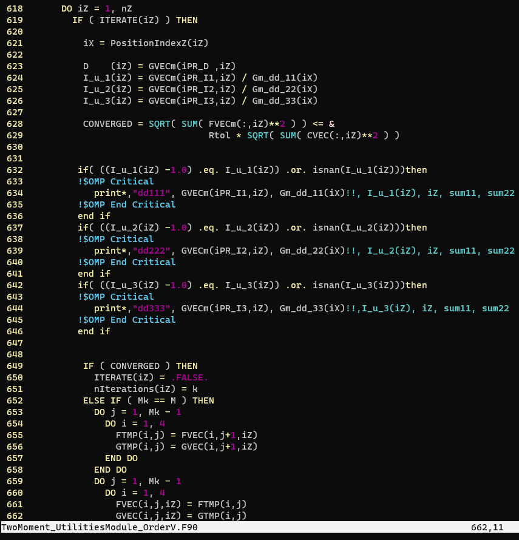
  The log file of the run is sineWave.O3.umd546.0727.0802022.noNaNs-OMP-Critical on ATS1
4. However, with out `OMP Critical` Nan appears at Cycle = 2 with the following code:

```
 632          if( ((I_u_1(iZ) -1.0) .eq. I_u_1(iZ)) .or. isnan(I_u_1(iZ)))then
 633 !!         !$OMP Critical
 634             print*,"dd111", GVECm(iPR_I1,iZ), Gm_dd_11(iX), I_u_1(iZ)!!, iZ, sum11, sum22
 635 !!         !$OMP End Critical
 636          end if
 637          if( ((I_u_2(iZ) -1.0) .eq. I_u_2(iZ)) .or. isnan(I_u_2(iZ)))then
 638 !!         !$OMP Critical
 639             print*,"dd222", GVECm(iPR_I2,iZ), Gm_dd_22(iX), I_u_2(iZ)!!, iZ, sum11, sum22
 640 !!         !$OMP End Critical
 641          end if
 642          if( ((I_u_3(iZ) -1.0) .eq. I_u_3(iZ)) .or. isnan(I_u_3(iZ)))then
 643 !!         !$OMP Critical
 644             print*,"dd333", GVECm(iPR_I3,iZ), Gm_dd_33(iX),I_u_3(iZ)!!, iZ, sum11, sum22
 645 !!         !$OMP End Critical
 646          end if
```
And the following figure shows the results:

 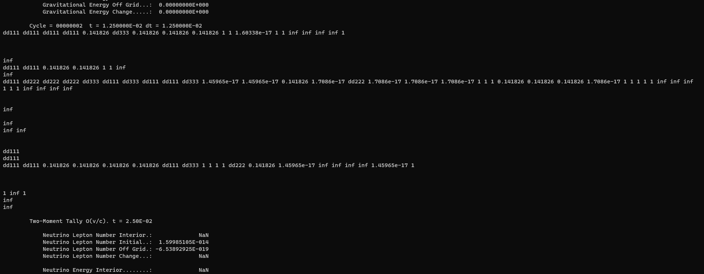

It is interesting to notice that although the result of divsion, i.e. the value of I_u_* has Inf, the denominator and the numerator are not zero, and they both have reasonable value. 

## Aug 01 2022
1. SineWaveStreaming case using `oneapi/eng-compiler/2022.06.30.002` on ATS1 and PVC12 (JIT).  LIBOMPTARGET_PLUGIN_PROFILE=T and iprof is used. 

  | Machine  |  Num Tiles/Funcs |  O0     | O1      | O2      | O3 
  | :----:   | :----:     | :----:  | :-----: | :-----: | :-----: |
  | ATS1     |  1         | Crashed |4m25.527s|4m24.140s|4m42.176s|
  |          |Compile Time|         |46.073s  |54.030s  |54.878s  |
  |          |Queue Sync  |         |1.03min  |58.62s   |1.01min  |
  |         |Module Create|         |47.84s   |55.80s   |56.65s   |
  | ATS1     |  2         | Crashed |4m43.760s|4m29.480s|4m30.923s|
  |          |Compile Time|         |46.163s  |53.926s  |55.277s  |
  |          |Queue Sync  |         |1.20min  |1.06min  |1.09min  |
  |         |Module Create|         |47.98s   |55.81s   |57.11s   |
  |          |
  | PVC12    |  1         |4m9.789s |2m53.561s|2m56.584s|2m57.627s| 
  |          |Compile Time|26.306s  |22.249s  |28.377s  |28.080s  |
  |          |Queue Sync  |29.16s   |13.88s   |13.50s   |13.68s   |
  |         |Module Create|27.47s   |23.41s   |29.54s   |29.24s   |
  | PVC12    |  2         |4m22.823s|3m6.994s |3m7.793s |3m8.035s |
  |          |Compile Time|26.928s  |23.079s  |29.028s  |28.824s  |
  |          |Queue Sync  |30.42s   |23.18s   |19.70s   |19.88s   |
  |         |Module Create|28.18s   |24.27s   |30.20s   |30.00s   |

(Crash means:  Segmentation fault (core dumped)
Trace location: /localdisk/quanshao/lttng-traces/iprof-20220721-120520

THAPI::Warning: exaperf-sdpcloud-ats1.jf.intel.com PID 65808 TID 65808 zeModuleCreate was called but never returned)


2. Then NaN for sineWaveStreaming on ATS1 seems very Random.    

## July 28-29 2022
1. Tried newest nightly, the NaNs are still there. nightly-compiler/2022.07.27. Inifinity for only several uI2L out of a total of 221184 uI2L elements.
   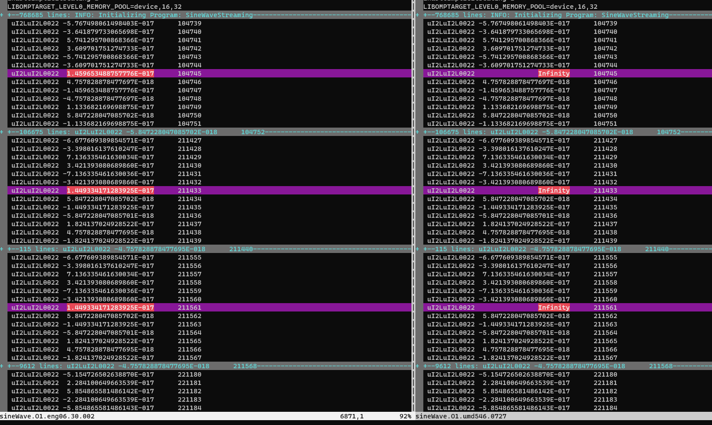
2. It seems that Alpha(iM, iZ) in the calculation of SUM1 has NaNs in it. Line 587 of `TwoMoment_UtilitiesModule_OrderV.F90`. The results are somehow random. This makes the debugging difficult. Sometime you got Nans, but sometime, when you add a print, NaNs are gone. Here is the code and the screen output for nans on cycle=2
   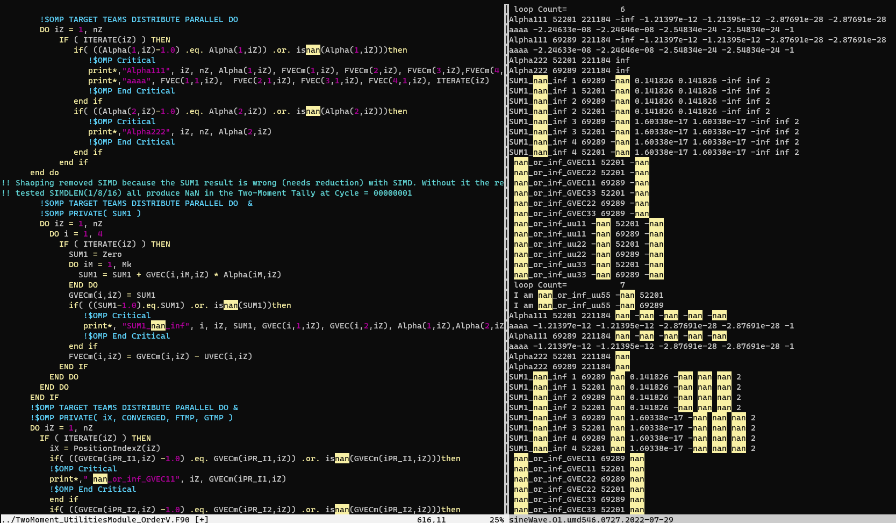
3. Even with the inline and deletion of SIMD for the Alpha_LS_Vector subroutine, I still see NaNs. Restart the debugging with this modification.
4. Debugging shows that there are some elements in uI2_L/R being Infs or NaNs as "R333" and "3333" are in the screen output. Had run a number times, and only saw 333
 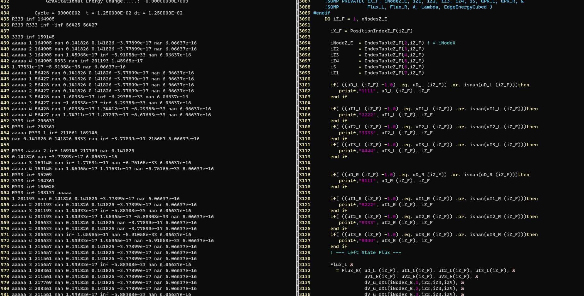
5. However, by adding the following code after line 632 of `TwoMoment_UtilitiesModule_OrderV.F90`
```
 if( ((I_u_2(iZ) -1.0) .eq. I_u_2(iZ)) .or. isnan(I_u_2(iZ)))then
  print*,"LLLLL", GVECm(iPR_I2,iZ), iPR_I2
 end if  
```
we got 
<pre>

2222 2222 2222 inf inf inf R222 R222 137577 R222 135721 135723 R222 R222 R222
R222

R222 inf inf inf inf inf inf 4201 R222 5161 R222 inf R222 6121 R222 19561 inf 9961 R222 21481 R222 R444 R222 R444 R222 R444 R222 R444 R222 R444 R222 R444 R222 R444 R444 R444 R222 R444 R222 4649 R222
R222
R222
R222
R222 20009 R222
R222
R222 inf R222 inf inf inf inf inf inf inf inf inf inf inf inf inf inf inf inf inf inf
inf
inf 5801 inf 3881 inf 7721 inf 9641 inf 11561 inf 13481 inf 19241 inf 21161 inf 23081 inf 25001 inf
inf
inf
111401
115241
111017
117737
119081
112937
114857
116777 118697 120617 134441 122537 124457 122921 126377 128297 130217 132137 134057 135977 137897 139817 138281
</pre>
Now the issue is in `uI1_L`. Surprising. 


## July 27 2022   
1. SineWaveStreaming case still gets NaNs on ATS1 using nightly-compiler/2022.07.26 and neo/agama-prerelease/546-22.30.023803.11807-main. So will stick these two for debugging. 
2. Debugging shows NaNs come from `StageData(iS) % dM_EX` for iS = 2 
```
CALL AddToArray( One, Ui, dt * w_EX(iS), StageData(iS) % dU_EX )
CALL AddToArray( One, Mi, dt * w_EX(iS), StageData(iS) % dM_EX )
!$OMP TARGET UPDATE FROM( StageData(iS) % dM_EX )
   if(count1 ==2)then
     print*,"aaaMiw_EX",is, w_EX(iS),  StageData(iS) % dM_EX
   endif 
```
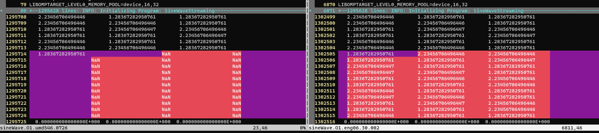

3. Now debugging shows the NaN come from `ComputeIncrement_TwoMoment_Explicit`   
4. `dU_E` already has NaNs before the kernel on line 3498 of `TwoMoment_DiscretizationModule_Streaming_OrderV.F90`.
5. `uI2_L(iZ_F)` has some Infinity values after `ComputePrimitive_TwoMoment`

## July 26 2022
1. PVC12 is down and need help from other team to bring it up. 
2. Switch to ATS1 
3. On ats1,  sineWaveStreaming case still runs very slow with umd544 and nightly 0720 with -O0, and has NaNs for -O1. To debug NaNs, try smaller cases xN={2,2,2}. xN={2,2,2} and {4,4,4} does not have NaNs issue.
4. Stick with xN={8,8,8}. 
5. Printing out Mi just after line 365 of `./SandBox/TwoMoment_OrderV/TwoMoment_TimeSteppingModule_OrderV.F90` and after the IF check of line 361, i.e. on line 398 of the same file, tells that NaN was introduced during the assemble step, either by adding `StageData(iS) % dM_IM` or `StageData(iS) % dM_EX`. It seems to me that only `M` or `uCR` has the NaN issue. The files has been copied to the shared: `~/ExaStar/thornado/`
 

## July 25 2022
1. Relaxation case hangs for nightly-compiler/2022.07.24 with -O0, NaNs with -O1.  The case runs with nightly-compiler/2022.07.05, and actually started to fail for nightly-compiler/2022.07.13. Investigating. 
2. Did a sweep test of nightly compilers and found out the hanging issue starts nightly-compiler/2022.07.13, and nightly-compiler/2022.07.12 does not have the issue.
3. Created a smaller reproducer and submitted a JIRA issue for this: https://jira.devtools.intel.com/browse/CMPLRLLVM-39173

## July 22 2022
1. SineWaveStreaming case runs on ATS1 using nightly-compiler/2022.07.20

  | O Level  |  UMD475 |  UMD531 | UMD534  | UMD535  | UMD536  |UMD538
  | :----:   | :----:  | :----:  | :-----: | :-----: | :-----: | :-----: |
  | O0       |Crashed  | 16m4.200s|16m0.896s|16m4.252s| 16m0.871s|16m14.366s|
  | O1       | 4m24.486s |4m5.094s |4m5.204s| NaNs   | NaNs  | NaNs|
  | 02       | 4m17.538s |4m17.776s|4m4.363s| NaNs   | NaNs  | NaNs|
  | 03       | 4m10.888s |4m7.390s |4m16.817s|NaNs   | NaNs  | NaNs|

  
2. SineWaveStreaming case runs on PVC12 using nightly-compiler/2022.07.20    

  | O Level  |   UMD475 | UMD531 | UMD534  | UMD535  | UMD536  | UMD538  
  | :----:   | :----:  | :----:  | :-----: | :-----: | :-----: | :-----: |
  | O0       |3m52.992s| Crashed | Crashed |Crashed  |3m52.532s|
  |  After   | Log out | Then    | Log in   
  | O0       |3m52.992s| 3m56.153s|3m49.783s|3m49.456s|3m50.011s|3m50.374s| 
  | 01       |2m45.995s |2m48.513s|2m48.725s|2m50.177s|2m49.328s|2m50.463s|
  | 02       |2m49.320s|2m49.439s |2m49.867s|2m50.589s|2m50.030s|2m51.729s|
  | 03       |2m48.156s|2m51.934s |2m50.805s|2m51.753s|2m51.171s|2m52.003s|


## July 21 2022
1. Made the JIT compilation default in the git repository.
2. Intel_gpu_top crashes if the largest window is used. But we can resize the terminal to see Compute/5,6,7, otherwise we will not see the tile working status on ATS nodes. For PVC nodes, the default size is fine. 

3. Tested sineWaveStreaming case of Thornado code on both PVC12 and ATS1 of our system. Here are the detailed info:
  * PVC12
  <pre>
    sineWaveStreaming case runs on pvc12 for single and two tiles with oneapi/eng-compiler/2022.06.30.002.
    the logfiles are: 
    Single-tile has a name of :  sineWave.O?.pvc12.06.30.002
    Two-tile    has a name of :  sineWave.O?.2tiles.pvc12.06.30.002
    The code runs for all level of optimization. i.e. -O0,1,2,3
   </pre>

  * ATS1
  <pre>
        sineWaveStreaming case runs on ats1 for single and two tiles with oneapi/eng-compiler/2022.06.30.002.
        the logfiles  are:
        Single-tile has a name of :  sineWave.O?.pvc12.06.30.002
        Two-tile    has a name of :  sineWave.O?.2tiles.pvc12.06.30.002
        ? stands for optimization level. The code runs for -O1 and above, but segmentation faults for -O0. It seems that is because of UMD issue.
  </pre>
  And here are some screen shots for two-tile run on ATS1 and PVC12. 

  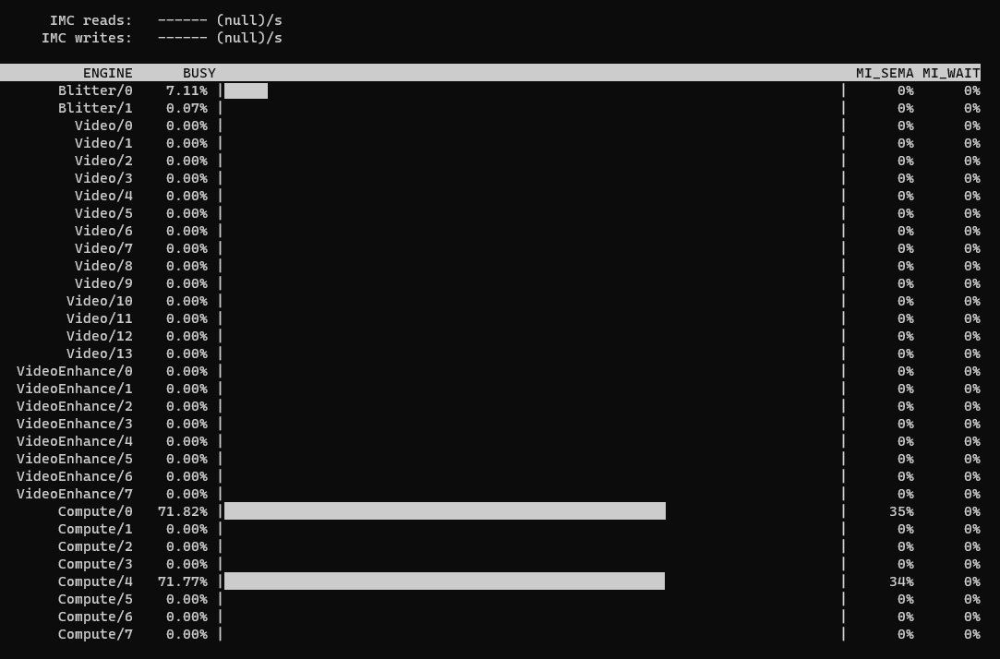    
  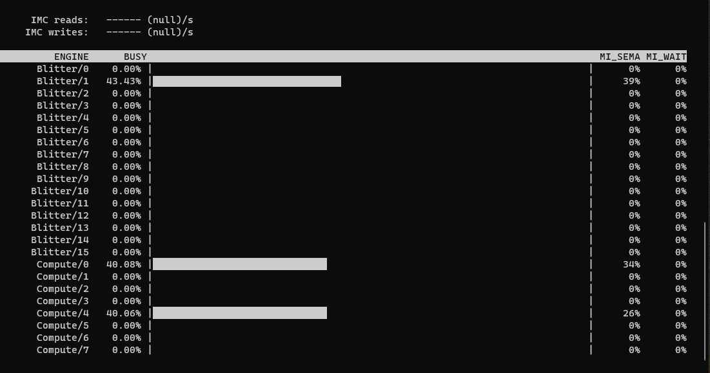


## July 20 2022
1.  The printed out values of private variables inside !$OMP TARGET TEAMS DISTRIBUTE are garbage when the code is compiled with -O0. But the results are fine if the code is compiled with high optimization, i.e.e -O1 and above. Here is a sample code:
```
         !$OMP TARGET TEAMS DISTRIBUTE &
         !$OMP MAP(to: LogD, LogDs, Alpha) &
         !$OMP PRIVATE(iD, dD)

         do kk = 1, SIZE(LogDs)

            do ll = 1, SIZE(Alpha)
               iD(ll)=logD(kk, ll) -logDs(kk)*2
               if(kk==1)then
                  print*,"aaaaa", ll, iD(1), iD(2), iD(3)
               end if
               dD(ll)=(logD(kk, ll) -logDs(kk)+4.0)/(logD(kk, ll) + logDs(kk)) + 0.123
               if(kk ==1) then
                  print*,"bbbbb", ll, iD(1), iD(2), iD(3), dD(1), dD(2), dD(3)
               end if
            end do

!!               if(kk ==1) then
!!                  print*,"ccccc", iD(1), dD(1)
!!               end if

         end do
```
Here is a sample of printout with wrong (garbage) values.
<pre>
 size          16           3           3           3
aaaaa 1 -3 0 0
bbbbb 1 -3 0 0 1.123 4.55856e-41 1.7099e-14
aaaaa 2 681181184 -3 681182196
bbbbb 2 681181184 -3 681182196 1.70974e-14 1.123 1.70993e-14
aaaaa 3 681181184 32531 -3
bbbbb 3 681181184 32531 -3 1.70974e-14 4.55856e-41 1.123
</pre>

Filed a jira, and here is the link: https://jira.devtools.intel.com/browse/CMPLRLLVM-39083


2. Tried to run sineWaveStreaming case with two tiles i.e. `export EnableImplicitScaling=1` and `export ZE_AFFINITY_MASK=0` on pvc12 and the run crashed with the following errors:
<pre>
        Cycle = 00000010  t = 1.125000E-01 dt = 1.250000E-02
    Abort was called at 342 line in file:
    /opt/src/build_l0_gpu_driver/BUILD/compute-runtime-1.3.023266.11298/shared/source/os_interface/linux/drm_neo.cpp
    forrtl: error (76): Abort trap signal
    Image              PC                Routine            Line        Source
    libpthread-2.31.s  0000153296502F80  Unknown               Unknown  Unknown
    libc-2.31.so       000015329615418B  gsignal               Unknown  Unknown
    libc-2.31.so       0000153296155585  abort                 Unknown  Unknown
    libze_intel_gpu.s  0000153267CACDB9  Unknown               Unknown  Unknown
    libze_intel_gpu.s  0000153267CACE40  Unknown               Unknown  Unknown
    libze_intel_gpu.s  00001532680F1E8D  Unknown               Unknown  Unknown
    libze_intel_gpu.s  0000153267FEFBA8  Unknown               Unknown  Unknown
    libze_intel_gpu.s  0000153267D42AFE  Unknown               Unknown  Unknown
    libTracerZE.so.0.  00001532F9C3739C  zeCommandQueueSyn     Unknown  Unknown
    libomptarget.rtl.  0000153268FA2B35  Unknown               Unknown  Unknown
    libomptarget.so    00001532FA75E070  Unknown               Unknown  Unknown
    libomptarget.so    00001532FA770057  Unknown               Unknown  Unknown
    libomptarget.so    00001532FA7628FA  __tgt_target_team     Unknown  Unknown
    ApplicationDriver  000000000069E5C8  Unknown               Unknown  Unknown
    ApplicationDriver  000000000072B029  Unknown               Unknown  Unknown
    ApplicationDriver  0000000000712691  Unknown               Unknown  Unknown
    ApplicationDriver  00000000007BA0E9  Unknown               Unknown  Unknown
    ApplicationDriver  00000000007DDF91  Unknown               Unknown  Unknown
    ApplicationDriver  000000000040D6AD  Unknown               Unknown  Unknown
    libc-2.31.so       000015329613F34D  __libc_start_main     Unknown  Unknown
    ApplicationDriver  000000000040D5DA  Unknown               Unknown  Unknown
    Aborted (core dumped)
    Trace location: /localdisk/quanshao/lttng-traces/iprof-20220720-173957
    
    THAPI::Warning: exaperf-sdpcloud-pvc12.jf.intel.com PID 19416 TID 19416 zeCommandQueueSynchronize was called but never returned
</pre>

But it runs to finish on pvc16, and the output file name is sineWave.O3.2tiles.

## July 19 2022
1. Found out there is an issue with SIMD combined with COLLAPSE, i.e. the summation inside the two nested loop can be wrong. Made a reproducer and found out the issue only happens for the code compiled with -O0, but not high optimization, such as -O1 and above. Also the issue only happens on PVC node but not Gen9 and ATs nodes. Discussed with Brian and we decided to submit a JIRA. Here is the link for the jira: https://jira.devtools.intel.com/browse/CMPLRLLVM-39067. The code is 
```
   !$OMP TARGET TEAMS DISTRIBUTE PARALLEL DO SIMD COLLAPSE(2) &
   !$OMP MAP(to: AA, mask) &
   !$OMP MAP(tofrom: Bsum) &
   !$OMP PRIVATE(sum1)
   do ii = 1, MAX_SIZE1
      do jj = 1, MAX_SIZE2
         if(mask(ii) == 1) then
            sum1 = 0.0
            do kk = 1, MAX_SIZE3
               sum1 = sum1 + AA(ii, jj, kk)
            end do
            Bsum(ii, jj)=sum1
         end if
      end do
   end do
```


2. Had a meeting with national labs' contacts and sent the [1,1,1] relaxation GPU results to them and asked them to verify the results. A bug related not updating two variables in TwoMoment_NeutrinoMatterSolverModule_OrderV.F90 which causes NaNs in GPU runs and the fixes have also communicated to then to see their thoughts. 

## July 18 2022
1. Running SineWaveStreaming on pvc12 and ats1. Combined the build and run scripts into one single script. The screen output has a name of "sineWave.${OP_LEVEL}.log". 
  * Testing oneapi/eng-compiler/2022.06.30.002  
      The sineWave compiles and runs fine on PVC12 for all the optimization levels, i.e. from -O0 to 03. It also compiles and runs fine on ATS1 for -O1, O2, O3, but fails to run for -O0. It fails at the zeCreateModule call.
  * Testing oneapi/eng-compiler/2022.06.30.002 with switch the default agama-prerelease-475 to neo/agama-prerelease/534-22.28.023672.11688-main, the sineWaveStreaming case compiles and runs fine.     

## July 15 2022
1. With the print in `./Distributions/Library/wlInterpolationModule.F90` 
   ```
   DO l = 1, SIZE( Alpha )
      iD(l) = Index1D_Lin( LogD(l,k), LogDs )
      dD(l) = ( LogD(l,k) - LogDs(iD(l)) ) / ( LogDs(iD(l)+1) - LogDs(iD(l)) )
      if(k==1)then
         print*,"iTT=", LogT(k), LogTs(iT), LogTs(iT+1),  LogD(l,k), iD(l),LogDs(iD(l))
      end if
   end do
   ```
   and `./Distributions/Library/wlInterpolationUtilitiesModule.F90` for `Index1D_Lin2( x, xx )`
   ```
   print*,"llhh", lo, hi, FLOOR( (hi-lo)*(x-xx(lo))/(xx(hi)-xx(lo)) ), xx(hi), xx(lo), x,  Index1D_Lin2
   ```
   we got:
   <pre>
    llhh 1 81 47 12.2646 9.06463 10.9448 48
    llhh 1 185 118 15.5002 3.22025 11.1395 119
    iTT= 10.9448 10.9446 10.9846 11.1395 119 11.0955
    llhh 1 185 130 15.5002 3.22025 11.9504 131
    iTT= 10.9448 10.9446 10.9846 11.9504 1072293899 0
    llhh 1 185 124 15.5002 3.22025 11.5449 125
    iTT= 10.9448 10.9446 10.9846 11.5449 -958217610 0
    1 1 1 1674281155 0.660146 0.734861 48
    2 1 1 1072293899 0.809576 0.734861 48
    11.3333 9.33333 1 -958217610 0.734861 0.734861 48
   </pre>
2. The issue is with the private `iD`, if just `!$OMP TARGET TEAMS DISTRIBUTE`, dD seems to overwrite iD. One solution is make `iD` as `iD(-16:16)`, and this solves the problems. But the concerns is that `SIZE(Alpha) can be larger than 16,or even 32. So this is just a bandage fix.
3. The second fix is add `PARALLEL DO` to the construct on line 484, and this also make the code run fine. The concern is there might need extra memory as `iD` is private for each thread. 
4. Will try a reproducer 


## July 14 2022
1. Tried nightly 2022.07.13, the latest, Thornado hangs. But it runs with nightly-compiler/2022.07.05. So stick to 07.05 to debug nans.
2. For nX=[4,4,4], with Relaxation case got a `forrtl: error (72): floating overflow` in writing out fluid field in `Modules/InputOutput/InputOutputModuleHDF.f90` around line 542. The value of uDF uDF(:, : , : , : , 9) are random, with a range of 1e-76 to 1e+270 on CPU, while on GPU, the largest is 2.291395215180077E+296 and divided by 1e-21 of unitsDF(iFF) will give the floating overflow error. Discussed with Eirik, and here is his reply
   <pre>
    I suspect these are uninitialized.  uDF should not be used for this test.  
    As a hack, you can set these to zero in Modules/Fields/FluidFieldsModule.F90, after allocation on line 353
   </pre>        
3. Did the initialization, The overflow error is gone. The code got NaN in the table lookup. 
   **Detailed debugging**
4. The GPU run for Cycle 1 with nx=[2,2,2] also gets NaNs for table loopup. But most noticeable is it took inner loop upto 100 and outer loop upto 50, which is much larger than the CPU runs, which has less than 6 inner loops and around 4 outer loop in `SUBROUTINE SolveNeutrinoMatterCoupling_FP_Nested_AA` of `TwoMoment_NeutrinoMatterSolverModule_OrderV.F90`.  Need to do a step by step debugging. 
   * The `C_Y    (iN_X),C_Ef   (iN_X),C_V_d_1(iN_X),C_V_d_2(iN_X),C_V_d_3(iN_X)` in `InitializeRHS_FP` are the same for GPU and CPU runs. 
   * J is almost the same with machine tolerance differences after `ComputeJNorm`. 
   * FVECm_inner has huge difference, i.e. order of two magitude difference.
   <pre>
     FFFVECm_inner -1.206613225576691E-005 -1.170946895644176E-005 (CPU)
     FFFVECm_inner -3.625228661495625E-002 -7.049775169865431E-002 (GPU)                                                             
   </pre>
   * Dive into `ComputeNeutrinoRHS_FP` to see why.
   with code like:
```
   !$OMP Critical
   print*, Gm(iOS+iCR_N,iN_X), Omega(iN_X), J(iN_E,iS,iN_X)
   print*, C_J(iN_E,iS,iN_X),vDotH, Eta_T
   print*, L_N,  dt,  Chi_T
   print*, iOS+iCR_N,iN_X, iN_E,iS
   !$OMP End Critical
```
   we got
  <pre>
       0.134166 0.909091 0.16606
       0.174363 0.00830301 0.0557524
       -0 29.9792 0.434601
       641 2 1 6 (GPU)
      0.166071880308287       0.909090909090909       0.166060198800086
      0.174363208733819       8.303009933733124E-003  8.436375913900438E-007
      0.000000000000000E+000   29.9792458000000       2.499015383580711E-006
        641           2           1           6                                                                   
      0.00248657 0.909091 0.0132454
      0.0139077 0.000662272 0.00027405
      -0 29.9792 0.474106
      449 1 17 4                                                                   
      1.324759238966979E-002  0.909090909090909       1.324543528030975E-002
      1.390770704382503E-002  6.622717635152795E-004  5.284208489403411E-007
      0.000000000000000E+000   29.9792458000000       3.391293714527960E-005
         449           1          17           4                                                                   
  </pre>     
  There are huge difference in Eta_T and Chi_T                                                          
 
  The difference are from Eta and Chi related variables as with the following prints:
  ```
    !$OMP Critical
    print*, iN_X, iN_E,iS
    print*, Chi_EmAb(iN_E,iS,iN_X),J0(iN_E,iS,iN_X)
    print*,Eta_NES (iN_E,iS,iN_X),Eta_Pair(iN_E,iS,iN_X),Eta_Brem(iN_E,iS,iN_X)
    print*,Chi_NES (iN_E,iS,iN_X),Chi_Pair(iN_E,iS,iN_X), Chi_Brem(iN_E,iS,iN_X)
    print*, iN_X, iN_E,iS
    !$OMP End Critical
  ```
  we got 
  <pre>
   1 1 1
   2.43271e-06 0.599958
   1.47268e-06 8.58013e-09 0.0557522
   1.83923e-06 5.57579e-08 0.434601
   1 1 1
   1 2 1
   7.11482e-06 0.565282
   5.1323e-06 2.93047e-08 0.0483397
   6.42853e-06 2.1695e-07 0.427188
   1 2 1

          1           1           1
  2.432714916955483E-006  0.599958394808085
  2.965681514226735E-006  1.643665266834680E-008  4.378840483803302E-007
  3.688487391952440E-006  1.107101615320025E-007  1.942833447315630E-006
           1           1           1

           1           2           1
  7.114820382685305E-006  0.565282229103415
  1.036630986684369E-005  5.621648350376951E-008  2.798075998170783E-007
  1.309161745477923E-005  4.315496809604552E-007  1.598808593112698E-006
           1           2           1
  </pre>
  the NES and Pair differences are gone by removing SIMD in their calculation for SUMs
   Now S_Sigma in `TwoMoment_NeutrinoMatterSolverModule_OrderV.F90` are different from GPU and CPU runs. The print in `SumLogInterpolateSingleVariable_2D2D_Custom_Aligned`  of `./Distributions/Library/wlInterpolationModule.F90` in `ExaStar/weaklib` by the following code
   ```
    if(i==1 .and. j==1 .and. k==1)then
       print*,SumInterp, Alpha(l), Interp, iD(l), dD(l),dT, iT
    end if
   ```
   shows
   <pre>
   1 1 1 1674281155 0.660146 0.734861 48
   2 1 1 1072293899 0.809576 0.734861 48
   11.3333 9.33333 1 -958217610 0.734861 0.734861 48

  6.822578759349772E-005   1.00000000000000       6.822578759349772E-005
         119  0.660145837770105       3.167526231304763E-003          48
  2.842912591336202E-003   1.00000000000000       2.774686803742705E-003
         131  0.809575743591289       3.167526231304763E-003          48
  6.935361497214425E-003   9.33333333333333       4.384766684869524E-004
         125  0.734860790680684       3.167526231304763E-003          48   
   </pre>
  

                                                                   
## July 13 2022
1. Although high optimization compiles and runs fine, but -O0 gives NaNs:
  <pre>

          Evolving from t = 0.00E+00 to t = 1.00E+02
    
            Cycle = 00000001  t = 0.000000E+00 dt = 1.000000E-04
    
       wlEOSInversionModule ERROR: NAN in Argument(s)
    
     [ComputeTemperatureFromSpecificInternalEnergy_TABLE_Vector] Error
      iP, D, E, Y :     1  1.032000000000000E+12                    NaN                    NaN
    
       wlEOSInversionModule ERROR: NAN in Argument(s)
    
     [ComputeTemperatureFromSpecificInternalEnergy_TABLE_Vector] Error
      iP, D, E, Y :     2  1.032000000000000E+12                    NaN                    NaN
    
       wlEOSInversionModule ERROR: NAN in Argument(s)
    
     [ComputeTemperatureFromSpecificInternalEnergy_TABLE_Vector] Error
      iP, D, E, Y :     3  1.032000000000000E+12                    NaN                    NaN

  </pre>
  Need to be fixed. The above error happens for nX=[8,8,8]. 
2. There is a bug in the code and also the compiler warned on it:
  ```
     668     IF ( ANY( Error > 0 ) ) THEN
     669       DO iP = 1, nP
     670         IF ( Error(iP) > 0 ) THEN
     671           CALL DescribeEOSInversionError( Error(iP) )
     672 !! Shaoping : As D, E, Y are passed in as intent(in), so the following UPDATE FROM is wrong.
     673 #if defined(THORNADO_OMP_OL)
     674 !!          !$OMP TARGET UPDATE FROM &
     675 !!          !$OMP ( D(iP), E(iP), Y(iP) )
     676 #elif defined(THORNADO_OACC)
     677           !$ACC UPDATE HOST &
     678           !$ACC ( D(iP), E(iP), Y(iP) )
     679 #endif
     680           D_P = D(iP) / ( Gram / Centimeter**3 )
     681           E_P = E(iP) / ( Erg / Gram )
     682           Y_P = Y(iP)
     683           WRITE(*,*)                 '[ComputeTemperatureFromSpecificInternalEnergy_TABLE_Vector] Error'
     684           WRITE(*,'(a,i5,3es23.15)') '  iP, D, E, Y : ', iP, D_P, E_P, Y_P
     685         END IF
     686       END DO
     687       STOP
     688     END IF
  ```
  with the above fix, NaN is gone, but becomes zero which is not right. 

3. Test the case with nx=[1,1,1], the case runs fine. nX=[2,2,2] and [2,2,1] replicate the issue.   Will use [2,2,1] to debug.


## July 12 2022
1. It was found that T_T, D_T, Y_T are all zeros before call of `ComputeTemperatureWith_DEY_Single_NoGuess` of line 580 in Modules/EquationOfState/EquationOfStateModule_TABLE.F90. So all these variables are zeros in `Distributions/EOSSource/wlEOSInversionModule.F90`, so the table look up gives NaNs. However, by printing these three varialbes just before call of `ComputeTemperatureFromSpecificInternalEnergy_TABLE_Scalar` in line 1015 of `Modules/EquationOfState/EquationOfStateModule_TABLE.F90`, the values of the variables in line 580 are no longer zeros, and so are the ones in `Modules/EquationOfState/EquationOfStateModule_TABLE.F90`. These suggest that all the variables are not available on GPU. However, we still get NaNs. One reason could be the unavailability of E_T.

2. By adding the above mentioned varialbels in `|1005     !$OMP MAP( to: D, Ev, Ne, D_T, T_T, Y_T, E_T ) &` of `SUBROUTINE ComputeThermodynamicStates_Auxiliary_TABLE_Vector` of `Modules/EquationOfState/EquationOfStateModule_TABLE.F90`, the NaN and zeros are gone.
 <pre>

      T_b 1.83919e+12 81 1.83919e+12 1.67736e+12 1.52977e+12
      T_aTb 1.16045e+09 1.83919e+12
      T_aTb0011 4.61984e+10 1.83919e+12
      T_aTb0011 4.61984e+10 2.91492e+11
      T_aTb0011 4.61984e+10 1.16045e+11
      T_aTb0011 7.32196e+10 1.16045e+11
      T_aTb0011 8.80293e+10 1.16045e+11
      T_aTb0011 8.80293e+10 9.65222e+10
      T_aTb0088 8.80293e+10 9.65222e+10
      CF_N  7.662304666415259E-013  7.662304666415260E-014  0.000000000000000E+000
       0.000000000000000E+000  2.358782551961799E-014  8.371403668866957E+040
      PF_N  7.662304666415259E-013  0.100000000000000       0.000000000000000E+000
       0.000000000000000E+000  1.975667318641036E-014  8.371403668866957E+040
      AF_NT  1.004328952224156E-056
 </pre>

 3. Added !$OMP Target update from for `nIterations_Inner, nIterations_Outer`, otherwise these two are zero on CPU, and then cause division by zero issue:
 <pre>
1220 !!Shaoping: added the following update from, otherwise they are all zero and caused floating point errors and of course wrong results.
1221
1222     !$OMP TARGET UPDATE FROM (nIterations_Inner, nIterations_Outer)
1223     print*,"niiiii", nIterations_Inner
1224     print*,"niiiii", nIterations_Outer
1225     print*,"niiiii", DBLE( nIterations_Inner )
1226     print*,"niiiii", DBLE( nIterations_Outer )
1227
1228
1229     nIterations_Inner &
1230       = FLOOR( DBLE( nIterations_Inner ) / DBLE( nIterations_Outer ) )
 </pre>

 in  `SUBROUTINE SolveNeutrinoMatterCoupling_FP_Nested_AA` of TwoMoment_NeutrinoMatterSolverModule_OrderV.F90

 After this changes, the code run to finish of the 1st cycle.


## July 11 2022
1. Noticed that the initially tallies are different in NLNI (Neutrino Lepton Number Interior/Initail)
    
   Will start to see why this is different.
    
   This debug shows that the actual difference before the normalization is on the order of 1e-174, i.e. machine precison tolerance. Discussed with Eirik, he said this is fine. No need to investigate further. Also, the differences of `uGE, uGF, uCF, uCR` between CPU and GPU for the initailly tally is on the order of machine tolerance.
2. Debugging shows that `T_T` in line 574 of Modules/EquationOfState/EquationOfStateModule_TABLE.F90  are zeros on GPUs. This leads to `ComputeTemperatureWith_DXY_NoGuess` in weaklib give 0 and an inverse of 0 gives NaNs.
<pre>
    
    NoGues
    BeforeTable 1.032e+12 2.31737e+19 0.1347 0
    BeforeTable 0 0 0
    no Error 1.032e+12 2.31737e+19 0.1347
    T_a 0 0 0
    T_b 0 81 0 0 0
    T_aTb 0 0
    
    T_aTb0022 0 0
    T_aTb0022 0 0
    T_aTb0088 0 0
    AfterTable 1.032e+12 2.31737e+19 0.1347 -nan
    -nan -nan
    DEY00 7.6623e-13 1.97567e-14 8.3714e+40 -nan
</pre>

Hera  are the files working on:
```
:ls
  1      "ApplicationDriver_Neutrinos.F90" line 263
  2      "TwoMoment_TallyModule_OrderV.F90" line 534
  3      "TwoMoment_Tim"                line 1
  4      "TwoMoment_TimeSteppingModule_OrderV.F90" line 339
  5  a   "TwoMoment_DiscretizationModule_Collisions_Neutrinos_OrderV.F90" line 646
  6 #    "TwoMoment_NeutrinoMatterSolverModule_OrderV.F90" line 976
  7 %a   "../../Modules/EquationOfState/EquationOfStateModule_TABLE.F90" line 591
```
## July 8 2022
1. https://jira.devtools.intel.com/browse/CMPLRLLVM-36450 has been closed as the issue reported in this jira has been fixed. The related wrong answer for -O0 option has been filed as a new jira here: https://jira.devtools.intel.com/browse/XDEPS-4599   

2. Running CPU version and comparing it with GPU version. It is found that at the beginning of the DO WHILE loop at line 1091 of `SandBox/TwoMoment_OrderV/TwoMoment_NeutrinoMatterSolverModule_OrderV.F90`, the D,E,Y are already different. CPU gives {7.662304666415259E-013  2.578424383593892E-002  0.134700000000000}, while GPU has {0.000000000000000E+000   4.81713100399459  3.00534867070193}. So it might be good to investigate from the begining, i.e. `ApplicationDriver_Neutrinos.F90`

3. Further debugging found that `U_F` and `U_R` in `ComputeIncrement_TwoMoment_Implicit` of SandBox/TwoMoment_OrderV/TwoMoment_DiscretizationModule_Collisions_Neutrinos_OrderV.F90 are different. They are zeros for GPU runs, but they have some non-zero value for CPU run.  The reason is that for this run as nStages, the DO jS loop in line 235 of SandBox/TwoMoment_OrderV/TwoMoment_TimeSteppingModule_OrderV.F90 will not be executed as iS-1 is 0.  For this it is found out that it is not an issue.

4. However, it is found out that `U_F` and `U_R` values are different, guess not because of double precision accuracy issue, i.e. GPU URDD 0.158606 1 3 1 1 1 2 5, while CPU 0.158430088131559 1 3 1 1  1 2  5, GPU UFDD 8.3714e+40 1 1 1 1 6, while CPU UFDD  8.478663039856931E+040 1  1 1  1  6. When they are printed in lines 600 and 640 of `MapDataForCollisions` function of `TwoMoment_DiscretizationModule_Collisions_Neutrinos_OrderV.F90`
   

## July 7 2022
1. The code with the fix for the crash with  "Pointer is not mapped but section extends into already mapped data" is shown below:
    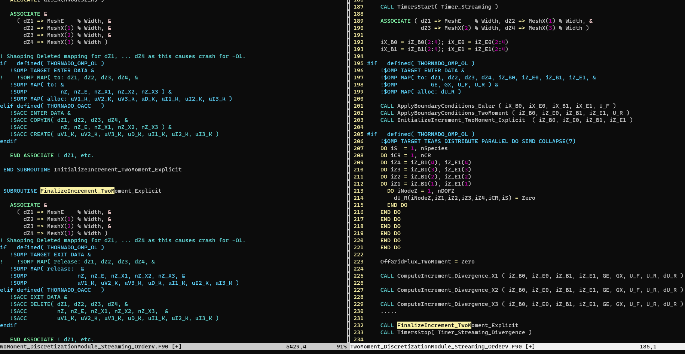
2. The SineWaveStreaming now run with the nightly-compile/2022.07.01 for all -O#, and the results are all correct. The make and outlog are in the format of make.ifx.07July2022.O#, and output.07July2022.O#. The files are added to the repository. 
3. The SineWaveStreaming now runs with the nightly-compile/2022.07.01 for -O1, -O2, -O3 on ATS1 with correct results. But segmentation fault with -O0, and here is debugging information:
  <pre>

  Target LEVEL0 RTL (pid:113439)  --> Created a command queue 0x000000000bc5e140 (Ordinal: 0, Index: 0) for device 0.
  Target LEVEL0 RTL (pid:113439)  --> Initialized Level0 device 0
  Libomptarget (pid:113439)  --> Device 0 is ready to use.
  Target LEVEL0 RTL (pid:113439)  --> Device 0: Loading binary from 0x0000000000b724d0
  Target LEVEL0 RTL (pid:113439)  --> Expecting to have 502 entries defined
  Target LEVEL0 RTL (pid:113439)  --> Base L0 module compilation options: -cl-std=CL2.0
  Target LEVEL0 RTL (pid:113439)  --> Found a single section in the image
  Target LEVEL0 RTL (pid:113439)  --> ZE_CALLER: zeModuleCreate ( Context, Device, &ModuleDesc, &Module, &BuildLog )
  ./run.anl.active.sh: line 57: 113439 Segmentation fault      (core dumped) ./ApplicationDriver_beacon_intel
  </pre>
   nightly-compile/2022.07.05 also seg fault with -O0. 

4. Tested the reproducer of CMPLRLLVM-36450 with nightly-compile/2022.07.01. The code compiles and runs without crash. but the result for the -O0 is not right, as the array are zeros even after it is assigned to some nonzero values. For higher optimization, such -O1 and above, the results are fine. 

5. Run the Relaxation code, but got NaNs. Further debugging shows NaNa appear in `ComputeTemperatureFromSpecificInternalEnergy_TABLE_Vector` of `Modules/EquationOfState/EquationOfStateModule_TABLE.F90`. Here is the stack of the debug:
   <pre>

     (gdb) where
     #0  equationofstatemodule_table::computetemperaturefromspecificinternalenergy_table_vector (d=0x1554f756b8c0, e=0x1554f7543c20, y=0x1554f7543c10, t=<optimized out>, guess_option=<optimized out>,
         error_option=<error reading variable: Location address is not set.>) at /localdisk/quanshao/ExaStar/thornado/Modules/EquationOfState/EquationOfStateModule_TABLE.F90:684
     #1  0x0000000000819bd8 in twomoment_neutrinomattersolvermodule_orderv::updatetemperature_packed (d=..., e=..., y=..., t=..., mask=..., nx_p=<optimized out>, packindex=..., unpackindex=...)
         at ../TwoMoment_NeutrinoMatterSolverModule_OrderV.F90:1790
     #2  0x00000000007f8d81 in twomoment_neutrinomattersolvermodule_orderv::solveneutrinomattercoupling_fp_nested_aa (dt=<optimized out>, j=..., h_u_1=..., h_u_2=..., h_u_3=..., v_u_1=..., v_u_2=..., v_u_3=...,
         d=..., t=..., y=..., e=..., gm_dd_11=..., gm_dd_22=..., gm_dd_33=..., niterations_inner=..., niterations_outer=...) at ../TwoMoment_NeutrinoMatterSolverModule_OrderV.F90:1207
     #3  0x00000000007cfe96 in twomoment_discretizationmodule_collisions_neutrinos_orderv::computeincrement_twomoment_implicit (iz_b0=..., iz_e0=..., iz_b1=..., iz_e1=..., dt=29.979245800000001, ge=..., gx=...,
         u_f=..., du_f=..., u_r=..., du_r=..., udr_option=...) at ../TwoMoment_DiscretizationModule_Collisions_Neutrinos_OrderV.F90:217
     #4  0x0000000000837d5e in twomoment_timesteppingmodule_orderv::update_imex_rk (dt=<optimized out>, ge=..., gx=..., u=..., m=..., computeincrement_twomoment_implicit=<optimized out>, solvegravity=0x0)
         at ../TwoMoment_TimeSteppingModule_OrderV.F90:303
     #5  0x000000000084cf89 in applicationdriver_neutrinos () at ../ApplicationDriver_Neutrinos.F90:313
   </pre>

 The screem output is 
   <pre>
 EEEE          11           1
 BBBB  0.000000000000000E+000   4.81713100399459        3.00534867070193
   2.37382155133154
 BB00  7.424713824045796E-031  1.000000000000000E-002  8.261108252506631E-052
  7.424713824045796E-031

   wlEOSInversionModule ERROR: NAN in Argument(s)

 22EEEE          11           1
 22BBBB  7.662304666415259E-013                     NaN                     NaN
   2.37382155133154
   </pre>

   For the code:
   ```
      668     print*, "EEEE", Error, nP
      669     print*, "BBBB", D, E, Y, T
      670     print*, "BB00", Gram, Centimeter, Erg, Gram
      671     IF ( ANY( Error > 0 ) ) THEN
      672       DO iP = 1, nP
      673         IF ( Error(iP) > 0 ) THEN
      674           CALL DescribeEOSInversionError( Error(iP) )
      675 #if defined(THORNADO_OMP_OL)
      676           !$OMP TARGET UPDATE FROM &
      677           !$OMP ( D(iP), E(iP), Y(iP) )
      678 #elif defined(THORNADO_OACC)
      679           !$ACC UPDATE HOST &
      680           !$ACC ( D(iP), E(iP), Y(iP) )
      681 #endif
      682     print*, "22EEEE", Error, nP
      683     print*, "22BBBB", D, E, Y, T
      684     print*, "22BB00", Gram, Centimeter, Erg, Gram
      685           D_P = D(iP) / ( Gram / Centimeter**3 )
      686           E_P = E(iP) / ( Erg / Gram )
      687           Y_P = Y(iP)
      688           WRITE(*,*)                 '[ComputeTemperatureFromSpecificInternalEnergy_TABLE_Vector] Error'
      689           WRITE(*,'(a,i5,3es23.15)') '  iP, D, E, Y : ', iP, D_P, E_P, Y_P
      690         END IF
      691       END DO
      692       STOP
      693     END IF
   ```


## July 6 2022
1. Combined compilation and run scripts into one buildRun.\*.sh.  This leads to much easier in making changes to modules loaded and other enviromental variables and in maintain consistence between the build and run. By default the script build and then run the application,i.e. without any options added. One can add -[rR]\* to just run the application, or -[bB]\* to just build application, or any other option to build and run the application. Forexample: `./buildRun.sineWave.sh -rudlfj;alkd`, or `./buildRun.sineWave.sh -Radfadef` will just run the application. 
2. Created a reproducer which can replicate crash of "Pointer is not mapped but section extends into already mapped data", but the reproducer is still large with two files. Will further reduce the reproducer. The other issues is the reproducer also crashes for -O1,-O2, -O3, but not -O0.
3. The main problem is that dZ# are mapped to GPU in `InitializeIncrement_TwoMoment_Explicit`, but only released in `FinalizeIncrement_TwoMoment_Explicit`, and between these two calls dZ# are also mapped to GPU by `ComputeIncrement_Divergence_X1` of `SandBox/TwoMoment_OrderV/TwoMoment_DiscretizationModule_Streaming_OrderV.F90`. . . . . . . . Will have more information tomorrow.

## July 5 2022
1. Thornado ApplicationDriver_Neutrinos AOT compiled successfully with -O0. But runs with NaNs and exit
   <pre>

      Evolving from t = 0.00E+00 to t = 1.00E+02

        Cycle = 00000001  t = 0.000000E+00 dt = 1.000000E-04

   wlEOSInversionModule ERROR: NAN in Argument(s)

 [ComputeTemperatureFromSpecificInternalEnergy_TABLE_Vector] Error
  iP, D, E, Y :     1  1.032000000000000E+12                    NaN                    NaN
Trace location: /localdisk/quanshao/lttng-traces/iprof-20220705-093943

API calls | 1 Hostnames | 1 Processes | 1 Threads |

                               Name |     Time | Time(%) | Calls |  Average |      Min |      Max | Error |
                     zeModuleCreate |    2.14s |  44.81% |    11 | 194.10ms |  95.06ms | 748.92ms |     0 |
                     zeKernelCreate | 750.44ms |  15.75% |   544 |   1.38ms |    918ns |  14.48ms |     0 |

   </pre>
2. Tested nightly-compiler/2022.07.01, the sineWaveStreaming AOT compiles and runs for -O0, -O2, and -O3, but for -O1, the code AOT compiles, but run failed the same. 
3. Tried to have a reproducer for "explicit extension not allowed", but did not replicate the issue. Found a post online related to this error: https://lists.llvm.org/pipermail/openmp-dev/2020-October/003692.html
4. Using  LIBOMPTARGET_DEBUG=1 , we see more detailed information:
   <pre>

    Libomptarget --> Entry  9: Base=0x0000149a7d0e5740, Begin=0x0000149a7d0e5740, Size=12582912, Type=0x0, Name=heap_array_descr.2.addr_a0$190_fetch.766
    Libomptarget --> Entry 10: Base=0x0000149a7dde6700, Begin=0x0000149a7dde6700, Size=12582912, Type=0x0, Name=heap_array_descr.1.addr_a0$76_fetch.742
    Libomptarget --> Entry 11: Base=0x00007ffe6f4f9918, Begin=0x00007ffe6f4f9918, Size=72, Type=0x0, Name=twomoment_discretizationmodule_streaming_orderv_mp_computeincrement_divergence_x1_$DZ1$_64
    Libomptarget --> Entry 12: Base=0x00007ffe6f4f9918, Begin=0x0000149ab402bbe0, Size=80, Type=0xc000000000011, Name=twomoment_discretizationmodule_streaming_orderv_mp_computeincrement_divergence_x1_$DZ1$_64_addr_a0
    Libomptarget --> Entry 13: Base=0x00007ffe6f4f9918, Begin=0x00007ffe6f4f9920, Size=64, Type=0xc000000000001, Name=twomoment_discretizationmodule_streaming_orderv_mp_computeincrement_divergence_x1_$DZ1$_64_dv_len
    Libomptarget --> Entry 14: Base=0x00007ffe6f4f98d0, Begin=0x00007ffe6f4f98d0, Size=72, Type=0x0, Name=twomoment_discretizationmodule_streaming_orderv_mp_computeincrement_divergence_x1_$DZ3$_64
        ....
    Libomptarget --> Looking up mapping(HstPtrBegin=0x00007ffe6f4f9918, Size=72)...
    Libomptarget --> WARNING: Pointer is not mapped but section extends into already mapped data
    Libomptarget message: explicit extension not allowed: host address specified is 0x00007ffe6f4f9918 (72 bytes), but device allocation maps to host at 0x00007ffe6f4f9938 (72 bytes)
    Libomptarget --> Call to getTargetPointer returned null pointer (device failure or illegal mapping).    
   </pre>

# ms68-daily based on master is ready 

# [:heavy_check_mark:] ms68-daily based on oneMKL -- will be working on ms68 daily based on the latest master from https://github.com/endeve/thornado.git    
## July 01 2022
1. After a long investigation, Finally the Relaxation case is running. Here is the list of things changed from previous SineWaveStreaming. 
   * make ApplicationDriver_Neutrinos MICROPHYSICS=WEAKLIB
   * weaklib update from https://github.com/starkiller-astro/weaklib
   * weaklib_tables update from git clone https://code.ornl.gov/astro/weaklib-tables.git with `export https_proxy=http://proxy-us.intel.com:912`
   * link the following files to the "Executables" directory
   <pre>
      #!/bin/bash
        WEAKLIB_TABLES_DIR='/localdisk/quanshao/ExaStar/weaklib-tables'
        ln -s $WEAKLIB_TABLES_DIR/SFHo/LowRes/wl-Op-SFHo-15-25-50-E40-B85-AbEm.h5
        ln -s $WEAKLIB_TABLES_DIR/SFHo/LowRes/wl-Op-SFHo-15-25-50-E40-B85-Iso.h5
        ln -s $WEAKLIB_TABLES_DIR/SFHo/LowRes/wl-Op-SFHo-15-25-50-E40-B85-NES.h5
        ln -s $WEAKLIB_TABLES_DIR/SFHo/LowRes/wl-Op-SFHo-15-25-50-E40-B85-Pair.h5
        ln -s $WEAKLIB_TABLES_DIR/SFHo/LowRes/wl-Op-SFHo-15-25-50-E40-HR98-Brem.h5
        ln -s $WEAKLIB_TABLES_DIR/SFHo/LowRes/wl-EOS-SFHo-15-25-50.h5
   </pre>
     The last one was linked to a different name in the old SineWaveStreaming, i.e. `ln -s $WEAKLIB_TABLES_DIR/SFHo/LowRes/wl-EOS-SFHo-15-25-50.h5 EquationOfStateTable.h5`
2. Tried nightly-compile/2022.06.30 but got 
   <pre>
   ld: /soft/restricted/CNDA/sdk/2022.01.30.001/oneapi/mkl/20220404/mkl/lib/intel64//libmkl_sycl.so: undefined reference to `clReleaseKernel'
   ld: /soft/restricted/CNDA/sdk/2022.01.30.001/oneapi/mkl/20220404/mkl/lib/intel64//libmkl_sycl.so: undefined reference to `clGetCommandQueueInfo'
   ld: /soft/restricted/CNDA/sdk/2022.01.30.001/oneapi/mkl/20220404/mkl/lib/intel64//libmkl_sycl.so: undefined reference to `clReleaseContext'
   ld: /soft/restricted/CNDA/sdk/2022.01.30.001/oneapi/mkl/20220404/mkl/lib/intel64//libmkl_sycl.so: undefined reference to `clReleaseEvent'
   ld: /soft/restricted/CNDA/sdk/2022.01.30.001/oneapi/mkl/20220404/mkl/lib/intel64//libmkl_sycl.so: undefined reference to `clEnqueueSVMUnmap'
  </pre>
    
     Marcus suggested to add `-lOpenCL` in the link line. This solves the issue. After talking to MKL and/or compiler team it seems that "MKL states they always recommends passing in -lOpenCL at link time, so going forward make sure your codes do that. They do not test without explicitly linking it."
     So `-lOpenCL` always for MKL 
3. The SineWaveStreaming case now works with nightly-compiler/2022.06.30 for -O0, -O2, and -O3, but fails with -O1 for running with the following message:
   <pre>
      Libomptarget message: explicit extension not allowed: host address specified is 0x00007ffd34a188a8 (72 bytes), but device allocation maps to host at 0x00007ffd34a188c8 (72 bytes)
      Libomptarget error: Call to getTargetPointer returned null pointer (device failure or illegal mapping).
      Libomptarget error: Run with
      Libomptarget error: LIBOMPTARGET_DEBUG=1 to display basic debug information.
      Libomptarget error: LIBOMPTARGET_DEBUG=2 to display calls to the compute runtime.
      Libomptarget error: LIBOMPTARGET_INFO=4 to dump host-target pointer mappings.
      Libomptarget error: Source location information not present. Compile with -g or -gline-tables-only.
      Libomptarget fatal error 1: failure of target construct while offloading is mandatory
      forrtl: error (76): Abort trap signal
      Image              PC                Routine            Line        Source
      libpthread-2.31.s  000014E2CF12AF80  Unknown               Unknown  Unknown
      libc-2.31.so       000014E2CED7C18B  gsignal               Unknown  Unknown
      
   </pre>
   will try to figure out why and may be a JIRA.

     
## June 30 2022   
1. The relaxation application runs, but with NaNs for both CPU and GPU runs.  gdb show Y in the code is zero and it is in the denom.
2. Discussed with Eirik Endeve at ORNL, Two things are missing 1) compile option, i.e. make ApplicationDriver_Neutrinos MICROPHYSICS=WEAKLIB 2) weaklib_table needs to be updated from git clone https://code.ornl.gov/astro/weaklib-tables.git, but got request denied error message. Talked to Chris, he suggested to `export https_proxy=http://proxy-us.intel.com:912` as By default we use proxy-chain as our https proxy so that you can access internal websites as well as external ones. This appears to have trouble with this particular git repo.
3. After export the above variable, git clone runs, and with the following message:
  <pre>
        Encountered 6 file(s) that should have been pointers, but weren't:
        LS220/HighRes/wl-EOS-LS220-20-40-100.h5
        LS220/HighRes/wl-EOS-LS220-25-50-100.h5
        LS220/HighRes/wl-EOS-LSwBCK-20-40-100.h5
        SFHo/HighRes/wl-EOS-SFHo-25-50-100-Standard.h5
        SFHo/HighRes/wl-EOS-SFHo-25-50-100.h5
        SFHx/wl-EOS-SFHx-25-50-100.h5
  </pre>
4. Now I got errors related to HDF5 as
<pre>
HDF5-DIAG: Error detected in HDF5 (1.10.7) MPI-process 0:
  #000: H5D.c line 286 in H5Dopen2(): not a location
    major: Invalid arguments to routine
    minor: Inappropriate type
  #001: H5Gloc.c line 244 in H5G_loc(): invalid location ID
    major: Invalid arguments to routine
    minor: Bad value

</pre>

## June 29 2022
1. Merged my local ms68 branch with the latest master branch in  https://github.com/endeve/thornado.git
2. run the SineWaveStreaming application but found a lot of differences. Talked to Eirik, and he believe the new code results are correct.
<pre>
My email: 
                                Merged with master                    ms68-lab-oneMKL
           Time                   4m12s                                      2m24s
  Radiation Fields, nSpecies        6                                         1
  Simple Opacities, nSpecies        6                                         1
  Neutrino Lepton Num Interior  -1.23984741E-014                 2.30383461E+000

Can you please let me know whether these differences are expected? If yes, what are the changes leading to the differences.

I think these changes are as expected.
The increase in time is because you are evolving more equations (1 versus 6 species).
The difference in lepton number is because when nSpecies > 1, the neutrino lepton number is defined as a difference in density between the first and second specie.  Since the density of the first two species is the same for this problem, the lepton number should be zero.

Best wishes,
Eirik
</pre>

3. Tried to compile Relexation application but got :
<pre>
../TwoMoment_PositivityLimiterModule_OrderV.F90(51): error #6580: Name in only-list does not exist or is not accessible.   [NDR]
    nDR, iDR_PL_Theta_1, iDR_PL_Theta_2, iDR_PL_dEnergy
----^
../TwoMoment_PositivityLimiterModule_OrderV.F90(51): error #6580: Name in only-list does not exist or is not accessible.   [IDR_PL_THETA_1]
    nDR, iDR_PL_Theta_1, iDR_PL_Theta_2, iDR_PL_dEnergy
---------^
</pre>
      The cause of this is that we should `export THORNADO_DIR=/localdisk/quanshao/ExaStar/thornado-lab` not `export THORNADO_DIR=/localdisk/quanshao/ExaStar/thornado-lab`. Basically it was a copy-paste problem.

4. The current code is located at: /localdisk/quanshao/ExaStar/thornado-lab on pvc12.
## June 28 2022
1. The relaxation app in thornado gives NaN for both CPU and GPU runs. Send an email to nations labs' contacts. Waiting for their reply. 
2. Because the !$OMP TARGET VARIANT DISPATCH does not compile, I cannot verify the fix for array assignment works or not for thornado. Started again to investigating why high opertimization gives NaNs. 
3. Validate the fix for JIRA https://jira.devtools.intel.com/browse/CMPLRLLVM-38330 works.


## June 27 2022
1. The problem related to `target variant dispatch` is still in nightly-compiler/2022.06.26, i.e.  Intel(R) Fortran 22.0-1725, while it is said the fix has been merged into  [22-1715] on 23-Jun-2022. Reported this to Marcus, and he said he will talk to Francesca.
2. I run the reproducer of https://jira.devtools.intel.com/browse/CMPLRLLVM-36450 using the latest nightly-compiler/2022.06.26, and the reproducer runs fine and the results are correct. Tried to compile Thornado with the nightly but found the issue reported in the previous item. 

## June 24 2022
1. Dahai Guo tried ms68-lab branch and found the code crashed, and here is his error message:

    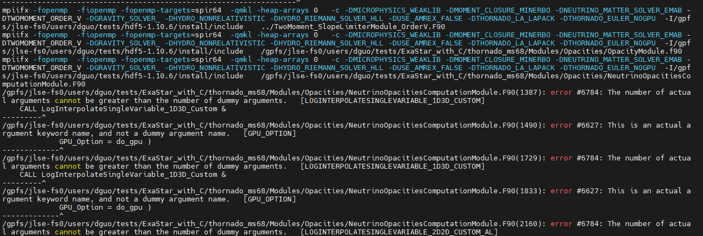

2. Worked with him and found out he did not follow the instruction in README.md. He used "Makefile_jlse_intel" instead of "Makefile_beacon_intel", did not link thing correctly, did not mkdir Output, ... etc..After he corrected all the errors in the procedure, the code runs and produced the same result as mine. He also said that mpiifx also works with the code.  I was always using mpiifort form Mingjie. 

3. `nightly-compiler/2022.06.23` still has the following compilaton errors:
  <pre>

   /localdisk/quanshao/ExaStar/thornado/Modules/Library/LinearAlgebraModule.F90(430): error #5533: Feature found on this line is not yet supported in ifx
   !$OMP END TARGET VARIANT DISPATCH
------^
  </pre>
   will using 06.10 nightly.
4. With inlining of `EddingtonTensorComponents_dd` into `ComputeConserved_TwoMoment`, ` FluxFactor` and `EddingtonFactor` into `Flux_X1`, `Flux_X2`, and `Flux_X3` in SandBox/TwoMoment_OrderV/TwoMoment_UtilitiesModule_OrderV.F90, NaNs disappear in the first time call of `ComputeIncrement_Divergence_X1`, X2, X3 in my screen output. But NaNs reappear when they are call the second time.   
   <pre>
      dU_RX333 8.09762e-06 0
      dU_RX333 5.14289e-07 0
      dU_RX333 -1.50463e-36 0
      dU_RX333 -2.25695e-36 0
      dU_RX333 -9.40395e-38 0
      dU_RX333 -1.88079e-37 0
      dU_RX333 1.50463e-36 0
       X1 Call Count           2
      FluxX1Q nan nan
      FluxX1Q nan nan
      FluxX1Q nan nan
      FluxX1Q nan nan
      FluxX1Q nan nan
   </pre>
   Doing printing to see where NaNs come from

                                                                                       

## June 23 2022
1. Started working on "Relaxation" problem.
2. The changes are small, only in build.anl.sh and run.anl.sh. Change the make option and the executable names.
3. Send an email to contacts in the national labs ask to confirm what I am planning to do.
4. Did a first run and found out there are NaNs in the tally output. 

## June 21-22 2022
1.  The compiler has the warning of "warning: <unknown>:0:0: "parallel loop' construct, in a declare target function, was ignored for calls from target regions." 
  ```
  SUBROUTINE ComputePointValuesZ_Single( U_Q, U_P )
    !$OMP DECLARE TARGET
    REAL(DP), INTENT(in)  :: U_Q(nDOFZ), U_P(nPT_Z)
    REAL(DP) :: SUM1
    INTEGER  :: iNodeZ, iP_Z

    !$OMP PARALLEL DO &
    !$OMP PRIVATE( SUM1 )
    DO iP_Z = 1, nPT_Z
      SUM1 = Zero
       DO iNodeZ = 1, nDOFZ
          ....
       END DO
    END DO   
  ```

2. Compiled Thornado with the latest nightlies, and found that staring from nightly-compiler/2022.06.16, the compile fails with the following error message:
  <pre>
    error #5533: Feature found on this line is not yet supported in ifx
  </pre>
  and the related code is 
 
  ```
    REAL(DP), DIMENSION(lda,*), TARGET :: a
    REAL(DP), DIMENSION(ldb,*), TARGET :: b
    REAL(DP), DIMENSION(ldc,*), TARGET :: c

      !$OMP TARGET VARIANT DISPATCH USE_DEVICE_PTR( a, b, c )
      CALL DGEMM &
             ( transa, transb, m, n, k, alpha, a, lda, b, ldb, beta, c, ldc )
      !$OMP END TARGET VARIANT DISPATCH   

  ```
  Discussed with Xin, her code also has the same directive, but the variables are allocatable arrays, and her code compiles fine. Then discussed with Brian, he has a small reproducer and he said he will file a JIRA. 

3. Discussed with National lab's scientists, they would like to start the "Relaxing" app, and I asked them to send me the details by email.

4. Investigated `USE_DEVICE_PTR` and find out that in new openMP this is no longer necessary. The dirctive is `!$OMP TARGET DISPATCH`.
5. Reading https://www.intel.com/content/www/us/en/develop/documentation/oneapi-gpu-optimization-guide/top.html to  learn more about GPU optimization. 
6. Discussed with Jeff, Marcus and Brian about the new application of Thornado 'Relaxation'. 

## June 17 2022
1. Discussed with Lorri about CMPLRLLVM-38396 as she did not see the issue I did. Finally, we found out that she is using a newer ifx, which includes the fix of https://jira.devtools.intel.com/browse/CMPLRLLVM-38328
2. Further digging of the releated JIRA and found that https://jira.devtools.intel.com/browse/CMPLRLLVM-38330 report similar issue I was debugging in last few days. Run the reproducer in the JIRA with -O0, which gives the right results, with higher optimization, i.e. -O1 and above, gives zeros. This is what I saw in `./SandBox/TwoMoment_OrderV/TwoMoment_DiscretizationModule_Streaming_OrderV.F90` for variable `uCR_X1_L` after `CALL ComputeConserved_TwoMoment`, similar things happen for `uCR_X1_R`. Added labels related to Thornado and A21 to the JIRA.
3. As there is a JIRA, work around like manually inline the call to `EddingtonTensorComponents_dd` into `ComputeConserved_TwoMoment` should be tried. 
4. Found a JIRA which cloud be related to https://jira.devtools.intel.com/browse/CMPLRLLVM-38247, i.e. https://jira.devtools.intel.com/browse/CMPLRLLVM-38328
5. inlining of `EddingtonTensorComponents_dd` into `ComputeConserved_TwoMoment` did not remove NaNs. So there are some other places which also lead to NaNs. 

## June 16 2022
1. Showed the reproducer to Brian, and he asked for other systems, such as ATS and Gen9. Tested the reproducer on these two systems, same issues were found. So submitted a jira, and here is the link: https://jira.devtools.intel.com/browse/CMPLRLLVM-38396
2. Learned that Gen9 system is an integrated system. so /sbin/lspcis |grep Display will show nothing. -Xcore-AVX## is for CPU only. gojira, schewa, nucs are all Gen9 machines.
3. The results are different after ComputeConserved_TwoMoment, and here are the src code and the result comparison. 

   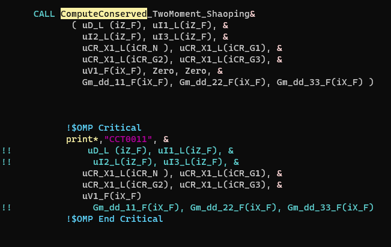
   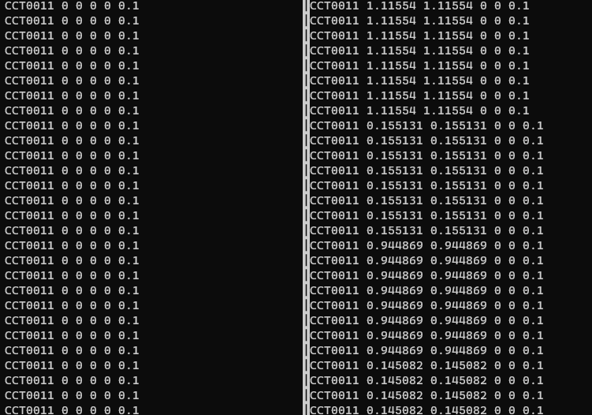

4. The reason for the print not work and wrong values might be the function/subroutine calls of EddingtonTensorComponents_dd. I have rewrite the function to a subroutine, but it did not help `CALL EddingtonTensorComponents_dd_Shaoping( D, I_u_1, I_u_2, I_u_3, Gm_dd_11, Gm_dd_22, Gm_dd_33, k_dd )` 

## June 15 2022
1. Found out that print does not work for nested kernals and discussed this with Brian. It seems the compiler team does not know of anything that prevent print from working for offloading in nested kernels. 
2. Created a small reproducer that can replicate the issue. print works if -O0 is used by we get some (null) after strings, for -O1 and above, no print in the nested kernels.

## June 14 2022
1. Continue debugging NaNs when O2 is used.
    NumericalFlux,  uCR_X1_L(iCR), uCR_X1_R(iCR) are either infs or nans starting the first call of SUBR ComputeIncrement_Divergence_X1.Here is the code and the output.
     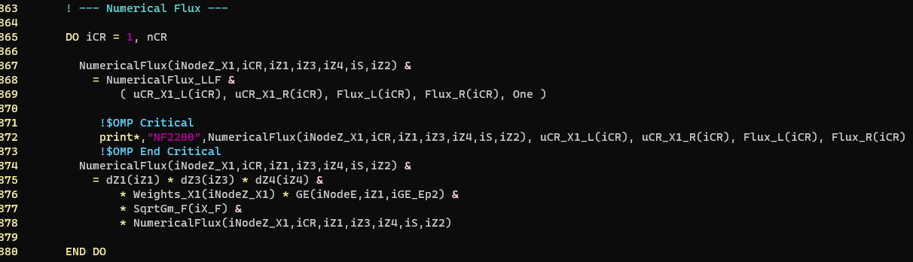
     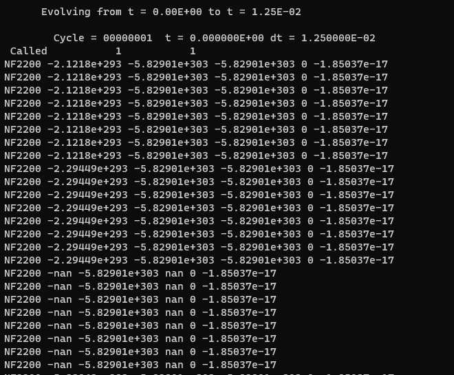
2. The value, i.e. the screen output seems to be random, and this is might be the beauty of OpenMP.
3. It seems to me that print statement does not print anything inside FUNCTION Flux_X1 of ./SandBox/TwoMoment_OrderV/TwoMoment_UtilitiesModule_OrderV.F90. Need further debugging. 2. The value, i.e. the screen output seems to be random, and this is might be the beauty of OpenMP.
3. It seems to me that print statement does not print anything inside FUNCTION Flux_X1 of ./SandBox/TwoMoment_OrderV/TwoMoment_UtilitiesModule_OrderV.F90. Need further debugging. 


## June 13-14 2022
1. Recreated a branch entitiled "ms68-lab-oneMKL" which is based on oneMKL committed on Thu Feb 24 11:29:26 2022 with a commit hash number of b19c9a4e1ac4204b4e5cd4526beddd851605f021.  Pushed to https://github.com/endeve/thornado repo.   
2. Thornado got Nans when it is compiled with -O2 (-O1, -O3). Here is the results:
   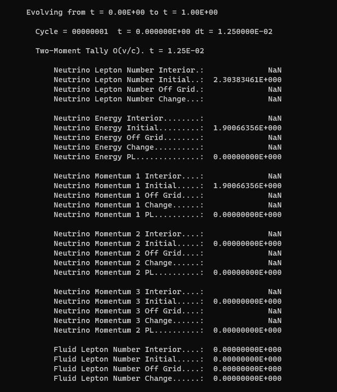

3. Started to debug it using print. 

4. Correspondence of Arguments/Parameters:

   CALL ComputeTally                   ( iZ_B0, iZ_E0, iZ_B1, iZ_E1, t, uGE, uGF, uCF, uCR )
   SUBR ComputeTally                   ( iZ_B0, iZ_E0, iZ_B1, iZ_E1, Time, GE, GX, U, M )
   CALL ComputeFromConserved_TwoMoment ( iZ_B0, iZ_E0, iZ_B1, iZ_E1, uGF, uCF, uCR, uPR )
   SUBR ComputeFromConserved_TwoMoment ( iZ_B0, iZ_E0, iZ_B1, iZ_E1, GX, CF, CR, PR )
   CALL Update_IMEX_RK                 ( dt, uGE, uGF, uCF, uCR )
   SUBR Update_IMEX_RK                 ( dt, GE, GX, U, M )

   M is NaNs, As M==>uCR==>CR, CR should be NaNs in Sub ComputeFromConserved_TwoMoment.
   CR is NaNs in Sub ComputeFromConserved_TwoMoment, so M must be NaNs in Sub Update_IMEX_RK. So Mi must be NaNs in this SUBR as `CALL CopyArray( M, One, Mi )`. 
   Examining:
   
   CALL ComputeIncrement_TwoMoment_Explicit (iZ_B0, iZ_E0, iZ_B1, iZ_E1, GE, GX, Ui,  Mi,  StageData(iS) % dM_EX )
   SUBR ComputeIncrement_TwoMoment_Explicit (iZ_B0, iZ_E0, iZ_B1, iZ_E1, GE, GX, U_F, U_R, dU_R ) in ./SandBox/TwoMoment_OrderV/TwoMoment_DiscretizationModule_Streaming_OrderV.F90
   dU_R is already nans on line 313. 
   dU_X1 and some U_R are already nans on line 1104 of SUBR ComputeIncrement_Divergence_X1, while dU_R is still zero. But after adding nans, dU_R becomes nans
   before first usage of dU_X1 on line 930, i.e. before CALL MatrixMatrixMultiply on line 930,  there are some element of dU_X1 being nans. These infs and nans are happening for the second time the SUBR is called. 


## June 10 2022
1. Got ATS5 from Xin and tried run thornado on ATS5.     
   1.1 The code compiled and ran with `nightly-compiler/2022.06.08` and `neo/agama-prerelease/497-22.23.023414.11428-main`. But with the default UMD (i.e. `intel_compute_runtime/release/agama-prerelease-402`), the compilation crashed with an ocloc error.    
   1.2 The code compiled and ran with `oneapi/eng-compiler/2022.01.30.007` and `neo/agama-prerelease/497-22.23.023414.11428-main`, But with the default UMD (i.e. `intel_compute_runtime/release/agama-prerelease-438`), the compilation crashed with an ocloc error.      
  
   The results agreed, while eng-007 is slower than nightly0608 by 1.6min, i.e. 3.28min versus 1.69min for all the zeCALLS. The difference mainly comes from  zeCommandQueueSynchronize, i.e. 2.86min versus 1.28 min.     
   All the files are located /localdisk/quanshao/ExaStar/thornado/SandBox/TwoMoment_OrderV/Executables on ATS5.      
   So https://jira.devtools.intel.com/browse/CMPLRLLVM-37346 and https://jira.devtools.intel.com/browse/XDEPS-4077 are closed.       

**O2 compilation option for the following items**   
2. Inlined `EddingtonTensorComponents_dd` to `ComputeIncrement_FixedPoint_Richardson` subroutine of SandBox/TwoMoment_OrderV/TwoMoment_DiscretizationModule_Collisions_OrderV.F90 make the code compile in the first pass, but failed with   
<pre>
     error: Total size of kernel arguments exceeds limit! Total arguments size: 2392, limit: 2048
     in kernel: 'twomoment_positivitylimitermodule_mp_applypositivitylimiter_twomoment_'
     error: backend compiler failed build.
     
     error: Total size of kernel arguments exceeds limit! Total arguments size: 2120, limit: 2048
     in kernel: 'twomoment_positivitylimitermodule_orderv_mp_applypositivitylimiter_twomoment_'
     error: backend compiler failed build.
     
     error: Total size of kernel arguments exceeds limit! Total arguments size: 2392, limit: 2048
     in kernel: 'twomoment_positivitylimitermodule_mp_applypositivitylimiter_twomoment_'
     error: backend compiler failed build.
     
     error: Total size of kernel arguments exceeds limit! Total arguments size: 2120, limit: 2048
     in kernel: 'twomoment_positivitylimitermodule_orderv_mp_applypositivitylimiter_twomoment_'
     error: backend compiler failed build.
     
     Build failed with error code: -11
     Command was: ocloc -file /tmp/ifxspirvoutoloeGD -output_no_suffix -spirv_input -options "-cl-take-global-address -cl-match-sincospi" -device 0x0bd6 -revision_id 0x2f -output /tmp/ifxspirvoutKUwHmE
     ifx: error #10401: error running 'Offline Compiler'
     
</pre>
3. To solve this compilation failure, I searched the JIRA, and found that `export IGC_OverrideOCLMaxParamSize=4096` fixed the problem.

4. Now the code compiles, but I saw NaNs again. 

## June 9 2022
1. The ICE of SandBox/TwoMoment_OrderV/TwoMoment_DiscretizationModule_Collisions_OrderV.F90 cause ICE with -O2 compile option. 
<pre>
     #13 0x0000000001225d3e (/opt/exaperf/nightly/compiler/2022.06.08/linux/bin-llvm/xfortcom+0x1225d3e)
     #14 0x00007f285626f34d __libc_start_main (/lib64/libc.so.6+0x2534d)
     #15 0x0000000000ed2de9 (/opt/exaperf/nightly/compiler/2022.06.08/linux/bin-llvm/xfortcom+0xed2de9)
     
     /tmp/ifxA8wHY8.i90: error #5633: **Internal compiler error: segmentation violation signal raised** Please report this error along with the circumstances in which it occurred in a Software Problem Report.  Note: File and line given may not be explicit cause of this error.
     compilation aborted for ../TwoMoment_DiscretizationModule_Collisions_OrderV.F90 (code 3)
     make: *** [/localdisk/quanshao/ExaStar/thornado/Build/Makefile_Suffixes:6: TwoMoment_DiscretizationModule_Collisions_OrderV.o] Error 3

</pre>

2. Got a reproducer, and found out that the code ICEs if compiled with -O1 and above, and if SIMD COLLAPSE(2) is removed the code compiles. Submitted a JIRA and here is the link:https://jira.devtools.intel.com/browse/CMPLRLLVM-38247

## June 8 2022
1. Created a ms68-lab branch in `quanshao@exaperf-sdpcloud-pvc12:/localdisk/quanshao/ExaStar/thornado-lab`,and push the branch to https://github.com/endeve/thornado.git . Be noted that under this directory, two repositories are set up, one originIntel, and originLab. Please careful every time one pushes a branch about which repo is expected.
2. Git cloned the ms68-lab from  https://github.com/endeve/thornado.git and compiled and ran the code on JLSE machies. The code work on ats for eng005 on ats nodes, for eng005, 006, 007 for pvc nodes. The nodes tested are: arcticus09 and florentia01. the path is: /home/ac.squan/ExaStar/thornado-lab/.
3. Send an email to collaborators of National Labs regarding the branch and the tests asking them for the suggestions on my modifications in the code. 
4. SandBox/TwoMoment_OrderV/TwoMoment_DiscretizationModule_Collisions_OrderV.F90 cause ICE with -O2 compile option. Trying to get a reproducer. 

## June 7 2022

1. Commit the code with "ms68 working with agreed results"   
2. Thornado compiles and runs with -g option. The results are in agreement with the -O0 results.
3. vtune collection data are usually huge, i.e. greater than 1GB, so tar -cvzf is a better option for transfer the data to /nfs/site/home. The compression ratio is 8/1.4 ~= 6 for -g collection, 3.0/0.6~=5 for -O0, very large compression ratio, and is very benficial for moving the data around. One other reason is that there are a lot of files for the collection, so moving around 1 file is much efficient than transfering a number of files.
4. vtune collection failed using nightly-compiler/2022.06.03 with -g. The following is the error message:
   <pre>
   Cycle = 00000076  t = 9.375000E-01 dt = 1.250000E-02
   Abort was called at 74 line in file:
   /opt/src/build_l0_gpu_driver/BUILD/compute-runtime-1.3.022868.10913/shared/source/command_stream/linear_stream.h
   forrtl: error (76): Abort trap signal
   Image              PC                Routine            Line        Source
   pinbin             00001538C8E26D10  Unknown               Unknown  Unknown
   libc-2.31.so       000015383295518B  gsignal               Unknown  Unknown
   libc-2.31.so       0000153832956585  abort                 Unknown  Unknown
   libze_intel_gpu.s  00001538080E3FE9  Unknown               Unknown  Unknown
   libze_intel_gpu.s  00001538080E4070  Unknown               Unknown  Unknown
   libze_intel_gpu.s  00001538080EFFB3  Unknown               Unknown  Unknown
   libze_intel_gpu.s  0000153808424A6D  Unknown               Unknown  Unknown
   libze_intel_gpu.s  0000153808158CF6  Unknown               Unknown  Unknown
   libze_intel_gpu.s  00001538081731B9  Unknown               Unknown  Unknown
   libze_intel_gpu.s  000015380817A30C  Unknown               Unknown  Unknown
   libpi_level_zero.  000015364009C987  Unknown               Unknown  Unknown
   libpi_level_zero.  00001536400ACC5E  piEnqueueKernelLa     Unknown  Unknown
   libsycl.so.5.6.0-  000015386105AB6F  Unknown               Unknown  Unknown
   libsycl.so.5.6.0-  0000153861059F2E  Unknown               Unknown  Unknown
   libsycl.so.5.6.0-  00001538610A6CAC  Unknown               Unknown  Unknown
   libsycl.so.5.6.0-  00001538610A1BFC  _ZN2cl4sycl7handl     Unknown  Unknown
   libsycl.so.5.6.0-  00001538610D19CC  Unknown               Unknown  Unknown
   libsycl.so.5.6.0-  00001538610D16BB  Unknown               Unknown  Unknown
   libsycl.so.5.6.0-  00001538610D0D74  Unknown               Unknown  Unknown
   libsycl.so.5.6.0-  00001538610D0D45  _ZN2cl4sycl5queue     Unknown  Unknown
   libmkl_sycl.so.2   00001538650B8158  _ZN6oneapi3mkl3gp     Unknown  Unknown
   libmkl_sycl.so.2   0000153863C0327C  _ZN6oneapi3mkl3gp     Unknown  Unknown
   libmkl_sycl.so.2   0000153863C01E7B  _ZN6oneapi3mkl3gp     Unknown  Unknown
   libmkl_sycl.so.2   0000153863C00F5F  _ZN6oneapi3mkl3gp     Unknown  Unknown
   libmkl_sycl.so.2   0000153863C042E2  _ZN6oneapi3mkl3gp     Unknown  Unknown
   libmkl_sycl.so.2   0000153863C0340C  _ZN6oneapi3mkl3gp     Unknown  Unknown
   libmkl_sycl.so.2   0000153863C08E2A  _ZN6oneapi3mkl3gp     Unknown  Unknown
   libmkl_sycl.so.2   0000153863EE7EB5  mkl_cblas_dgemm_o     Unknown  Unknown
   libmkl_sycl.so.2   00001538642D4DCA  mkl_blas_dgemm_om     Unknown  Unknown
   ApplicationDriver  000000000048079A  Unknown               Unknown  Unknown
   </pre>

5. Changing the umd from the default one (402) to the newest one (491) fixed the crash.          
6. -g collection reaches the limit of the "vtune: Warning: The specified data limit of 1000 MB is reached. Data collection is stopped.". Tried -ring-buffer 10, the collection crashed with "vcs/tpss2/tpss/src/tpss/runtime/linux/exe/tpss_deepbind.c:1427 getrlimit64: Assertion 'not implemented' failed.". So we stay with no -g collection. 
7. -g collection data reaches 8G and stopped collection before any interesting things happen. So stay with no -g collection.

## June 6 2022
1. tried to run vnc, but failed. .bashrc was also rewritten. 
2. Discussed with Erik, and he finally found out that by replacing old .config with the Gnome re-created $HOME/.config fixed the problem.
3. vncpasswd is used to set new vnc password.
4. Tested and found vnc is working. the test is done for Thornado runs. 

## June 3 2022
   
1. Run the application with vtune to get some more information about the code speed and memory usage, etc. 
2. Need to use the newest vtune from Marcus, i.e. 
  <pre>
   Until then, if you want to use Vtune on PVC, the workaround is to:

   1. Load your compiler/UMD env like normal
   2. source /sharedjf/mjh/tools/Intel_VTune_Profiler_2022.3.0_nda/env/vars.sh
   3. run your collection

   If for whatever reason you need a local copy of vtune - for instance to run a gui somewhere else, you can grab the gzip'd tarball at the below, untar it on your system, and source the same vars.sh script to get the right version of vtune (obviously the location of the script will be wherever you put it).

 /sharedjf/mjh/tools/Intel_VTune_Profiler_2022.3.0_nda_623565.tar.gz

  </pre>
         
 3. Copied the vtune results to /nfs/shared, but it takes hours, did not finish copying even after work. 
## June 2 2022

1. Tried compile and run Thornado on JLSE Machine (Florentia is a PVC A , i.e. "-device 0x0bd5 -revision_id 3"), also repeated runs on ats and pvc at Intel internal machines. Here is the summary:

  | Machine  |  2022.01.|30.005  | 2022.01.|30.006  | 2022.01.|30.007 
  | :----:   | :-----:          | :------:        | :-----: | :-----:          | :------:        | :-----: |
  |          | Tot Ze Time | Tot Sim Time | Tot Ze Time | Tot Sim Time | Tot Ze Time | Tot Sim Time
  |Florentia               |  1.21min |2m46.838s| 1.24min |2m40.960s| 3.42min | 4m56.644s|
  |Florentia MemPool 16-32 |  46.67s  |2m14.156s|  49.46s |2m20.418s|  48.53s | 2m17.350s|
  |Arcticus                |  2.22min |3m24.354s| Compile |Fails    | Compile |Fails     |
  |pvc12                   |  1.22min |2m43.817s|  1.31min|2m37.901s|  6.09min| 8m20.790s|
  |pvc12  MemPool 16-32    |  37.87s  |1m46.483s|  52.95s |1m59.894s|  50.93s | 1m57.203s|
  |ats6                    |  2.25min |3m30.579s| Compile |Fails    | Compile |Fails|

  File name pattern of the screen output is output.iprof.$MACHINE_NAME.$ENG_VERSION.$DATE[.mempool16-32], for example: output.iprof.florentia01.006.2June2022, and output.iprof.florentia01.007.2June2022.mempool16-32
  File name patter of the build is make.ifx.$MACHINE_NAME.$ENG_VERSION, such as make.ifx.arcticus15.007

2. Found “UseEnergyLimiter” is not initialized for the SineWaveStreaming case, but it is initialized for other cases.  However it is used on line 839-840 of SandBox/TwoMoment_OrderV/ApplicationDriver.F90. Send an email to Eirik, Austin, and Brice. 

## June 1 2022
1. Tried module oneapi/eng-compiler/2022.01.30.006/7 on ats6, both of them failed in AOT compilation with an error message of "ifx: error #10105: ocloc: core dumped"
2. Tried module oneapi/eng-compiler/2022.01.30.005 on ats6, the code compiled and ran with no errors. -g option is also working. 
3. Comparing the result of Thornado from ats6, pvc12,  and arcticus09.    
   it is noticed that 1) the physical results for the three runs are identical; 2) ats6 and arcticus09 show the similar time, and this is expected as these are supposed to be the same systems; 3) pvc12 runs are faster by 40% for all the level 0 calls. PVCs are supposed to be faster than ATSs. The main slown down is zeCommandQueueSynchronize which takes 1.6 min on ATS, but only 13.18s on PVC.

   a) result comparison between runs on arcticus09 and ats6
   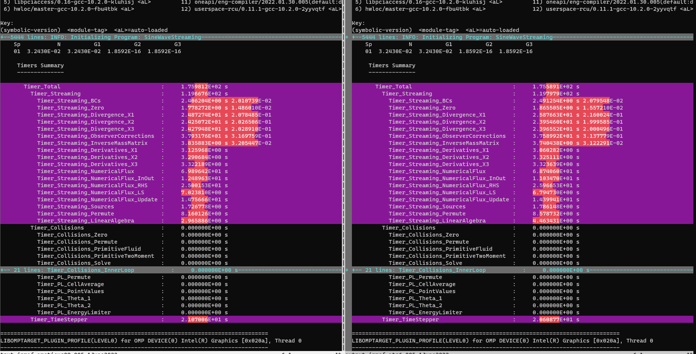
   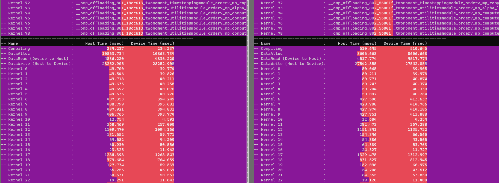
   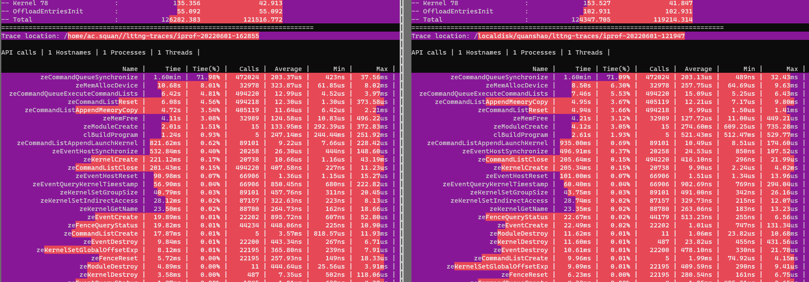
   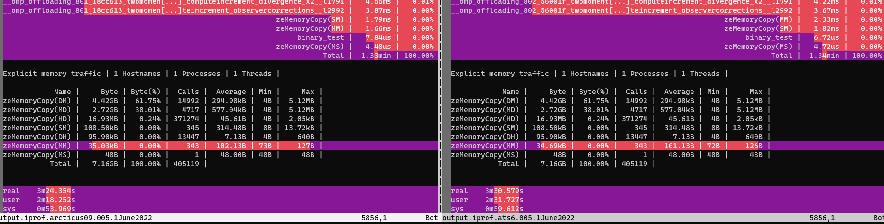

   b) result comparison between runs on arcticus09 and pvc12
   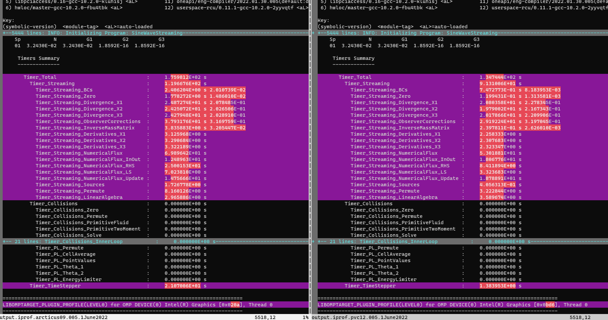
   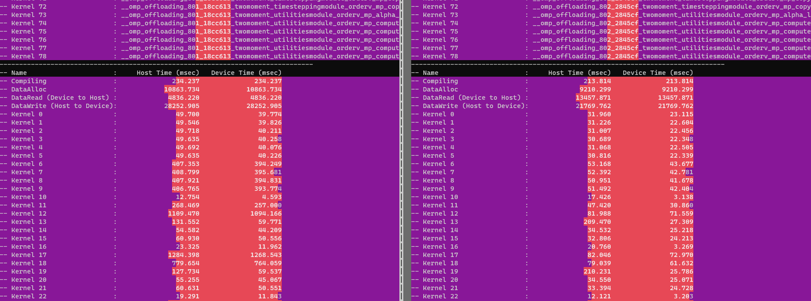
   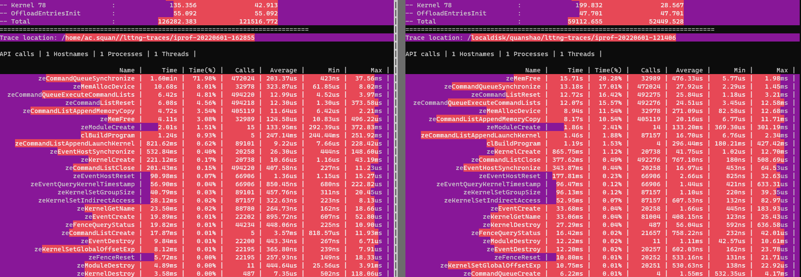
   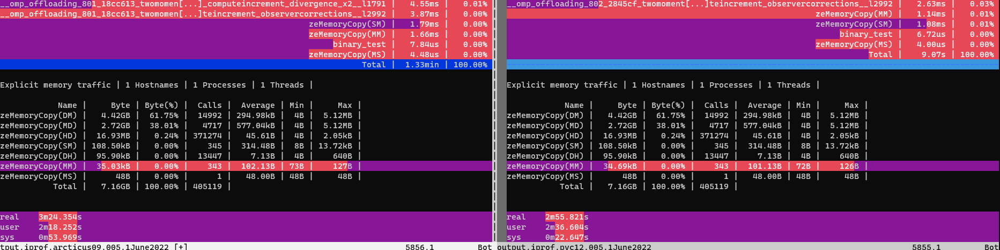


## May 31 2022
1. Debugging "Abort(1): In MPIR_Free_contextid, the context id is not in use (Internal MPI error!)" error. The error appears inside the FinalizeProgramm. When MPI__FINALIZE( mpierr ) is placed right after InitializeProgram(), we got the same error. So it is something inside this subroutine messed up MPI_INIT and MPI_FINALIZE.
2. It is something inside InitializedDevice causes the crash. The issue is that `ndevice` is not set for the option of THORNADO_GPU being set, thus `ndevice =0` or uninitialized. Thus the current fix is to initialize `ndevice` to 1 for THORNADO_GPU. The test found this fix works.
3. Run Thornado on arcticus13 using oneapi/eng-compiler/2022.01.30.005, the code ran fine. But hangs on florentia01 which is believed to be a PVC node. 
## May 25-26 2022

1. Set up the ifort runs of Thornado code on pvc12, and here is the path: /localdisk/quanshao/ExaStar/thornado-ifort
2. Tested the reproducer of CMPLRLLVM-37746 with the new nightly compilers, and found out that starting nightly 0520, i.e. Intel(R) Fortran 22.0-1635, the reproducer compiles. Added a comment to the JIRA issue. 
3. Write a report to Brian about the zeMemFree and zeMemAllocDevice changes from 0413 and 0414 nightly and later. 
4. Fixed a data transfer from GPU to CPU bug. Now errors for GPU and CPU runs are very close. 

    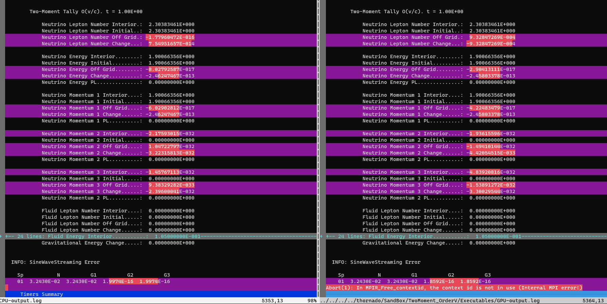

5. Modules/Runtime/ProgramInitializationModule.f90  Shaoping :  "In MPIR_Free_contextid, the context id is not in use (Internal MPI error!)" is added to help figure out the issue in the future   
## May 24 2022
1. PVC09 is down. Move to PVC12. Updated the makefile for AOT compilation on PVC nodes. 
2. Ran default memory pool size for 0413 and 0414, and here are the time data  and comparision to those on pvc09 for  zeMemAllocDevice  calls. According to https://www.intel.com/content/www/us/en/develop/documentation/oneapi-dpcpp-cpp-compiler-dev-guide-and-reference/top/compilation/supported-environment-variables.html, the default is : all,1,4,256, i.e. Enables memory pool for all memory types which can allocate up to four 1MB blocks from a single block allocated from Level Zero with 256MB total pool size allowed.

 | Machine | Nightly Compiler    |  MemPool Opt. | Time     | Time(%)  |   Calls  |  Average |      Min |      Max | Total ze#  Time | Total Sim Time
 | :----:  | :-----:             | :------:      | :------: | :------: | :------: |  :----:  | :---:    |  :----:  |  :-------:      |  :-----: |
 | pvc12  | 0413 |Default|   7.84s |  10.55% |   32977 | 237.84us |  86.01us |  12.15ms | 1.24min | 2m31.902s | 
 | pvc12  | 0414 |Default| 1.50min |  24.70% |  221283 | 405.72us | 102.64us |  33.99ms | 6.06min | 8m14.794s |
 | pvc12  | 0413 |8-32   | 35.37ms |   0.07% |      17 |   2.08ms | 278.37us |  19.28ms | 50.44s  | 1m58.993s |
 | pvc12  | 0414 |8-32   | 80.58ms |   0.16% |      17 |   4.74ms | 257.02us |  65.41ms | 49.67s  | 1m58.312s |
 | pvc12  | 0413 |16-32  | 81.51ms |   0.16% |      17 |   4.79ms | 323.75us |  65.63ms | 49.53s  | 1m56.012s |
 | pvc12  | 0414 |16-32  | 80.33ms |   0.17% |      17 |   4.73ms | 236.30us |  65.59ms | 46.82s  | 1m55.164s |
 | pvc09  | 0413 |Default|  23.30s |  11.82% |   32977 | 706.62us | 334.72us |  10.19ms | 1.44min | 4m33.063s |
 | pvc09  | 0414 |Default| 2.77min |  28.98% |  221283 | 750.08us | 347.76us |  93.53ms | 9.55min | 11m53.364s|
 | pvc09  | 0413 |8-32   |159.61ms |   0.11% |      17 |   9.39ms | 695.84us |  91.27ms | 2.46min | 3m37.644s |
 | pvc09  | 0414 |8-32   |162.08ms |   0.12% |      17 |   9.53ms | 711.31us |  93.26ms | 2.34min | 3m30.972s |
 | pvc09  | 0414 |16-32  |159.01ms |   0.11% |      17 |   9.35ms | 618.91us |  91.13ms | 2.35min | 3m32.067s |
 |        |      |       | May 23  | 2022 |results
 | pvc09  | 0414 |8-32   | 90.51ms |   0.19% |      17 |   5.32ms | 281.06us |  75.10ms | 46.81s  | 1m54.419s |

 Will be using pvc12 onward. 

## May 23-24 2022
1. `LIBOMPTARGET_LEVEL0_MEMORY_POOL` effects on 0414 and 0413.  `export LIBOMPTARGET_LEVEL0_MEMORY_POOL=device,8,16`

  a) zeMemAllocDevice  calls for 0414. All the files have a name in the format of output.device-$Option and is located at `/localdisk/quanshao/ExaStar/thornado/SandBox/TwoMoment_OrderV/Executables` on pvc09. (C) means crashed. 

 | Option     |     Time | Time(%)  |   Calls  |  Average |      Min |      Max | Total ze#  Time | Total Sim Time
 | :------: | :------: | :------: | :------: | :------: |  :----:  | :---:    |  :----:         |  :-------: |
 |256-1024(C)|   28.80s |  85.44% |      26 |    1.11s | 342.08us |    8.17s | 33.71s | 1m21.804s|
 |256-512    |    7.27s |  12.25% |      32 | 227.17ms | 249.11us |    3.60s | 59.34s | 2m7.236s |
 |256-256    | 141.73ms |   0.28% |      17 |   8.34ms | 442.30us |  71.17ms | 49.96s | 1m58.881s|
 |256-128    | 108.68ms |   0.22% |      17 |   6.39ms | 211.77us |  71.12ms | 48.96s | 1m56.648s|
 |256-64     |  94.92ms |   0.20% |      17 |   5.58ms | 331.64us |  70.42ms | 47.51s | 1m56.160s|
 |256-32     |  87.98ms |   0.18% |      17 |   5.18ms | 240.66us |  73.97ms | 47.80s | 1m56.197s|
 |256-16     |  87.87ms |   0.19% |     180 | 488.19us | 144.31us |  34.58ms | 45.78s | 1m54.327s|
 |256-8      |  1.04min |  22.19% |  161920 | 386.07us |  94.99us |  67.78ms | 4.70min| 6m38.125s|
 |------|------|------|------|------|------|------|------|------| 
 |256-32     |  87.98ms |   0.18% |      17 |   5.18ms | 240.66us |  73.97ms | 47.80s | 1m56.197s|
 |8-32       |  90.51ms |   0.19% |      17 |   5.32ms | 281.06us |  75.10ms | 46.81s | 1m54.419s|
 |4-32       |  50.99ms |   0.11% |      24 |   2.12ms | 277.51us |  34.57ms | 48.44s | 1m55.634s|
 |2-32       |    1.58s |   2.97% |    4559 | 346.72us | 117.04us |  73.51ms | 53.20s | 2m1.845s |
 |1-32       |    4.61s |   7.51% |   16871 | 273.05us | 101.06us |  73.08ms | 1.02min| 2m10.429s|
 |------|------|------|------|------|------|------|------|------| 
 |512-16     | 118.07ms |   0.25% |     180 | 655.93us | 149.32us |  71.70ms | 47.45s | 1m55.163s|
 |256-16     |  87.87ms |   0.19% |     180 | 488.19us | 144.31us |  34.58ms | 45.78s | 1m54.327s|
 |64-16      | 120.27ms |   0.26% |     180 | 668.15us | 146.03us |  74.95ms | 46.39s | 1m52.659s|
 |32-16      | 101.75ms |   0.21% |     180 | 565.28us | 116.25us |  60.00ms | 47.94s | 1m55.896s|
 |16-16      |   21.03s |  16.89% |   54227 | 387.81us |  85.78us |  76.70ms | 2.07min| 3m28.914s|
 |8-16       |  1.52min |  24.05% |  235181 | 388.17us | 111.47us |  70.73ms | 6.33min| 8m39.223s|

 b) zeMemAllocDevice  calls for 0413. All the files have a name in the format of output.0413-device-$Option and is located at `/localdisk/quanshao/ExaStar/thornado/SandBox/TwoMoment_OrderV/Executables` on pvc09. 

 | Option     |     Time | Time(%)  |   Calls  |  Average |      Min |      Max | Total ze#  Time | Total Sim Time
 | :------: | :------: | :------: | :------: | :------: |  :----:  | :---:    |  :----:         |  :-------: |
 |32-16   | 123.56ms |   0.25% |     180 | 686.46us | 156.24us |  73.90ms | 49.93s |1m56.729s|
 |16-16   | 150.21ms |   0.29% |     254 | 591.40us | 136.34us |  53.56ms | 51.84s |2m1.278s |
 |8-16    | 694.92ms |   1.37% |    1961 | 354.37us |  72.73us |  58.23ms | 50.81s |1m57.851s|

2. Tried AOT compilation on PVC09, the following three options are working (i.e. the code compiles and runs): a) "-device 0x0bd5 -revision_id 4" b) "-device 0x0bd6 -revision_id 4" c)"-device 0x0bd6 -revision_id 0x2f". The speed of the runs are almost the same : 0m30.797s to 0m24.640s.  Discussed with Brian, c) is the right one as ` /sbin/lspci | grep Display` shows  `0bd6 (rev 2f)`. Will use "-device 0x0bd6 -revision_id 0x2f"

3. “ComputeFromConserved_TwoMoment” in  ./SandBox/TwoMoment_OrderV/TwoMoment_UtilitiesModule_OrderV.F90 is called on CPU by SandBox/TwoMoment_OrderV/ApplicationDriver.F90, and  it calls “ComputePrimitive_Euler_NonRelativistic” and “ComputePrimitive_TwoMoment” on CPU also. So the update of uPR should be done on CPU. But the two overloaded subroutines of “ComputePrimitive_Euler_NonRelativistic” are declared TARGET, And also “ComputePrimitive_TwoMoment_Scalar” has “!$OMP DECLARE TARGET”. This seems not right. Send an email to the collaborators at ORNL. Got an email back. It is Okay to do this way. 
4. Print out uPRs in ./SandBox/TwoMoment_OrderV/InitializationModule.F90, and saw all of them are zeros. Need to check if this is true. Line 2193


## May 20, 23-24 2022
1. tested nightly-compiler/2022.05.19, the crash still exists. 
2. Here are some more comparison between slow 0414 and fast 0413 runs. 
   (a) patternMatch.py gets zeMemAllocDevice from the output of runs with LIBOMPTARGET_DEBUG=4. (output.10.targetDebug4.fast, output.10.targetDebug4.slow)
    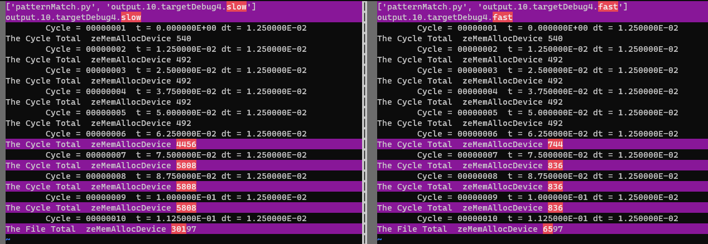
    we can see the number of zeMAD calls are different from cycle=6

    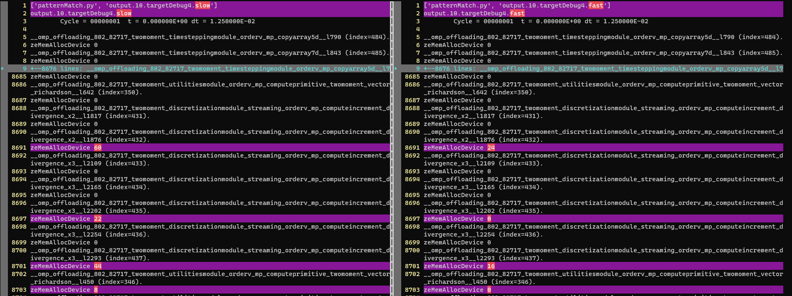
    The zeMAD call number is different starting from kernel : twomoment_discretizationmodule_streaming_orderv_mp_computeincrement_divergence_x2__l1876 

    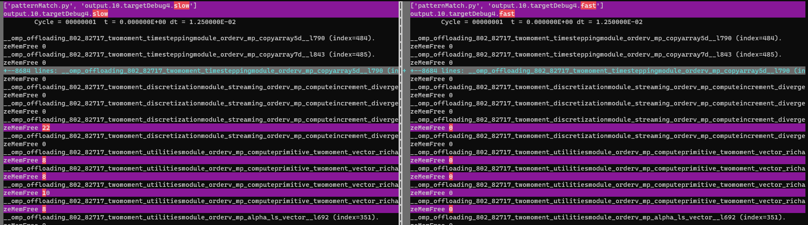
    we can see that zeMFree calls start being different from the kenerl: twomoment_discretizationmodule_streaming_orderv_mp_computeincrement_divergence_x3__l2254, line 8699, which says it zeMFree differences happen after the ones for zeMAD call. 

    Now let's take a look at the differences in the execution of computeincrement_divergence_x2__l1876 for the slow and fast. (x2__l1876.slow x2__l1876.fast)

    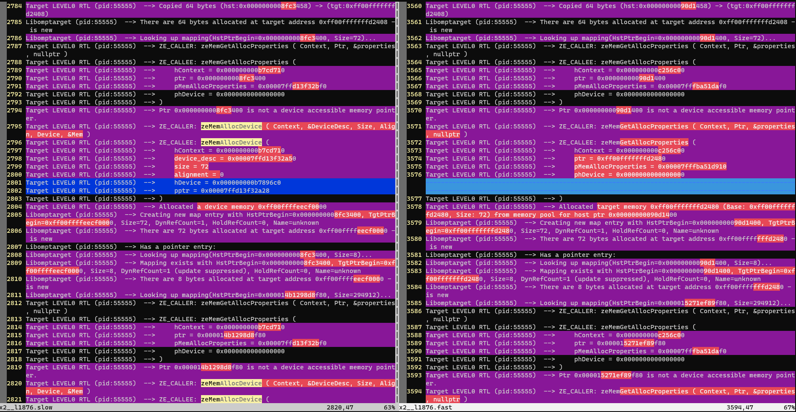
    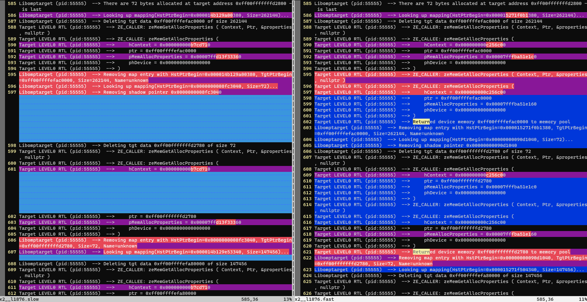

    We can clearly see that 0413, i.e. the fast one, uses the memory pool by "Returned device memory 0xff00ffffefac0000 to memory pool" and by issue one extra "zeMemGetAllocProperties" call to "Allocated target memory 0xff00fffffffd2480 (Base: 0xff00fffffffd2480, Size: 72) from memory pool for host ptr 0x00000000090d1400. However, after the first "zeMemGetAllocProperties", 0414 or the slow one calls  "zeMemAllocDevice"  because of " Ptr 0x0000000008fc3400 is not a device accessible memory pointer" (although both deem this memory is not device accessible).

    So, In conclusion, 0414 and later version does not use the memory pool by putting memory back and allocating new memory in the pool, while 0413 use both of strategies, and thus 0413 is faster than 0414 and later due to the fresh allocation of memory is very slow. 


## May 19 2022
1. Created output using `iprof -t`. Already had output using `iprof -l` for the slow and fast
2. comp_igc-16095 is not in neo/agama-prerelease/469-22.20.023154.11245-3main. Tested Thornado on ATS1 with this agama, the code crashed with the same error. (kmazurkiMazurkiewicz, Krzysztof added a comment - 29 minutes ago. Moving to Implemented per process as the changes are in. This is why the test is performed.)
3. Thornado compiles with an ICE using the newest nightly compiler  2022.05.18. Created a reproducer and submitted a JIRA issue: https://jira.devtools.intel.com/browse/CMPLRLLVM-37746. The ICE is causeb by a number of factors, such as simd, array assigment, if statements inside the do loop. The ICE appears for 1 out do loop and also multiple out do loops. The reproducer is ICE-nightlyCompiler-2022-05-18.f90 on pvc09 localdisk/sandbox. 

4. runs the slower and faster version with `iprof -t`, and  grep zeMemAllocDevice output.iprof-t.10.slow/fast.0414/0413 give: 30198 and 6598 of zeMemAllocDevice_exit and zeMemAllocDevice_entry. No "memory pool" was found in either of the files
5. Create a iprof-test.f90 in /localdisk/quanshao/sandbox on pvc09 to reproduce the slowing down, but no slowing down observed. 


## May 18 2022
1. Found out that for the slow run, the number of zeMemAllocDevice calls differs from cycle = 6 and for twomoment_discretizationmodule_streaming_orderv_mp_computeincrement_divergence_x2__l1876.
2. Discuss the finding with Marcus, and learned a lot thing for the LIBOMPTARGET_DEBUG=4 output
3. Decided to do 1) comparing slow and faster kenerl _x2__l1876 to see why there are more zeMemAllocDevice calls 2) having a loop over the reproducer and make the reproducer a 5-7 layers Do loop to try replicate the issue. 3) run with -t, --trace to see any new information. 
4. Created more files: zeMAD_count.10.slow/fast.All, memory_pool.slow/fast, x2__l1876.fast/slow,  x2__l1876.slow/fast.early1, zeMAD_count.10.slow/fast.lineNum
5. x2__l1876.slow/fast :line 3578(fast) line 2804(slow)

## May 17 2022

1. Run the code with  nightly-compiler/2022.05.16, the slowness still exists. 
<pre>
                               Name |     Time | Time(%) |   Calls |  Average |      Min |      Max | Error |
                          zeMemFree |  2.10min |  33.89% |  221294 | 568.16us |  19.52us |   2.67ms |     0 |
                   zeMemAllocDevice |  1.42min |  23.01% |  221283 | 385.74us |  97.61us |  14.47ms |     0 |
  zeCommandQueueExecuteCommandLists |  1.37min |  22.15% |  498152 | 164.96us |   3.58us |  10.91ms |     0 |
          zeCommandQueueSynchronize |   27.96s |   7.54% |  477899 |  58.52us |   5.17us |   2.71ms |     0 |
                 zeCommandListReset |   19.01s |   5.12% |  498152 |  38.16us |   1.96us |   1.99ms |     0 |
</pre>


2. Run patternMatch.py for both slow and fast runs' log files, i.e. output.10.targetDebug4.slow and output.10.targetDebug4.fast, and got two files respectively which contains the number of zeMemAllocDevice calls for each kernel launched, i.e.zeMAD_count.10.slow.txt  zeMAD_count.10.fast.txt
3. SlowDown4014.md recordes some debugging info.

## May 16 2022
1. Use `export LIBOMPTARGET_DEBUG=4` for the first 10 Cycle and save the screen output to output.10.targetDebug4.slow/fast. `grep -n Cycle output.10.targetDebug4.slow` shows the line number. `sed -n '1,50163p' output.10.targetDebug4.fast |grep zeMemAllocDevice |wc -l` to show how many occurances of "zeMemAllocDevice" between line 1 and 50163. Here is a table for the runs compiled with 0413 and 0414.

| Cyc Num  | Line Num 0413 | Line Num 0414  | zeMAD Count 0413  | zeMAD Count 0414
| :------: | :------: | :------: | :------: | :------: |  
|   0      |   1      |      1   |   0       |    0    |
|   1      |   50163  |  48865   |  38       |   38    |
|   2      |   858389 |  807289  |  502      |  502    |
|   3      | 1665698  | 1564898  | 492       |  492    |  
|   4      | 2473007  | 2322507  | 492       |  492    |  
|   5      | 3280316  | 3080116  | 492       |  492    |  
|   6      | 4087625  | 3837725  | 492       |  492    |  
|   7      | 4898704  | 4627191  | 744       |  4456   |  
|   8      | 5711153  | 5427518  | 836       |  5808   |  
|   9      | 6523602  | 6227845  | 836       |  5808   |  
|   10     | 7336051  | 7028172  | 836       |  5808   |  

` grep zeMemAllocDevice output.10.targetDebug4.slow|wc -l` gives 30197, while it is 6597 for the fast file.


2. `grep  "Launching target execution"  output.10.targetDebug4.fast` gives: 
<pre>
Libomptarget (pid:48232)  --> Launching target execution __omp_offloading_802_82717_twomoment_utilitiesmodule_orderv_mp_computeprimitive_twomoment_vector_richardson__l553 with pointer 0x000000000ca63fb0 (index=348).
</pre>
 
There are 826 occurances of "Launching target execution" between two consective cycles. So there is no additional kernel lauched. 

There are 8260 occurances of "Launching target execution" for either output.10.targetDebug4.slow or output.10.targetDebug4.fast. So no additional kernel executed for 0413 and 0414.

3. Writting a python code to examin why to many zeMAD for 0414. The file is entitled: /localdisk/quanshao/ExaStar/thornado/SandBox/TwoMoment_OrderV/Executables/patternMatch.py

4. iprof tells that there are many more zeMe### calls for the slow run than the fast run. 
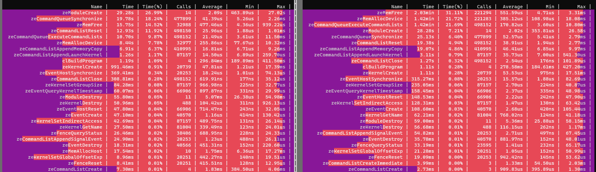

## May 12 and 13 2022
1. Run the code on pvc09 and ats1 to see timing and any speedup or slowning down.
2. pvc09 and ats1 runs on one card one tile. (ats1 by setting ZE_AFFINITY_MASK=0.0 and unset EnableWalkerPartition; pvc09: unset EnableWalkerPartition seems to be enough, checked with ZE_AFFINITY_MASK=0.0, the time is very similar) 

  | nightly compiler | UMD     | PVC09 real time   | ATS1 real time 
  |  :---------:     | :-----: |  :--------: | :---:                    |
  |  eng.005         | default |  2m39.195s/2m30.255s/2m42.026s/2m26.629s/2m41.569s-0.0  |   3m16.222s/3m16.056s/3m14.500s |
  |  0410            | default |  2m28.120s/2m28.301s2m/28.744s  |  hangs/4m47.601s/4m48.578s/4m37.341s |
  |  0411            | default |  2m31.426s/2m20.316s/2m20.869s  |  hangs/4m46.077s/11m16.755s/ |
  |  0413            | default |  2m26.017s/2m35.120s/2m35.742s/2m39.694s-0.0  |  hangs more frequently 4m58.260s|
  |  0414            | default |  7m33.410s/7m36.627s/7m39.557s/7m40.873s/7m46.911s-0.0  | 6m21.112s/6m19.443s/6m18.472s |
  |  0501            | default |  7m47.727s/7m42.710s/9m17.057s/7m43.431s    |   |
  |  0511            | default |  7m40.205s/7m47.025s/7m45.540s|  6m17.110s/6m3.887s/6m16.791s|
  |  0511            | 462     |  7m43.004s/7m39.702s/7m39.702s     |   |

3.  Detailed comparison on PVC09 between 0413 and 0414 nightly.    

   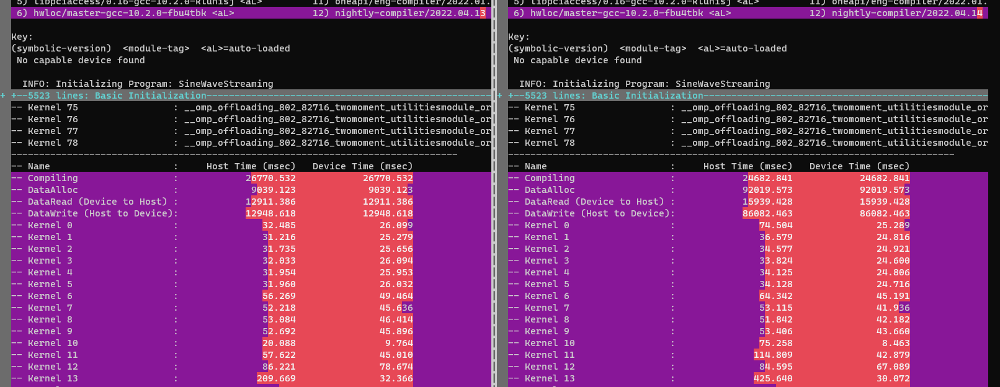
   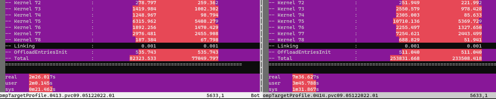

4. Detailed comparison between ATS1 and PVC09 using oneapi/eng-compiler/2022.01.30.005.   
   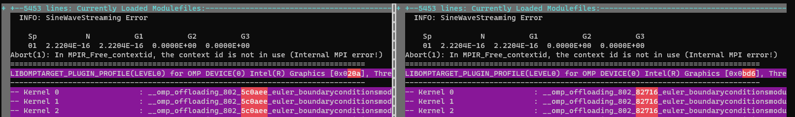
   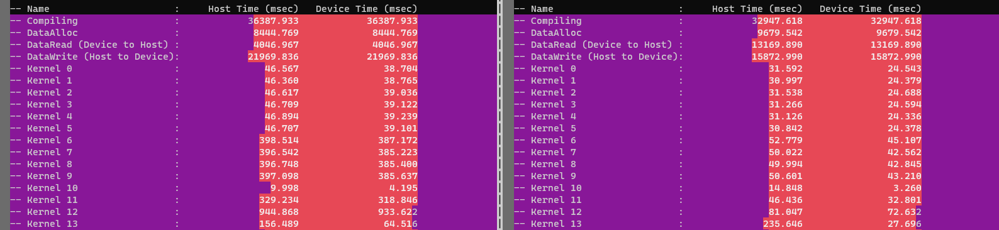
   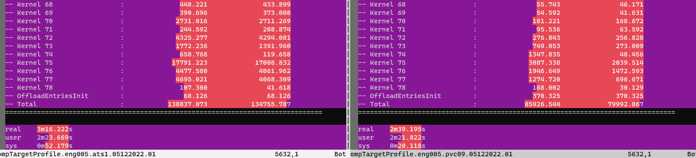

   Basically, PVC09 GPU computation time on  is always faster than ATS's, i.e. 1.5X. But the data reading or allocation no improvement, sometimes slower.  

5. Detailed comparison on ATS1 between 0413 and 0414 nightly.   
   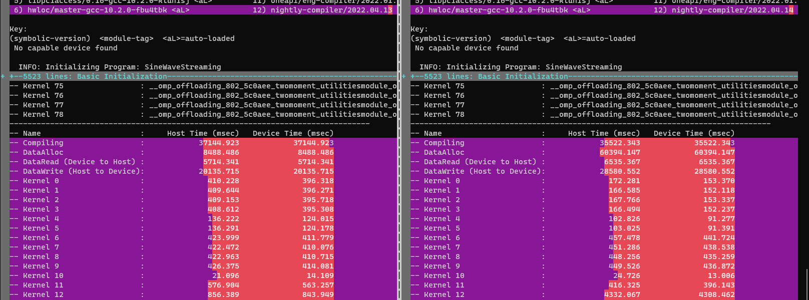
   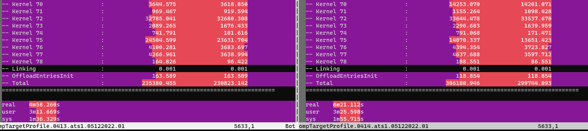

## May 11 2022
1. Tried Francesca's method suggested by Brian which can use a specific igc version, in this case it is  comp_igc-16095, on ATS1 for Thornado. The issue seems being fixed. The steps is in TipsTricks.md.
2. Made ms68-daily more closer to ms68 as we hunting down bugs.
3. Changed the fifth index of NumericalFlux2 to iZ3 from iZ4, no infs are observed. push the code and the log file with infs to ms68-daily.
4. removed the debugging code for infs.
5. The code runs now for both ats1 (with specific igc version) and pvc09.

## May 10 2022
1. Prepared a ppt presentation of workarounds/bug fixes in the Thornado code
2. Had a monthly meeting with the group and discussed the modifications with ANL and ORNL collaborators. The fifth index of NumericalFlux2 should be iZ3 not iZ4. Will test this.


## May 09 2022
 **Mainly working on pvc09**
1. For https://jira.devtools.intel.com/browse/XDEPS-4077, it was found initially that the intrinsics like `llvm.masked.gather.v4f64.v4p4f64` and `llvm.masked.gather.v4f64.v4p4f64` are the reason for thornado to crash on UMD-402 and the later, but not UMD-401. Worked with Brain and Marcus, we found that `SandBox/TwoMoment_OrderV/TwoMoment_PositivityLimiterModule_OrderV.F90` produces the above intrinsics. The loopFile.sh is used to loop over all the .o files and do a `strings $file | egrep 'masked|scatter' | egrep llvm` on each file. It is found that the above intrinsics are in TwoMoment_PositivityLimiterModule_OrderV.o.
2. XDEPS group now found out that the crash happens due to the kernels in the subroutine `ComputeIncrement_ObserverCorrections` of `SandBox/TwoMoment_OrderV/TwoMoment_DiscretizationModule_Streaming_OrderV.F90`, and these kernal do not have the above kernels. 
3. The code runs on pvc09; but crashes on ats1 on AOT built, or compiles and crashes during run for JIT build stage. 
4. Disable all the offload regions in `SandBox/TwoMoment_OrderV/TwoMoment_DiscretizationModule_Streaming_OrderV.F90`, AOT compiles. It is found that `ComputeIncrement_Divergence_X#" also causes the ocloc errors besides 'ComputeIncrement_ObserverCorrections`. Further investigation found that the crash may related to collapse (4) and (5). However, the founding is not very convincing as other places in the code also have collapse clauses. Wait for xdeps group's conclusion.  
5. Some detailed debugging on pvc09:  For the original sineWaveStreaming app. 
 NumericalFlux2(8, 4, 1:8, 1:8, 1:8, 1, 1:9)
 NF2fffff      (1, 1,  1,   1,  1:8, 1,  9 )  =  -1.539767602857075E+302 
 However, by adding print statement for NumericalFlux2>1.0e20 in `ComputeIncrement_Divergence_X3` when it is compted, the infs appears on different cycles: 00000014, 00000021,  00000022, .... for Energy caculation. 

 Debugging source code inside `SandBox/TwoMoment_OrderV/TwoMoment_DiscretizationModule_Streaming_OrderV.F90` is
    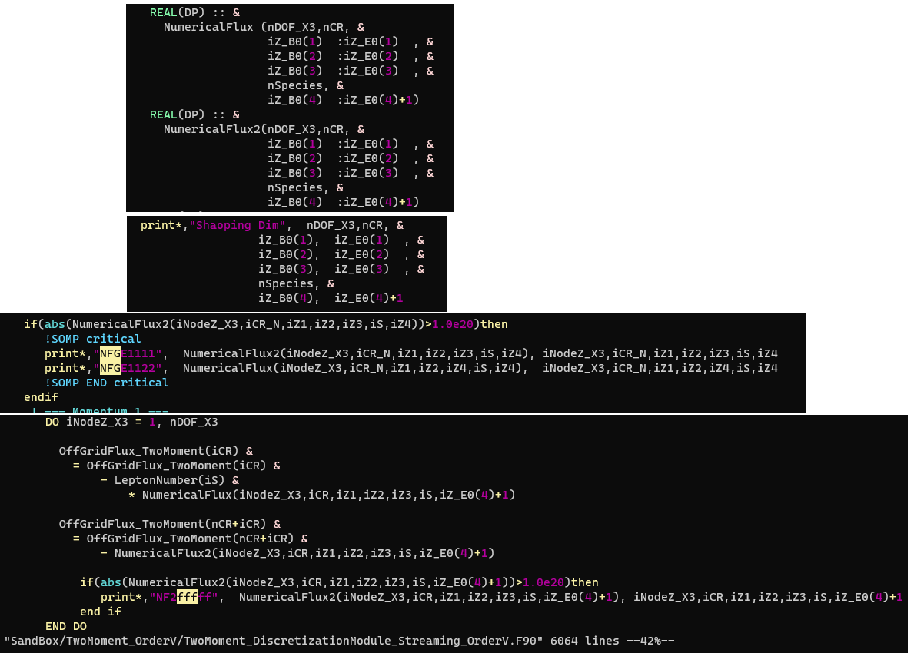    

 The output
 <pre>
Shaoping Dim  8  4  1  8  1  8  1  8  1  1  9
Shaoping Dim  8  4  1  8  1  8  1  8  1  1  9
NFGE1111 -1.53977e+302 1 1 1 1 7 1 9
NFGE1122 -5.82901e+303 1 1 1 1 9 1 9
NFGE1111 -1.53977e+302 1 1 1 1 5 1 9
NFGE1122 -5.82901e+303 1 1 1 1 9 1 9
NFGE1111 -1.53977e+302 1 1 1 1 4 1 9
NFGE1122 -5.82901e+303 1 1 1 1 9 1 9
NFGE1111 -1.53977e+302 1 1 1 1 2 1 9
NFGE1122 -5.82901e+303 1 1 1 1 9 1 9
NFGE1111 -1.53977e+302 1 1 1 1 1 1 9
NFGE1122 -5.82901e+303 1 1 1 1 9 1 9
NFGE1111 -1.53977e+302 1 1 1 1 8 1 9
NFGE1122 -5.82901e+303 1 1 1 1 9 1 9
NFGE1111 -1.53977e+302 1 1 1 1 3 1 9
NFGE1122 -5.82901e+303 1 1 1 1 9 1 9
NFGE1111 -1.53977e+302 1 1 1 1 6 1 9
NFGE1122 -5.82901e+303 1 1 1 1 9 1 9
NF2fffff -1.539767602856910E+302  1  1  1  1  1  1  9
NF2fffff -1.539767602856910E+302  1  1  1  1  2  1  9
NF2fffff -1.539767602856910E+302  1  1  1  1  3  1  9
NF2fffff -1.539767602856910E+302  1  1  1  1  4  1  9
NF2fffff -1.539767602856910E+302  1  1  1  1  5  1  9
NF2fffff -1.539767602856910E+302  1  1  1  1  6  1  9
NF2fffff -1.539767602856910E+302  1  1  1  1  7  1  9
NF2fffff -1.539767602856910E+302  1  1  1  1  8  1  9/ 
 </pre>

## May 06 2022     
1. Migrated the Thornado code to pvc09 and tested the code. the code gives infs for nightly-compile 0414, but not for 0413 which is consistent with pvc17 findings.
2. Added print out for NumericalFlux2 if it's value is greater than 1.0e20, and found out that starting from nCycle =9 we see infs, but no every nCycle.
3. Default UMD is used.
4. Infs only appears for Cycle = 00000009, 00000025, 00000028, 00000056, 00000072, and 00000073 in all total of 81 cycles. 


## May 05 2022
1. Worked with Brian on figuring out which part of code is responsible for the crash due to the intrinsic. 
2. A lot of methods have been tried, but so far, no success. Here is a summary of things we tried:       
   a. The script:

<pre>
#!/bin/bash

for file in *.o; do
    if [ -f "$file" ]; then
        echo "$file"

      /exaperf/nightly/compiler/2022.05.03/linux/bin/clang-offload-bundler -type=o -targets=host-x86_64-unknown-linux-gnu,openmp-spir64  -inputs=$file  --outputs=host.o --outputs=device.o -unbundle  -allow-missing-bundles
        strings $file |grep -i scatter
        strings $file |grep -i gather
        strings device.o| egrep 'masked|scatter' | egrep llvm
        strings host.o| egrep 'masked|scatter' | egrep llvm
        grep -i scatter device.o
        grep -i scatter host.o
        grep -i gather device.o
        grep -i gather host.o
        echo " "
    fi
done
   </pre>
   
   b. Shader Dump by setting `export IGC_ShaderDumpEnableAll=1` and `export IGC_DumpToCurrentDir=1` see detail at https://github.com/intel/intel-graphics-compiler/blob/master/documentation/configuration_flags.md. These can be used for compilation, and also ocloc of the reproducer. It will create a bunch of stuff, and not easy to get useful information.    

   c. Using `/exaperf/nightly/compiler/2022.05.03/linux/bin/clang-offload-bundler -type=o -targets=host-x86_64-unknown-linux-gnu,openmp-spir64  --inputs=test.o  --outputs=host.o --outputs=device.o -unbundle  -allow-missing-bundles` to pull apart o files.    
   d. set `export  TMPDIR=./temps` and add `-i_save-temps -v` to the compilation and link options. We got the temporary files. Using llvm-dis tool to disessembly the .o file. We did found the intrinsics in ` TwoMoment_PositivityLimiterModule_OrderV.o`. But with all the offload directive disabled, the code 1) compiles and then runs fails during JIT 2) ocloc issue for AOT. 

   
## May 04 2022
 1. PVC12 is down and not stable. The investigation of the Tally jumps and significant slowing down on PVC12 is stopped until a PVC machine is available as these issues only happen on PVC machines.
 2. Started working on CMPLRLLVM-37346, which is the clone of  xdeps-4077 as xdeps people say that the crash is not a defect. Tried grep and strings command. I kind of believe that the intrinsics are not the reason to blame.
 3. Used a script to check which .o files have the intrinsics. 

## May 03 2022

1. **Thornado was primarily tested and ran on ATS1. On ATS7, a sweep of nightly-compilers has been used to see which one does not have "masked.gather/scatter" intrinsics. Thornado crashes if UMD402 and later is used for run on ATSs, but it apparently run fine on PVC12. So From now on pvc12 will be used.** 
2. Compiled the code using nightly-compiler.05.02 and ran "strings" command, "masked.gather/scatter" are observed also. Discussed with Marcus and Brian, Created a new task for ifort by clone++ xdeps-4077.
3. Here is summary of the runs on pvc12:

  | nightly compiler | UMD    | real time   | Neutrino Energy Off Grid 
  |  :---------:     | :-----:|  :--------: | :---:                    |
  |  0410            | 401    |  3m53.002s  |  -4.80328700E+002  |
  |  0410            | 402    |  3m56.943s  |  -4.80328700E+002  |
  |  0413            | 440    |  3m55.929s  |  -4.80328700E+002  |
  |  0414            | 440    |  11m1.826s  |  5.80478701E+302   |
  |  0415            | 440    |  10m42.958s |  5.80478701E+302   |
  |  0420            | 440    |  10m48.650s |  5.80478701E+302   |
  |  0427            | 440    |  10m57.014s |  5.80478701E+302   |
  |  0427            | 401    |  10m58.104s |  5.80478701E+302   |
  |  0427            | 402    |  11m6.689s  |  5.80478701E+302   |
  |  eng-compiler    | 005    |  4m19.106s  |  -4.80328700E+002  |

  Note: eng-compiler.005 is based on nightly-0410 and umd 402.
  So it seems that nightly 0414 brings issues, or discloses bugs in the code.    

4. Got 0413 and 0414 Tally for each cycle. 0414's Tally jumps to 9.67464518E+301 on Cycle = 9, while it was  -5.68795950E+002 at Cycle = 8.   The differences start at Cycle =7 .

## May 02 2022
1. Setup Thornado on pvc12. the code compiles and runs for umd401, umd402 and the lated umd440
2. There are some result differences and simulation time differences. 
3. Ran a number combinations of nightlies and umds to see which one is the cause for the differences. 


## April 29 2022
1. Run Thornado JIT on ATS7 for profiling for more than 5 times, and the time for the runs are very similar, for real time is between 3m41s to 3m46. The time spend is :
```
real    3m46.153s
user    2m30.319s
sys     1m19.716s
```
The log file is named as "ompTargetProfile.log.280402022.ats7-##". The "-01" file is added to ms68
2. Compile Thornado on ATS7 using different nightly compiler, i.e. nightly-compiler : 03-20, 03-25, 03-30, 04-04, 04-06, 04-10, and 04-27. Using strings command and found that all the versions have `llvm.masked.gather.v4f64.v4p4f64`. The executables and the script are in `/localdisk/quanshao/ExaStar/thornado/SandBox/TwoMoment_OrderV/Executables/MultiExes`.

## April 28 2022
1. tried the latest nightly, i.e. nightly-compiler/2022.04.27 and nightly-compiler/2022.04.26, the issue regarding to !$OMP TARGET UPDATE( G) with being an multi-D array has been fixed. The JIRA issue is closed. 
2.  -Xopenmp-target-backend "-device pvc" does not work, but with revision id, it works, i.e. compiles and runs. -Xopenmp-target-backend "-device pvc -revision_id 3"
3. Discussed with Brian, SIMD might be a issue for the slow down. So will try to change the length and romoving it. iprof and vtune might be used to see where the slow is in more detail. 
4. Compiled the code with extra debugging flags which are needed for iprof. On ATS1, the code compiles but run with the following errors:

<pre>
Abort was called at 406 line in file:
/opt/src/build_l0_gpu_driver/BUILD/compute-runtime-1.3.022791.10859/level_zero/core/source/module/module_imp.cpp
forrtl: error (76): Abort trap signal
Image              PC                Routine            Line        Source
ApplicationDriver  0000000000CA7F4B  Unknown               Unknown  Unknown
libomptarget.so.1  000014FFDA3A1C3E  __tgt_target_data     Unknown  Unknown
ApplicationDriver  00000000004117F8  initializeprogram         243  ProgramHeaderModule.F90
ApplicationDriver  0000000000410613  initializeprogram         147  ProgramHeaderModule.F90
ApplicationDriver  0000000000982C79  initializeprogram         115  ProgramInitializationModule.f90
ApplicationDriver  0000000000C9518E  initializedriver          738  ApplicationDriver.F90
ApplicationDriver  0000000000C93DA5  applicationdriver         558  ApplicationDriver.F90
ApplicationDriver  000000000040DB72  Unknown               Unknown  Unknown
libc-2.31.so       000014FF791D434D  __libc_start_main     Unknown  Unknown
ApplicationDriver  000000000040DA8A  Unknown               Unknown  Unknown
Aborted (core dumped)                    
</pre>
5. Weird things happned on PVCs, i.e. pvc A0. Will Fresh start using PVC A4.  things: compiles and runs with UMD 402, speed is different for different pvc nodes, and way slower than ats node. Further investigation is needed. 
      
## April 27 2022
1. As pvc17 is not ready, put the code onto pvc19. The code compiles and runs with nightly-compiler/2022.04.26 and neo/agama-prerelease/401-22.13.022791.10859-main, but see large values in the log file: ompTargetProfile.output.log.27042022.pvc19.JIT       
<pre>
        Two-Moment Tally O(v/c). t = 1.00E+00

            Neutrino Lepton Number Interior.:  2.30383461E+000
            Neutrino Lepton Number Initial..:  2.30383461E+000
            Neutrino Lepton Number Off Grid.:  4.34710278E-004
            Neutrino Lepton Number Change...: -4.34710277E-004

            Neutrino Energy Interior........:  1.90066356E+000
            Neutrino Energy Initial.........:  1.90066356E+000
            Neutrino Energy Off Grid........:  5.63405797E+302
            Neutrino Energy Change..........: -5.63405797E+302
            Neutrino Energy PL..............:  0.00000000E+000
-- Kernel 74                 : __omp_offloading_802_28408a_twomoment_utilitiesmodule_orderv_mp_computeprimitive_twomoment_vector_richardson__l450
-- Kernel 75                 : __omp_offloading_802_28408a_twomoment_utilitiesmodule_orderv_mp_computeprimitive_twomoment_vector_richardson__l480
-- Kernel 76                 : __omp_offloading_802_28408a_twomoment_utilitiesmodule_orderv_mp_computeprimitive_twomoment_vector_richardson__l553
-- Kernel 77                 : __omp_offloading_802_28408a_twomoment_utilitiesmodule_orderv_mp_computeprimitive_twomoment_vector_richardson__l583
-- Kernel 78                 : __omp_offloading_802_28408a_twomoment_utilitiesmodule_orderv_mp_computeprimitive_twomoment_vector_richardson__l642


-- Kernel 73                 :             2864.176              874.472
-- Kernel 74                 :            25175.029              170.018
-- Kernel 75                 :            24899.799             3383.122
-- Kernel 76                 :             2885.787             1725.721
-- Kernel 77                 :            25037.960             1693.019
-- Kernel 78                 :             2017.534              163.133
</pre>

Two issues here:
   a) Large (almost inf) values
   b) Device time is significantly smaller than the Host time for a lot of kernels. 
Investigation needed.     

2. AOT compile. a) "-device 0x0bd5 -revision_id 3" worked b) "-device pvc" compiled but run crashed with following errors
    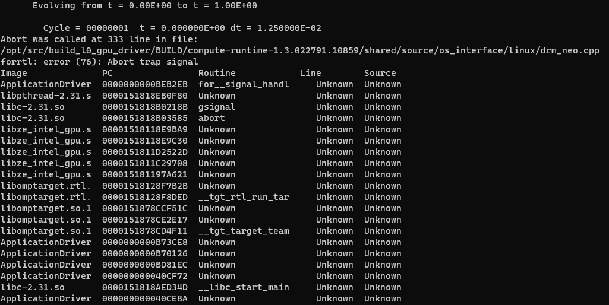
3. on pvc19, after kill the app id, i.e.  kill -9 50960, we got. 
```
quanshao@exaperf-sdpcloud-pvc19:~> ps -aux |grep App
quanshao  33166  0.0  0.0  33560  8676 pts/0    S+   12:59   0:00 vim ApplicationDriver.F90
quanshao  50960  101  0.0      0     0 pts/2    Zl+  17:06  31:28 [ApplicationDriv] <defunct>
quanshao  51306  0.0  0.0  10140   748 pts/4    S+   17:37   0:00 grep --color=auto App
```
## April 26 2022
1. nightly-compiler/2022.04.25 does not have the ICE fix for !$OMP TARGET UPDATE TO( G ) where G is a 5D or multi-D arrray. So  Stick with  nightly-compiler/2022.04.10 and neo/agama-prerelease/401-22.13.022791.10859-main
2. Taking 2022 SAFETY ALWAYS course. 
3. Run the code with JIT on pvc17, the code compiles and runs. but for AOT with -fopenmp-targets=spir64_gen -Xopenmp-target-backend "-device pvc", the run hangs and cannot be killed. 

## April 25 2022

1. Stick with  nightly-compiler/2022.04.10 and neo/agama-prerelease/401-22.13.022791.10859-main as the newest compiler and newer neo has issues with the code. Please refer to the previous comments. 
2. Clean up the directories and the code and redo debugging print coding for both  CPU and GPU versions of the code.
3. For nX=[8,2,2], the differences happen "randomly" on different NumericalFlux2(:,:,:,:,:,:,:) for repeated runs. See the following two figures. For the first one, the huge difference happens for (1,1,6,2,2, 1,1)  for ee11, and for (5,1,4,1,2,1,1), see the blue marked line.    
    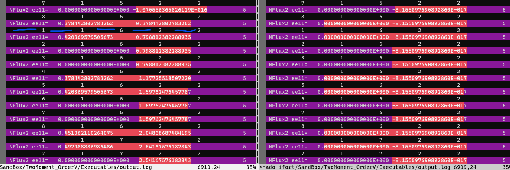
    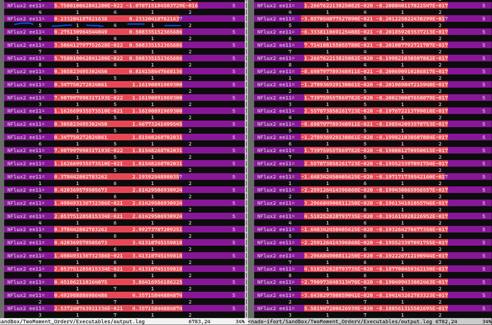

4.  Array of NumericalFlux2 for X1, X2, and X3 are:    
  <pre>
  ( nDOF_X1, nCR, iZ_B0(1):iZ_E0(1), iZ_B0(3):iZ_E0(3), iZ_B0(4):iZ_E0(4), nSpecies, iZ_B0(2):iZ_E0(2)+1)       
  (    8,     4,         1:8,               1:2,               1:2,            1,           1:9 )         
   
  ( nDOF_X2, nCR, iZ_B0(1):iZ_E0(1), iZ_B0(2):iZ_E0(2), iZ_B0(4):iZ_E0(4), nSpecies, iZ_B0(3):iZ_E0(3)+1)              
  (    8,     4,         1:8,               1:8,               1:2,            1,           1:3 )          

  ( nDOF_X3, nCR, iZ_B0(1):iZ_E0(1), iZ_B0(2):iZ_E0(2), iZ_B0(3):iZ_E0(3), nSpecies, iZ_B0(4):iZ_E0(4)+1 )            
  (    8,     4,         1:8,               1:8,               1:2,            1,           1:3 )         
  </pre>
  <pre>        
  (    1,     1,          5,                 6,                 3,             1,            3 ) 
  NF2Calc0=  0.517607 0.983266 0.526416 0.517607
  </pre>                                                                                              
  are what I saw. For the code:

  ```
      NumericalFlux2(iNodeZ_X3,iCR_N,iZ1,iZ2,iZ3,iS,iZ4) &
        = GE(iNodeE,iZ1,iGE_Ep1) &
            * ( NumericalFlux(iNodeZ_X3,iCR_N,iZ1,iZ2,iZ4,iS,iZ4) &
                + uV1_F(iX_F) &
                    * NumericalFlux(iNodeZ_X3,iCR_G1,iZ1,iZ2,iZ3,iS,iZ4) &
                + uV2_F(iX_F) &
                    * NumericalFlux(iNodeZ_X3,iCR_G2,iZ1,iZ2,iZ3,iS,iZ4) &
                + uV3_F(iX_F) &
                    * NumericalFlux(iNodeZ_X3,iCR_G3,iZ1,iZ2,iZ3,iS,iZ4) )
!$omp critical
if(abs(NumericalFlux2(iNodeZ_X3,iCR_N,iZ1,iZ2,iZ3,iS,iZ4))>1e-3)then
   print*, "NF2Calc0= ", NumericalFlux2(iNodeZ_X3,iCR_N,iZ1,iZ2,iZ3,iS,iZ4),  NumericalFlux(iNodeZ_X3,iCR_N,iZ1,iZ2,iZ4,iS,iZ4), &
   GE(iNodeE,iZ1,iGE_Ep1), NumericalFlux(iNodeZ_X3,iCR_N,iZ1,iZ2,iZ4,iS,iZ4)*GE(iNodeE,iZ1,iGE_Ep1)
   print*, "NF2Index= ", iNodeZ_X3,iCR_N,iZ1,iZ2,iZ4,iS,iZ4, iNodeE,iGE_Ep1, iZ3
!!   print*, "NF2rest1= ",uV1_F(iX_F) * NumericalFlux(iNodeZ_X3,iCR_G1,iZ1,iZ2,iZ3,iS,iZ4)
!!   print*, "NF2rest2= ",uV2_F(iX_F) * NumericalFlux(iNodeZ_X3,iCR_G2,iZ1,iZ2,iZ3,iS,iZ4)
!!   print*, "NF2rest3= ",uV3_F(iX_F) * NumericalFlux(iNodeZ_X3,iCR_G3,iZ1,iZ2,iZ3,iS,iZ4)
end if
!$omp end critical
  ```

 <pre>
 NF2Calc0=  0.517607 0.983266 0.526416 0.517607
 NF2Index=  1 1 5 6 3 1 3 1 2 2
 NF2Calc0=  0.588568 0.983266 0.598584 0.588568
 NF2Index=  2 1 5 6 3 1 3 2 2 2
 NF2Calc0=  0.517607 0.983266 0.526416 0.517607
 NF2Index=  5 1 5 6 3 1 3 1 2 2
 NF2Calc0=  0.588568 0.983266 0.598584 0.588568
 NF2Index=  6 1 5 6 3 1 3 2 2 2
 NF2Calc0=  0.69797 0.898964 0.776416 0.69797
 NF2Index=  1 1 7 4 3 1 3 1 2 2
 </pre>
5. It has been found that uV1/2/3_F(iX_F) * NumericalFlux are always small. The large values come from NumericalFlux(iNodeZ_X3,iCR_N,iZ1,iZ2,iZ4,iS,iZ4).

## April 22 2022
1. Sent two emails: 1) to Dahai Guo regarding the modified code and the related JIRAs, code profiling results, and which pair of nightly and agama I am using. 2) to ANL and ORNL collaborators asking for the review of the modified code. 
2. The new default intel_compute_runtime/release/agama-prerelease-402 has the same compiler error as neo 402 with nightly 04.10. 
3. Tried with nightly-compiler/2022.04.21, and the compilation fails with ICE. reopenned https://jira.devtools.intel.com/browse/CMPLRLLVM-35636

## April 21 2022

1. Set JLSE account and scp-ed ms68 of thornado to JLSE account.
2. Discussed with Brian and found out MPI_INIT issue for valgrind runs with the Hello World Fortran code is because of the setting. Set ONEAPI_MPICH_GPU=NO_GPU make the valgrind runs fine. Another way of doing this is set MPIR_CVAR_ENABLE_GPU=0, and the related webpages are:  https://github.com/intel-innersource/libraries.runtimes.hpc.mpi.mpich-aurora/wiki/Tuning-Parameters  and  https://intel.sharepoint.com/sites/IAGS-CEEExascalePerformanceCoDesign/SitePages/MPI.aspx
3. However, tried these setting valgrind still does not work. ONEAPI_MPICH_GPU=NO_GPU   still has MPI_INIT problems, and  MPIR_CVAR_ENABLE_GPU=0 leads to similiar/same issue.
## April 20 2022
1. Setup 1source account and requested the access to 1source github user
2. Setup DUO MFA for jsle account. But still has issues with ssh to "ac.squan@login.jlse.anl.gov". An error message appears as "Duo Authentication Required.". My guess is to wait a day or two and let the things propogate to the cluster. 
3. Some observation: tmux interfere with mpirun.
4. worked with Brian, finally found out that if tmux is used for the allocation terminal, then any ssh-ed terminal with tmux will hang for mpiruns due to srun and mpich not play nicely.
5. 1source thornado-feb2022 has been setup. Now git clone and git push all work. No password needed. 

## April 19 2022
1. Ran nX={8,2,2} nE=8 cases and also find differences. The difference appears earlier.  But the results seems kind of random. So do a valgrind CPU run to see any memory access errors. 
2. Valgrind has the following error
  ```
  ==20951== Warning: ignored attempt to set SIGRT32 handler in sigaction();
  ==20951==          the SIGRT32 signal is used internally by Valgrind
  forrtl: severe (168): Program Exception - illegal instruction
  Image              PC                Routine            Line        Source
  ApplicationDriver  00000000009E25BC  Unknown               Unknown  Unknown
  libpthread-2.31.s  000000004F89BF80  Unknown               Unknown  Unknown
  libmpi.so.12.1.14  000000005A86AE86  Unknown               Unknown  Unknown
  libmpi.so.12.1.14  000000005A7F8B26  Unknown               Unknown  Unknown
  libmpi.so.12.1.14  000000005A74B0A6  Unknown               Unknown  Unknown
  libmpi.so.12.1.14  000000005A74AE29  Unknown               Unknown  Unknown
  libmpi.so.12.1.14  0000000059F39DB6  MPI_Init              Unknown  Unknown
  libmpifort.so.12.  000000004F1318F9  MPI_INIT              Unknown  Unknown
  ApplicationDriver  00000000008219F2  programinitializa         109  ProgramInitializationModule.f90
  ApplicationDriver  00000000009D4375  applicationdriver         738  ApplicationDriver.F90
  ApplicationDriver  00000000009D333B  MAIN__                    558  ApplicationDriver.F90
  ApplicationDriver  000000000040D892  Unknown               Unknown  Unknown
  libc-2.31.so       000000004FCD134D  __libc_start_main     Unknown  Unknown
  ApplicationDriver  000000000040D7AA  Unknown               Unknown  Unknown
  ==20951==
  ==20951== HEAP SUMMARY:
  ```
3. Ran the code with `LIBOMPTARGET_PLUGIN_PROFILE=T`  and got performance profiling for GPU kernel, data transfer time. The file name is "ompTargetProfile.output.log.19042022". Here are some excerpts    
   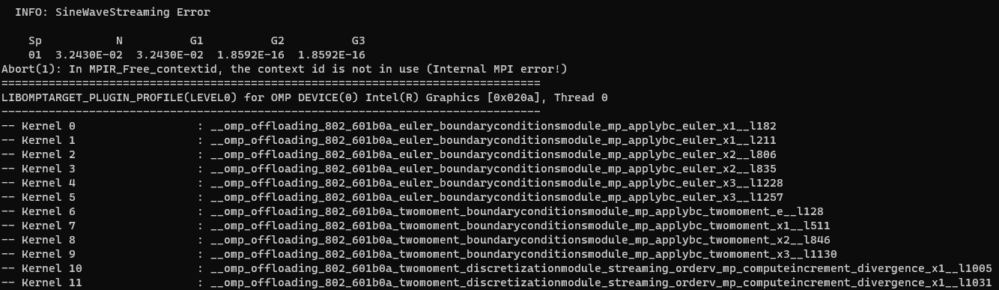
   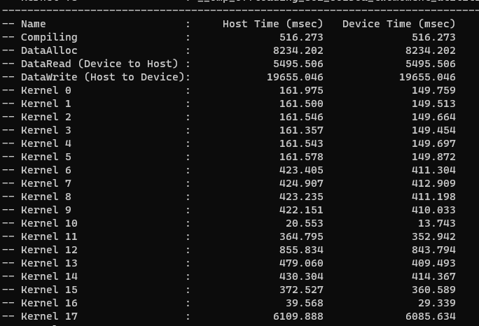


## April 18 2022
1. tested with nightly-compiler/2022.04.17 and neo/agama-prerelease/415-22.16.022974.11000-main, the code has an "ifx: error #10105: ocloc: core dumped ", "ifx: warning #10102: unknown signal(1)"
2. Continue use nightly-compiler/2022.04.10 and neo/agama-prerelease/401-22.13.022791.10859-main 
3.  Needs further investigate. 
4. The focus will placed on  Neutrino Energy Off Grid, i.e. dM(5) --> OffGridFlux_TwoMoment in `SandBox/TwoMoment_OrderV/TwoMoment_DiscretizationModule_Streaming_OrderV.F90`    
5. nSpecies = 1; The largest difference appears when  NumericalFlux2(iNodeZ_X3,iCR,iZ1,iZ2,iZ3,iS,iZ_E0(4)+1) is used, i.e. the last one of XComputeIncrement_Divergence_X3

## April 15 2022
1. tested with nightly nightly-compiler/2022.04.13 and neo/agama-prerelease/401-22.13.022791.10859-main, the original case nX=[8,8,8] runs and no NaNs and Infs were observed.  Here is the screen output for Twom-Momentum Tally.   
 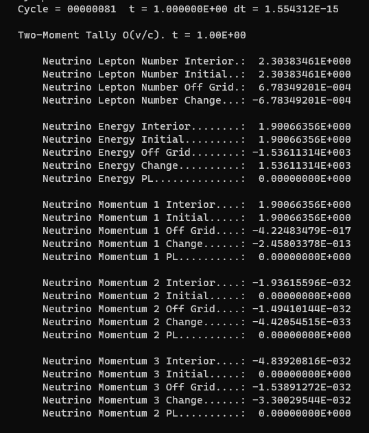

2. Prepared the code and merge the code to ms68 branch. Tested it and the code runs on nightly-compiler/2022.04.10 and neo/agama-prerelease/401-22.13.022791.10859-main.
3. Waiting for the suggestion from Erik to see whether 1source or gitlab can be used to share the modifications with the national lab collaborators. 

## April 14 2022

1. The fix yesterday, i.e. removing SIMD, makes NaNs gone. But infs (3.71700575E+295) were seen in the Two-Moment Tally at t=1.25E-02. Debugging these infs.
    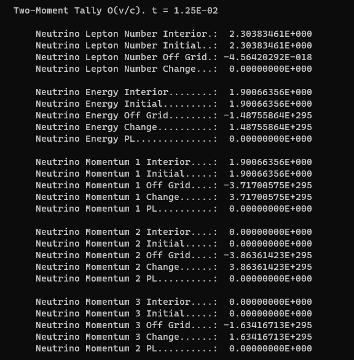   
2. NeutrinoEnergy_OffGrid = dM(5); NeutrinoMomentum1_OffGrid = dM(6); NeutrinoMomentum2_OffGrid = dM(7); NeutrinoMomentum3_OffGrid = dM(8)
3. NumericalFlux2 is the reason for large values of the above variables. The large value appears for NumericalFlux2 in `SUBROUTINE ComputeIncrement_Divergence_X2` and then `SUBROUTINE ComputeIncrement_Divergence_X3',while no large value in *_X1. 
4. It is found out that NumericalFlux2 was not updated from GPU for X2 and X3. After adding 
   ```
   #if defined(THORNADO_OMP_OL)
   !$OMP TARGET UPDATE FROM( NumericalFlux, NumericalFlux2 )
   #endif
   ```
   The code runs with no large numbers for the smaller case nX=[8,2,2] and nE=4. 
   **GREAT JOB DONE**

## April 13 2022
1. Here is the output source code and the screen output of NaN when the code runs on GPU
    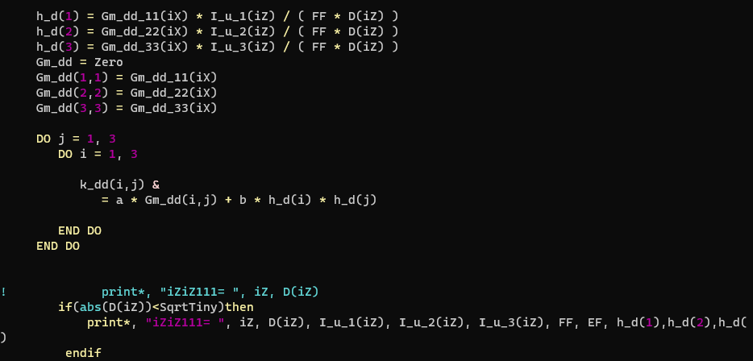

    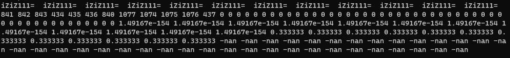
2. One thing noticed is that the thread has NaNs are different every time the code is run. This is the beauty of OpenMP if a thread's computation is dependent on the other thread's results.
3. discussed with Brian, he suggested to compare the solution of GPU with the results of CPU
4. Fixed iZ =606 and print out all the related variable on both GPU and CPU runs. `SandBox/TwoMoment_OrderV/TwoMoment_UtilitiesModule_OrderV.F90`
    ```
   if(iZ == 606)then
      print*, "sum1 = ", SUM1, GVEC(i,iM,iZ),  Alpha(iM,iZ)
   end if
   ```   

5. The following figure shows the comparision between GPU and CPU results for the original/unfixed code inside `DO WHILE( ANY( ITERATE ) .AND. k < MaxIterations )` around line 470     
   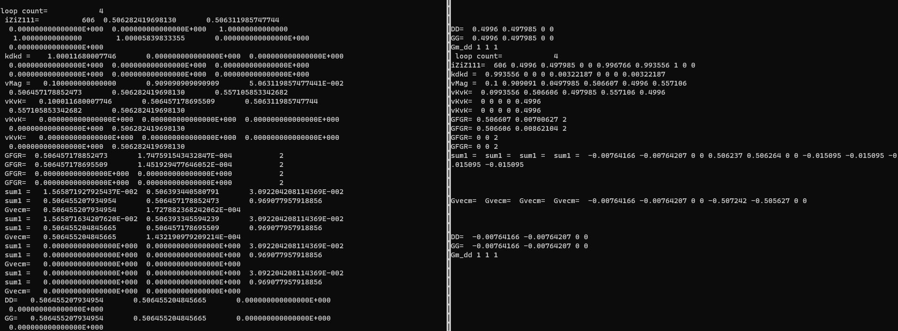

   we can cleary see that "sum1" are clearly different. GPU only prints 4 times, and CPU prints 8 times, and the values are also different. These lead to differences in DD and GG, and the differences are huge. GPU has negative values, and D is density, so this is wrong. The issue found out to be due to the usage of SIMD on line around 590 for SUM1 calculation. 

   After removing SIMD we can see from the following two figure one is at loop count equal to 4 and the other one is the loop is converged, i.e. loop count equal to 7. The GPU and CPU result are very similar. 
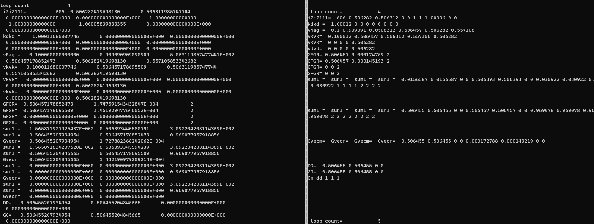

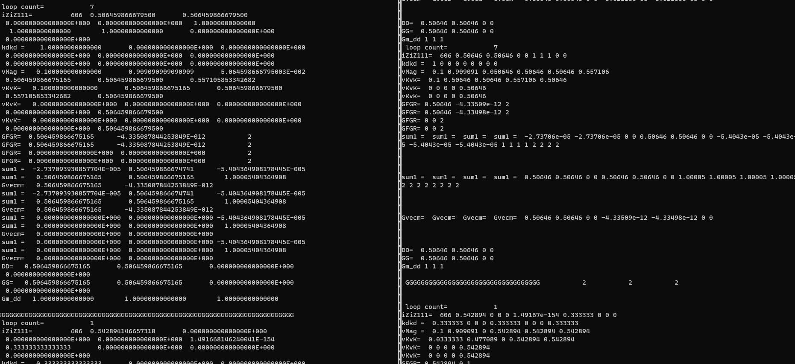


## April 12 2022
1. stick to UMD 405 and NEO 2022.04.05
2. Nan's first found in  EddingtonTensorComponents_dd on loop_count = 10, where D in the function is zero. discussed with ANL and ORNL staff and found out D should not be zero. further examination needed.  

## April 11 2022
1. Now switching to figure out why we got "inf" instead of "nan". See a lot of infs, but it seems there is not a function to test inf. 
2. Debugging found that inf appears for AA11 and AB1 due to Fm being something like -1.18302e+301. this is in  `SUBROUTINE Alpha_LS_Vector` of `SandBox/TwoMoment_OrderV/TwoMoment_UtilitiesModule_OrderV.F90`
3. Found that  GVECm(i,821) is a large number, i.e. 1.18302e+301

## April 08 2022
1. Tried `neo/agama-prerelease/405-22.14.022868.10926-main`, got same "ocloc" error. Thus a jira is filed, and here is the link: https://jira.devtools.intel.com/browse/XDEPS-4077
2. It is found that -O0 is responsible for the ocloc error. If -O0 is removed then 40? UMD works fine. 
3. Prior to `neo/agama-prerelease/401-22.13.022791.10859-main` compile with -O0 works and got NaNs in running. After `neo/agama-prerelease/402-22.14.022868.10913-main` compile with -O0 leads to "ocloc" error.  
4. Currently, modified Thornado compiles and runs with all UMD without -O0, and we do see NaNs for the first few time step. Need to figure out why -O0 give NaN. A possible reason is the initialization, i.e. -O0 does not initialize the variables correctly. 
5. Debugging NaNs. Currently working on `SandBox/TwoMoment_OrderV/TwoMoment_UtilitiesModule_OrderV.F90`'s `Alpha_LS_Vector`

## April 07 2022
1. Tried `neo/agama-prerelease/402-22.14.022868.10913-main` with the 04.05/04.06, compile fails with "ifx: error #10105: ocloc: core dumped"
2. Brian suggested to play with compile options. By removing -O0, compile fails for 401 and 402 UMD with an error of "error: Total size of kernel arguments exceeds limit! Total arguments size: 2208, limit: 2048 in kernel: `twomoment_positivitylimitermodule_mp_applypositivitylimiter_twomoment_`".     
3. By inline manually or put "!DIR$ ATTRIBUTES FORCEINLINE" before `Gam = GammaFun`, the code compiles.
4. To see whether a JIRA is needed for 1. the ocloc error.  
5. Find an ICE due to SIMD and Critical session. A JIRA is files:  https://jira.devtools.intel.com/browse/CMPLRLLVM-36697
6. Tried nX=[8,1,1] no NaN were produced. Will stay with nX=[8,2,2] and UMD 401/neo 04.05
7. working on `./SandBox/TwoMoment_OrderV/TwoMoment_UtilitiesModule_OrderV.F90` and `./SandBox/TwoMoment_OrderV/TwoMoment_DiscretizationModule_Streaming_OrderV.F90`

## April 06 2022

1. Tested `nightly-compiler/2022.04.05` and `neo/agama-prerelease/401-22.13.022791.10859-main`, and the code from yesterday works and runs repeatedly. So stick to this newest pair. 

2. Code bugs have been found. 
```
   CALL       Update_IMEX_RK(dt, uGE, uGF, uCF, uCR, ComputeIncrement_TwoMoment_Implicit )
   SUBROUTINE Update_IMEX_RK(dt,  GE,  GX,   U,   M, ComputeIncrement_TwoMoment_Implicit, SolveGravity )
   REAL(DP), INTENT(in)     :: GE
   REAL(DP), INTENT(inout)  :: GX
   REAL(DP), INTENT(inout)  :: U
   REAL(DP), INTENT(inout)  :: M
   !$OMP TARGET ENTER DATA MAP( to: GE, GX, U, M )
   ....
   !$OMP TARGET EXIT DATA MAP(from: U, M ) MAP(release: GE, GX)
```
  So U/uCF, M/uCR has been EXITED from the offload at the end of `Update_IMEX_RK` call. Host now should have updated values for this variable, while the device may not have valid values.   

```
!!Shaoping Print
    print*,"aa010000",uCR(1,1,1,1,1,1,1)
    CALL Update_IMEX_RK( dt, uGE, uGF, uCF, uCR, ComputeIncrement_TwoMoment_Implicit )
!!Shaoping Print
    print*,"aa01111",uCR(1,1,1,1,1,1,1), uGF(1,1,1,1,1), uCF(1,1,1,1,1)
    t = t + dt
    IF( MOD( iCycle, iCycleW ) == 0 )THEN
#if defined(THORNADO_OMP_OL)
      !$OMP TARGET UPDATE FROM( uGF, uCF, uCR )
#elif defined(THORNADO_OACC)
      !$ACC UPDATE HOST( uGF, uCF, uCR )
#endif
    print*,"aa0111222",uCR(1,1,1,1,1,1,1), uGF(1,1,1,1,1), uCF(1,1,1,1,1)
      CALL ComputeFromConserved_TwoMoment( iZ_B0, iZ_E0, iZ_B1, iZ_E1, uGF, uCF, uCR, uPR )
!!Shaoping Print
    print*,"aa022222",uCR(1,1,1,1,1,1,1), uGF(1,1,1,1,1), uCF(1,1,1,1,1)
```

Therefore, the `TARGET UPDATE FROM( uGF, uCF, uCR )` code can lead to worng values or even NaNs of these variables. Here is the output:   
```
 aa010000  0.639049905831149
 IMEX_RK=    1.00000000000000       0.639049905831149
 aa01111  0.639049905831149       0.000000000000000E+000   1.00000000000000
 aa0111222                     NaN  0.000000000000000E+000    1.00000000000000
 aa022222                      NaN  0.000000000000000E+000    1.00000000000000
```

**The fix is to remove the `TARGET UPDATE FROM( uGF, uCF, uCR )` code**

3. Another bugs in `./SandBox/TwoMoment_OrderV/TwoMoment_DiscretizationModule_Streaming_OrderV.F90` which lead NaNs in the Tally are found.

```
REAL(DP) :: NumericalFlux
REAL(DP) :: NumericalFlux2
...
!$OMP TARGET ENTER DATA &
!$OMP MAP( to: dZ1, dZ2, dZ4, iZ_B0, iZ_E0, iZ_B1, iZ_E1, iZP_B0, iZP_E0 ) & 
!$OMP MAP( alloc: GX_K, GX_F, uCF_K, uCF_L, uCF_R, &
!$OMP             uCR_K, uCR_L, uCR_R, NumericalFlux, Flux_q, dU_X2 )

...

print*, "aaaaa0111", NumericalFlux(1,1,1,5,1,1,1), NumericalFlux2(1,1,1,5,1,1,1)
print*, "aaaaa0111", NumericalFlux(2,1,1,5,1,1,1), NumericalFlux2(2,1,1,5,1,1,1)
print*, "aaaaa0111", NumericalFlux(5,1,1,5,1,1,1), NumericalFlux2(5,1,1,5,1,1,1)
print*, "aaaaa0111", NumericalFlux(1,2,1,5,1,1,1), NumericalFlux2(1,2,1,5,1,1,1)
print*, "aaaaa0111", NumericalFlux(4,2,1,5,1,1,1), NumericalFlux2(4,2,1,5,1,1,1)
print*, "aaaaa0111", NumericalFlux(5,2,1,5,1,1,1), NumericalFlux2(5,2,1,5,1,1,1)
    print*," aaa0000111", OffGridFlux_TwoMoment
```  
with the screen output:    
```
 aaaaa0111  0.000000000000000E+000                     NaN
 aaaaa0111  0.000000000000000E+000                     NaN
 aaaaa0111  0.000000000000000E+000 -4.259658497090796E-011
 aaaaa0111  0.000000000000000E+000                     NaN
 aaaaa0111  0.000000000000000E+000                     NaN
 aaaaa0111  0.000000000000000E+000 -4.259658497090796E-011
 aaa0000111  0.000000000000000E+000  0.000000000000000E+000
  0.000000000000000E+000  0.000000000000000E+000                     NaN
                     NaN                     NaN                     NaN
 aaa0000222  0.000000000000000E+000  0.000000000000000E+000
  0.000000000000000E+000  0.000000000000000E+000                     NaN
                     NaN                     NaN                     NaN
```

**The fix is to map `NumericalFlux2` to the device as `NumericalFlux`** 

4. Still see NaNs for nStages=2 as 
```
    CALL ComputeIncrement_Divergence_X1( iZ_B0, iZ_E0, iZ_B1, iZ_E1, GE, GX, U_F, U_R, dU_R )
    print*, "ccc0011", OffGridFlux_TwoMoment
    CALL ComputeIncrement_Divergence_X2( iZ_B0, iZ_E0, iZ_B1, iZ_E1, GE, GX, U_F, U_R, dU_R )
    print*, "ccc0022", OffGridFlux_TwoMoment
    CALL ComputeIncrement_Divergence_X3( iZ_B0, iZ_E0, iZ_B1, iZ_E1, GE, GX, U_F, U_R, dU_R )
    print*, "ccc0033", OffGridFlux_TwoMoment
```
and the screen output  
```
 ccc0011  0.000000000000000E+000  0.000000000000000E+000  0.000000000000000E+000
  0.000000000000000E+000  1.126200336604241E-310  0.000000000000000E+000   0.000000000000000E+000  0.000000000000000E+000
 ccc0022  0.000000000000000E+000  0.000000000000000E+000  0.000000000000000E+000
  0.000000000000000E+000  1.126200336604241E-310  0.000000000000000E+000   0.000000000000000E+000  0.000000000000000E+000
 ccc0033  0.000000000000000E+000  0.000000000000000E+000  0.000000000000000E+000
  0.000000000000000E+000  1.126200336604241E-310  0.000000000000000E+000   0.000000000000000E+000  0.000000000000000E+000
 ccc0011  1.126200395291334E-310  0.000000000000000E+000  1.126200395291334E-310
  1.126200395291334E-310                     NaN                     NaN                      NaN                     NaN
 ccc0022  1.126200395291334E-310  0.000000000000000E+000  1.126200395291334E-310
  2.252400790582669E-310                     NaN                     NaN                      NaN                     NaN
 ccc0033  3.378601185874003E-310  0.000000000000000E+000  2.252400790582669E-310
  4.504801581165337E-310                     NaN                     NaN                      NaN                     NaN
```   
The issue here is that the variable on the host and on the device is messed up. Need to figure out a way to fix them.


## April 05 2022
1. Tested `nightly-compiler/2022.04.04` and `neo/agama-prerelease/399-22.13.022791.10859-main`, and the code from yesterday works and runs repeatedly. So stick to this newest pair. 
2. Added more files to offload. Only 9 files left with 8 under `Modules/TwoMoment/` and one is ` Modules/Library/SubcellReconstructionModule.F90`
3. **TwoMoment__OrderV now successfully compiled and runs** 
4. A branch is created with all the related files offloading on. `ms68-offloadTwoMomentOrderV`
5. However, we see NANs in the output. Need further examination.

## April 04 2022

1. Although it is because of introducing `Modules/Library/ReferenceElementModuleX__Lagrange.F90` but the run hangs on line 480 of `SandBox/TwoMoment_OrderV/TwoMoment_UtilitiesModule_OrderV.F90` with following as the last print out:
  ```
 Shaoping k=          16           2
 Shaoping k=          17           2
 Shaoping k=          18           2
  Target LEVEL0 RTL --> Kernel Scalar argument 22 (value: 0x0000000085f25d9e) was set successfully for device 0.
Target LEVEL0 RTL --> Kernel Scalar argument 23 (value: 0x0000000000000020) was set successfully for device 0.
Target LEVEL0 RTL --> Setting indirect access flags 0x0000000000000002
Target LEVEL0 RTL --> Submitted kernel 0x000000000caa7cc0 to device 0
  ```

  by commenting out `k_dd = EddingtonTensorComponents_dd` inside the iZ loop on line 504 the code runs. 
  By commenting out `FF = EddingtonFactor` and ` FF=FluxFactor` on line 1665, and 1666, and uncommenting the above line, the code runs. 
 2. After the two functions are inlined the code runs and runs repeatedly with "heap-arrays 0"

**Hanging issues examined:   nightly-compiler/2022.03.30 and /agama-prerelease/398-22.13.022791.10846-main
  | heap-arrays  | times  | hang/run         | New terminal|  no heap-arrays
  |  :---------: | :-----:|  :--------:      | :---:  |      :---:|
  |  512         | 1F     |  Hangs ncyc = 1  | Yes (a)   |    Hangs|
  |  512         | 2      |  Runs to the end | No (a)    |    runs | 
  |  512         | 3      |  Hangs ncyc = 1  | No (a)   |     runs |
  |  512         | 4      |  Hangs ncyc = 1  | No (a)   |     runs |
  |  512         | 5      |  Runs            | Yes (b)   |    Hangs|
  |  512         | 6      |  Hangs ncyc = 1  | No (a)   |     Hangs|
  |  512         | 7      |  Hangs ncyc = 1  | No (b)   |     Hangs|
  |  512         | 8      |  Hangs ncyc = 1  | Yes (c)  |     Hangs| 
  |  512         | 9F     |  Hangs ncyc = 1  | No (a)   |     Hangs|
  |  512         | 10     |  runs            | No (a)   |     runs |
  |  10          | 1F     |  Hangs ncyc = 1  | No (a)   |     runs |
  |  10          | 2      |  Hangs ncyc = 1  | No (a)   |     runs |
  |  10          | 3      |  Hangs ncyc = 1  | No (a)   |     hangs|
  |  10          | 4      |  Hangs ncyc = 1  | No (a)   |     hangs|
  |  0           | 1F     |  Hangs ncyc = 1  | No (a)   |     runs |
  |  0           | 2      |  Hangs ncyc = 1  | No (a)   |     hangs|
  |  4096        | 1F     |  Hangs ncyc = 1  | No (a)   |     runs |
  |  4096        | 2      |  runs            | No (a)   |     hangs|
  |  4096        | 3      |  Hangs ncyc = 1  | No (a)   |     hangs|

Without heap-arrays option, the app runs repeatedly


 nightly-compiler/2022.03.23 and agama-prerelease/394-22.12.022737.10751-main

  | heap-arrays  | times  | hang/run         | New terminal|
  |  :---------: | :-----:|  :--------:      | :---:  |      
  |  512         | 1F     |  Hangs ncyc = 1  | No (a)   |
  |  512         | 2      |  Hangs ncyc = 1  | No (a)    |    
  |  512         | 3      |  runs            | No (a)   |
  |  512         | 4      |  Hangs ncyc = 1  | No (a)    |    
  |  512         | 5      |  runs            | No (a)   |
  |  512         | 6      |  Hangs ncyc = 1  | No (a)    |    
  |  512         | 7      |  Hangs ncyc = 1  | No (a)    |    
  |  512         | 8      |  Hangs ncyc = 1  | No (a)    |    
  |  512         | 9      |  Hangs ncyc = 1  | No (a)    |    
  |  512         | 10     |  Hangs ncyc = 1  | No (a)    |    
  |  512         | 11     |  Hangs ncyc = 1  | Yes(d)    |    
  |  512         | 12     |  runs            | No(d)    |    
  |  512         | 13     |  Hangs ncyc = 1  | No(d)    |    
  |  512         | 14     |  Hangs ncyc = 1  | No(d)    |    

 without heap-arrays option, see hangs, but runs most time. Hangs usually come after a fresh build. 


nightly-compiler/2022.03.23 and agama-prerelease/398-22.13.022791.10846-main

  | heap-arrays  | times  | hang/run         | New terminal| No heap-arrays  |
  |  :---------: | :-----:|  :--------:      | :---:  |      :----:         |  
  |  512         | 1F     |  Hangs ncyc = 1  | No (a)   |     Hangs |
  |  512         | 2      |  Hangs ncyc = 1  | No (a)    |    Hangs |
  |  512         | 3      |  Hangs ncyc = 1  | No (a)    |    Hangs |
  |  512         | 4      |  runs            | No (a)    |    Hangs |
  |  512         | 5      |  Hangs ncyc = 1  | No (a)    |    runs  | 
  |  512         | 6      |  runs            | No (a)    |    runs  |
  |  512         | 7      |  runs            | No (a)    |    Hangs | 
  |  512         | 8      |  Hangs ncyc = 1  | No (a)    |    Hangs |
  |  512         | 9      |  Hangs ncyc = 1  | No (a)    |    Hangs |
  |  512         | 10     |  runs            | No (a)    |    runs  |
  |  512         | 11     |  Hangs ncyc = 1  | No (a)    |    Hangs |
  |  512         | 12     |  runs            | No (a)    |    runs  |
  |  512         | 13     |  Hangs ncyc = 1  | No (a)    |    Hangs |
  |  512         | 14     |  Hangs ncyc = 1  | No (a)    |    
  |  512         | 15     |  runs            | No (a)    |    

  For code without `Modules/Library/ReferenceElementModuleX__Lagrange.F90` code runs, no hangs. with/without heap-arrays option. 

## April 01 2022
1. started with the two source files yesterday. It is finally confirmed that it is `Modules/Library/ReferenceElementModuleX_Lagrange.F90` caused the code hang. However, by remove the "-heap-arrays 0" in the compile line. The code runs. 
2. **important** The hanging seems does not really has some pattern. Initially, with "-heap-arrays 512" the fresh compiled code runs, but when run it again without compilation, the code has.  
  But after I compiled the code with "-heap-arrays 1024" which the freshly compiled exectuable hangs. The I tried 512, even the freshly compiled code hangs. but rerun of the executable runs.  All these happen in the same terminal. Interesting. 
## March 31 2022
1. Thornado with workarounds compiles with `load nightly-compiler/2022.03.30` and `neo/agama-prerelease/398-22.13.022791.10846-main`. So using this pair.
2. Thornado works robutstly only with the pair `nightly-compiler/2022.03.23` and `neo/agama-prerelease/395-22.12.022737.10751-main`. The other newer ones are tested. The code can compile and run, but when it is compiled and ran it again on same terminal, the ran may hang. 
3. It is finally found out that the reason might be due to adding `Modules/Library/ReferenceElementModuleX_Lagrange.F90` or `Modules/Library/ReferenceElementModuleE_Lagrange.F90`. Was using 2022.03.30 and 398. By doing `git difftool ms68-daily ms68-daily-2022-03-31`


## March 30 2022
1. Discussed with Brian about the crash due to the one line array assignment. Tried different with new nightly and neo, and find that with `nightly-compiler/2022.03.27` and `397-22.12.022737.10751-main` the repoducer crashed in the init function with `-heap-array 0`. This is new. Without the heap option, the code crashed the same way as yesterday. So we decided file a jira for the assignment issue, and here is the link: https://jira.devtools.intel.com/browse/CMPLRLLVM-36450
2. We will see what we want to do for the new "init" issue.
3. Compiled and run the rewritten Thornado with the newest nightly and neo, i.e. `nightly-compiler/2022.03.27`  and `neo/agama-prerelease/397-22.12.022737.10751-main`. The code runs to the end, but we still see NAN in the output. So will stick to this pair. 
4. Two jira issues filed: https://jira.devtools.intel.com/browse/CMPLRLLVM-36460 and https://jira.devtools.intel.com/browse/CMPLRLLVM-36450
## March 29 2022

1. nightly 2022.03.23/27 and neo 393/394/395  have the same issue, i.e. `Libomptarget fatal error 1: failure of target construct while offloading is mandatory`
2. inlining of Alpha_LS and ShiftVec in `ComputeIncrement_FixedPoint_Richardson` of ` ./SandBox/TwoMoment_OrderV/TwoMoment_DiscretizationModule_Collisions_OrderV.F90` makes the code runs. Some `simd` were removed as they causes app crash during the offloading. 
3. A reproducer has been made, but cannot replicated the problems. After long time, I figured out it is related to the compile line options. It seems that "-heap-arrays 0" is the key for the issue. The reproducer is: `arrayAssign.f90`. using the `nightly-compiler/2022.03.23` and its default UMD. The run hangs. Using neo/394, the run crashes.  Using neo/388, the run crashes the same way. 

## March 28 2022
1. By commenting out ` CALL ComputeEddingtonTensorComponents_uu` and `CALL ComputeHeatFluxTensorComponents_uuu1` in line 1322 and 1327 of `./SandBox/TwoMoment_OrderV/TwoMoment_UtilitiesModule_OrderV.F90` the code compiles and runs. 
2. it found that the crash is due to ` h_u = [ I_u_1, I_u_2, I_u_3 ] / ( FF * D )` in the above two subroutines. After rewrote, the code runs. 
3. `Libomptarget fatal error 1: failure of target construct while offloading is mandatory`  for ` h_u = [ I_u_1, I_u_2, I_u_3 ]`  and `A [:]= alpha_LS(aa, bb, cc)` in line 878 of `SandBox/TwoMoment_OrderV/TwoMoment_DiscretizationModule_Collisions_OrderV.F90` 
4. nightly 2022.03.23/27 and neo 393/394  have the same issue

## March 25 2022
1. Starting with `./SandBox/TwoMoment_OrderV/TwoMoment_DiscretizationModule_Streaming_OrderV.F90`.
2. It is found that A=[1,2,3.0,4.0] seems not working for offload inside a parallel do loop. Will try a reproducer. Orginal code in line 3020 offload of `./SandBox/TwoMoment_OrderV/TwoMoment_DiscretizationModule_Streaming_OrderV.F90`. After rewrote to A[1]=1, A[2]=2, A[3]=3.0, A[4]=4.0. The code compiles and runs. Need a reproducer. 
3. continue on the same file to enable offload code. Seems Line 3173 for computing Flux_L and Flux_R has issues.

## March 24 2022
1. Adding `SandBox/TwoMoment_OrderV/TwoMoment_DiscretizationModule_Collisions_OrderV.F90`. The code compiles but crashes in running. with `nightly-compiler/2022.03.23` and `neo/agama-prerelease/394-22.12.022737.10751-main`
2. More source files have offload code enabled. `./SandBox/TwoMoment_OrderV/TwoMoment_DiscretizationModule_Streaming_OrderV.F90` is the latest file working on. 
3. One lesson learned. `!$OMP TARGET ENTER DATA MAP(alloc: aaa)` and `!$OMP TARGET EXIT DATA MAP(release: aaa)` need to be paired up. Otherwise, we will get:
  " explicit extension not allowed: host address specified is 0x000014554bff6a80 (32768 bytes), but device allocation maps to host at 0x000014554bff6f80 (32768 bytes)"

## March 23 2022
1. `nightly-compiler/2022.03.22` and `neo/agama-prerelease/393-22.12.022737.10749-main` are the news build and ready available in the system. So tried these two, and same issue happened. So try to have a small reproduce to replicate the `ifx: error #10105: ocloc: core dumped` issue.
2. However, by removing SIMD in line 1493 of `SandBox/TwoMoment_OrderV/TwoMoment_PositivityLimiterModule_OrderV.F90', the code compiles as before but runs. Good news.  
3. tried a small reproducer, but it did not replicate the issue.
4. Discussed with Brian, for jit issue, a reproducer.sprv is Okay. So remove the SIMD in line 1493 and keep working. 

## March 22 2022
1. `nightly-compiler/2022.03.20` and `neo/agama-prerelease/392-22.12.022737.10749-main` have same issue for Thornado. So use these combination to figure out why crashing in AOT compile.

2. It is found that SIMD in line 1493 of `SandBox/TwoMoment_OrderV/TwoMoment_PositivityLimiterModule_OrderV.F90' is a reason for ocloc crash `ifx: error #10105: ocloc: core dumped`. Need further investigation , need a reproducer to confirm the finding. 
3. Had a meeting with the group and sent out a summary email to everyone in the group. 

## March 21 2022
1. Starting working on the following 4 files to see any issues.
```
./Modules/TwoMoment/TwoMoment_BoundaryConditionsModule.F90
./SandBox/OpacitiesNeutrinoOpacities.f90
./SandBox/TwoMoment_OrderV/TwoMoment_TroubledCellIndicatorModule.F90
./SandBox/TwoMoment_OrderV/TwoMoment_SlopeLimiterModule_OrderV.F90
```
2. I used the newest ifx and runtime library and created a new reproducer, i.e. reproducer-03212022.spv.  The ifx version is: Intel(R) Fortran 22.0-1430, and the run time is neo/agama-prerelease/389-22.11.022665.10679-main. 
3. offload code compilation issue when `-g` and or `-debug offload` , and or `-traceback` is (are) used.
  ```
  ifx -what -g -O0 -xCore-AVX2 -qopenmp -fopenmp-targets=spir64_gen -Xopenmp-target-backend "-device xehp -revision_id 4" cloc.F90 for UMD of 387,388, and 389. The nightlys used are nightly-compiler/2022.03.16 and 2022.03.20
  ```
4. Thornado compiles with JIT but crashes when running due to seg fault, and does not compile with AOT for `nightly-compiler/2022.03.16` and `neo/agama-prerelease/389-22.11.022665.10679-main`

## March 18 2022
1. Starting examine `FUNCTION EddingtonTensorComponents_dd` in `./SandBox/TwoMoment_OrderV/TwoMoment_UtilitiesModule_OrderV.F90`
2. It finally found that the offload code needed to be uncommented out in ` Modules/TwoMoment/TwoMoment_ClosureModule.F90` and `SandBox/TwoMoment_OrderV/TwoMoment_UtilitiesModule_OrderV.F90`

## March 17 2022
1. Follow Brian's suggestion to compile the GPU code Ahead Of Time (AOT) instead of Just In Time. But the code compile crashed with "unknow errors"
   ```
   ifx: error #10105: ocloc: core dumped
   ifx: warning #10102: unknown signal(1)
   ifx: error #10106: Fatal error in ocloc, terminated by unknown
   ifx: error #10401: error running 'Offline Compiler'
   ```
   all the device "-device xehp -revision_id 4", "-device gen9", and "-device pvc" and " nightly-compiler/2022.03.16" and 03.09 produces the same errors.
2. Discussed with Brian and decided to comment out all the offloading codes in all the files and by uncommenting the code in .f90 file one by one. Basically I am using
    ```
       grep -nr THORNADO_OMP_OL --include=*.F90 >thornado_omp_ol.txt
       sed -i 's/THORNADO_OMP_OL/QUANQUAN_QUANSP/g' $(find . -type f -name "*.F90")
    ```
    to record files with offload and comment out all the offload codes in all the file. 
    To uncommenting the offload code, I started with ApplicationDriver.F90 to see which modules it includes.

3. Further debugging shows that the following code is responsible in `./SandBox/TwoMoment_OrderV/TwoMoment_UtilitiesModule_OrderV.F90` for the crash. As if the following code is commented out, the code compiles and runs. 
   ```
   k_dd = EddingtonTensorComponents_dd &
              ( D(iZ), I_u_1(iZ), I_u_2(iZ), I_u_3(iZ), &
              Gm_dd_11(iX), Gm_dd_22(iX), Gm_dd_33(iX) )
   ```      
## March 16 2022
1. The crash seems to be related to `1
2. Changed the  make file : `SandBox/TwoMoment_OrderV/Makefile` to ```
    ApplicationDriver: \ 
    ApplicationDriver.o
    $(FLINKER) $(FLAGS) -o ApplicationDriver_$(MACHINE) \
    ApplicationDriver.o  
    ```
    and `ApplicationDriver.f90` to only have the offload code. The executable runs.
3. Try to add .o to see which .o(s) cause the problem
4. Discussed with Brian, he immediately identified the problem is the JIT (Just In Time) issue. He suggested ways to create a reproducer from the executable. 
5. A JIRA issue was created, and here is the link: https://jira.devtools.intel.com/browse/XDEPS-3917
## March 15 2022
1. Created a branch named: ms68-daily-2022-03-15-35982 which has all the debugging codes to pinpoint the array copy SIMD issue. 
2. Starting ms68-daily with the original ms68 code as there are no code bugs found. The issues found are all related to the compiler.
3. The code compiled successfully, but when run it with offload on, error messages were spit out " Unable to generate entries table for device id 0", " No capable device found". print will be used to see where in the code the error came out.
4. The code crashed at the end of subroutine `InitializeProgramHeaderX` in `/Modules/ProgramHeader/ProgramHeaderModule.F90`

## March 14 2022
1. it is found that the issue is the Array data copy with `SIMD` clause in `!$OMP TARGET TEAMS DISTRIBUTE PARALLEL DO SIMD COLLAPSE(2)`. Several producers have been created, and having discussion with Brian, and we decided to go with a code for 2d array.
2. The source code is `SandBox/TwoMoment_OrderV/TwoMoment_TimeSteppingModule_OrderV.F90` and the function is called `CopyArray5D`
3. A jira issue has been created, and here is the link: https://jira.devtools.intel.com/browse/CMPLRLLVM-35982

## March 11 2022
1. It is found that `D(iZ)=N(iZ)` in the first DO iZ loop in `ComputePrimitive_TwoMoment_Vector_Richardson`. So the issue now is `uN_l(1)` is zero or all of them are zero. But noGPU code, i.e. compiled by ifort has a value of 0.542894146657318 for `uN_l(1)`
2. Now examine difference in ifx and ifort runs of `U_F` in subroutine `ComputeIncrement_TwoMoment_Explicit` of `TwoMoment_DiscretizationModule_Streaming_OrderV.F90`
3. it seems to be `CopyArray5D` function did not copy things right. If `SIMD` is removed, the copy is fine. 

## March 10 2022
1. Keep working on `TwoMoment_DiscretizationModule_Streaming_OrderV.F90` using `print*,` statement. `write(*,*)` does not work in the offload region.
2. Found out  `SIMD` is the reason for `print*` to print multiple times in a line. By removing it or limit it's lenght to 1 give us a single printout using `simd simdlen(1)`. 
3. `TwoMoment_UtilitiesModule_OrderV.F90 ` function `Flux_X1' has the passing in parameter `D` as nan. It is `uD_L(iZ_F)` in `TwoMoment_DiscretizationModule_Streaming_OrderV.F90`
4. Two file `TwoMoment_DiscretizationModule_Streaming_OrderV.F90` line 842, and `TwoMoment_UtilitiesModule_OrderV.F90` line 1698. Added a new function `EddingtonTensorComponents_dd_sq` to debug. D are zero, and FF are tiny. This is the problem. The function is called inside ` ComputePrimitive_TwoMoment_Vector_Richardson`. UD_L(1) or all the elements are zero. 


## March 09 2022
1. print out the indices of the variable array which has NaN. added print in various places to see where NaN is first appeared. 
2. Here is the path for NaNs. `/TwoMoment_TallyModule_OrderV.F90` ->`ApplicationDriver.F90`->`TwoMoment_TimeSteppingModule_OrderV.F90` ->`TwoMoment_DiscretizationModule_Streaming_OrderV.F90`. all these files are in `SandBox/TwoMoment_OrderV/`.
3. variables are `M`->`uCR`->`NumericalFlux`->`U_R`->`d_UR`

## March 08 2022
1. Tried with a lot of ways to figure out why including change the compile options. Not really helping.
2. Discussed with Mingjie, figure out a way to compile the code using ifort, i.e. `-fc=ifort` instead of `-fc=ifx`. Got pure cpu code running, and got reasonal results: not divergening, compared to Mingjie's previous run and the results looks similiar. Tried a number of ways, then decided to ask Brian for help.
3. Tried a number of ways to see whether we have some better ways to tackle the NaNs. Finally decided to do write or print the variable and it's components which are used to compute the value and using -O0. NaN's were produce in the first time step. this is good news for debugging. 
4. Sent an email to Austin to get some help on where the NaN variables are updated.
## March 07 2022
1. The app runs with offload disabled. but NANs were seen. Also run the app with `OMP_TARGET_OFFLOAD=MANDATORY`, the app crashes at the beginning of the run. Investigating. 
2. The code cannot be compiled with either of `USE_OMP_OL USE_GPU USE_ONEMKL` be false due to link issue. The reason for doing this is that NANs were seen on offload off runs. Planning using oneapi gdb to see what is wrong. 
3. gdb seems not work well with Thornado code. 
4. write is used to see why we got NANs and also run the app with `export OMP_NUM_THREADS=1`

## March 04 2022
1. Spent a lot time to try to figure `Invalid record` error with the help from Brian. Created a small code, but did not replicate the issue. 
2. Using the most recent nightly build `nightly-compiler/2022.03.02`, Thornado compiles, and the code is full with my changes. Did try to run the application, but got segmentation fault. 
3. Try to compile original Thornado oneMKL to see what happens.
4. Run the case with `OMP_TARGET_OFFLOAD=DISABLED`, but found app crashed due to mpi_init(mpierror). It is found that by `module switch -f mpi/aurora_mpich/icc-sockets/45.3` the app run. 

## March 03 2022
1. It is finally figured out that variable array in private clause causes ICE. A small code was created to replicate the ICE error. Discussed with Brian, and he simplified the code again. His version is the index rage of the array is passed into the subroutine. My version is a module based code. A jira bug report is filed and here is the link: https://jira.devtools.intel.com/browse/CMPLRLLVM-35694.   
Here is the code:
```
subroutine pArray(nDOFX)
  implicit none
  integer::nDOFX, k
  REAL(8)::uCR(1:nDOFX)
  !$OMP TARGET PARALLEL DO PRIVATE( uCR)
   do k = 1, 8
      uCR(k) = k
   end do
  end subroutine pArray
```
2. By commenting out `uCR` in the `PRIVATE` clause, recompile the code. Got `bin-llvm/clang-offload-bundler: error: Invalid record (Producer: 'Intel.oneAPI.DPCPP.Compiler_2022.1.0' Reader: 'Intel.oneAPI.DPCPP.Compiler_2022.1.0')` error for `TwoMoment_PositivityLimiterModule_OrderV.F90`. Doing step by step debugging to see which line of code causes this problem. 

3. Line 1973 of `TwoMoment_PositivityLimiterModule_OrderV.F90` caused the aboved `Invalid record` error
## March 02 2022
1. The code ICE crashed due to `!$OMP TARGET PARALLEL DO COLLAPSE(2)`,`!$OMP MAP( release/to)' and `!$OMP MAP( release)'. My guess is arrays with a specified lower bound have issues with offload. A comment is added to jira report CMPLRLLVM-35636  
```
SUBROUTINE collapse(imax, jmax, imin, jmin, A  )
   integer, intent(in)    :: imax, jmax,  imin,jmin
   real(8), intent(inout) :: A(:, jmin:)
   !$OMP TARGET PARALLEL DO COLLAPSE(2)
   do i = imin, imax
      do  j = jmin, jmax
          A(i,j) = i + j - 1
      enddo
   enddo
end subroutine collapse
```

2. The offload seems not give ICE if the array is A(imin:imax, jmin:jmax) or A(:,:), but ICE for A(imin:, jmin:). This observation is based on line 973-976 and 989-991 of `Modules/Euler/Euler_SlopeLimiterModule_Relativistic_IDEAL.F90`. The arrays are also defined with the low bound and high bound. The compiler is happy about this. A small code is also create to confirm this ( mapto.f90 in $HOME/sandbox).
3. The code ICE crashed again for `TwoMoment_SlopeLimiterModule_OrderV.F90`. By manipulating `THORNADO_OMP_OL` to see where the ICE comes from. 
4. The previously reported **two JIRA bugs** have been fixed by compiler engineer. 1) loop index being private 2) offload adjustable arrays to device. 

## March 01 2022
1. The code compilation ICE crashed on `Modules/Geometry/GeometryComputationModule.F90` However commenting out `!$OMP TARGET UPDATE TO( G )` on line 79 makes the compilation through this file. 
2. A JIRA bug report has been filed with help from Brian.  Here is the jira report https://jira.devtools.intel.com/browse/CMPLRLLVM-35636. It is boiled down to the following small code  
  ```
   SUBROUTINE ComputeGeometryX(G, ii)
    INTEGER, INTENT(in)           ::  ii
    REAL(8), INTENT(inout)        ::  G(ii:)
    !$OMP TARGET UPDATE TO( G )
   END SUBROUTINE ComputeGeometryX
```
This code compiles with 2022.02.21 ( Intel(R) Fortran 22.0-1331 ), but fails starting with 2022.02.23 ( Intel(R) Fortran 22.0-1335 ) and 2022.02.26( Intel(R) Fortran 22.0-1359).  The main issue is the lower bound ii of G in line 3 is removed, i.e. G( : ), the code compiles fine for all versions of compiler tested. 

3. The code compilation ICE crashed on `/Modules/Euler/Euler_UtilitiesModule_NonRelativistic.F90` on lines 330 and 409. 
4. The code compilation ICE crashed on `/Modules/Euler/Euler_BoundaryConditionsModule.F90` still debugging to see which line(s)

## Feb 28 2022
1. The code compile failed for the recently nightly drop `nightly-compiler/2022.02.23` and `nightly-compiler/2022.02.26` with the error message of `/tmp/ifxNdOxeW.i90: error #5633: **Internal compiler error: segmentation violation signal raised** Please report this error along with the circumstances in which it occurred in a Software Problem Report.  Note: File and line given may not be explicit cause of this error.`
2. Discussed with Mingjie regarding the success of the compilation using `nightly-compiler/2022.02.21` while there is no change in `Modules/Euler/Euler_BoundaryConditionsModule.F90` on lines with ` DO iNX = 1, nDOFX`, but having   
 ```   
 !$OMP TARGET TEAMS DISTRIBUTE PARALLEL DO SIMD COLLAPSE(5) &
 !$OMP PRIVATE( iNX, jNX, jNX2 )
 ```  

 just before the loop. This is a mystery. `oneapi/eng-compiler/2021.10.30.002` spit out error about iNX. 

3. Created a small code `loopIndex.f90' as following:  
 ```
 integer:: i,j  
 !$OMP TARGET TEAMS DISTRIBUTE PARALLEL DO SIMD COLLAPSE(2) &  
 !$OMP PRIVATE( i, j)  
 do i = 1, MAX_SIZE   
    do  j = 1, MAX_SIZE  
       A(i,j) = i + j - 1  
    end do  
 end do
 ```   

 to reproduce the ICE error. A JIRA report has been filed by Brian as I need to request the access to JIRA which takes some time.  https://jira.devtools.intel.com/browse/CMPLRLLVM-35611

4. A workaround suggested by both Mingjie and Brian is remove the private clause. Will give it a try. 

5. Sent an email to Brice to confirm the goal and the way the application needs to be compiled. Got the reply with the confirmation:`make USE_GPU=TRUE USE_CUDA=FALSE USE_OMP_OL=TRUE USE_ONEMKL=TRUE` and the minin app is `SineWaveStreaming` application

## Feb 25 2022
  1. Talked to Brian for his thought. The small FORTRAN code was sent to Brian. He was able to compile the code with no error message in his own enviroment. But compiling the code with my script fails. It found that Brian is using `Intel(R) Fortran 22.0-1335`
     while I was using `Intel(R) Fortran 22.0-1201`. The conclusion is it was a compiler bug, but the bug has been fixed in recent releases.
  2. Compiled Thornado with the nightly builds. `nightly-compiler/2022.02.23` failed with an ICE error. This needs to be double check. While `nightly-compiler/2022.02.21` successfully compiled Thornado. But the application crashed properly due to `c_loc` issue. This need further investigation
  3. Leaned `-what` compile ption to tell the verion of the compiler
  4. A new repo named "thornado-feb2022" is created on gitlab.devtools.intel.com/A21-NRE-EPA/NRE-Codes because the old repo is working and we do not want to mess up the exsited successful one, and the README.md is created and initiated
## Feb 24 2022
  1. Revisited the line with errors carefuly With help from Austin's email, it is found that all the problematic variables are alias for other variables, i.e `ASSOCIATE (dX1 => MeshX(1) % Width`.  
  2. Compared the new code with the old code which Mingjie was able to successfully run the code, and find out that Option (`#if   defined( THORNADO_OMP_OL )`) for the `!$OMP MAP(to: ... )` is different
  3. Finally, we figured out that the problem is due to the addition of `USE_OMP_OL=TRUE` 
  4. Further debugging found that the FORTRAN compiler in oneapi/eng-compiler/2022.01.30.002 may not be able to work properly on `!$OMP MAP(to: ... )` for alias variables.  
  5. A small FORTRAN code was created and it further confirm the finding.
## Feb 23 2022
  1. Compiled the code by commenting out the lines with the compile error to see if there are any other compile errros. Here are some errors:  
     1. loop indices cannot be private. This is fixed by remove the private clause for loops
     2. `error #6404: This name does not have a type, and must have an explicit type.` for variables like dX1, dX2, dX3, dZ#,CenterE, WidthE. These variables are used in `!$OMP MAP(to: ... )`
  2. Sent an email to Austin. He replied with "These are not errors in the code, as far as I can tell"   
## Feb 22 2022
  - Had a meeting with ANL and ORNL, and got to know that there are some updates for the code.  
  - The code will need be compiled with `USE_OMP_OL=TRUE USE_GPU=TRUE USE_ONEMKL=TRUE`
  1. Cloned the code, Compiled with the above options and `module load oneapi/eng-compiler/2022.01.30.002`. Compile failed due to `LinearAlgebraModule.F90(273): error #6404: This name does not have a type,  CALL stream_sync( stream )`  
  2. Sent an email to Austin Harris regarding this error, and he replied that he will fix it and let us know once the fix is pushed.  
                                                                                                            

